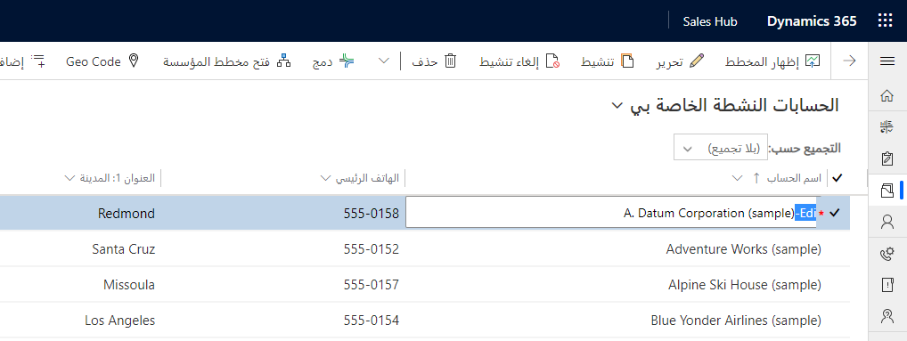
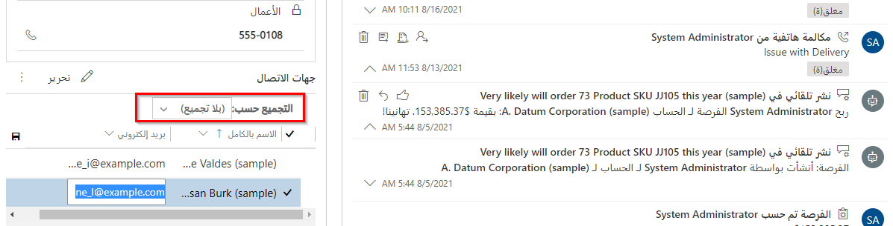

الشبكات القابلة للتحرير هي عناصر تحكم خاصة لتحرير أعمدة محددة من طريقة عرض دون الحاجة إلى فتح صف معين. هذه الميزة متاحة خارج الصندوق ولكن يجب إضافتها إلى الجداول في تطبيقات مشاركة العملاء. تتوفر الشبكات القابلة للتحرير للاستخدام في طرق العرض وكشبكات فرعية موضوعة في النماذج. لا يمكنك إنشاء صفوف جديدة عبر الشبكة القابلة للتحرير؛ يمكنك استخدامه فقط لتحديث الصفوف الموجودة. تستخدم عناصر التحكم هذه إطار عمل التحكم المخصص. 

سيكون لتغييرات البيانات التي يتم إجراؤها داخل الشبكة القابلة للتحرير نفس التأثير على مهام سير العمل وقواعد العمل بنطاق الجدول أو كل النماذج كما لو تم إجراء نفس تغييرات البيانات في النموذج. سيكتمل الحفظ التلقائي عندما ينتقل المستخدم إلى الصف التالي في الشبكة.

لاستخدام الشبكات القابلة للتحرير، ستحتاج إلى تمكين الميزة صراحة لكل جدول وتمكين كل شبكة فرعية في نموذج.

لتمكين الشبكات القابلة للتحرير، يجب عليك أولاً إضافة عنصر التحكم في تعريف الجدول.

بمجرد التمكين، يمكنك إجراء تحرير داخلي مباشر للصفوف لصفوف من هذا النوع من الجدول.

بالإضافة إلى القدرة على تحرير الصفوف من الشبكة، يمكنك أيضاً تجميع الصفوف.

لتمكين شبكة فرعية قابلة للتحرير في نموذج، يجب أن تبدأ من النموذج حيث توجد الشبكة الفرعية. في مثالنا أدناه، ننظر في الشبكة الفرعية لجهات الاتصال في نموذج الحساب.

انقر نقراً مزدوجاً فوق الشبكة الفرعية لفتح خصائصها.

في علامة التبويب عناصر التحكم، حدد إضافة عنصر تحكم.

حدد شبكة قابلة للتحرير.

سيكون لديك الآن نفس وظيفة الشبكة القابلة للتحرير المتاحة في الشبكة الفرعية لجهات الاتصال في نموذج الحساب، بما في ذلك التجميع. عندما يتم حفظ تغييرات البيانات من شبكة فرعية قابلة للتحرير، لن يقوم نموذج الاستضافة أيضاً بتنفيذ عملية الحفظ. هذا يعني أن التغيير الذي أجريته على صف جهة الاتصال سيتم حفظه ولكن لن يتم تنشيط حفظ آخر في صف الحساب. 

