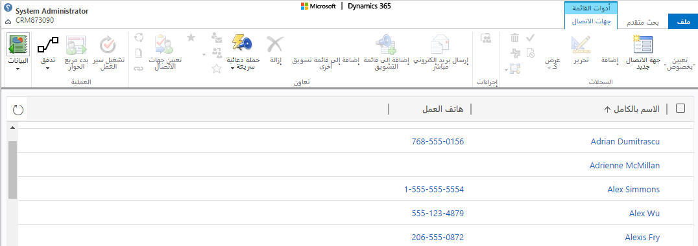
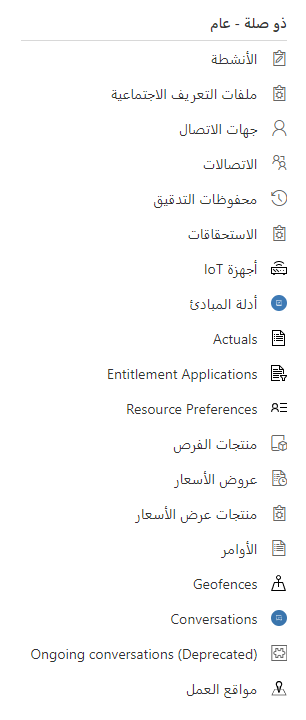
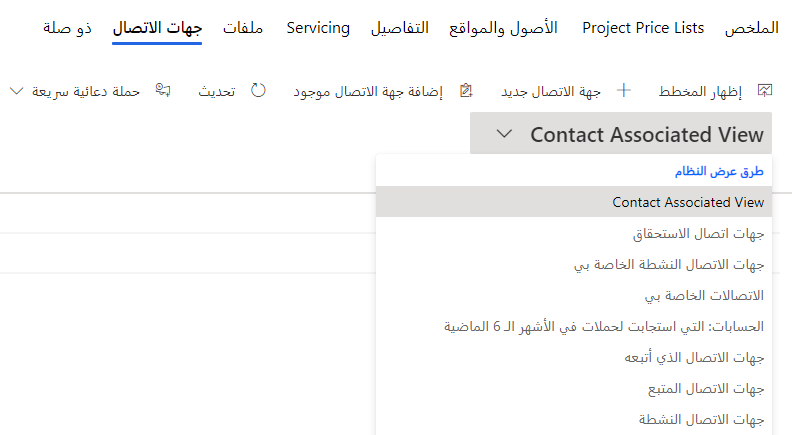
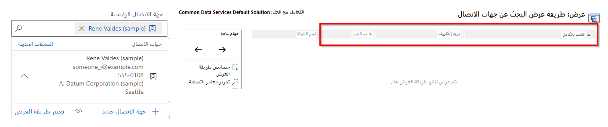
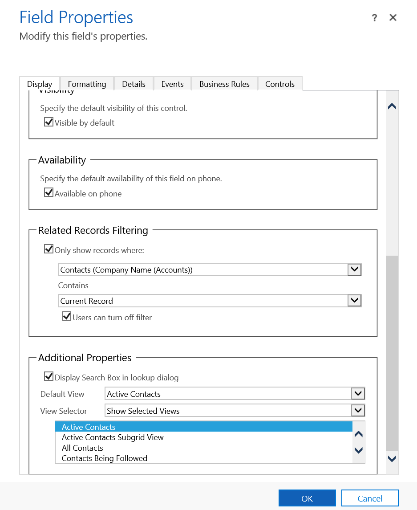
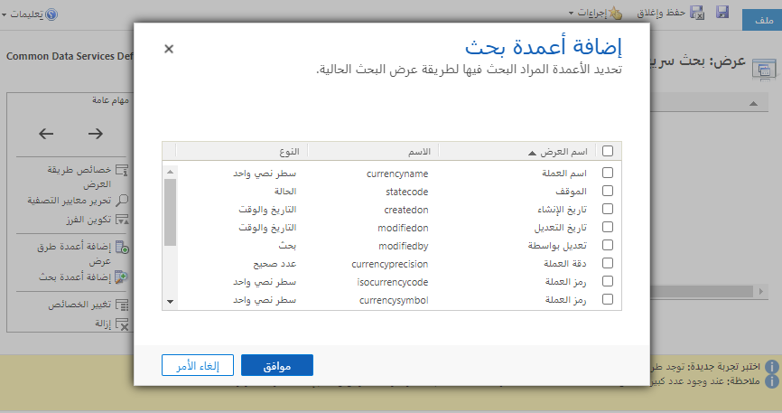

بالإضافة إلى طرق العرض القياسية التي تم تناولها بالفعل في هذا الدرس، هناك العديد من طرق العرض المتخصصة المتاحة والمعروفة باسم طرق العرض العامة. يتم إنشاء طرق العرض العامة هذه للجداول المخصصة تلقائياً ويمكن تعديلها ولكن لا يمكن حذفها. يمكن إنشاء المزيد من طرق العرض العامة وحذفها. 

**بحث متقدم**

عندما يقوم المستخدم بإجراء عرض شخصي أو إجراء بحث متقدم مرتجل، فسيكون هذا هو العرض الافتراضي لنتائج البحث. طريقة عرض النظام هذه قابلة للتحرير، ولكن يمكن أن يكون هناك عرض واحد فقط لكل جدول. عندما يكون المستخدم في "بحث متقدم" ويقوم بتغيير الأعمدة، يمكن حفظه ومشاركته كعرض شخصي. سيتم عرض هذا العرض بعد ذلك للمستخدم في محدد العرض.

**مقترن**

يعرض المستخدمون البيانات في الصفوف من الجدول المضيف ولكن يمكنهم أيضاً عرض الجداول ذات الصلة. عند تحديد جداول البيانات ذات الصلة، يتم تحميلها على نموذج المضيف في علامة تبويب جديدة. يمكن أن يحتوي كل جدول على أكثر من عرض مرتبط.

يوجد المزيد من طرق العرض المرتبطة بالنظام لوظائف مثل عمليات الحذف المجمع أو لعرض أعضاء قائمة التسويق. تحتوي طرق العرض هذه على وظائف تخصيص محدودة.

عندما يعرض المستخدم قائمة طرق العرض المرتبطة بالجدول، سيرى طرق عرض النظام بدءاً من العروض المرتبطة بالترتيب الأبجدي، ثم العرض العام الافتراضي، متبوعاً بأي طرق عرض عامة متبقية بترتيب أبجدي. ستكون المشاهدات التي أنشأها المستخدم أو استقبلها من خلال المشاركة مرئية أبجدياً في قسم **طرق العرض الخاصة بي** أسفل القائمة.

**بحث**

تظهر الأعمدة الثلاثة الأولى من طريقة عرض البحث عندما ينقر المستخدم على أيقونة العدسة المكبرة في عمود البحث ذي الصلة. يتم استخدام طريقة عرض بحث النظام بشكل افتراضي عند وضع عمود بحث في نموذج. 

يمكنك تعيين طرق عرض بحث محددة والمزيد من معايير التصفية في عمود البحث. يُعرف هذا ببحث تمت تصفيته. 

**بحث سريع**

تعرض طريقة العرض هذه نتائج البحث وتحدد الأعمدة المستخدمة لتحديد نتائج البحث. لا يوجد سوى طريقة عرض واحدة للبحث السريع لكل طاولة. 

 
