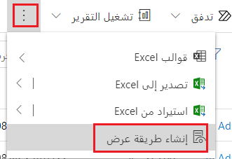
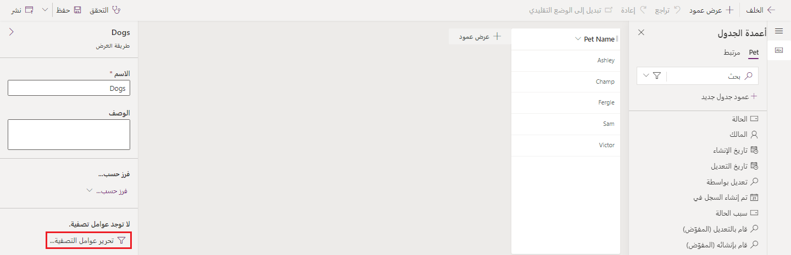
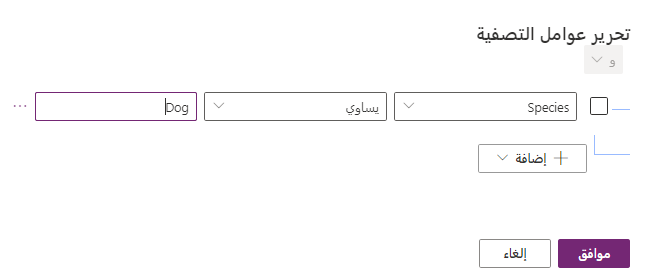
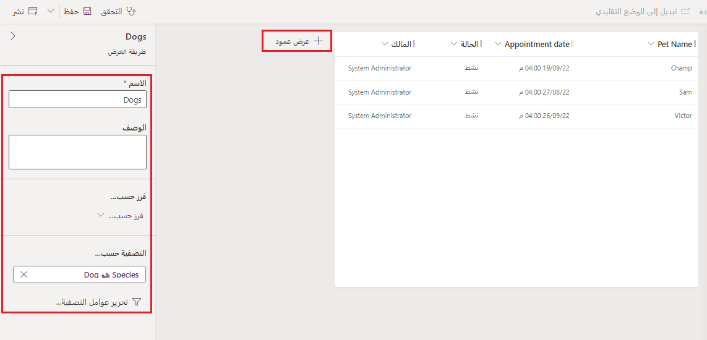

تستخدم التطبيقات التي تستند إلى النموذج طرق العرض لتحديد كيفية عرض قائمة سجلات في أحد التطبيقات. هناك ثلاثة أنواع رئيسية من طرق العرض: فيما يلي ملخص لكل واحدة منها:

- **طريقة العرض الشخصية** - طرق العرض الشخصية مملوكة من قِبل أفراد ولا تكون مرئية إلا لذلك الشخص فقط ما لم يُشارك طرق العرض الشخصية الخاصة به مع الآخرين.

- **طريقة عرض النظام** - طرق عرض النظام هي طرق عرض خاصة. يعتمد التطبيق على طرق العرض هذه، وهي موجودة لجداول النظام أو تنشأ تلقائياً عند إنشاء جداول مخصصة. تشتمل طرق العرض هذه على أغراض محددة وبعض الإمكانات الإضافية. ويتم تحريرها من قِبل مسؤول النظام أو مخصص النظام.

- **طريقة العرض العامة** - طرق العرض العامة هي طرق عرض تُستخدم لغرض عام ويمكنك تخصيصها على النحو الذي تراه مناسباً. إنها مهمة لأن جميع مستخدمي التطبيق يمكنهم الوصول إليها، عند إتاحتها، باستخدام محدد طريقة العرض. من الممكن استخدام طرق العرض العامة في الشبكات الفرعية في نموذج أو كقائمة في لوحة المعلومات.

داخل كل تطبيق، بإمكان المستخدمين الاختيار من قائمة منسدلة لطرق العرض المتاحة تتضمن طرق العرض هذه.

### طرق العرض الشخصية

بإمكان المستخدمين إنشاء طريقة عرض شخصية من تطبيقهم الذي يستند إلى النموذج باتباع الخطوات التالية:

1. حدد **إنشاء طريقة عرض** في شريط الأوامر. اعثر على هذا الأمر عن طريق تحديد علامة الحذف على الجانب الأيسر من الشريط

    

2. في النافذة المنبثقة "بحث متقدم" في Dynamics 365، حدد عوامل تصفية طرق العرض الخاصة بك.

3. بعد ذلك، حدد **حفظ**. عند العودة إلى التطبيق، ستتمكن من تحديد طريقة العرض ضمن **طرق العرض الخاصة بي**.

> [!NOTE]
> بينما يمكنك إنشاء طريقة عرض شخصية جديدة استناداً إلى طريقة عرض النظام أو طريقة عرض عامة، لا يمكنك إنشاء طريقة عرض النظام أو طريقة عرض عامة استناداً إلى طريقة عرض شخصية.

### طرق عرض النظام

لا تظهر طرق عرض النظام في محدد طريقة العرض، ولا يمكنك استخدامها في القوائم الفرعية في نموذج أو كقائمة في لوحة معلومات. لا يمكنك حذف طرق العرض هذه أو إلغاء تنشيطها. إنها مملوكة من قِبل المؤسسة، بحيث يمكن للجميع عرضها. فيما يلي الأنواع المختلفة وكيفية استخدامها.

>[!div class="mx-tdBreakAll"]
>|طرق عرض النظام |الوصف‏‎|
>|:----------- |:--------- |
>|البحث السريع   |طريقة العرض الافتراضية المستخدمة لعمليات البحث التي يتم تنفيذها باستخدام البحث السريع. تحدد طريقة العرض هذه أيضاً الأعمدة التي يتم البحث فيها عند استخدام إمكانات البحث في طريقة عرض البحث السريع وطريقة عرض البحث.|
>|البحث المتقدم |طريقة العرض الافتراضية المستخدمة لإظهار النتائج عند استخدام البحث المتقدم. تحدد طريقة العرض هذه أيضاً الأعمدة المستخدمة افتراضياً عند إنشاء طرق عرض عامة مخصصة أو طرق عرض شخصية جديدة من دون تحديد طريقة عرض لاستخدامها كقالب.|
>|مقترنة |طريقة العرض الافتراضية التي تسرد الجداول المرتبطة بسجل ما.|
>|البحث |طريقة العرض التي تظهر عند تحديد سجل لتعيينه لعمود بحث.|

### طرق العرض العامة

هناك بعض طرق العرض العامة موجودة افتراضياً لجداول النظام ولأي جدول مخصص. عندما تقوم بإنشاء جدول مخصص جديد، سيكون لديك مجموعة من طرق العرض العامة (طرق عرض نشطة وغير نشطة لجدولك) وطرق عرض النظام (بما في ذلك طرق عرض النظام الأربع).

بالإضافة إلى ذلك، بإمكان المستخدمين إنشاء طرق عرض عامة مخصصة. وبإمكان المستخدمين أيضاً حذف أي طرق عرض عامة مخصصة قاموا بإنشائها في حل غير مُدار. ولكن، لا يمكن حذف أي طرق عرض عامة يحددها النظام.

يمكنك استخدام الأسلوب التالي لإنشاء طريقة عرض عامة باستخدام محرر الجداول.

1. من Power Apps Maker Portal، وسّع **Dataverse**، وحدد **الجداول‏‎**، ثم ابحث عن الجدول الذي ترغب في إضافة طريقة العرض العامة إليه وحدده.

    >[!Note]
    >لن تتمكن من إنشاء طريقة عرض عامة في حل مُدار

2. من محرر الجداول، في جزء **تجارب البيانات**، حدد **طرق العرض**

    

3. حدد **+ طريقة عرض جديدة** من قائمة الرأس. بعد ذلك، أضف اسماً إلى طريقة العرض الجديدة وحدد **إنشاء**.

    

4. من محرر أعمدة الجدول، يمكنك إضافة عامل تصفية إلى بياناتك عن طريق تحديد الزر **تحرير عوامل التصفية** من الجزء الموجود على يسار الشاشة. في المثال التالي، سنقوم بتصفية قائمة الحيوانات الأليفة لدينا لإظهار الكلاب فقط.

    

5. في نافذة "تحرير عوامل التصفية" حدد **+ إضافة** ثم **إضافة صف**. يمكنك الآن تحديد شرط لتصفية جدولك، ويمكنك متابعة إضافة الشروط إلى عامل التصفية. إذا أضفت شروطاً متعددة، فيمكنك تحديد سلوك عامل التصفية من خلال تحديد و/أو من القائمة المنسدلة.  لتطبيق عامل التصفية، حدد **موافق**.

    

6. أضف أعمدة أخرى إلى طريقة العرض باستخدام السحب والوضع من جزء أعمدة الجدول. لاحظ أنه يمكنك أيضاً تعديل الاسم والوصف والفرز حسب العمود وضبط عامل التصفية باستخدام القائمة الموجودة على الجانب الأيسر من الشاشة.

    

7. عندما تقتنع بطريقة العرض الخاصة بك، حدد **نشر** لحفظ طريقة العرض وإتاحتها للمستخدمين الآخرين في مؤسستك.

لمزيد من المعلومات، راجع [فهم طرق عرض التطبيق الذي يستند إلى النموذج](/power-apps/maker/model-driven-apps/create-edit-views/?azure-portal=true).
