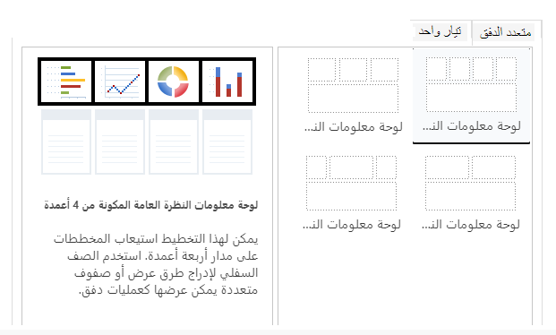
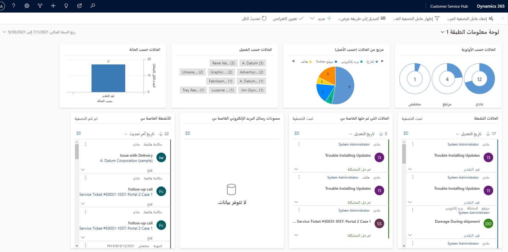
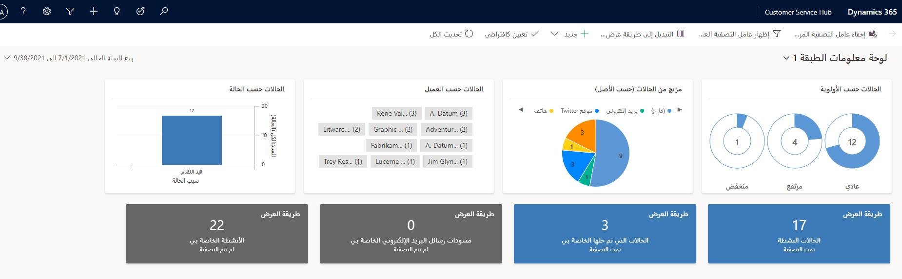
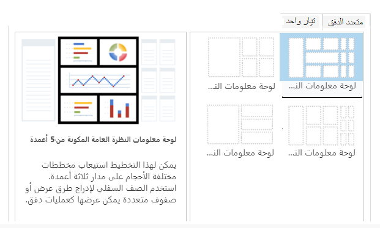
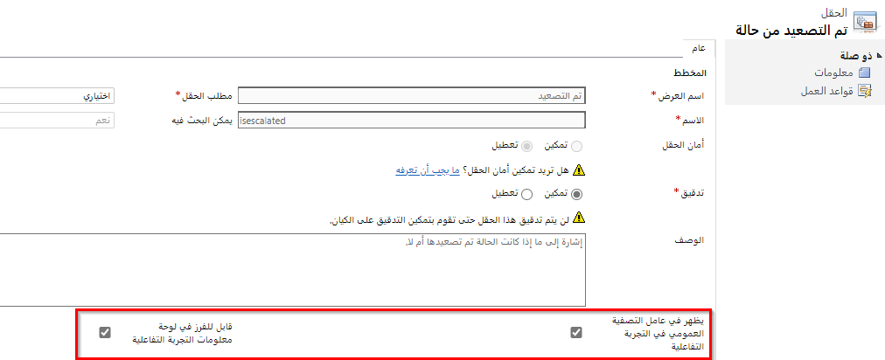
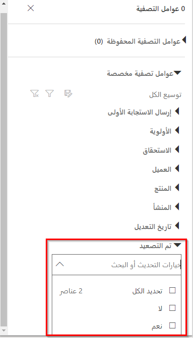
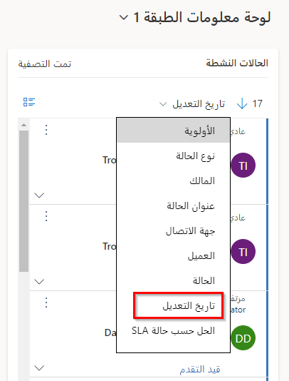
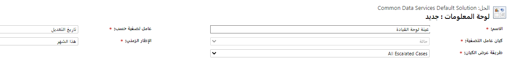
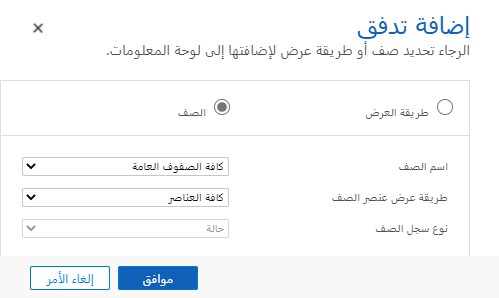

يمكن أن تكون لوحات معلومات التجربة التفاعلية مكان عمل شامل لمستخدمي التطبيق، مثل مندوبي الخدمة، للاطلاع على معلومات عبء العمل واتخاذ الإجراءات. إنها قابلة للتكوين بالكامل، وتستند إلى دور الأمان، وتقدم معلومات عبء العمل عبر تدفقات فورية متعددة. لا يحتاج مستخدمو لوحة المعلومات التفاعلية إلى تصفح التطبيق بحثاً عن صف معين ؛ يمكنهم التصرف عليها مباشرة من لوحة المعلومات.

تأتي لوحات معلومات التجربة التفاعلية في شكلين: دفق متعدد ودفق واحد. يمكن تلخيص الدفق كعرض فوري لبيانات الجدول. وهي تستند إلى عرض الجدول أو صف الانتظار، وعلى هذا النحو يمكن أن يعتمد التدفق على جدول واحد فقط. بالإضافة إلى ذلك، يمكن أن تكون لوحات المعلومات متعددة الدفق عبارة عن صفحة رئيسية أو لوحات معلومات خاصة بالجدول. يتم تكوين لوحات المعلومات الخاصة بالجدول في جزء مختلف من واجهة المستخدم ومحمَّلة مسبقاً جزئياً بمعلومات التكوين الخاصة بالجدول.

### لوحات المعلومات متعددة الدفق
تعرض لوحات المعلومات متعددة الدفق البيانات فورياً عبر تدفقات متعددة. يمكن أن يستند كل تدفق إلى جدول مختلف، مما يجعلها جيدة للنظرات العامة عالية المستوى مثل لوحة معلومات المستوى 1 في مركز خدمة العملاء. 

لتكوين لوحة معلومات متعددة الدفق، يمكنك الاختيار من بين أربعة تخطيطات مختلفة:

تحتوي الإطارات المتجانبة العلوية على مخططات تفاعلية يشار إليها باسم **عوامل التصفية المرئية.** تعرض هذه المخططات عدد الصفوف ذات الصلة، ويمكنك تصفية البيانات الموجودة في لوحة المعلومات عن طريق تحديد قيم مختلفة مضمنة في المخططات.   

  

توفر لوحات المعلومات متعددة الدفق أيضاً عرض إطاراً متجانباً يمكن تنشيطه عن طريق تحديد الزر **التبديل إلى عرض الإطار المتجانب**. يقوم هذا الخيار بتبديل بيانات الدفق ليتم عرضها على هيئة إطارات متجانبة ملخص تفاعلية تعرض عدد الصفوف في كل دفق. 

 

### لوحات المعلومات أحادية الدفق
تعرض لوحات المعلومات أحادية الدفق البيانات فورياً عبر دفق واحد. إنها تتيح عرضاً أكثر تفصيلاً لجدول معين، وبالتالي فهي جيدة لمراقبة بيانات أقل ولكن أكثر تعقيداً، كما هو موضح في لوحة معلومات المستوى 2 لمركز خدمة العملاء.

بالنسبة للوحات المعلومات أحادية الدفق، يمكنك الاختيار من بين أربعة تخطيطات مختلفة:

### الإطارات متجانبة التفاعلية
الإطارات متجانبة التفاعلية مفيدة لتوفير رؤى مرئية أكثر تفصيلاً حول بياناتك. باستخدام الإطارات متجانبة التفاعلية، يمكنك:

- إظهار عرض مجمّع للبيانات عبر صفوف الانتظار / طرق العرض

- حدد إطاراً متجانباً للتنقل إلى الصفوف الأساسية

توفر الإطارات متجانبة التفاعلية عرضاً مجمعاً للمعلومات الموجودة في التدفقات، عبر صفوف الانتظار أو طرق العرض التي تهمك أكثر. إنها تساعدك على مراقبة حجم الحالات والتنقل بسرعة لأسفل إلى صف معين. في لوحة معلومات متعددة الدفق، يمكنك التبديل من العرض القياسي إلى عرض الإطار المتجانب عن طريق تحديد الزر **التبديل إلى عرض الإطار المتجانب** الموجود في شريط الأوامر.

يمثل محتوى كل إطار متجانب عدد الصفوف ضمن ذلك الدفق المحدد. سيظهر لك التمرير فوق نص "العرض" طريقة العرض التي يتم سحب دفق اللوحة منها. سيؤدي تحديد إطار متجانب إلى إنشاء قائمة منبثقة للصفوف الموجودة في الدفق، والتي يمكنك الانتقال إليها عن طريق تحديد صف معين.

### تكوين أعمدة لوحة المعلومات التفاعلية
يمكن تمكين أي جدول مدعوم في الواجهة الموحدة للوحات معلومات التجربة التفاعلية.

يمكن تمكين عمود مدعوم لتجربة لوحة المعلومات التفاعلية على إعدادات العمود الخاصة به:

يمكن تكوين أعمدة عامل التصفية العمومي عن طريق تعيين علامة "يظهر في عامل التصفية العام في التجربة التفاعلية" في عمود معين. سيؤدي هذا إلى ظهور العمود في القائمة المنبثقة لعامل التصفية العمومي:

يمكن تكوين الأعمدة القابلة للفرز عن طريق تعيين علامة "قابلة للفرز في لوحة معلومات التجربة التفاعلية" على عمود. سيؤدي هذا إلى ظهور العمود في القائمة المنبثقة التي تظهر عندما يحدد المستخدم "المزيد" في رأس الدفق.

### إنشاء لوحات معلومات تفاعلية مخصصة
لإنشاء لوحة معلومات تفاعلية مخصصة، يجب تعيين السمات التالية:

- **جدول عامل التصفية:** تعتمد سمات عوامل التصفية المرئية والعمومية على هذا الجدول.

- **عرض الجدول:** تعتمد عوامل التصفية المرئية على طريقة العرض هذه.

- **تصفية حسب:** العمود الذي ينطبق عليه عامل التصفية "الإطار الزمني".

- **الإطار الزمني**: قيمة عامل التصفية الإطار الزمني الافتراضي لعمود "تصفية حسب".

استفد من خيار **إضافة مكون** لإضافة مخططات تفاعلية إلى لوحة المعلومات الخاصة بك:

يُستخدم الخيار **إضافة دفق** لإضافة تدفقات تفاعلية إلى لوحة المعلومات الخاصة بك:

تعتبر لوحات المعلومات التفاعلية مدركة للحلول ويمكن تصديرها ثم استيرادها إلى بيئة مختلفة كجزء من الحل. ومع ذلك، فإن صفوف الانتظار التي تستند إليها التدفقات والإطارات متجانبة ليست على دراية بالحل. قبل استيراد حل لوحة المعلومات إلى النظام المستهدف، يجب إنشاء صفوف الانتظار يدوياً في النظام الهدف. إذا قمت بإنشائها في النظام الهدف بنفس المعرف، فلا داعي لمزيد من التحرير. قد يتطلب ذلك استخدام أداة استيراد البيانات التي يمكنها إنشاء صفوف بالمعرف نفسه، أو مطور باستخدام API النظام الأساسي. إذا لم تكن هذه متوفرة، فيمكنك إنشاؤها يدوياً في الإعدادات> إدارة الخدمة> صفوف الانتظار. بعد إنشاء صفوف الانتظار واستيراد حل لوحة المعلومات إلى النظام الهدف، ستحتاج إلى تحرير التدفقات أو الإطارات متجانبة التي تستند إلى صفوف الانتظار لتعيين صفوف الانتظار المنشأة حديثاً بشكل مناسب.
