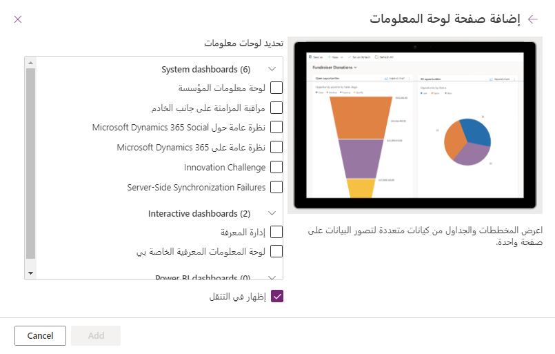

تعد لوحات المعلومات التفاعلية بمثابة مكان عمل شامل لمستخدمي التطبيق لعرض معلومات الوقت الحقيقي واتخاذ الإجراءات المطلوبة. إنها قابلة للتكوين بالكامل، وتستند إلى دور الأمان، وتوفر معلومات حمل العمل من إدخالات متعددة. لا يحتاج مستخدمو لوحة المعلومات التفاعلية إلى تصفح التطبيق بحثاً عن صف معين؛ يمكنهم العمل عليه مباشرة من لوحة المعلومات.

### أنواع لوحات المعلومات
تأتي لوحات معلومات التجارب التفاعلية بشكلين: **متعددة الدفق** و **أحادية الدفق**. بالإضافة إلى ذلك، يمكن أن تكون لوحات المعلومات متعددة الدفق عبارة عن صفحة رئيسية أو لوحات معلومات خاصة بالجداول. يتم تكوين لوحات المعلومات الخاصة بالجدول في جزء مختلف من واجهة المستخدم ومحمَّلة مسبقاً جزئياً بمعلومات التكوين الخاصة بالجدول.

### لوحات المعلومات متعددة الدفق
تعرض لوحات المعلومات متعددة الدفق البيانات في الوقت الحقيقي عبر عمليات دفق متعددة. لا يوجد حد لعدد عمليات الدفق التي يمكنك تكوينها على لوحة المعلومات. يمكن ان تستند البيانات الموجودة في دفق إلى جدول واحد، لكن يمكن أن يستند كل دفق إلى جدول مختلف.

في لوحة المعلومات متعددة الدفق، ترى صفاً من عوامل التصفية المرئية في الأعلى مع عمليات دفق البيانات تحتها.  لديك أيضاً القدرة على إخفاء عوامل التصفية المرئية عن طريق تبديل الخيار **إخفاء عامل تصفية مرئي** من رأس الشاشة.

> [!div class="mx-imgBorder"]
> 

توفر لوحات المعلومات المتعددة الدفق أيضاً طريقة عرض إطار متجانب، يمكنك تبديلها عن طريق تحديد الزر **التبديل إلى عرض الإطار المتجانب‬‏‫** في شريط الأوامر. يقوم هذا الخيار بتبديل بيانات الدفق ليتم عرضها على هيئة إطارات متجانبة تفاعلية للملخص تعرض عدد الصفوف في كل دفق. الزر **التبديل إلى طريقة عرض الدفق‬** هو الطريقة التي يظهر بها مفتاح التبديل في طريقة عرض الإطار المتجانب.

تحتوي الإطارات المتجانبة على مخططات تفاعلية يشار إليها باسم **عوامل التصفية المرئية.** تعرض هذه المخططات عدد الصفوف ذات الصلة، ويمكنك تصفية البيانات الموجودة في لوحة المعلومات عن طريق تحديد قيم مختلفة مضمنة في المخططات.

### لوحات المعلومات أحادية الدفق
تعرض لوحات المعلومات أحادية الدفق البيانات في الوقت الحقيقي عبر دفق واحد استناداً إلى طريقة عرض الجدول، مع تطبيق عوامل التصفية المرئية بالفعل. إنها تتيح طريقة عرض أكثر تفصيلاً لجدول معين، وبالتالي فهي جيدة لمراقبة كمية أقل من البيانات ولكن أكثر تعقيداً. يعرض نوع لوحة المعلومات هذا دائماً الإطارات المتجانبة ويضعها على الجانب الأيسر من الشاشة.

> [!div class="mx-imgBorder"]
> 

### الإطارات المتجانبة التفاعلية
تُعد الإطارات المتجانبة التفاعلية مفيدة لتوفير رؤى ملخصة حول بياناتك. باستخدام الإطارات المتجانبة التفاعلية، يمكنك:

- إظهار عرض مجمّع للبيانات عبر قوائم الانتظار / طرق العرض

- تحديد إطار متجانباً للانتقال إلى الصفوف الأساسية

يمثل محتوى كل إطار متجانب عدد الصفوف ضمن ذلك الدفق المحدد. سيظهر لك التمرير فوق نص "العرض" طريقة العرض التي يتم سحب دفق اللوحة منها. سيؤدي تحديد إطار متجانب إلى إنشاء قائمة منبثقة للصفوف الموجودة في الدفق، والتي يمكنك الانتقال إليها عن طريق تحديد صف معين.

### تكوين أعمدة لوحة المعلومات التفاعلية
لتكوين لوحة معلوماتك، من قائمة صفحات محرر التطبيق المستند إلى نموذج، وسّع قسم **لوحات المعلومات** وحدد لوحة المعلومات التي تريد تعديلها. بعد ذلك، حدد علامة الحذف على يسار اسم لوحة المعلومات وحدد **تحرير**. سينقلك هذا إلى محرر لوحة المعلومات.

داخل محرر لوحة المعلومات، يمكنك ضبط خصائص أي عنصر عن طريق تحديد العنصر، ثم تحديد **تحرير المكون** في شريط الأوامر. تمكّنك النافذة المنبثقة **تعيين الخصائص** من تعديل خصائص المكون الخاص بك.

إذا كنت ترغب في إضافة لوحة معلومات تم إنشاؤها مسبقاً إلى تطبيقك، من شاشة محرر التطبيق المستند إلى نموذج، حدد **+ إضافة صفحة** من شريط الأوامر. بعد ذلك، من النافذة المنبثقة **إضافة صفحة** حدد **لوحة معلومات** ثم **التالي**.  تسمح **صفحة إضافة لوحة معلومات** باختيار لوحة المعلومات التي ترغب في إضافتها.

### إنشاء لوحات معلومات تفاعلية مخصصة

لإنشاء لوحة معلومات، ستحتاج إلى تحديد **حلول** من شاشة Maker Portal الرئيسية. حدد الحل، ثم علامة التبويب **كائنات**. من القائمة المنسدلة **+ جديد** في شريط الأوامر، حدد **لوحة معلومات**، ثم حدد خياراً من ضمن الخيارات المتعلقة بعدد الأعمدة أو Power BI Embedded.

ستظهر شاشة **لوحة معلومات: جديد** في علامة تبويب متصفح منفصلة. وسيتطابق التخطيط مع الخيار الذي حددته في السابق، ولكن ستكون جميع الأقسام فارغة مع سلسلة من الأيقونات التي تمكّنك من إدراج مخطط أو قائمة أو مساعد أو Iframe أو مورد ويب. يمكنك أيضاً إدراج عناصر من شريط الأوامر.

يؤدي تحديد **ادراج مخطط** من الأيقونات إلى ظهور نافذة مربع الحوار **إضافة مكون**. يمكنك تحديدها لإضافة مخططات تفاعلية إلى لوحة معلوماتك. يمكنك تحديد السجل وطريقة العرض والمخطط الذي تريد تصويره، وستظهر معاينة على يسار النافذة.

وبالمثل، فإن تحديد **إدراج قائمة** يؤدي إلى تقديم قائمة **إضافة مكون** مع خيارات لتحديد القائمة المراد إضافتها إلى لوحة المعلومات.  يتوفر الأمر **إدراج مساعد** فقط لإطار متجانب واحد في لوحة المعلومات.  سيقدم لك الأمر **إدراج IFRAME** نافذة مربع حوار لإضافة IFRAME ويطالب الأمر **إدراج مورد ويب** نافذة مربع حوار بإضافة مورد ويب.

بعد أن تنتهي من تحرير لوحة معلوماتك، يمكنك حفظها وإغلاقها للعودة إلى شاشة تحرير التطبيق حيث يمكنك إدراج لوحة معلوماتك الجديدة في التطبيق.

لمزيد من المعلومات، راجع [إنشاء وتكوين لوحات معلومات التجربة التفاعلية لتطبيق يستند إلى نموذج](/power-apps/maker/model-driven-apps/configure-interactive-experience-dashboards/?azure-portal=true).