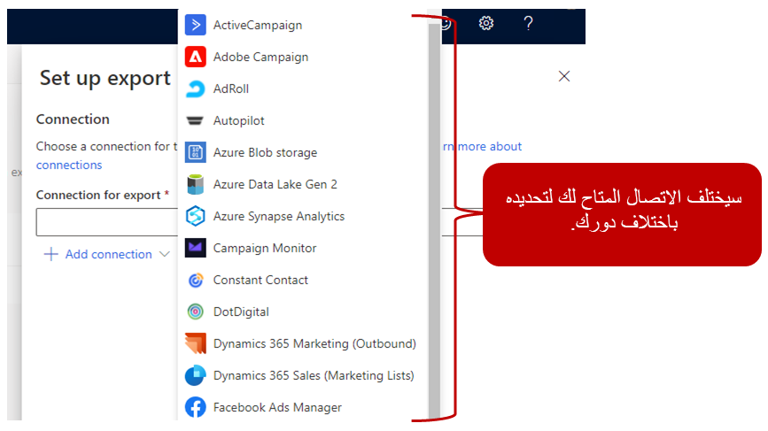
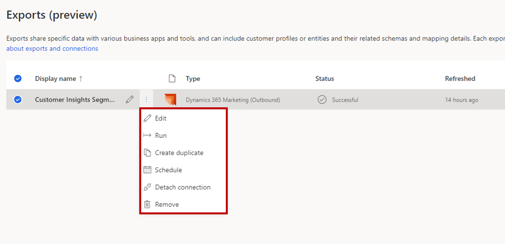

عادةً، عندما يفكر الأشخاص في منصة بيانات العملاء، فإن أكثر ما يهمهم هي قدرتها على مساعدتهم في إنشاء عرض شامل لعملائهم عبر أنظمة بيانات مختلفة. في حين أن هذه القدرة هي جزء مهم من النظام الأساسي لبيانات العميل، إلا أنها ليست بالضرورة الجزء الأكثر أهمية. الأهم من ذلك هو ما يمكنك من القيام به بالبيانات بعد استيعابها وتوحيدها وبناء رؤى حولها. على سبيل المثال، إذا كانت الرؤى التنبؤية التي أعددتها في النظام الأساسي لبيانات العملاء تخبرك أنه من المحتمل أن يقوم العميل *بخسارتك* (يقرر عدم التعامل معك بعد الآن)، فأنت بحاجة إلى التصرف بناءً على تلك البيانات. لن يتم تنفيذ الإجراءات التي تخطط لاتخاذها، مثل إرسال القسائم أو الاتصال بمندوب مبيعات، بواسطة منصة بيانات العملاء الخاصة بك. يتم إكمال هذه الإجراءات بواسطة تطبيقات أخرى. قد تكون القسائم التي ترسلها جزءاً من رحلة العميل التي نفذتها في تطبيق التسويق المفضل لديك. سيتفاعل موظفو المبيعات لديك، على الأرجح، مع العملاء باستخدام نوع معين من تطبيق إدارة علاقات العملاء (CRM). سيسهل النظام الأساسي استخدام بيانات العميل الجيد من قبل المؤسسة في التطبيقات التي تستخدمها كل يوم.

تساعدك ميزة **الصادرات** في Microsoft Dynamics 365 Customer Insights على مشاركة بيانات محددة مع تطبيقات متنوعة. قد تتضمن هذه البيانات ملفات تعريف العملاء والكيانات والمخططات وتفاصيل التعيين. يتطلب كل تصدير [اتصال ليتم إعداده](/dynamics365/customer-insights/audience-insights/connections/?azure-portal=true). سيدير هذا الاتصال المصادقة والوصول إلى التطبيق الذي تقوم بالتصدير إليه.

النوعان الرئيسيان لعمليات التصدير هما:

- **إخراج البيانات** - تصدير أي نوع من الكيانات المتوفرة في Customer Insights. يتم تصدير الكيانات التي تحددها مع كل حقول البيانات وبيانات التعريف والمخططات وتفاصيل التعيين.

- **الشريحة** - تصدير كيانات الشريحة من Customer Insights. تمثل الشريحة قائمة ملفات تعريف العملاء. عندما تقوم بإعداد التصدير، حدد حقول البيانات المضمنة، بحسب النظام المستهدف الذي تخطط لتصدير البيانات إليه.

## تصدير الشرائح

يمكنك إعداد Customer Insights لدعم المؤسسات التي تستهدف حسابات الأعمال (متاجرة عمل-عمل) أو المستهلكين الأفراد (متاجرة عمل-مستهلك)، والتي يتم تمثيلها بواسطة بيئات مختلفة في التطبيق. قد يكون لدى بعض المؤسسات حسابات أعمال وعملاء أفراد في مثيل Customer Insights نفسه. بينما تدعم معظم خيارات التصدير نوعي البيئات، فإن تصدير الشرائح إلى أنظمة مختلفة سيكون له متطلبات محددة. بشكل عام، يحتوي عضو المقطع (الذي يستخدم ملف تعريف العميل) على معلومات الاتصال. ورغم أن هذا السيناريو ينطبق عادةً على المقاطع المبنية على المستهلكين الأفراد (متاجرة بين عمل ومستهلك)، فقد لا يكون هذا هو الحال بالنسبة للمقاطع التي تستند إلى حسابات الأعمال (متاجرة بين عمل وعمل). تأكد من أنك على دراية بالاختلافات بين تصدير المقاطع لسيناريوهات المتاجرة بين عمل وعمل ‬مقابل سيناريوهات المتاجرة بين عمل ومستهلك.

## الفروق بين المقاطع حسب أنواع البيئات

سيتم بناء المقاطع على كيان *الحساب* عند إنشائها في سياق بيئات حسابات الأعمال. لتصدير مقاطع الحساب في حالتها الحالية، يحتاج النظام المستهدف إلى دعم قطاعات الحساب الخالصة. مثال على ذلك هو التصدير إلى [LinkedIn](/dynamics365/customer-insights/audience-insights/export-linkedin-ads/?azure-portal=true) عندما تختار **الشركة** الخيار أثناء تحديد التصدير. (سيتم شرح التصدير إلى LinkedIn بمزيد من التفصيل لاحقاً.) تتطلب جميع الأنظمة المستهدفة الأخرى حقولاً من كيان جهة الاتصال. في هذه السيناريوهات، تأكد من أن مقاطع حسابك يمكنها استرداد البيانات من جهات الاتصال ذات الصلة والمرتبطة بالحساب.

سيتم إنشاء المقاطع على كيان *ملف تعريف العميل الموحد* عند إنشائها في سياق البيئات لعملاء فرديين. يمكن تصدير كل شريحة تلبي متطلبات الأنظمة المستهدفة (مثل عنوان البريد الإلكتروني).

## إعداد عملية تصدير جديدة

لن تتمكن كل جهة لديها حق الوصول إلى تطبيق Customer Insights من إنشاء عمليات تصدير. يجب أن يكون لديك اتصالات متاحة لك. ستعتمد الاتصالات المختلفة المتاحة لك على [دور المستخدم](/dynamics365/customer-insights/audience-insights/permissions/?azure-portal=true). الروابط حسب الدور هي كما يلي:

- يمكن **للمسؤولين** الوصول إلى جميع الاتصالات. يمكنهم أيضاً إنشاء اتصالات جديدة عند إعداد تصدير.

- يمكن **للمساهمين** الوصول إلى اتصالات محددة. يعتمدون على المسؤولين لإعداد الاتصالات ومشاركتها.

- يمكن **للعارضين** عرض الصادرات الحالية فقط، وليس إنشائها.

لمزيد من المعلومات، راجع [تعيين أذونات المستخدم](/dynamics365/customer-insights/audience-insights/permissions/?azure-portal=true).

عندما تقوم بإعداد تصدير، تأكد من تحديد الاتصال الذي تريد استخدامه للتصدير. ستختلف الموصلات المحددة التي ستتوفر لك بناءً على دور المستخدم الخاص بك. ستحتاج إلى تحديد خيارات مختلفة بناءً على الموصل الذي تحدده.

> [!div class="mx-imgBorder"]
> 

بعد تحديد التصدير، يمكنك عرض التفاصيل المتعلقة بالتصدير من صفحة **الصادرات**. لكل عملية تصدير يتم تحديدها، ستتمكن من عرض حالة التحديث لوظيفة التصدير ووقت التحديث الأخير.

> [!div class="mx-imgBorder"]
> 

بالإضافة إلى ذلك، ستكون قادراً على أداء المهام في مهمة التصدير، مثل إنشاء نسخة من الوظيفة، وتحديد جدول زمني، وتعديل الوظيفة وإزالتها.

لمزيد من المعلومات، راجع [العمل مع الصادرات](/dynamics365/customer-insights/audience-insights/export-destinations/?azure-portal=true).

ستدرس بقية هذه الوحدة كيفية تصدير بيانات Customer Insights إلى بعض التطبيقات الأكثر شيوعاً التي يتم استخدامها غالباً معها.
