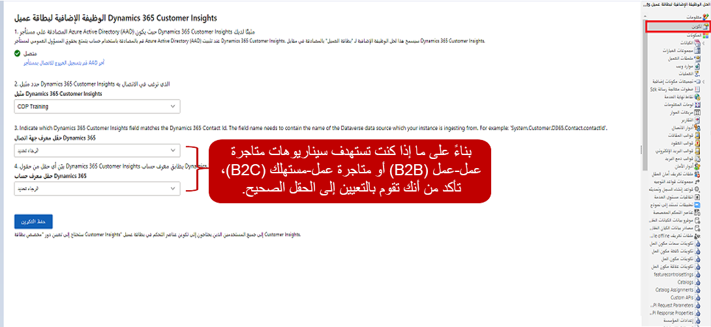

غالباً ما تقوم المؤسسات بالحصول على عرض بزاوية 360 درجة لعملائها باستخدام تطبيقات إدارة علاقة العميل (CRM) الخاصة بهم. وأثناء حصولهم على عرض كامل لبيانات العميل في سياق بيانات CRM الخاصة بهم، فإنهم لا يحصلون فعلاً على عرض 360 درجة للعميل لأنه لا يتضمن بيانات من خارج نظام CRM. 

للحصول فعلياً على عرض 360 درجة لعملائك في نظام CRM الخاص بك، يجب أن يقوم النظام بتضمين تفاصيل أخرى مثل الأنشطة التي حدثت في التطبيقات الأخرى والتحليلات المهمة التي يمكن استخدامها للمساعدة على تشغيل إجراءات العمل والمعلومات السكانية التي قد لا تكون متوفرة في التطبيق. تتوفر هذه التفاصيل بسهولة في Customer Insights. لمساعدتك على توفير هذه المعلومات، يمكنك تثبيت الوظيفة الإضافية لبطاقة العميل وإعدادها لـ Microsoft Dynamics 365 Customer Insights في تطبيقات Dynamics 365 الخاصة بك. ستقوم الوظيفة الإضافية لبطاقة العميل باسترداد البيانات من Customer Insights، مثل حقول ملف تعريف العميل والرؤى والمخطط الزمني للنشاط. وبعد ذلك، سيتم عرض البيانات الموجودة في التطبيقات مثل Dynamics 365 Sales وDynamics 365 Customer Service وDynamics 365 Marketing والمزيد، دون التأثير على البيانات في تطبيق Dynamics 365 المتصل.

على سبيل المثال، باستخدام الوظيفة الإضافية الخاصة ببطاقة العميل لعرض المخطط الزمني للنشاط من Customer Insights إلى نموذج Dynamics 365، يمكنك عرض الأنشطة مثل مشتريات مواقع الويب أو زيارات المتجر أو عمليات الفحص أو الأنشطة الأخرى من التطبيقات الأخرى. بالإضافة إلى ذلك، يمكنك عرض أنشطة Dynamics 365، مثل رسائل البريد الإلكتروني والمواعيد والمهام التي يتم تخزينها في المخطط الزمني لسجل Dynamics 365. من خلال توفير هذه المعلومات، يمكنك تزويد المستخدمين بصورة كاملة لكل ما يحدث. 

تتضمن الوظيفة الإضافية لبطاقة العميل عناصر تحكم متعددة يمكنك إضافتها إلى النماذج التي تستند إلى النموذج لعرض البيانات: 

-   **التحكم في المقياس** - يعرض مقاييس مهمة مثل إجمالي الزيارات وإجمالي مدة البقاء ومتوسط ​​مدة البقاء من ملف تعريف العميل في رؤى الجمهور. 
    
-   **التحكم في المعلومات** يعرض بيانات التوقعات، مثل توصيات المنتج أو بيانات الخسارة المخصصة، استناداً إلى النماذج المخصصة أو التوقعات في رؤى الجمهور.
    
-   **التحكم في تفاصيل العميل** يعرض المعلومات التي تأتي من ملف تعريف العميل الموحد في رؤى الجمهور. 

-   **التحكم في التحسين** - يوفر بيانات الإثراء التي تدعمها Microsoft، مثل العلامة التجارية والاهتمامات لملفات تعريف العملاء المرتبطة. 

-   **التحكم في جهات الاتصال** - يعرض جهات الاتصال المرتبطة بالحساب. لا يكون عنصر التحكم هذا متاحاً إلا في حالة استخدام Customer Insights لدعم السيناريوهات من عمل إلى عمل. 
    
-   **التحكم في المخطط الزمني** - يعرض المخطط الزمني للأنشطة التي تأتي من رؤى الجمهور. يختلف هذا المخطط الزمني عن المخطط الزمني الخاص بـ Dynamics 365. 
    
> [!IMPORTANT]
> يعتمد كل عنصر من عناصر تحكم الوظيفة الإضافية على بيانات محددة في رؤى الجمهور. تتوفر بعض البيانات وعناصر التحكم فقط في أنواع محددة من البيئات. قد تكون بعض عناصر التحكم متوفرة في البيئة الخاصة بك إذا لم يكن لديك العناصر الصحيحة التي تم إعدادها في Customer Insights. على سبيل المثال، يتطلب عنصر التحكم في **المعلومات** البيانات التي يتم إنشاؤها باستخدام التوقعات أو النماذج المخصصة. إذا لم تقم بإعداد بيئة رؤى الجمهور المتصلة، فلن تتمكن من إضافة عنصر التحكم إلى النموذج.

قبل تثبيت الوظيفة الإضافية لبطاقة العميل تأكد من تلبية كافة المتطلبات اللازمة، مثل تضمين بيانات Dynamics 365 في ملف تعريف العميل الموحد. وإلا قد لا تعمل البطاقة بشكل صحيح. للحصول على قائمة بالمتطلبات راجع [متطلبات الوظيفة الإضافية لبطاقة العميل](/dynamics365/customer-insights/audience-insights/customer-card-add-in?azure-portal=true#prerequisites). 

## تثبيت الوظيفة الإضافية لبطاقة العميل

قبل أن تتمكن من استخدام حل الوظيفة الإضافية لبطاقة العميل في البيئة الخاصة بك، تحتاج أولاً لتثبيته في بيئة Dynamics 365 الخاصة بك. يمكنك العثور على الحل بالانتقال إلى [الوظيفة الإضافية لبطاقة عميل Customer Insights (إصدار أولي)](https://appsource.microsoft.com/product/dynamics-365/mscrm.dynamics_365_customer_insights_customer_card_addin?tab=overview). لتثبيت الحل، حدد زر **الحصول عليه الآن**.

> [!div class="mx-imgBorder"]
> 

> [!NOTE]
> قبل بدء تثبيت الحل، قد تحتاج إلى تسجيل الدخول باستخدام بيانات اعتماد المسؤول لتطبيق Dynamics 365 لتثبيت الحل. بعد بدء التثبيت، قد يستغرق التثبيت بعض الوقت لكي يتم تثبيت الحل في البيئة الخاصة بك.

## إعداد الوظيفة الإضافية لبطاقة العميل

يتطلب إعداد الحل استخدام الإعدادات المتقدمة التي يمكنك العثور عليها عن طريق تحديد رمز الترس في تطبيقات Dynamics 365 الخاصة بك ثم تحديد **الإعدادات المتقدمة**. 

> [!div class="mx-imgBorder"]
> 

بعد تحميل منطقة **الإعدادات المتقدمة**، حدد **الإعدادات > التخصيصات > الحلول** ثم حدد الرابط الخاص بحل **الوظيفة الإضافية لبطاقة عميل Dynamics 365 Customer Insights (إصدار أولي)**.

> [!div class="mx-imgBorder"]
> 

> [!IMPORTANT]
> قد يُطلب منك المصادقة على التطبيق الذي سيتم تقديمه في نافذة منبثقة. إذا لم يحدث أي شيء، فتحقق من أن أداة حظر العناصر المنبثقة لا تحظر نافذة المصادقة عند تحديد زر **تسجيل الدخول**.

يتطلب الحل إكمال الإعداد الأساسي. حدد **التكوين**، وفي صفحة التكوين، قم بإعداد المعلومات التالية:

-   **مثيل Dynamics 365 Customer Insights** - يحدد مثيل Customer Insights الذي ترغب في الاتصال به وتعبئة تفاصيل البطاقة به. 

-   **الحقل الخاص بمعرف جهة اتصال Dynamics 365** - يحدد الحقل في ملف تعريف العميل الذي يتطابق مع حقل معرف جهة الاتصال في Dynamics 365. 

-   **الحقل الخاص بمعرف حساب Dynamics 365** - يحدد الحقل في Customer Insights الذي يتطابق مع حقل معرف حساب Dynamics 365. ما عليك سوى إكمال هذه الخطوة للسيناريوهات من عمل إلى عمل. 

> [!div class="mx-imgBorder"]
> 

لمزيد من المعلومات، راجع [تكوين الوظيفة الإضافية لبطاقة العميل](/dynamics365/customer-insights/audience-insights/customer-card-add-in?azure-portal=true#configure-the-customer-card-add-in).

## إضافة عناصر تحكم بطاقة العميل إلى النماذج

تتمثل الخطوة الأخيرة في العملية فيما يتعلق بإضافة عناصر تحكم بطاقة العميل إلى النماذج الضرورية في بيئة Dynamics 365 الخاصة بك. ووفقاً للسيناريو الخاص بك، يمكنك اختيار إضافة عناصر تحكم إلى نموذج **جهة الاتصال** أو نموذج **الحساب**. إذا قررت استخدام رؤى الجمهور للأغراض من عمل إلى عمل، فإننا نوصي باستخدام نموذج **الحساب**. 

إن أبسط طريقة لبدء عملية تخصيص النماذج هي استخدام [مدخل صانع Microsoft Power Apps](http://make.powerapps.com/?azure-portal=true).  

قم بتوسيع منطقة **البيانات** (التي قد تظهر على أنها **Dataverse** في البيئة الخاصة بك)، وحدد **الجداول**، ثم حدد **الحساب** أو **جهة الاتصال** استناداً إلى نوع التوزيع الخاص بك. لأغراض هذا التمرين، حدد **جهات الاتصال**. حدد **النماذج** ثم حدد إصدار نموذج جهة الاتصال الذي ترغب في استخدامه. 

> [!div class="mx-imgBorder"]
> 

عندما يكون إصدار نموذج جهة الاتصال الذي تريد استخدامه مفتوحاً، حدد زر **التبديل إلى الوضع الكلاسيكي** الذي سيقوم بفتح النموذج في الواجهة الكلاسيكية. 

> [!div class="mx-imgBorder"]
> 

غالباً ما تحتاج إلى إضافة علامات تبويب وأقسام إلى النموذج الخاص بك للتأكد من إمكانية عرض المعلومات بالطريقة التي تريدها. ستحتاج أيضاً إلى إضافة حقل إلى كل قسم ليكون بمثابة العنصر النائب الذي يمكنك إرفاق عناصر تحكم Customer Insights به. وعادةً، يمكن أن يكون هذا الحقل أي حقل في النموذج. 

تعرض الصورة التالية نموذجاً يحتوي على ثلاثة أعمدة، مع إضافة ثلاثة أقسام. يستخدم كل قسم حقل **مدينة العنوان 1** لحقل العنصر النائب. 

> [!div class="mx-imgBorder"]
> 

عندما تكون مقتنعاً بأن كل شيء في موضعه، انقر نقراً مزدوجاً فوق الحقل الذي تريد تعديله ثم افتح القائمة "خصائص". عند فتح خصائص الحقل، قم بإلغاء تحديد مربع اختيار **عرض التسمية في النموذج** ثم حدد علامة تبويب **عناصر التحكم**. 

> [!div class="mx-imgBorder"]
> 

في علامة التبويب **عناصر التحكم** حدد **إضافة عنصر تحكم**، وفي مربع **إضافة عنصر تحكم** حدد عنصر تحكم Customer Insights الذي ترغب في إضافته إلى النموذج. 

يمكنك التحديد من ضمن الخيارات التالية:

-   عنصر التحكم السكاني لـ Customer Insights

-   عنصر التحكم في إثراء Customer Insights

-   عنصر التحكم في معلومات Customer Insights

-   عنصر التحكم في مقاييس Customer Insights

-   عنصر التحكم في المخطط الزمني لـ Customer Insights

 بعد تحديد عنصر التحكم الذي تريد العمل معه، قم بتعيين عنصر التحكم على **الويب** ثم حدد **موافق**. 

> [!div class="mx-imgBorder"]
> 

كرر العملية لكل عنصر من عناصر تحكم Customer Insights الذي تريد إضافته إلى النموذج. بعد حفظ النموذج ونشره، سيتم عرض عناصر التحكم المضافة حديثاً في النموذج. 

> [!div class="mx-imgBorder"]
> 

يعتبر استخدام Dynamics 365 Customer Insights مع تطبيقات Dynamics 365 الأخرى أحد الطرق المتعددة التي يمكن من خلالها استخدام بيانات Customer Insights في التطبيقات الأخرى. بعد ذلك، ستتعلم كيفية إكمال العملية نفسها باستخدام Microsoft Power Platform. 
