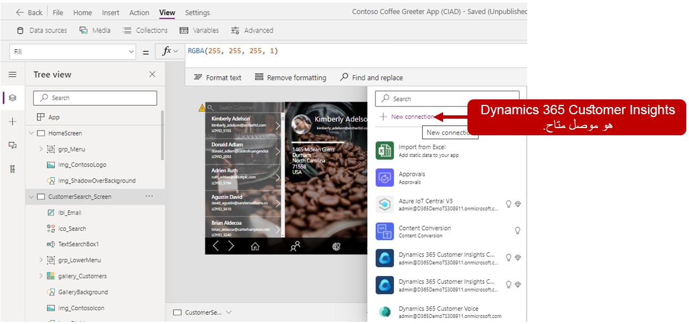
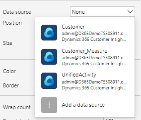
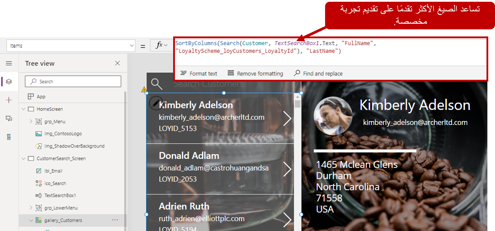
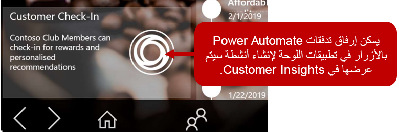
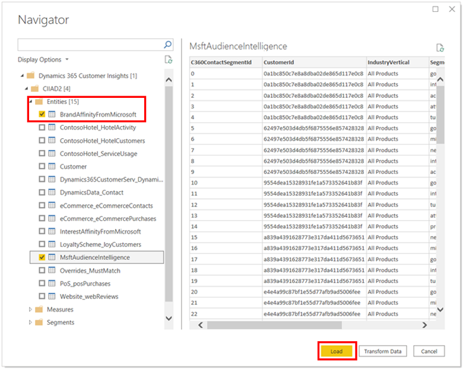
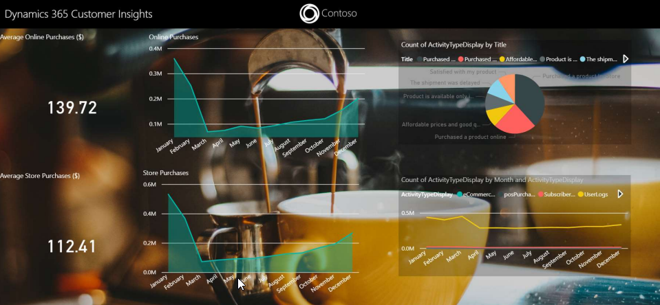

عندما يكون لديك نظام أساسي لبيانات العميل، فإنك بحاجة إلى التأكد من أن الأشخاص الذين يحتاجون إلى البيانات والرؤى يمكنهم استخدامها. على سبيل المثال، عندما يشير نموذج التوقع إلى أنه من المحتمل خسارة العميل (لم يعد يريد التعامل مع شركتك)، فأنت بحاجة إلى أن تكون قادراً على تنفيذ إستراتيجية بسرعة لتقليل احتمالية حدوث ذلك. لن يتم تنفيذ هذه الإستراتيجية في Customer Insights ولكن سيتم تنفيذها من خلال التطبيقات والعمليات التي تمتلكها مؤسستك للتعامل مع هذه السيناريوهات.

Microsoft Power Platform هو عبارة عن نظام أساسي للتطوير المهني منخفض التعليمات البرمجية/لا يحتوي على تعليمات برمجية يساعد المؤسسات على إنشاء حلول الأعمال بسرعة. وهو يتكون من أدوات تساعد المؤسسات على إنشاء حلول تحليلية وإنشاء تطبيقات وأتمتة العمليات وإنشاء روبوتات الدردشة وغير ذلك. من خلال أكثر من 500 موصل مختلف لتطبيقات Microsoft وتطبيقات الموردين الخارجيين، يمكن للمؤسسات إنشاء حلول لدعم الاحتياجات الخاصة بهم.

Dynamics 365 Customer Insights هو واحد من العديد من الموصلات المتوفرة لـ Microsoft Power Platform، مما يعني أنه يمكنك إنشاء تقارير تحليلية للتطبيقات والتطبيقات والعمليات التي تدعمها بيانات Customer Insights.

بالإضافة إلى ذلك، يمكنك استخدام بيانات Customer Insights في الكيانات التالية:

-   **Microsoft Power Apps** - السماح للمؤسسات بإنشاء تطبيقات أعمال مخصصة بسرعة تتصل بالبيانات التي يتم تخزينها في العديد من مصادر البيانات المحلية وعلى الإنترنت، مثل Dataverse، وSharePoint، وMicrosoft 365، وDynamics 365، وSQL Server، وما إلى ذلك.

-   **Microsoft Power Automate** - السماح للمؤسسات بإنشاء عمليات أتمتة لتحسين كفاءة العملية وتكامل التطبيقات وأتمتة العمليات اليدوية والمزيد.

-   **Microsoft Power BI** - السماح للمؤسسات بإنشاء حلول تحليلية تساعد على تحقيق نتائج أعمال أفضل.

## Power Apps

Power Apps عبارة عن مجموعة من التطبيقات والخدمات والموصّلات ونظام أساسي للبيانات مما يوفر بيئة تطوير سريعة لإنشاء تطبيقات مخصَّصة تلبي احتياجات عملك. تُضفي Power Apps الطابع الديمقراطي على تجربة إنشاء تطبيقات الأعمال المخصّصة بتمكين المستخدمين من إنشاء تطبيقات أعمال مخصّصة وثرية بالميزات دون كتابة تعليمات برمجية. تساعد هذه الميزة المؤسسات على إنشاء تطبيقات الأعمال بسرعة وفقاً لاحتياجات العمل الخاصة بها.

لقد تعلمت مسبقاً كيفية إدراج بيانات Customer Insights في التطبيقات المستندة إلى النموذج، مثل تطبيقات Dynamics 365 باستخدام الوظيفة الإضافية لبطاقة العميل. تساعد Power Apps أيضاً في تبسيط عملية إنشاء تطبيقات لوحة العملاء التي تستخدم بيانات Customer Insights. عند إنشاء تطبيقات اللوحة، تكون متصلة بمصدر بيانات واحد أو أكثر.

يعتبر السيناريو التالي مثالاً لاستخدام Power Apps مع Customer Insights.

تريد شركة Contoso Coffee تقديم خدمة وتوصيات مخصصة للعملاء الذين يقومون بزيارة متاجر البيع بالتجزئة والمقاهي. بالإضافة إلى ذلك، تخطط الشركة لالتقاط تفاصيل العملاء الذين يقومون بزيارة المتاجر. ولتحقيق هذا الهدف، قرروا تمكين موظفي البيع بالتجزئة في Contoso Coffee من خلال تطبيق ترحيب تم إنشاؤه باستخدام Power Apps ودعمه ببيانات Customer Insights.

عندما يدخل العملاء المتاجر، سيتمكن موظفو البيع بالتجزئة من:

-   البحث عن ملفات تعريف العميل الموحدة لتحديد العملاء عندما يصلون.

-   التقاط تسجيلات وصول العميل.

-   الوصول إلى التفاصيل المهمة الخاصة بالعملاء، مثل قيمة مدة البقاء وتفاصيل الولاء.

-   تزويد العملاء بتوصيات مخصصة استناداً إلى معلومات من Customer Insights.

## Customer Insights في تطبيق Power Apps

تستخدم التطبيقات من Power Apps الموصلات للاتصال بالبيانات التي تريد إظهارها في التطبيق. يعد Customer Insights أحد مصادر البيانات العديدة المتوفرة التي تحتوي على موصل Power Apps. باستخدام موصل Customer Insights يمكنك تضمين بيانات Customer Insights في كائنات مثل المعارض والنماذج والصور والمزيد.

> [!NOTE]
> بينما تشير هذه الوحدة النمطية إلى بعض المفاهيم حول إنشاء التطبيقات من Power Apps، إلا أنها ليست التركيز الأساسي. لمزيد من المعلومات، راجع [وثائق Power Apps](/power-apps/?azure-portal=true).

في مصمم Power Apps الخاص بك، يمكنك إرفاق مصادر البيانات بتحديد **عرض > مصادر البيانات**. عند تحديد **اتصال جديد**، سيكون Dynamics 365 Customer Insights Connector هو الخيار الذي يمكنك تحديده.

بعد إضافة Customer Insights كاتصال بيانات، يمكنك تحديد الكيانات التالية في Power Apps:

-   **العميل** - يسمح لك باستخدام البيانات من [ملف تعريف العميل الموحد](/dynamics365/customer-insights/audience-insights/customer-profiles/?azure-portal=true) في التطبيق الخاص بك.

-   **UnifiedActivity** - يستخدم لعرض [المخطط الزمني للنشاط](/dynamics365/customer-insights/audience-insights/activities/?azure-portal=true) في التطبيق.

-   **ContactProfile** - يستخدم لعرض جهات الاتصال الخاصة بأحد العملاء. يتوفر هذا الكيان فقط في بيئات رؤى الجمهور لحسابات الأعمال.

> [!div class="mx-imgBorder"]
> 

> [!IMPORTANT]
> يمكنك فقط استرداد كيانات **العميل**، وأيضاً **UnifiedActivity**، وكذلك **الشرائح**، بالإضافة إلى **ContactProfile** من خلال موصل Power Apps. لا يتوفر الكيان **ContactProfile** إلا في مثيل رؤى الجمهور لحسابات الأعمال. ويتم عرض الكيانات الأخرى نظراً لأن الموصل الأساسي يدعمها من خلال المشغلات في Power Automate.

بعد الاتصال بـ Customer Insights كمصدر بيانات، ستتمكن من استخدام البيانات في التطبيق الخاص بك. على سبيل المثال، قد تقوم بإضافة عنصر تحكم في المعرض (الذي يستخدم لعرض سجلات متعددة في وقت واحد) والذي يسمح لك بالبحث عن ملفات تعريف العملاء الموحدة المختلفة وعرضها. بعد إضافة عنصر تحكم المعرض إلى التطبيق الذي تقوم بإنشائه، يمكنك تعيين المعرض لاستخدام **العميل** كمصدر البيانات للعناصر.

> [!div class="mx-imgBorder"]
> 

للحصول على مزيد من السيناريوهات الأكثر تقدماً، يمكنك استخدام الصيغ لتوفير مزيد من الوظائف المستهدفة. في الصورة التالية، يستخدم معرض العملاء عنصر تحكم مربع نص لتوفير معايير التصفية لما يتم عرضه في المعرض. 

> [!div class="mx-imgBorder"]
> 

أثناء قيامك بإنشاء المزيد من الشاشات في التطبيق، يمكنك استخدام بيانات مختلفة من Customer Insights حسب الحاجة.

> [!div class="mx-imgBorder"]
> 

لاحظ التفاصيل التالية في الصورة السابقة:

-   الصورة وتفاصيل العميل مأخوذة من حقل الصورة في ملف تعريف العميل الموحد.

-   تم الحصول على كافة معلومات العنوان من ملف تعريف العميل الموحد.

-   يقوم المخطط الزمني **النشاط** بتعبئة المعرض في المنتصف.

-   تتم تعبئة **النقاط الحالية** و **قيمة مدة البقاء** من خلال مقاييس Customer Insights.

-   تم الحصول على توصيات المنتج من الرؤى التي تم تحديدها باستخدام نموذج توقع توصيات المنتج.

## العمل باستخدام Power Automate

أداة Microsoft Power Platform الأخرى التي يمكنك استخدامها مع Customer Insights هي Power Automate. وعلى غرار Power Apps، تتيح Power Automate لك استخدام موصل Customer Insights لإنشاء عمليات أتمتة يتم تشغيلها أو التفاعل معها من خلال بيانات Customer Insights. 

تستخدم تدفقات Power Automate المشغلات لتحديد وقت تشغيل التدفق. تتيح لك هذه المشغلات إنشاء تدفقات السحابة وأتمتة المهام المتكررة، مثل الإخطارات أو الإجراءات الأكثر تقدماً.

عند استخدام موصل Customer Insights، ستتوفر المشغلات التالية:

-   مشغل عند فشل تحديث مصدر البيانات.

-   مشغل عند نجاح تحديث مصدر البيانات.

-   مشغل عند تجاوز الحد في إحدى الشرائح. يقتصر المشغل على تجاوز الحد.

-   مشغل عند تجاوز حد معين في أحد مقاييس العمل. يتم دعم مقاييس الأعمال فقط بدون بُعد. يقتصر المشغل على تجاوز الحد.

-   مشغل عند إنهاء التحديث الكامل للعناصر، مثل مصادر البيانات والشرائح والمقاييس.

-   مشغل عند اكتمال تحديث عملية التوحيد.

لا يعد بناء تدفقات Power Automate هو التركيز الأساسي لهذه الوحدة النمطية. لمزيد من المعلومات، راجع [تكوين المشغلات الخاصة بك في Power Automate](https://flow.microsoft.com/connectors/shared_customerinsights/dynamics-365-customer-insights-connector/?azure-portal=true).

## إنشاء تدفق Power Automate

لإنشاء تدفق في الرؤى الخاصة بالجمهور، انتقل إلى **المسؤول > وجهات التصدير**، وحدد مربع **Power Automate** ثم حدد **الإعداد**. عند فتح نافذة **موصل Customer Insights (إصدار أولي) في Power Automate** يمكنك **تسجيل الدخول** إلى Power Automate وتحديد أحد المشغلات المتوفرة ثم إضافة مزيد من الخطوات إلى التدفق الجديد. 

يعتبر السيناريو التالي مثالاً لاستخدام Power Automate مع Customer Insights.

تريد شركة Contoso Coffee التقاط تفاعلات داخل المتجر مع عملائها. يجب أن يكون الموظفون قادرين على التقاط أنشطة تسجيل الوصول باستخدام تطبيق الترحيب. لتنفيذ هذه المهمة، يمكنك إكمال المهام التالية:

-   إنشاء نشاط تسجيل وصول العميل داخل Dynamics 365 لتخزين تفاصيل زيارات متجر العملاء.

-   إعداد التدفق لالتقاط تسجيل وصول العميل.

-   تشغيل التدفق من تطبيق الترحيب.

> [!div class="mx-imgBorder"]
> 

## Power BI

تُعد Power BI مجموعة من خدمات البرامج والتطبيقات والمُوصّلات التي تعمل معاً لتحويل مصادر البيانات غير ذات الصلة لديك إلى رؤى مُترابطة وغامرة بصرياً وتفاعلية. قد تكون بياناتك عبارة عن جدول بيانات Microsoft Excel أو مجموعة من مستودعات البيانات المختلطة المستندة إلى السحابة والمحلية. باستخدام Power BI، يمكنك الاتصال بمصادر البيانات الخاصة بك وتصور بياناتك واكتشاف ما هو مهم ومشاركة المعلومات مع أي شخص تريده.

بعد إنشاء ملفات تعريف العميل الموحدة، يمكنك استخدام Power BI Desktop لإنشاء تقارير وتحليلات فعالة مرتبطة ببيانات Customer Insights الخاصة بك. ومثل الخيارات الأخرى، يعد Dynamics 365 Customer Insights الموصل المتاح الذي يمكنك استخدامه عند إنشاء التقارير.

بعد الاتصال بـ Customer Insights، سيتم عرض قائمة بكافة البيئات التي تملك حق الوصول إليها. قم بتوسيع إحدى البيئات وفتح أي مجلد مثل الكيانات والمقاييس والشرائح والتحسينات التي يمكنك استيرادها.

> [!div class="mx-imgBorder"]
> 

بعد ذلك، يمكنك استخدام القدرات الموجودة في Power BI لإنشاء مرئيات تعرض بيانات Customer Insights الخاصة بك.

السيناريو التالي هو مثال لما قد تتضمنه هذه العملية.

ترغب شركة Contoso Coffee في استخدام موصل Power BI لـ Customer Insights لاستخدام البيانات الموحدة التي قمت بإنشائها داخل Microsoft Power BI لمزيد من التحليل والكشف عن الرؤى حول العميل.

إذ ترغب في عرض الأنواع التالية من المعلومات:

-   تفاصيل العملاء مثل الأدوار والمواقع

-   تفاصيل الاتصال مثل عناوين البريد الإلكتروني وأرقام الهواتف

-   المقاييس، مثل **الإنفاق مدى الحياة للعميل** أو **درجة المشاركة** على عدد قليل من الأفكار العديدة التي يمكن الكشف عنها

باستخدام Power BI، يمكنك إنشاء تقرير قد يكون مشابهاً للصورة التالية. يسلط هذا التقرير البسيط الضوء على المعلومات التالية:

-   قيمة **متوسط الشراء عبر الإنترنت** أعلى من قيمة الشراء داخل المتجر

-   وهو يعرض كمية أكبر من عمليات الشراء داخل المتجر مقابل عمليات الشراء عبر الإنترنت

-   قد تحدث الاتجاهات الموسمية مع انخفاض المبيعات في حوالي شهر مارس وزيادتها مرة أخرى في سبتمبر

> [!div class="mx-imgBorder"]
> 

لمزيد من المعلومات، راجع [وثائق Microsoft Power BI](/power-bi/?azure-portal=true).

