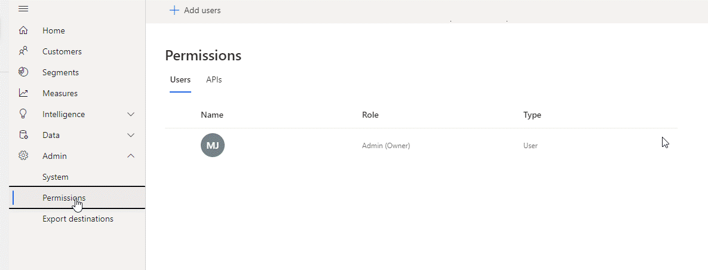

مع العديد من التطبيقات والخدمات الشائعة، توفر Customer Insights العديد من الأدوات الجاهزة التي تساعدك على الاتصال ببياناتها واستخدامها. ومع ذلك، قد تحدث السيناريوهات عندما تريد إنشاء تطبيقاتك الخاصة استنادًا إلى البيانات الموجودة في Customer Insights.

لبناء حلول مخصصة، يمكن للمطورين استخدام واجهة برمجة التطبيقات المتاحة (API) في Customer Insights. على سبيل المثال، لتوجيه عمليات البيانات في تطبيق داعم، قد ترغب في استخدام مقياس في Customer Insights. قد ترغب في إرسال بعض المعلومات إلى العميل، عندما تنخفض قيمة متوسط ​​العمر الذي ينفقه العميل إلى أقل من مبلغ معين. باستخدام واجهات API لـ Customer Insights، ستتمكن من تحديد التدابير المختلفة المتاحة وتحديثها حسب الحاجة لضمان تحديث كل شيء. يمكنك إجراء عمليات في التطبيق الداعم، عندما تكون لديك هذه البيانات.

يمكنك إكمال مهام محددة في حلولك، باستخدام واجهات API لـ Customer Insights.

- **إنشاء ملفات تعريف البيانات** - اسحب معلومات السمة وملف تعريف الكيان بحيث يمكنك استخدامها في مناطق أخرى.

- **العمل مع مصادر البيانات** - كشأن حذف مصدر بيانات أو الحصول على قائمة بجميع مصادر البيانات أو سحب تفاصيل مصدر بيانات معين، قم بتنفيذ مهام الإدارة المتعلقة بمصادر البيانات الخاصة بك.

- **العمل مع بيانات الكيان** - الحصول على تفاصيل الكيان وإنشائها وتحديثها.

- **إدارة المثيلات** - إنشاء مثيلات Customer Insights وحذفها وإعادة تعيينها.

- **إدارة التدابير** - إنشاء الإجراءات وحذفها وتحديثها في التطبيق.

- **إدارة أذونات المستخدم** - إدارة الأدوار والأذونات التي يمتلكها المستخدمون في التطبيق.

- **إدارة العلاقات** - إدارة العلاقات بين الكيانات المختلفة في التطبيق.

- **إدارة الشرائح** - إنشاء الشرائح وحذفها وإعادة تعيينها في مثيل Customer Insights الخاص بك.

## استكشاف واجهات API لـ Customer Insights

قبل أن تتمكن من البدء في استخدام واجهات API لـ Customer Insights، تحتاج أولاً إلى تمكينها. لإكمال هذه المهمة، انتقل إلى **المسؤول > الأذونات**، وحدد علامة التبويب **واجهات برمجة التطبيقات (API)** ثم حدد **تمكين**.

> [!div class="mx-imgBorder"]
> 

سيؤدي تمكين واجهات برمجة التطبيقات إلى إنشاء مفتاح اشتراك أساسي وثانوي للمثيل الخاص بك والذي سيتم استخدامه في طلبات واجهة برمجة التطبيقات (API). يمكنك إعادة إنشاء المفاتيح عن طريق تحديد الخيارين **إعادة إنشاء الأساسي** أو **إعادة إنشاء الخيارات الثانوية** في **المسؤول > الأذونات > واجهات برمجة التطبيقات (API)**.

يعد بناء الحلول باستخدام واجهات API لـ Customer Insights خارج نطاق هذه الوحدة. لمزيد من المعلومات، انتقل إلى الارتباطات التالية:

- [ابدأ استخدام واجهات API لـ Customer Insights](/dynamics365/customer-insights/audience-insights/apis?azure-portal=true#get-started-trying-the-customer-insights-apis)

- [إنشاء تسجيل تطبيق في Azure](/dynamics365/customer-insights/audience-insights/apis?azure-portal=true#create-a-new-app-registration-in-the-azure-portal)

- [مكتبات عملاء Customer Insights](/dynamics365/customer-insights/audience-insights/apis?azure-portal=true#customer-insights-client-libraries)

- [مراجع واجهة API لـ Customer Insights](https://developer.ci.ai.dynamics.com/api-details#api=CustomerInsights&operation=Get-an-attribute-profile)
