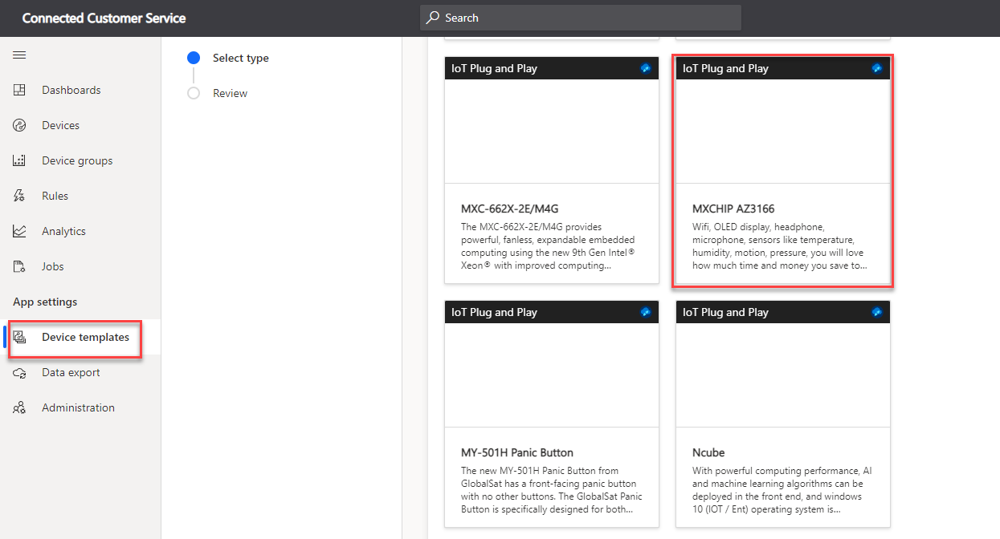

إذا كان من الممكن توصيل أي كائن مادي بالإنترنت للتحكم فيه أو لتوصيل المعلومات، فيمكن تحويله تقريباً إلى جهاز "IoT". على سبيل المثال، يمكنك استخدام تطبيق هاتف ذكي لتشغيل مصباح أو مستشعر حركة أو منظم حرارة ذكي في مكتبك أو حتى مصباح شارع متصل.

عند العمل باستخدام Connected Customer Service، ستكتشف أن هناك جانبين هامين يقودان إلى مدى فاعلية الحل أثناء العمل مع أجهزة IoT وإدارتها:

-   تسجيل أجهزة IoT باستخدام "مركز IoT" من Microsoft Azure أو Microsoft Azure IoT Central.

-   إدارة أجهزة IoT وتبسيط طريقة تفاعلك معها.

تأكد أنك حددت سجلاً مطابقاً لأي جهاز متصل سينشئ تنبيهات أو سيتم التفاعل معه. في التطبيق، يكمل Connected Customer Service هذه المهمة من خلال سجلات **أصول العميل** و **جهاز IoT**.

## سجل أصول العميل

يمثل سجل **أصول العميل** المعدات الموجودة في موقع العميل والتي تدعمها المؤسسة ويتم تنفيذ عمليات الخدمة عليه. يلعب جدول جهاز IoT دوراً مهماً في الحل لأنه يمكنك استخدامه لتوصيل سجلات أصول العميل بأجهزة IoT المادية أو غير المادية داخل "مركز IoT" أو تطبيق Azure IoT Central.

> [!NOTE] 
> يمكن أن تكون أصول العميل عبارة عن أجهزة "IoT" أو أجهزة غير متصلة بـ "IoT".

لربط سجلات أصول العميل بسجلات جهاز "IoT"، يستخدم Connected Customer Service حل Microsoft Connections ووظائف **أدوار الاتصال**. يتم إنشاء الاتصال تلقائياً باستخدام دور اتصال **جهاز IoT متصل** عندما يتم تسجيل أصل العميل كجهاز "IoT".

يمكنك إعداد أصول العميل في تدرج هرمي. عادةً ما يكون لدى أحد أصول العميل العديد من أجهزة الاستشعار الممكنة IoT المرتبطة به. في هذه السيناريوهات، سيكون لكل مستشعر IoT أصل عميل مرفق بسجل الأصول الرئيسي.

## تسجيل جهاز IoT

قبل أن يتم استهلاك بيانات الجهاز وتتبع الاستخدام بواسطة Microsoft Dynamics 365 Connected Customer Service، يجب أولا تسجيل الجهاز باستخدام "مركز IoT" أو Azure IoT Central كجهاز IoT. بعد أن تقوم بتسجيل جهاز باستخدام "مركز IoT" أو Azure IoT Central (مباشرة في Azure، من Dynamics 365، أو أي وسيلة أخرى)، يتم إنشاء سجل جهاز IoT المقابل تلقائياً في Dynamics 365.

من بين الطرق المختلفة التي يمكنك من خلالها تسجيل الأجهزة ما يلي:

-   **من سجل أصول العميل** - يقوم التشغيل الآلي بإنشاء جهاز IoT وتسجيله في تطبيق Azure IoT Central أو في Azure loT Hub بعد إنشاء سجل أصول العميل. تقوم الأتمتة بعد ذلك بإنشاء سجل جهاز IoT في Dynamics 365 ثم تقوم بتحديث سجل أصول العميل.

-   **من تسجيل الجهاز في Azure IoT Central أو IoT Hub** - يتم إنشاء جهاز وتسجيله في Azure IoT Central أو IoT Hub. تنتقل الأتمتة، مثل دفق Microsoft Power Automate، إلى Dynamics 365 وينشئ جهاز IoT وسجل أصول العميل.

> [!div class="mx-imgBorder"]
> 

> [!NOTE] 
> يركز هذا التدريب على استخدام Connected Customer Service لـ Azure IoT Central.

## إنشاء جهاز في Azure IoT Central

خطوتك الأولى في إنشاء أحد الأجهزة في تطبيق Azure IoT Central هي تحديد أحد قوالب الأجهزة. يحدد القالب خصائص الجهاز وتفاصيل قياس تتبع الاستخدام التي سيرسلها الجهاز. في تطبيق Azure IoT Central، حدد **قوالب الأجهزة**، والتي ستعرض قائمة بالقوالب المكونة مسبقاً وخيار إنشاء قالب مخصص.

> [!div class="mx-imgBorder"]
> 

قم بالتمرير لأسفل وحدد قالب **MXCHIP AZ3166** ثم حدد **التالي: مراجعة > إنشاء**.

سيتم عرض إمكانيات القالب. يحتوي هذا القالب على العديد من أجهزة الاستشعار، بما في ذلك درجة الحرارة والرطوبة.

> [!div class="mx-imgBorder"]
> 

يمكن أن تكون الأجهزة في Azure IoT Central حقيقية أو تمت محاكاتها. للتحقق بسرعة من عملية توزيع Connected Customer Service، يعد إنشاء جهاز محاكاة طريقة ممتازة لذلك.

في تطبيق Azure IoT Central، حدد **الأجهزة** ثم حدد **إنشاء جهاز**. سيتم إنشاء **اسم الجهاز** و **معرّف الجهاز**. تأكد من استخدام **معرّف الجهاز** عند إنشاء أصل العميل وجهاز "IoT" في Microsoft Dynamics 365.

> [!div class="mx-imgBorder"]
> 

حدد القالب، وقم بتشغيل مفتاح التبديل **محاكاة هذا الجهاز**، ثم حدد **إنشاء**. سيتم إنشاء الجهاز، وفي غضون بضع دقائق، سيتم عرض القياس عن بُعد الذي تم إنشاؤه عشوائياً للجهاز.

> [!div class="mx-imgBorder"]
> 

## إنشاء جهاز في Dynamics 365 Customer Service

في مركز Microsoft Dynamics 365 Customer Service، يمكنك إنشاء سجل أصول عميل جديد.
بعد إنشاء السجل، أدخل **معرّف الجهاز** للجهاز المحاكى الذي تم إنشاؤه في Azure IoT Central، وحدد **حفظ**، ثم حدد **تسجيل الأجهزة**.

> [!div class="mx-imgBorder"]
> 

> [!NOTE] 
> الحل الذي يتم توفيره باستخدام Connected Customer Service لـ "مركز IoT" سينشئ تلقائياً سجل جهاز IoT في Dynamics 365 عند إضافة الجهاز إلى "مركز IoT". بالنسبة لـ Connected Customer Service لـ IoT Central، ستحتاج إلى إنشاء سجل جهاز IoT يدوياً أو إنشاء دفق Power Automate السحابي لإكمال هذه المهمة.

يُعد القالب Power Automate الحالي، والذي باسم **عند إنشاء جهاز في Dynamics 365، قم بتحديث IoT Central**، هو قالب دفق يقوم بإنشاء جهاز في Azure IoT Central تلقائياً.

> [!IMPORTANT] 
> أحدث إصدار من Azure IoT Central هو V3. تستخدم العديد من القوالب موصل V2 IoT Central. تأكد من تحديث عمليات الدفق لاستخدام موصل V3.

تُظهر لقطة الشاشة التالية دفق Power Automate السحابي الذي ينشئ أجهزة جديدة في Azure IoT Central عند إضافة سجل جهاز IoT إلى Dynamics 365.

> [!div class="mx-imgBorder"]
> 

أنت الآن جاهز لاستخدام Power Automate لإنشاء عمليات دفق سحابية لربط Azure IoT Central بـ Microsoft Dynamics 365 Customer Service.
