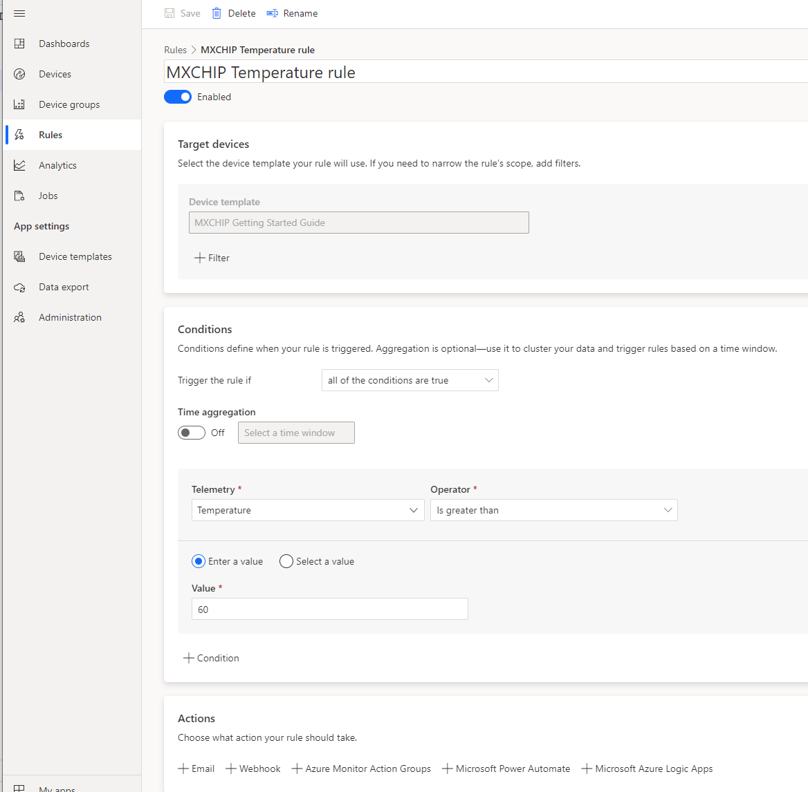
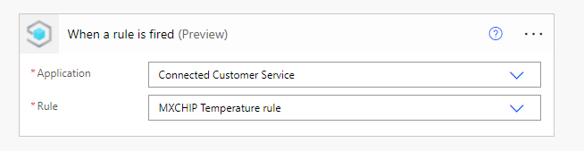
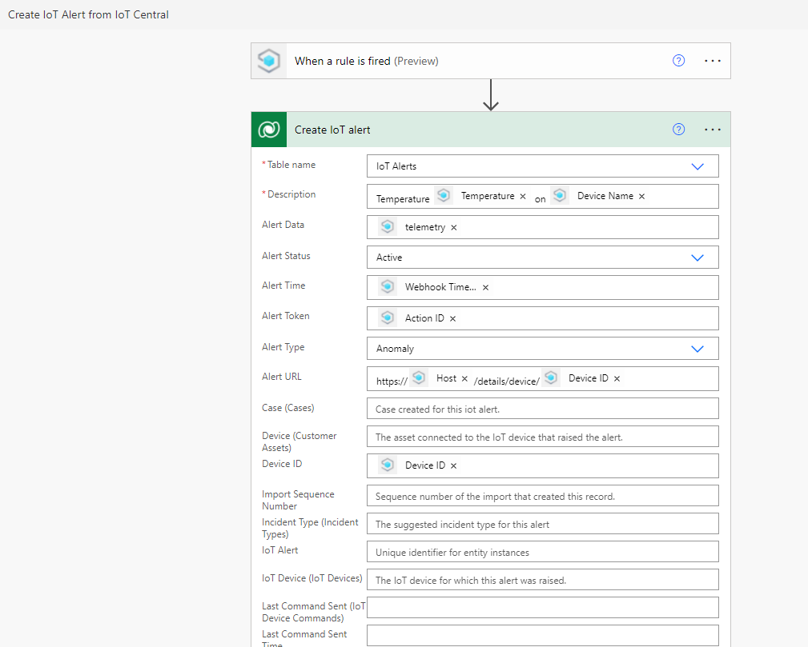
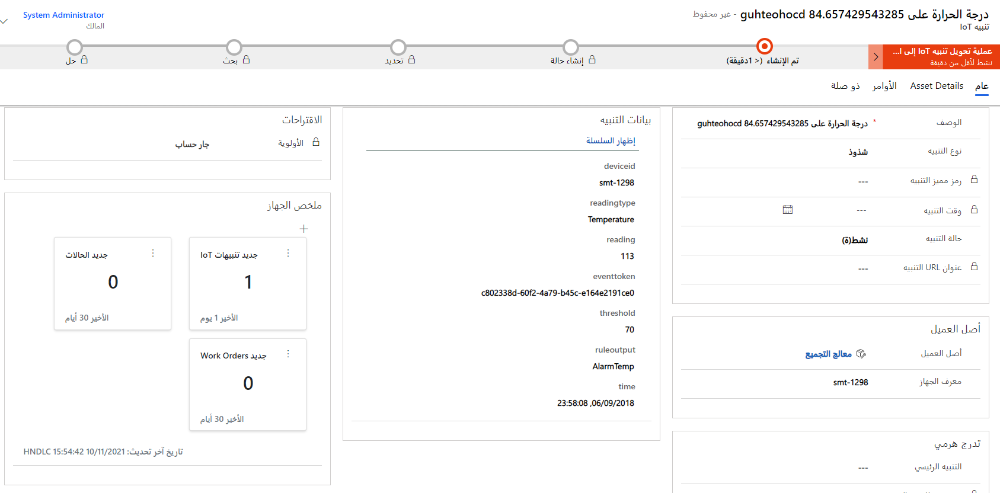
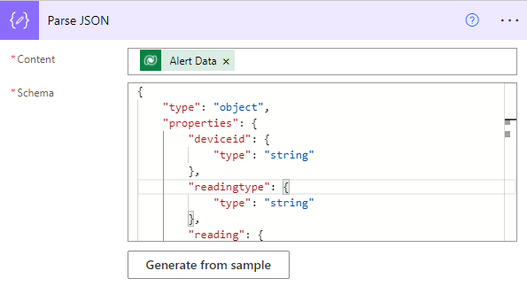
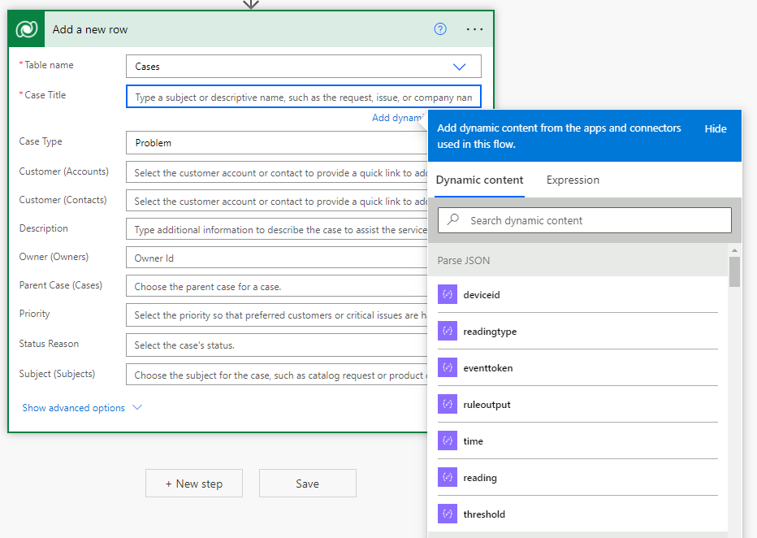
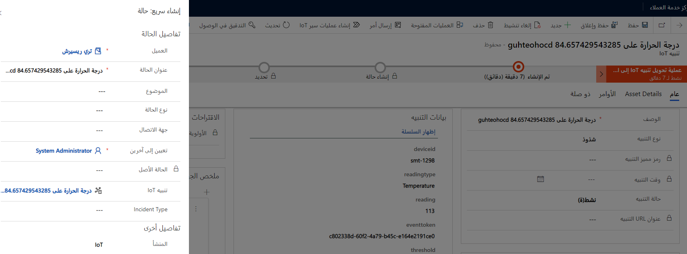

سيتم تسجيل القراءات من الأجهزة استناداً إلى التكوين، بعد تسجيل أصول العملاء الممكّنة لـ IoT باستخدام Azure IoT Hub أو Azure IoT Central. داخل IoT Hub أو Azure IoT Central، يمكنك تحديد كيف ومتى تريد تشغيل تنبيه يمكن إرجاعه إلى Dynamics 365. فمثلاً، ضع في اعتبارك سيناريو يكون لديك فيه منظم حرارة مزوّد بIoT. سيرسل الجهاز قراءات درجة الحرارة باستمرار إلى "مركز IoT". سيتم إنشاء سجل تنبيه IoT في Dynamics 365، عند اكتشاف قراءة درجة حرارة خارج الحد المحدد.

ستتوفر بيانات الجهاز في Dynamics 365، إذا كنت تستخدم Connected Customer Service لخيار نشر "مركز IoT". يمكنك رصد هذه البيانات بعدة طرق:

- **تنبيه IoT** - عند إنشاء تنبيه ما، يتم تضمين تفاصيل التنبيه كـ JSON مع التنبيه.

- **سحب بيانات الجهاز** - يبدأ سحب بيانات الجهاز مباشرة من سجل جهاز IoT في Microsoft Dynamics 365 Field Service.

- **سحب البيانات المجدول** - مشابه لسحب بيانات الجهاز مباشرةً، إلا أنه يتم وفقاً لجدول زمني محدد.

لن تتوفر إمكانية سحب بيانات الجهاز والعرض داخل Dynamics 365، إذا كنت تستخدم خيار النشر Connected Customer Service لـ IoT Central.
تأكد من إنشاء عمليات دفق Power Automate السحابية التي تربط Azure IoT Central بـ Dynamics 365.

## <a name="create-alert-rules-in-azure-iot-central"></a>إنشاء قواعد التنبيه في Azure IoT Central

يسمح لك Azure IoT Central بإنشاء قواعد يمكنها، عند تشغيلها، تنفيذ إجراءات عندما يتجاوز القياس عن بُعد المحدد حداً معيناً. من بين الإجراءات هو تشغيل إحدى عمليات دفق Power Automate السحابية. لإنشاء قاعدة، حدد **القواعد** في تطبيق Azure IoT Central ثم حدد **+ جديد**.

في القاعدة، يمكنك تحديد قياس تتبع الاستخدام الذي تريد مراقبته، ونافذة الوقت، والشروط، كما هو موضح في لقطة الشاشة التالية.

> [!div class="mx-imgBorder"]
> 

بعد تحديد **حفظ**، يمكنك إضافة دفق Power Automate كإجراء لهذه القاعدة.

## <a name="create-iot-alerts-for-azure-iot-central-with-power-automate"></a>إنشاء تنبيهات IoT لـ Azure IoT Central باستخدام Power Automate

في Power Automate، يمكنك إنشاء دفق سحابي تلقائي جديد ثم تحديد **موصل IoT Central** الذي يحتوي على مشغّل واحد: **عند إطلاق قاعدة ما**.

> [!IMPORTANT]
> أحدث إصدار من Azure IoT Central هو V3، لذا تأكد من تحديد موصل IoT Central V3.

كما هو موضح في لقطة الشاشة التالية، حدد تطبيق Azure IoT Central والقاعدة.

> [!div class="mx-imgBorder"]
> 

كما هو موضح في لقطة الشاشة التالية، استخدم موصل Microsoft Dataverse لإنشاء سجل تنبيه IoT.

> [!div class="mx-imgBorder"]
> 

تُظهر لقطة الشاشة التالية مثالاً على تنبيه IoT الذي تم إنشاؤه باستخدام هذا الدفق.

> [!div class="mx-imgBorder"]
> 

## <a name="work-with-the-alert-data-feature"></a>العمل باستخدام ميزة "بيانات التنبيه"

بعد إنشاء تنبيه IoT، تحتاج إلى تحديد الإجراء التالي الواجب اتخاذه. يحتوي سجل **تنبيه IoT** على عدة أجزاء من المعلومات، بما في ذلك نوع التنبيه والوقت ومعرف الجهاز وبيانات التنبيه.

يتكون الحقل **بيانات التنبيه** من بيانات JSON التي تحتوي على تفاصيل محددة حول الحدث. يمكن أن تختلف البيانات المضمّنة بحسب الجهاز.
ستحدد المعلومات المتوفرة في الحقل **بيانات التنبيه** بشكل عام الخطوة التالية المحددة الواجب عليك اتخاذها. عند البدء في إنشاء أتمتة حول الخطوات التالية، يجب عليك فهم الأدوات والمعلومات المتوفرة وكيف تتيح لك هذه الأدوات تحقيق هدفك.

تتوفر العديد من الإجراءات خارج الصندوق والتي يمكنك استخدامها للمساعدة في أتمتة العناصر، مثل إنشاء الأجهزة وتسجيلها والتفاعل مع سجلات تنبيهات IoT. عند تلقي أحد التنبيهات، تتوفر البيانات المحددة المتعلقة بالتنبيه في الحقل **بيانات التنبيه**. تتوفر البيانات الموجودة في هذا الحقل بتنسيق JSON. عند ظهور تنبيه IoT، يمثل نموذج التعليمات البرمجية التالي ما يمكن تمريره إلى الحقل **بيانات التنبيه**.

```json
{"deviceid":"smt-1298","readingtype":"Temperature","reading":113,"eventtoken":"c802338d-60f2-4a79-b45c-e164e2191ce0","threshold":70,"ruleoutput":"AlarmTemp","time":"2018-09-06T15:58:08.964Z"}
```

بشكل عام، لا يمكنك استخدام محتويات الحقل **بيانات التنبيه** مباشرةً لأنك ربما تحاول الاستعلام بناءً على إحدى الخصائص، وليس جميعها. أولاً، قم بتحليل المعلمات ذات الصلة التي تريد العمل معها بحيث يمكنك استخدام هذه المعلمات لتشغيل الاستعلام وتوجيه الخطوات التالية.

ستكتشف أنها تنقل المعلومات التالية، إذا قمت بتحليل سلسلة JSON السابقة.

| **معلمة**| **قيمة** |
| ---- | ---- |
| **Deviceid**| Smt-1298 |
| **Readingtype**| درجة الحرارة |
| **القراءة**| 113 |
| **Eventtoken**| c802338d-60f2-4a79-b45c-e164e2191ce0 |
| **Threshold**| 70 |
| **Ruleoutput**| AlarmTemp |
| **Time**| 09/06/2018 06:58:08 صباحاً |

## <a name="use-power-automate-to-parse-data"></a>استخدم Power Automate لتحليل البيانات

يتضمن Power Automate أحد الإجراءات الذي يسمى "تحليل JSON". عند تشغيل الإجراء "تحليل JSON"، سيتم تحليل JSON من الحقل **بيانات التنبيه** إلى خصائص فردية. تأكد من تحديد مخطط قاعدة البيانات بحيث يؤدي الأمر إلى معرفة طريقة تحليل البيانات. يمكنك استخدام عينات الحمولات من تنبيه IoT لإنشاء المخطط.

توضح الصورة التالية أنه يتم استخدام نفس سلسلة JSON التي تم تضمينها في تنبيه IoT لإنشاء المخطط.

```json
{"deviceid":"nest1234","readingtype":"Temperature","reading":80,"eventtoken":"cfd5e690-ee88-4ca8-a75d-3b86ac61295c","threshold":70,"ruleoutput":"AlarmTemp","time":"2019-10-19T16:42:26.457Z"}
```

أنشأت السلسلة خصائص متعددة تمثل كل عنصر تم تحليله في JSON، مثل deviceid وreadingtype وreading وما إلى ذلك.

> [!div class="mx-imgBorder"]
> 

بعد تحليل البيانات، يمكنك استخدامها لملء الحقول الأخرى في تنبيه IoT، كما هو الحال مع سير العمل. والآن، يمكنك استخدام كل خاصية كمحتوى ديناميكي في أي خطوة مستقبلية في الدفق.

> [!div class="mx-imgBorder"]
> 

إذا استخدمت هذا الأسلوب لتحليل سلسلة JSON السابقة، فيمكنك إنشاء دفق في Power Automate يقوم بتنفيذ الإجراءات التالية:

1. يبدأ الدفق عند إنشاء سجل تنبيه IoT جديد.

2. يتم تشغيل إجراء تحليل JSON لتحليل JSON إلى خصائص فردية.

3. يقوم الدفق بتحديث سجل تنبيه IoT بقيمة إخراج إحدى الخصائص التي تم إرجاعها. فمثلاً، يتم استخدام الخاصية **Reading** لتحديث الحقل **قراءة الجهاز**.

4. يمكن تشغيل دفق آخر عند تحديث الحقل **قراءة الجهاز**، والذي يقوم بتنفيذ الإجراءات التالية:

    -   إذا كان الحقل **قراءة الجهاز** بين 70 و85، فسيقوم بإنشاء أمر مرتبط بتنبيه IoT الذي يرسل أمر إعادة تعيين إلى الجهاز.

    -   إذا كان الحقل **قراءة الجهاز** أكبر من 85 درجة، فسيتم إكمال سير العمل بالحالة **تم بنجاح**.

## <a name="create-cases-from-iot-alerts"></a>إنشاء حالات من تنبيهات "IoT"

يمكن لفريق الخدمة الخاص بك، عندما تتلقى تنبيهاً من أحد الأجهزة، مراقبة التنبيهات يدوياً واستكشاف المشكلة وإصلاحها عن بُعد. إذا لم يتم حل المشكلة عن طريق إرسال أمر عن بُعد، فيمكن لممثل الخدمة إنشاء حالة للعمل على المشكلة بشكل أكبر. يرشدك سير إجراءات العمل المقدّم خلال عملية الرد يدوياً على تنبيهات "IoT".

تتوفر المرحلة الأولية في سير إجراءات العمل في سجل تنبيه IoT، كما أن المراحل التالية مخصصة للحالة. يمكنك إنشاء حالة إذا قمتَ بتحديد المرحلة الأولى ثم حددت **المرحلة التالية**. بعد ذلك، وكما هو موضح في لقطة الشاشة التالية، سيظهر الجزء **الإنشاء السريع**.

> [!div class="mx-imgBorder"]
> 

بعد إنشاء الحالة، ستتغير حالة "التنبيه" في سجل تنبيه IoT إلى **قيد التقدم - تم إنشاء الحالة** وسيكون السجل "للقراءة فقط". عندما يتم حل الحالة، يتم تغيير حالة تنبيه IoT تلقائياً إلى **مُقفل**.

## <a name="required-security-roles-for-connected-customer-service"></a>أدوار الأمان المطلوبة لـ Connected Customer Service

تسمح أدوار الأمان لـ Connected Customer Service للمسؤولين بإعطاء وصول مناسب إلى كيانات IoT، بما في ذلك التنبيهات والأصول والأجهزة والأوامر.

يتم تضمين أدوار الأمان التالية باستخدام Connected Customer Service:

- **IoT - المسؤول** - جميع الامتيازات لجميع السجلات على أصول العملاء، وأجهزة IoT، وتنبيهات IoT، والجداول المرتبطة.

- **IoT - مستخدم نقطة النهاية** - دور خاص تستخدمه Microsoft لربط Dynamics 365 بأنظمة "مركز IoT".

> [!NOTE]
> يجب على أي مستخدم يحتاج إلى العمل مع تسجيل الجهاز وسحب بيانات الجهاز (IoT Hub) أن يكون لديه أدوار أمان كلّ من "مسؤول IoT" و"مستخدم نقطة نهاية IoT".

قد تحتاج إلى إنشاء أدوار الأمان الخاصة بك لتوفير الامتيازات المطلوبة للمستخدمين.

> [!IMPORTANT]
> تم تصميم هذه الأدوار المضمّنة لتكمل الأدوار الأخرى، مثل ممثل خدمة العملاء أو مدير CSR؛ إنها تحتوي فقط على الامتيازات المخصصة لـ Connected Customer Service ولا تحتوي على الامتيازات التي يطلبها المستخدمون، مثل الحسابات وجهات الاتصال والحالات والأنشطة.
