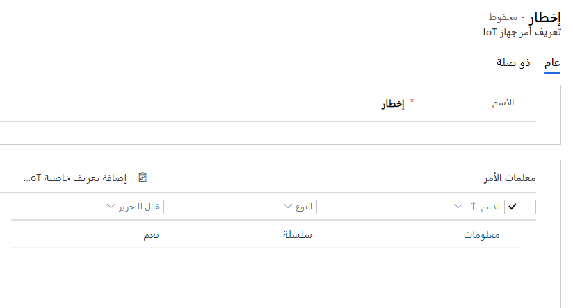
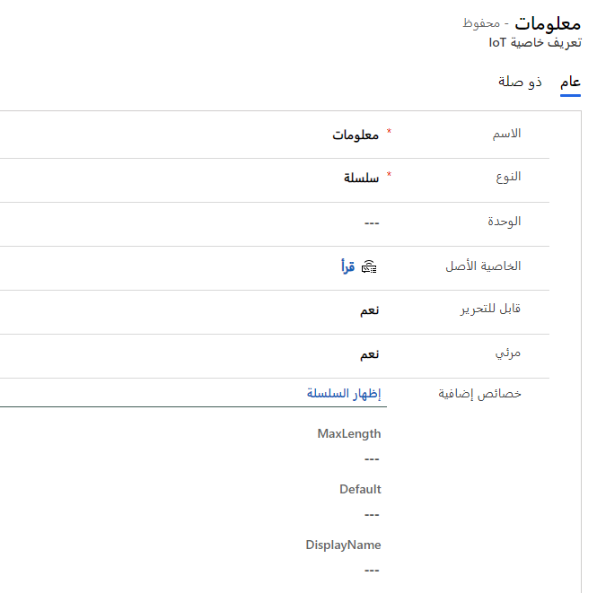
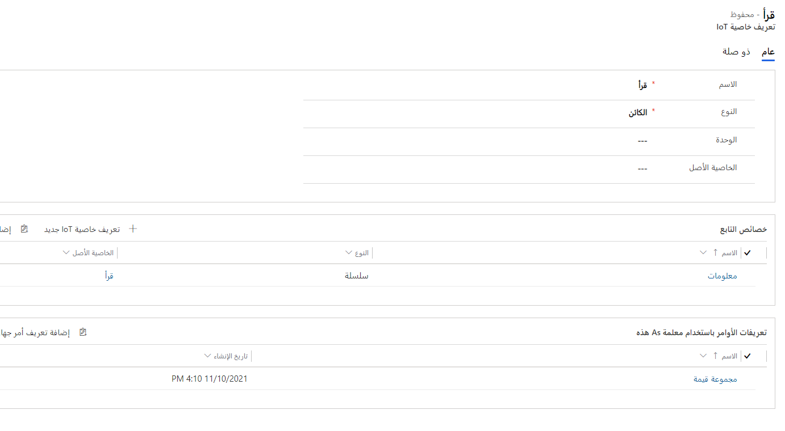

بعد تسجيل أجهزتك كأجهزة IoT، سيتم التقاط القراءات من هذه الأجهزة وإرسالها مرة أخرى إلى مركز Azure IoT أو Azure IoT Central.
عندما يقوم أحد الأجهزة برفع استثناء، سيتم إرساله مرة أخرى إلى Dynamics 365 كتنبيه. على سبيل المثال، ضع في اعتبارك سيناريو تدير فيه مؤسستك صناديق المهملات الذكية. سترسل سلة المهملات باستمرار قراءات مستوى المهملات إلى مركز IoT أو Azure IoT Central. عند اكتشاف قراءة خارج النطاق المحدد، يجب رفع تنبيه. بعد ذلك، سيتم إنشاء سجل تنبيه IoT في Dynamics 365 من خلال أتمتة مثل تدفق Power Automate أو تطبيق من Logic Apps.

في كثير من الأحيان، عندما يتلقى النظام تنبيه IoT، فإن خطوته الأولى هي محاولة التفاعل عن بُعد مع الجهاز وربما إرسال أوامر إلى الجهاز.
تتوفر العديد من أنواع السجلات لاستخدامها في إدارة هذه الأجهزة والتفاعل معها عن بُعد.

تشمل أنواع السجلات الرئيسية التي يمكنك استخدامها لإدارة الجهاز والتفاعل ما يلي:

- **فئة الجهاز** - استخدم نوع السجل هذا لتجميع عدة أجهزة حسب نوع الجهاز. يمكنك استخدام فئات الأجهزة لأغراض إعداد التقارير والإدارة وتبسيط تفاعلات الجهاز. على سبيل المثال، يمكنك إنشاء فئات درجة الحرارة والرطوبة لفصل أجهزة أو أوامر IoT المتعلقة بدرجة الحرارة عن أجهزة أو أوامر IoT التي تركز على الرطوبة.

- **الأمر** - تمثل أنواع السجلات هذه الإجراء الفعلي أو الأمر الذي يجب تشغيله على جهاز IoT المحدد. تتكون هذه الأجهزة عادةً من خصائص JSON المختلفة التي يتم تمريرها إلى الجهاز الذي يقوم بشيء ما على الجهاز. على سبيل المثال، إذا كنت ترغب في ضبط درجة حرارة الجهاز ورطوبته على قيم محددة، فيمكنك تمرير البرنامج النصي JSON التالي إلى الجهاز باستخدام سجل الأوامر. 
    
    {"CommandName":"Set Values","Parameters":{"Reading":{"Temperature":"60","Humidity":"40"}}}

- **تعريف الأمر** - يمثل نوع السجل هذا أمراً محدداً مسبقاً يمكنك إضافته إلى سجل الأمر. يحتوي على العديد من الخصائص المكونة مسبقاً والتي يمكنك تعديلها لعملية الإرسال إلى الأجهزة. بعد إنشاء أمر، يمكنك تحديد تعريف الأمر. ستتم تعبئة الخصائص في التعريف بالقيم الافتراضية، ولكن يمكنك تجاوز هذه القيم.
    على سبيل المثال، يمكنك إنشاء تعريف أمر يسمى **تعيين القيم**. في تعريف الأمر، يمكنك تحديد المعلمات مسبقاً، مثل القراءة ودرجة الحرارة والرطوبة. عند تحديد تعريف الأمر، سيقوم تلقائياً بتعبئة الأمر، ويمكنك تغيير المعلمات يدوياً حسب الحاجة.

- **تعريف الخاصية** - استخدم نوع السجل هذا لتعريف الخصائص المحددة المتاحة ويمكن تمريرها كجزء من تعريف الأمر. على سبيل المثال، إذا قمت بإنشاء تعريف أمر **تعيين القيم** (كما تمت مناقشته سابقاً)، فسيكون لكل معلمة، مثل reading وtemperature وhumidity، تعريف خاصية محدد والتي تم إقرانها بتعريف أمر **تعيين القيم**.

## <a name="command-definitions"></a>تعريفات الأوامر

بشكل دوري، سيكون لديك العديد من أجهزة IoT التي تقوم بنفس الشيء أو لها خصائص مماثلة يتم الإبلاغ عنها ومن المحتمل أن تحتاج إلى التفاعل معها. على الرغم من أن تنبيهات IoT التي يتم إنشاؤها خاصة بالجهاز، غالباً ما توجد خصائص مشتركة بين الأجهزة التي تحتاج إلى التفاعل معها. يحدد كل أمر أياً من هذه الخصائص المختلفة يتم استخدامها لهذا الجهاز المحدد. على سبيل المثال، ضع في اعتبارك سيناريو تريد فيه إرسال رسالة مرة أخرى إلى جهاز يتيح للجهاز معرفة (أو الشاشة الموجودة على الجهاز) بأنه تم إرسال فني لحل المشكلة. عند حدوث هذا الموقف، ستحتاج إلى إنشاء أمر في Connected Customer Service يتضمن رسالة JSON التالية:

```json
{"CommandName":"Notification","Parameters":{"Message":"Technician has been dispatched"}}
```

يحتوي المثال السابق على ثلاثة مكونات محددة يتم إرسالها إلى الجهاز كجزء من الرسالة:

- **CommandName** - يمثل هذا المكون اسم الأمر الذي يتم تعيينه على الجهاز. في الأمر السابق، اسم الأمر هو **الإخطار**.

- **المعلمات** - استخدم هذا المكون للإعلان عن الخصائص المحددة التي يتم التفاعل معها كجزء من الأمر. ستشمل هذه المعلمات جميع الخصائص التي يتفاعل معها الأمر. في الأمر السابق، يمثل كل ما يلي "المعلمات" (في هذه الحالة، "الرسالة") الخصائص التي يتم التفاعل معها كجزء من هذا الأمر.

- **الخاصية** - تمثل الخاصية المحددة التي سيتم التفاعل معها والقيمة التي يجب دفعها إلى الخاصية. يتم تعريف الخصائص عادةً على أنها أزواج الاسم/القيمة. على سبيل المثال، تمثل "الرسالة" خاصية الرسالة التي يمكنك استخدامها لإرسال رسالة إلى الجهاز. يتم تمرير قيمة "تم إرسال الفني" إلى خاصية "الرسالة".

بينما يمكنك تحديد JSON يدوياً لكل أمر باستخدام التنسيق المحدد في القسم السابق، فإن الحقيقة هي أنك على الأرجح تحدد أوامر متعددة تقوم بنفس الشيء بشكل أساسي. هذا الموقف عندما يكون استخدام تعريف أمر مفيد. بشكل أساسي، تعريف الأمر هو غلاف يحدد مسبقاً اسم الأمر والمعلمات التي تريد استخدامها في الأمر.
من خلال التحديد المسبق للمعلمات التي تم تعيينها في أمر معين، ستساعد على توفير الوقت للمستخدمين و/أو عمليات التشغيل التلقائي لأنهم سيحتاجون فقط إلى تعديل قيم الخصائص ذات الصلة بما يحاول الأمر القيام به.
عند إنشاء أمر، يمكن للمستخدم/العملية تحديد تعريف الأمر الذي يريد استخدامه.

تمثل الصورة التالية تعريف الأمر، المسمى **الإخطار**، والذي سينشئ تلقائياً JSON نفسه من المثال الأصلي.

> [!div class="mx-imgBorder"]
> 

يمكنك إقران كل تعريف أمر محدد بواحد أو أكثر من تعريفات الخاصية. يمثل تعريف الخاصية معلمة خاصة يتم استخدامها كجزء من الأمر. تتم تعبئة المعلمات التي تم تحديدها لتعريف الأمر تلقائياً بالقيم الافتراضية التي تم تحديدها لتعريف الخاصية المحددة التي يتم استخدامها. يمكن استخدام هذه القيم كما تتم الكتابة فوقها في وقت إنشاء الأمر الفعلي.

## <a name="property-definitions"></a>تعريفات الخصائص

تساعد تعريفات الخصائص على تبسيط مهمتك في التحديد المسبق لخصائص محددة مرتبطة بأجهزة IoT.

يحتوي تعريف الخاصية على المعلومات التالية:

- **الاسم** - اسم الخاصية المحددة. في المثال السابق، سيتم تعيين **الرسالة** كاسم لأنها الخاصية التي تريد تعريفها.

- **النوع** - تحديد نوع الخاصية.

- **الخاصية الأصل** - تقوم بتحديد أن الخاصية هي خاصية تابعة لخاصية أخرى.

- **قابل للتحرير** - يقوم بتحديد هل ستكون الخاصية قابلة للتحرير عند استخدامها في تعريف أمر ما.

- **مرئي** - يحدد ما إذا كانت الخاصية مخفية ويجب ألا تظهر في تعريف الأمر.

- **الخصائص الإضافية** - عناصر إضافية خاصة بنوع الخاصية التي يمكنك تعريفها، مثل سلسلة نصية افتراضية ستستخدمها مع إحدى خصائص **الرسالة**.

يصف الجدول التالي ستة أنواع مختلفة من تعريفات الخصائص التي يمكنك الاختيار من بينها.

| النوع | الوصف‏‎ | الخصائص والأمثلة الإضافية |
|------|-------------|------------------------------------|
| **السلسلة‬** | تستخدم عندما تكون القيمة التي تريد تمريرها إلى خاصية هي قيمة نصية. | الحد الأقصى للطول والقيمة الافتراضية. **مثال** - قد تستخدم خاصية الرسالة نوع السلسلة لأن محتويات الرسالة ستكون نصية. |
| **التاريخ والوقت** | يستخدم عندما تكون القيمة المراد تمريرها إلى خاصية قائمة على التاريخ و/أو الوقت. | الحد الأقصى والحد الأدنى للقيم. |
| **قيمة منطقية**| تستخدم عندما تريد تمرير إحدى القيمتين المحتملتين إلى الخاصية. | اسم العرض للقيمة الصحيحة واسم العرض للقيمة الخاطئة واسم العرض للقيمة الافتراضية. |
| **رقم صحيح**| يستخدم عندما تريد تمرير رقم صحيح إلى الخاصية. | الحد الأدنى والأقصى والقيمة الافتراضية. |
| **رقم عشري**| يستخدم عندما تريد تمرير رقم عشري إلى الخاصية. | الحد الأدنى والأقصى والقيمة الافتراضية والموضع العشري. |
| **الكائن** | يستخدم عندما يكون العنصر الذي تريد تمريره كائناً. | **مثال** - قد تحتوي خاصية ‎reading على خاصية temperature وhumidity. من خلال تعيين خاصية reading على نوع **الكائن**، ستتمكن من تحديد الخصائص الفرعية المحددة لها. |

## <a name="use-property-definitions-in-command-definitions"></a>استخدام تعريفات الخصائص في تعريفات الأوامر

عند فحص البيانات التي يتم إرسالها كجزء من تنبيه IoT، أو إذا كنت ترسل أمراً عن بُعد إلى جهاز، فسيتم ربط العديد من الخصائص ببيانات التنبيه أو الرسالة المراد إرسالها. تمثل الخصائص زوج الاسم/القيمة الذي يعرض أو يوفر معلمات ذات صلة بالحدث، على سبيل المثال:

- قد يتضمن تنبيه جهاز IoT المرتبط بدرجة الحرارة معرّف الجهاز أو نوع القراءة أو القراءة الفعلية أو الحد الذي تم تجاوزه.

- قد يتضمن الأمر الذي تقوم بإعادته إلى جهاز IoT الرسالة المراد إرسالها أو قيمة معينة تريد تعيين خاصية لها.

يمكنك استخدام تعريفات الأوامر لإنشاء أوامر معرّفة مسبقاً لها المعلمات المحددة التي تريد العمل معها. لإكمال هذه المهمة، قم بتكوين تعريفات الخاصية ثم قم بإقران تعريفات الخاصية تلك بتعريفات أوامر محددة. سيحدد تعريف الخاصية تفاصيل معينة حول الخاصية التي يتم تمريرها إلى الأمر، كما هو موضح في المثال التالي:

```json
{"CommandName":"Notification","Parameters":{"Message":"Technician has been dispatched"}}
```

المعلمات هي الخصائص المحددة التي تريد تضمينها في الأمر.
تشير خاصية **الرسالة** إلى أنك تريد إرسال رسالة إلى الجهاز، والنص هو الرسالة التي تريد تضمينها في الرسالة. تعتبر خاصية الرسالة في الأمر السابق مثالاً جيداً لمكان استخدام تعريفات الخاصية.

> [!div class="mx-imgBorder"]
> 

## <a name="work-with-parent-properties"></a>العمل مع خصائص الأصل

في كثير من الأحيان، سيكون للخاصية خصائص فرعية متعددة تشكل تعريف الخاصية بالكامل. في هذه الحالة، يمكنك استخدام الخصائص الأصل لربط خاصية بخصائص فرعية متعددة.

الأمر التالي هو مثال لـ reading يعتبر الخاصية الأصل لدرجة الحرارة والرطوبة.

```json
{"CommandName":"Set Values","Parameters":{"Reading":{"Temperature":"30","Humidity":"30"}}}
```

في هذا الأمر، يمكنك تعيين نوع **‎Reading** على **كائن**. سيشير هذا الإعداد إلى أن خاصية **Reading** يجب اعتبارها كائناً وقد تحتوي على خصائص أخرى تشكل القيمة الإجمالية. سيكون لكل من تعريفات خاصية **Temperature** و **Humidity** تعريف خاصية **Reading** الذي تم تعيينه كخاصية الأصل.

| اسم المعلمة | النوع   | الخاصية الأصل |
|----------------|--------|-----------------|
| Reading        | الكائن | بلا            |
| Temperature    | النص   | Reading         |
| Humidity       | النص   | Reading         |

عند إنشاء تعريف أمر يحتاج إلى استخدام خاصية **Reading**، ما عليك سوى تضمين مرجع إلى تعريف خاصية **Reading**. نظراً لأن **Reading** تحتوي على نوع من **الكائنات**، وكل من **Temperature** و **Humidity** لديهما **‎Reading‎** كخاصية الأصل، فهذا يضمن أنه عند استخدام خاصية **‎Reading‎** سيتم أيضاً تضمين خصائص كل من **Temperature** و **Humidity**.

> [!div class="mx-imgBorder"]
> 

تساعد تعريفات الأوامر على تبسيط مهمتك في تبسيط عملية إنشاء أوامر لإرسالها إلى الأجهزة. بالإضافة إلى ذلك، تساعد تعريفات الخصائص على تسهيل استخدام Power Automate لتحديد القيم المحددة التي تريد تمريرها في أحد الأوامر ومعالجتها.
