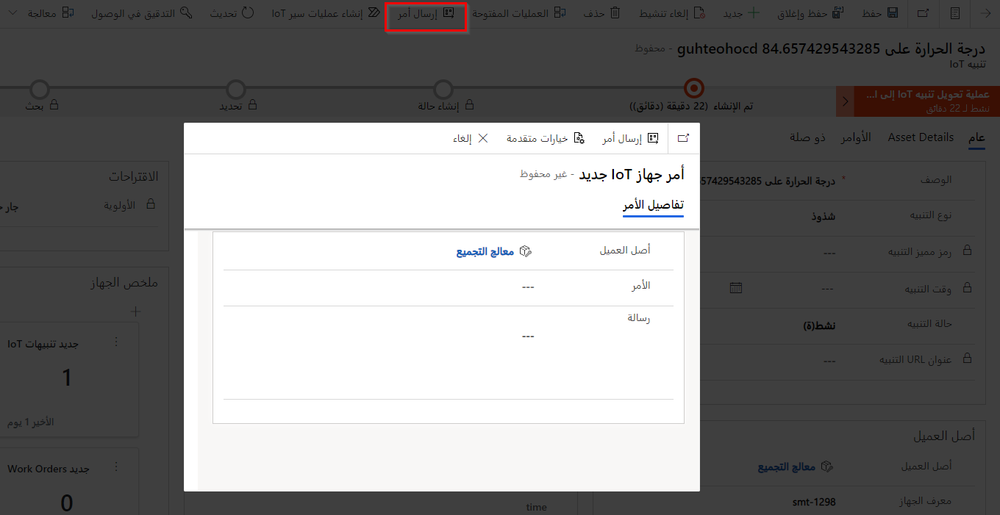
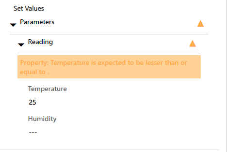
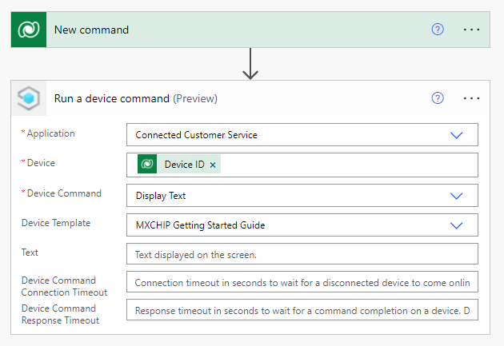

عندما لا يعمل الجهاز بشكل صحيح، يتلقى النظام تنبيهاً. لاستكشاف المشكلة وإصلاحها عن بعد، يمكنك إرسال أمر باختيار جهاز مسجل أو باستخدام تنبيه IoT الموجود. سيتم إرسال الأمر إلى مركز IoT أو Azure IoT Central، والذي سيرسل إليه رسالة من السحابة إلى الجهاز.

## إنشاء أمر

بشكل عام، تتم صياغة الأوامر بتنسيق JSON. يمكنك إنشاء أمر يدوياً أو استخدام تعريف أمر، وهو عبارة عن مجموعة من الخصائص المكونة مسبقاً والتي يمكنك إضافتها إلى أمر.

يمكنك إرسال أمر من تنبيه IoT أو جهاز IoT.

يؤدي تحديد **إرسال امر** إلى إنشاء نموذج منبثق، حيث يمكنك تحديد تعريف أمر أو إدخال أمر في حقل **الرسالة**.

> [!div class="mx-imgBorder"]
> 

علي سبيل المثال، يمكنك إدخال سلسلة JSON التالية لإعادة تعيين جهاز.

~~~~~~~~~~~~~~~~~~~~~~~~~~~~~~~~~~~~~~~~~~~~~~~~~~~~~~~~~~~~~~~~~~~~~~~~~~~~~~~~
{"CommandName":"Reset","Parameters":{"Reset":true}}
~~~~~~~~~~~~~~~~~~~~~~~~~~~~~~~~~~~~~~~~~~~~~~~~~~~~~~~~~~~~~~~~~~~~~~~~~~~~~~~~

يؤدي تحديد تعريف أمر موجود إلى إنشاء JSON من الخصائص، كما هو موضح في لقطة الشاشة التالية.

> [!div class="mx-imgBorder"]
> 

حدد **إظهار الملخص**، الذي سيمكنك من إدخال قيم لخصائص الأمر، كما هو موضح في لقطة الشاشة التالية.

> [!div class="mx-imgBorder"]
> 

## إرسال أوامر باستخدام Connected Customer Service لتوزيع مركز IoT

إذا قمت بتوزيع Connected Customer Service باستخدام مركز IoT، سيتم إرسال الأمر باستخدام رمز المكون الإضافي Microsoft Dataverse لناقل خدمة Microsoft Azure.

## إرسال أوامر باستخدام Connected Customer Service لتوزيع IoT Central

إذا قمت بتوزيع Connected Customer Service باستخدام Azure IoT Central، ستحتاج إلى إنشاء تدفق سحابة Power Automate لإرسال الأمر من Dynamics 365 إلى Azure IoT Central.

> [!IMPORTANT] 
> يستخدم القالب **عندما يتم إرسال الأمر من Dynamics 365، قم بتشغيل الأمر في قالب IoT Central** في Power Automate موصل V2 IoT Central. تأكد من تحديث التدفق لاستخدام موصل V3 أو قم بإنشاء تدفق من جديد.

في Power Automate، قم بإنشاء تدفق سحابة تلقائي جديد ثم حدد موصل Microsoft Dataverse وخيار **عند إضافة صف أو تعديله أو حذفه**.
ثم قم بإعداد المشغل كما يلي:

-   إضافة - **نوع التغيير**

-   **اسم الجدول** - أوامر جهاز IoT

-   **نطاق** - المؤسسة

حدد **+ خطوة جديدة >موصل IoT Central** ثم حدد إجراء **تشغيل أمر الجهاز**.

> [!IMPORTANT] 
> أحدث إصدار من Azure IoT Central هو V3. تأكد من تحديد موصل IoT Central V3.

حدد تطبيق Azure IoT Central والقاعدة. استخدم المحتوي الديناميكي لإدراج معرف الجهاز.

بعد ذلك، حدد **قالب الجهاز**. بعد تحديد القالب، يمكنك تحديد **أمر الجهاز**، كما هو موضح في لقطة الشاشة التالية.

> [!div class="mx-imgBorder"]
> 

وبناء علي القالب والأمر الذي قمت بتحديدهما، سيتم توفير المعلمات ذات الصلة في الخطوة. كما هو موضح في لقطة الشاشة السابقة، يمكنك إضافة النص الذي سيتم عرضه في شاشه LED الخاصة بالجهاز.

> [!NOTE] 
> نظراً لإنشاء الأمر JSON في Dynamics 365، ستحتاج إلى إضافة إجراء تحليل JSON لاستخراج الخصائص من الأمر وتعيين الحقول في إجراء **تشغيل أمر الجهاز**.
