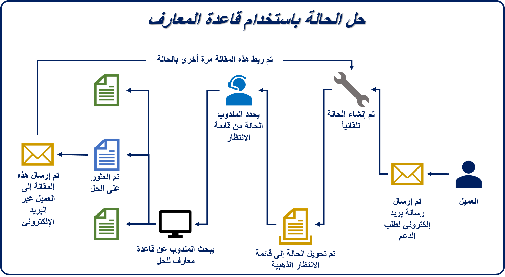

تتمثل إحدى المزايا الرئيسية لحل إدارة المعرفة Microsoft Dynamics 365 في أن المندوبين يمكنهم البحث عن مقالات المعرفة مباشرةً من سجل حالة في أثناء عملهم لحل مشكلة العميل. بشكلٍ مبتكر، يشتمل Dynamics 365 على عنصر تحكم **Knowledge Base Search** الذي يمكن الوصول إليه من الجزء **ذو صلة** للحالة. عندما يقوم مندوب بتحديد زر **Knowledge Base Search**، يتم عرض قاعدة المعارف، ويتم إدخال عنوان الحالة التي يتم العمل عليها تلقائيا في حقل البحث. يتم ذكر أي مقالات تتوافق مع المعلومات في عنوان الحالة في نتائج البحث. لذلك، لا يضطر المندوبين إلى ترك سجل الحالة الذي يعملون عليه للبحث عن حلول محتملة للحالة.

يمكن لمندوبي خدمة العملاء عرض مقال أو ربطه أو إرساله بالبريد الإلكتروني مباشرة من داخل عنصر تحكم **Knowledge Base Search**. لكل مقال يقوم عامل بعرضه في عنصر التحكم، يتم تسجيل طريقة العرض وإضافتها إلى عدد طرق العرض. يستطيع مديرو المعرفة استخدام عدد طرق العرض لتعقب أكثر المقالات التي يتم عرضها والمقالات الأخرى غير المرتبطة. إذا قدمت أحد المقالات حلاً للحالة التي يعمل عليها المندوب، فيمكن للمندوب ربط المقال بالحالة أو إرسال الحل بالبريد الإلكتروني إلى العميل. في كلتا الحالتين، يتم إنشاء علاقة بين الحالة والمقال. يستطيع مديرو المعرفة استخدام معلومات العلاقات في علامة تبويب **تحليلات** للمقال.

يوضح المثال المذكور في الصورة الآتية كيفية عمل كل هذه القطع مع بعضها.

بشكلٍ افتراضي، يمكن لكيان الحالة فقط البحث في قاعدة المعارف. لكن يمكنك إعداد كيانات أخرى للبحث عنها أيضاً، ويمكن تضمين عنصر التحكم **Knowledge Base Search** في الصفحة لهذه الكيانات. على سبيل المثال، تستخدم المؤسسة Dynamics 365 لمتابعة العملاء المتوقعين، ولديها مقالات مرتبطة بالعملاء المتوقعين. في هذا السيناريو، يمكن إعداد كيان العميل المتوقع للبحث في قاعدة المعارف ويمكن إضافة عنصر التحكم **Knowledge Base Search** إلى صفحة **العميل المتوقع**.

ستركز هذه الوحدة على إعداد معلومات المقال وعرضه واستخدامه بشكلٍ فعال في كيان الحالة والكيانات الأخرى في Dynamics 365. ستتعرف أيضاً على ما تبدو عليه التجربة بالنسبة إلى المستخدمين الذين يقومون بحل الحالات باستخدام قاعدة المعارف. وفي النهاية، ستعرض هذه الوحدة بعض الخيارات التحليلية المتوفرة كجزء من حل إدارة المعرفة.
