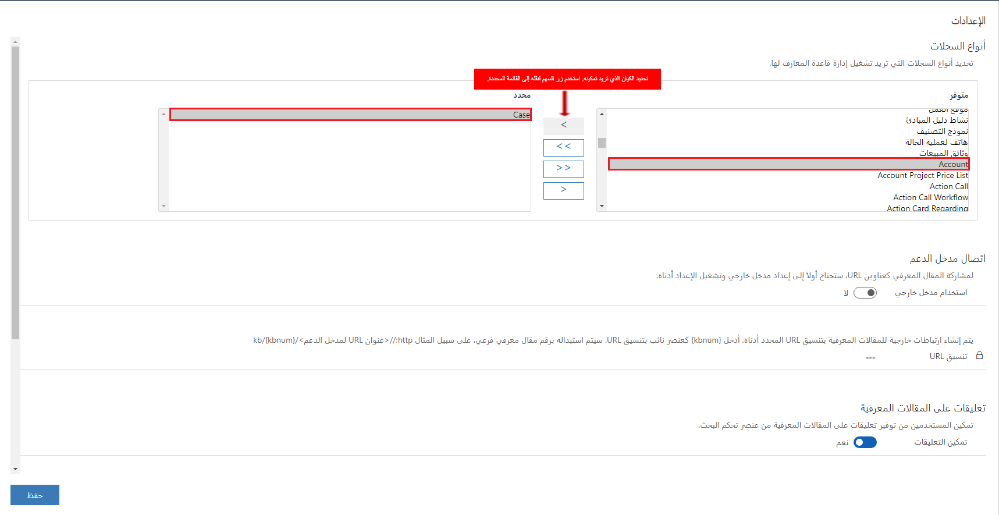
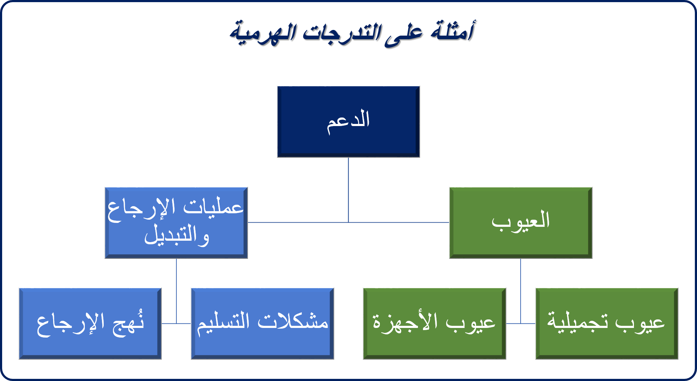

قبل إمكانية استخدام عنصر التحكم **Knowledge Base Search** للبحث عن مقالات معرفية، يجب تشغيل وظيفة البحث في المعارف الخاصة بها. كما يجب عليك إعداد وظيفة قاعدة المعارف للمؤسسة من خلال إعداد عنصرين:

- **البحث في المعارف المضمنة:** يحدد الكيانات التي يمكنها استخدام عنصر التحكم **Knowledge Base Search** وقاعدة المعارف المستخدمة.
- **الفئات:** من خلال تعريف فئات المقالات، يمكنك تسهيل البحث عن المقالات في أثناء عمليات البحث وعند ظهور قاعدة المعارف في مدخل خدمة العملاء.

لإعداد وظيفة قاعدة المعارف، انتقل إلى **الإعدادت** \> **الخدمة**، وفي القسم **إدارة قاعدة المعارف**، حدد **البحث في المعارف المضمنة** أو **الفئات**.

بعد إعداد إدارة المعرفة، سيتمكن المستخدمون من:

- البحث عن المقالات ذات الصلة في Dynamics 365 بينما يعملون على أحد السجلات.
- رؤية محتوى المقالة المضمنة. كما سيتم عرض أي صور ومقاطع فيديو في المقالة.
- تقديم معلومات متسقة في الوقت المناسب إلى العملاء عند العمل على الحالات، وذلك باستخدام إجراءات مختلفة. على سبيل المثال، يمكن للمندوب فتح مقالة ومشاركة المعلومات مع أحد العملاء. بدلاً من ذلك، يمكن للمندوب إرسال رابط للمقالة عبر البريد الإلكتروني إلى العميل.

## البحث في المعارف المضمنة

عند إعداد وظيفة قاعدة المعارف، تكون وظيفة البحث في المعارف المضمنة هي أول شيء يجب عليك إعداده لتحديد الكيانات في Dynamics 365 التي ستتمكن من استخدام عنصر التحكم **Knowledge Base Search**. وبشكل افتراضي، يكون الكيان "الحالة" هو الكيان الوحيد الذي يمكنه استخدام عنصر التحكم، ولكن يمكنك إعداد كيانات إضافية لاستخدامها حسب الحاجة.

> [!IMPORTANT] 
> يؤدي تشغيل البحث في المعارف لأي كيان إلى إتاحة استخدام وظيفة Knowledge Base Search على هذا الكيان. يجب أن تستمر في إعداد عنصر التحكم **Knowledge Base Search** للكيان الموجود في صفحة الكيان. على سبيل المثال، إذا قمت بتشغيل وظيفة البحث في المعارف للكيان "العميل المتوقع"، فلن يتمكن المندوبين من البحث عن المقالات حتى تقوم بإضافة عنصر التحكم إلى الصفحة **العميل المتوقع**.

ستتوفر معلومات حول إضافة عنصر التحكم **Knowledge Base Search** إلى أي صفحة في الوحدة التالية.

تتوفر إعدادات إدارة قاعدة المعارف الآتية لوظيفة البحث في المعارف المضمنة:

- **أنواع السجلات:** ‏‫تحديد أنواع السجلات لتشغيل إدارة قاعدة المعارف لها. (بشكل افتراضي، يتم تشغيلها لسجلات الحالات فقط).
- **مصدر المعارف:** تحديد قاعدة المعارف لاستخدامها.

> [!NOTE]
> تم إيقاف Parature. ستحدد *Dynamics 365* دائماً في هذا الحقل.

- **اتصال مدخل الدعم:** تشغيل قاعدة المعارف للمداخل الخارجية.

  - ويجب عليك تحديد تنسيق URL للمقالات.
  - ولن تضطر إلى تعيين هذا الحقل إذا كنت تستخدم مداخل Dynamics 365. (يتم إعداد استخدام مداخل Dynamics 365 بشكل افتراضي).

بعد تحديد الكيانات لاستخدامها مع قاعدة المعارف، يمكنك تحديد **التالي** ثم **إنهاء**. سيتم تشغيل قاعدة المعارف للكيانات المحددة، ويمكنك إعداد عنصر التحكم **Knowledge Base Search** في صفحات الكيان.

لمزيد من المعلومات حول إعداد البحث في المعارف، راجع [استخدام البحث في المعارف المضمنة لإعداد إدارة المعرفة](https://docs.microsoft.com/dynamics365/customer-engagement/customer-service/set-up-knowledge-management-embedded-knowledge-search).

## الفئات

يمكن استخدام الفئات لتعريف بنية التدرج الهرمي لتنظيم المقالات في Dynamics 365. يوضح المثال في الصورة الآتية إحدى الطرق التي يمكن بها بنية الفئات.

عند إنشاء كل مقالة، يمكن ربطها بفئة واحدة أو أكثر. وتظهر هذه الفئات في مداخل Dynamics 365، ويمكن للمندوبين توسيعها لرؤية المقالات التي تنطبق على كل فئة.

> [!VIDEO https://www.microsoft.com/videoplayer/embed/RE2IJmn]

لمزيد من المعلومات حول العمل مع فئات المقالات، راجع [تكوين الفئة للمقالات المعرفية وإدارتها](https://docs.microsoft.com/dynamics365/customer-engagement/portals/configure-knowledge-categories-articles).
