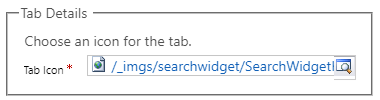
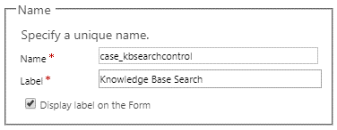
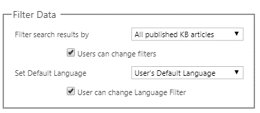
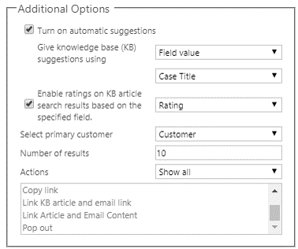

بعد إعداد وظيفة البحث عن المعرفة في Dynamics 365 وتحديد فئات المقالات، تكون الخطوة التالية إعداد عنصر تحكم **Knowledge Base Search** لكل صفحة كيان حيث سيتم استهلاكه. بشكل افتراضي، تم إعداد عنصر التحكم بالفعل لكيان الحالة. إذا قمت بإعداده لأي كيانات أخرى، فيجب إعداده أيضاً على الصفحة ذات الصلة لكل من هذه الكيانات.

## قبل البدء

لإعداد عنصر تحكم **Knowledge Base Search**، يجب تخصيص الصفحات التي ستظهر فيها. إذا لم تكن على دراية بتخصيص الصفحات في Dynamics 365، راجع [تخصيص نماذج Dynamics 365](/dynamics365/customer-engagement/customize/create-design-forms).

## العمل مع صفحات مركز خدمة العملاء

يتم استخدام واجهة Dynamics 365 الموحدة لكل من مركز المبيعات وتطبيقات مركز خدمة العملاء. على الرغم من أن كلا التطبيقين يوفران نفس التنقل والوظائف والتجربة المرئية، إلا أن الصفحات التي يجب تخصيصها تختلف، وفقاً للتطبيق الذي تستخدمه. يستخدم تطبيق مركز المبيعات وتطبيقات مثل Field Service وProject Service نفس الصفحات المستخدمة في تطبيقات أخرى: **الحساب**، **جهة الاتصال** وكذلك **الفرصة**. ولكن يتضمن تطبيق مركز خدمة العملاء صفحات خاصة تسمى صفحات التجربة التفاعلية. تستخدم هذه الصفحات للعديد من الكيانات الأساسية التي تظهر في مركز خدمة العملاء. تأكد من تخصيص الصفحة الصحيحة للتطبيق الذي سيعرض المعلومات.

يوضح الجدول التالي الصفحة التي تقوم بتخصيصها للكيانات الثلاثة التي يتم استخدامها في أغلب الأحيان، وذلك حسب التطبيق الذي ستظهر فيه.

| الكيان  | صفحة مركز خدمة العملاء          | صفحة مركز المبيعات |
|---------|------------------------------------|----------------|
| الحساب | حساب للتجربة التفاعلية | الحساب        |
| ‏‫جهة الاتصال‬ | جهة الاتصال للتجربة التفاعلية | ‏‫جهة الاتصال‬        |
| الحالة    | الحالة للتجربة التفاعلية    | الحالة           |

عند البدء في إضافة عنصر تحكم **Knowledge Base Search** أو تحريره على الصفحات، تأكد من استخدام الصفحة الصحيحة.

## إلغاء تأمين الجزء المرتبط

لإضافة عنصر تحكم **Knowledge Base Search** إلى صفحات معينة، انتقل إلى **الإعدادات** \> **التخصيصات** \> **تخصيص النظام**. من الحل، قم بتوسيع الكيان لتخصيص (على سبيل المثال، **الحالة**)، ثم حدد الصفحة للعمل معها. 

> [!NOTE] 
> تذكر: عنصر تحكم **Knowledge Base Search** في صفحة **الحالة**، يجب تخصيص صفحة **حالة التجربة التفاعلية**.

يتوفر عنصر تحكم **Knowledge Base Search** في الجزء **المرتبط** في صفحة **الحالة**. بشكل افتراضي، يتم تأمين الجزء **المرتبط**، ولا يمكنك تحريره. لإلغاء تأمين الجزء **المرتبط**، حدده، ثم حدد **تغيير الخصائص**. قم بإلغاء تحديد خانة الاختيار **تأمين المقطع على النموذج** ثم حدد **موافق**. يمكنك الآن تحرير الجزء.

إذا لم يكن في الصفحة التي تعمل معها جزء **مرتبط**، يمكنك إضافته. في علامة التبويب **الإدراج‬‏‫**، حدد **القسم**، ثم حدد اللوحة **المرجعية‬**.

> [!NOTE] 
> قد تضطر أيضا إلى إلغاء تأمين جزء **المرجع** على الصفحات الموجودة قبل أن تتمكن من تحريره.

## إعداد عنصر تحكم Knowledge Base Search

بعد إلغاء تأمين الجزء **المرتبط**، يمكنك إعداد عنصر تحكم **Knowledge Base Search** عن طريق تحديده ثم تحديد **تغيير الخصائص**. يحتوي عنصر التحكم على الأقسام التالية:

- **تفاصيل علامة التبويب:** يعرض هذا القسم مسار مورد الويب المستخدم لرمز علامة التبويب في الجزء. يمكنك تغيير هذا الرمز إذا لزم الأمر.

   يجب أولاً إضافة أي رمز تريد استخدامه كمورد ويب.

   

   لمزيد من المعلومات حول استخدام موارد الويب، راجع [موارد ويب](/dynamics365/customer-engagement/developer/web-resources).

- **الاسم:** يعرض هذا القسم اسم عنصر التحكم والتسمية المستخدمة له. يمكنك تحديد ما إذا كان التسمية معروضة على الصفحة.

   

- **عامل تصفية البيانات**: يحدد هذا القسم المقالات المعرفية التي يتم عرضها في عنصر التحكم بشكل افتراضي. يمكنك تحديد ما إذا كان يمكن للمستخدمين تغيير عوامل التصفية المستخدمة.

   يمكنك أيضاً تحديد اللغة الافتراضية التي تظهر بها المقالات. يتم تعيين اللغة افتراضياً إلى اللغة الافتراضية للمستخدم. (يجب أن توجد ترجمة مقال للغة.) يمكنك تحديد ما إذا كان يمكن للمستخدمين تغيير عامل تصفية اللغة.

   

   لمزيد من المعلومات حول ترجمات المقالات، راجع [ترجمة مقالة معرفية بلغات](/dynamics365/customer-engagement/customer-service/customer-service-hub-user-guide-knowledge-article#translate-a-knowledge-article-in-multiple-languages).

- **خيارات إضافية:** يوفر هذا القسم إعدادات إضافية تحدد كيفية بحث عنصر التحكم عن البيانات وعدد المقالات التي يتم إرجاعها والإجراءات المتوفرة للمستخدمين في عنصر التحكم. ويتضمن الحقول التالية:

    - **تشغيل الاقتراحات التلقائية:** حدد خانة الاختيار هذه لتشغيل اقتراحات المقالات التلقائية.
    - **إعطاء اقتراحات قاعدة المعارف (KB) باستخدام:** حدد الحقل الذي يجب أن يوفر قيمة البحث المستخدمة لتوفير اقتراحات تلقائية للمقالات. (افتراضياً، تم تحديد *عنوان الحالة*.)
    - **تمكين التقييمات على نتائج بحث مقالة KB (قاعدة المعارف) استناداً إلى حقل محدد:** حدد خانة الاختيار هذه لتشغيل تقييمات المقالات، استناداً إلى الحقل المحدد. (افتراضياً، تم تحديد *التقييم*.)
    - **تحديد العميل الأساسي:** حدد الحقل الذي يجب استخدامه كحقل العميل الأساسي للاقتران. (افتراضياً، تم تحديد *العميل*.)
    - **عدد النتائج:** أدخل عدد المقالات التي يجب إرجاعها في نتائج البحث. (افتراضياً، يتم إدخال *10*.)
    - **الإجراءات:** حدد إجراءات المقال التي يجب أن تكون متاحة لكل سجل يتم إرجاعه في نتائج البحث. تتضمن أمثلة الإجراءات نسخ الرابط وربط المقال والبريد الإلكتروني للارتباط. (افتراضياً، تم تحديد *إظهار الكل*.)

   

بعد الانتهاء من تحديد عنصر تحكم **Knowledge Base Search** لصفحة، يجب حفظ التخصيصات ونشرها قبل أن تكون مرئية في التطبيق.

> [!VIDEO https://www.microsoft.com/videoplayer/embed/RE2IOFZ]

لمزيد من المعلومات حول إعداد عنصر تحكم **Knowledge Base Search** ، راجع [إضافة عنصر تحكم Knowledge Base Search إلى النماذج](/dynamics365/customer-engagement/customer-service/add-knowledge-base-search-control-forms).
