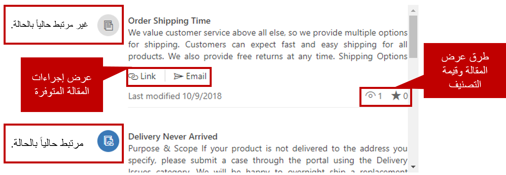

بعد إعداد قاعدة المعارف، وإضافة عنصر تحكم **، Knowledge Base Search** إلى صفحات الكيان المناسبة، يُمكن للوكلاء البدء في استخدام عنصر التحكم للبحث عن مقالات معرفية.

بما أن الوكلاء يحاولون حل المشكلات للعملاء، يُمكنهم استخدام قاعدة المعارف للتحقق من وجود حلول محتملة لتلك المشكلات. للوصول إلى عنصر تحكم **، Knowledge Base Search**، حدد زر **، Knowledge Base Search** في الجزء **المرتبط** في صفحة **الحالة**.

عند تحميل عنصر تحكم **، Knowledge Base Search**، يتم تعبئة حقل البحث تلقائياً بعنوان الحالة الحالية (أو قيمة أي حقل آخر تم تحديده لعنصر التحكم). يُمكن للوكلاء تجاوز قيمة الحقل في أي وقت. مثال، إذا لم تقدم النتائج الحالية إجابة كافية، يُمكن للوكيل إدخال كلمات رئيسية. سيبحث عنصر التحكم عن هذه الكلمات الرئيسية في عنوان الحالة والكلمات الرئيسية للمقالات ومحتوى المقالة، وسيرجع بأي تطابقات موجودة.

افتراضياً، يعرض عنصر تحكم **Knowledge Base Search** إصدارات المقالات المنشورة باللغة الافتراضية للمستخدم فقط. ولكن يمكن للوكلاء استخدام زر التصفية وتغيير عامل التصفية للبحث في مسودة، أو مقالات معتمدة أو منشورة. إذا تم تعيين القدرة على تغيير عامل تصفية اللغة إلى عنصر التحكم، فيُمكنهم أيضاً تحديد اللغة لعرض المقالات فيها. يُمكن فرز المقالات الناتجة عن البحث حسب صلة المقالة، وعدد طرق العرض وتاريخ آخر تعديل (الأحدث أو الأقدم أولاً).

> [!IMPORTANT] 
> وتُقدم المقالات بلغات أخرى إلى الوكلاء فقط إذا كانت النسخ المترجمة من المقالات متاحة بتلك اللغات.

لمزيد من المعلومات عن ترجمات المقالات، راجع [ترجمة مقالة معرفية بعدة لغات](/dynamics365/customer-engagement/customer-service/customer-service-hub-user-guide-knowledge-article#translate-a-knowledge-article-in-multiple-languages).

سيُعرض مقتطف قصير من كل مقالة يتم إرجاعها. كما تُعرض المعلومات والخيارات التالية للمقالة:

- تاريخ آخر تغيير تم في المقالة
- عدد مرات مشاهدة المقالة
- قيمة التصنيف الحالية للمقالة
- خيار ربط المقالة بالحالة الحالية
- خيار إرسال المقالة بالبريد الإلكتروني إلى عميل (عند إرسال مقالة عبر البريد الإلكتروني، يُمكنك أيضاً ربط المقالة بالحالة الحالية).

يشير رمز مميز بالألوان بجوار كل مقالة إلى ما إذا كانت المقالة مرتبطة بالحالة حالياً أم لا. يمكن ربط مقالات متعددة بحالة واحدة.

مثال، يتصل أحد العملاء لطرح بعض الأسئلة عن متوسط وقت الشحن للطلبات. في أثناء الاتصال، يعرب العميل عن قلقه من عدم وصول الطلب. في هذا المثال، يُمكنك ربط كلا المقالتين بالحالة، لأن كلاهما تغطي المواضيع التي ناقشتها مع العميل، وكلاهما يقدم الحلول المحتملة للمشكلة.

عندما يحدد وكيل عنوان المقالة في عنصر تحكم **، Knowledge Base Search**، تُعرض المقالة في عنصر التحكم ويتم تنسيقه تماماً مثل المقالة. تحتوي المقالة المُنسقة على معلومات العرض والتقييم ذاتها. وسوف تكون الإجراءات ذاتها المتوفرة للمقتطف متوفرة للمقالة.

## إرسال مقالة معرفية عبر البريد الإلكتروني

عندما يختار وكيل إرسال مقالة إلى عميل عبر البريد الإلكتروني، يُنشئ Dynamics 365 تلقائياً بريداً إلكترونياً يتضمن محتوى المقالة. تستخدم نافذة البريد الإلكتروني للمقالة محرر "ما تراه هو ما تحصل عليه" (WYSISYG) ذاته المُستخدَم لإنشاء المقالات. يُمكن للوكيل تحرير محتوى المقالة بالكامل في البريد الإلكتروني قبل إرسالها.

> [!VIDEO https://www.microsoft.com/videoplayer/embed/RE2IWj0]
