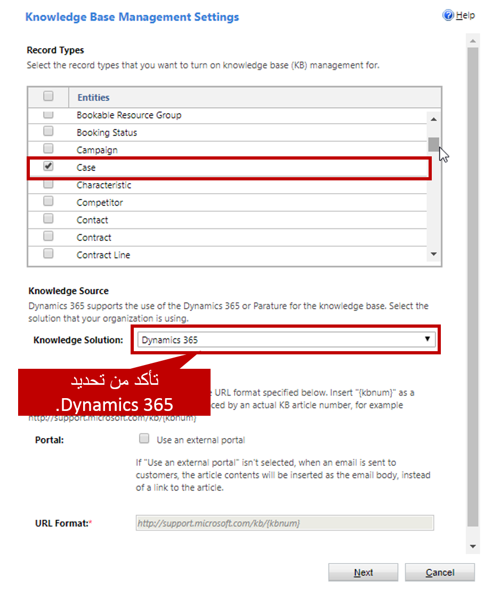
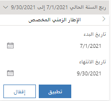
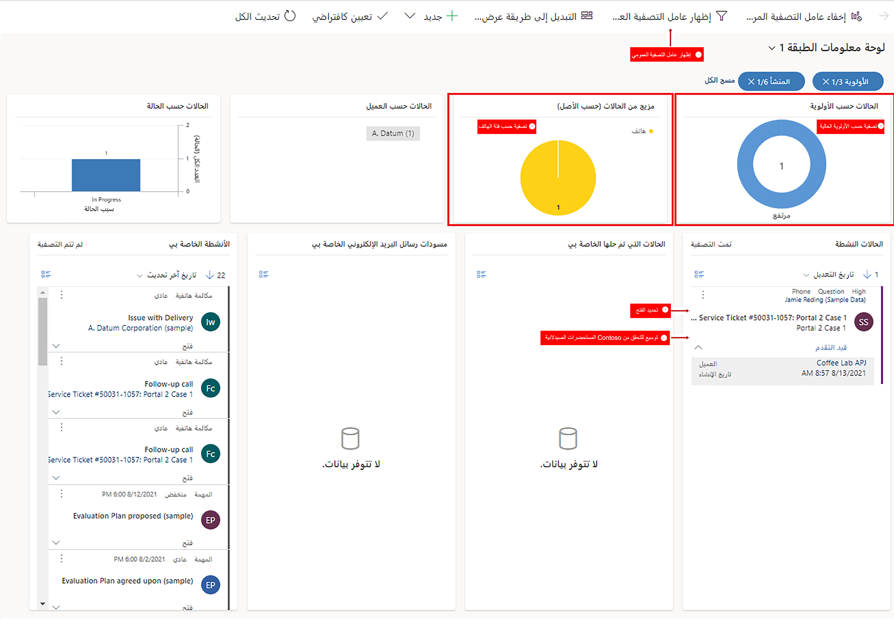

Microsoft Dynamics 365 for Customer Service يتيح للمؤسسة خدمة عملائها بعدة طرق، اعتماداً على الاحتياجات المحددة لهؤلاء العملاء، ونموذج خدمة المؤسسة، وعوامل محددة أخرى. إحدى الميزات التي يمكن للمؤسسات الاستفادة منها هي عنصر تحكم **Knowledge Base Search**.

سيوجهك هذا التمرين العملي خلال عملية إعداد الميزة ووضع عنصر تحكم **Knowledge Base Search** في صفحة معينة. يمكنك بعد ذلك استخدام عنصر التحكم للعثور على المقالات المعرفية التي يمكن أن تساعدك في حل الحالات.

### قبل البدء

يعمل هذا التمرين بشكل أفضل عندما يكون لديك بيانات نموذجية لاستخدامها. يمكّنك Dynamics 365 من إضافة بيانات نموذجية حسب الحاجة. إذا لم يتم تثبيت البيانات النموذجية في البيئة التي تعمل فيها، فاتبع هذه الخطوات لتثبيت بعضها.

1. إذا لزم الأمر، من شريط التنقل بالتطبيق الرئيسي، حدد سهم القائمة المنسدلة بجوار **Dynamics 365**، ثم حدد **Dynamics 365** - مخصص.
2. من شريط التنقل، حدد سهم القائمة المنسدلة بجوار **الإعدادات**، ثم حدد **إدارة البيانات**.
3. حدد **البيانات النموذجية**.
4. حدد **تثبيت البيانات النموذجية**.
5. ثم أغلق صفحة **البيانات النموذجية**.

## الأهداف التعليمية

في نهاية هذا التمرين، ستتمكن من أداء المهام التالية:

- إعداد ميزة البحث عن المعارف.
- تغيير إعدادات عنصر تحكم **Knowledge Base Search** في أي صفحة.
- استخدام عنصر تحكم **Knowledge Base Search** لحل حالة.

الوقت المقدر لإنهاء هذا التمرين: 15 إلى 20 دقيقة

### السيناريو

أنت تعمل في مؤسسة بدأت في استخدام قاعدة معارف Dynamics 365، وتم مؤخراً إنشاء العديد من المقالات. وطُلب منك التأكد من أن المندوبين يمكنهم استخدام عنصر تحكم **Knowledge Base Search** من كيان الحالة. إذا لزم الأمر، يجب أن يكون المندوبون قادرين على تغيير لغة المقالة لمعرفة ما إذا كانت المقالات متاحة بلغات أخرى.

### ‏‫الخطوات عالية المستوى

1. قُم بإعداد ميزة بحث المعارف المضمنة.
2. قُم بإعداد عنصر تحكم **Knowledge Base Search** في صفحة **الحالة**.
3. استخدم مركز خدمة العملاء لتحديد أي حالات عبر الهاتف ذات أولوية عالية.
4. أضف نشاط متابعة مكالمة هاتفية للحالة.
5. أضف حالة تابعة لحالة موجودة.
6. استخدم مقالة لحل حالة.

### الخطوات التفصيلية

#### إعداد بحث المعارف المضمنة

1. من شريط التنقل بالتطبيق الرئيسي، حدد سهم القائمة المنسدلة بجوار **Dynamics 365** لعرض الوحدات النمطية للتطبيق المتاحة.
2. حدد **Dynamics 365 – مخصص**.
3. من شريط التنقل، حدد سهم القائمة المنسدلة بجوار **الإعدادات**، ثم حدد **إدارة الخدمة**.
4. ضمن **إدارة قاعدة المعارف**، حدد **بحث المعارف المضمنة**.
5. ضمن **أنواع السجلات**، تأكد من تحديد **الحالة**. إذا لم يكن كذلك، فحدد خانة الاختيار.
6. ضمن **مصدر المعارف**، تأكد من تعيين حقل **حل المعارف** على Dynamics 365.

7. حدد **التالي**.
8. على صفحة التأكيد، حدد **إنهاء**.

**إعداد عنصر تحكم "Knowledge Base Search" في صفحة "الحالة"**

1. من شريط التنقل، حدد سهم القائمة المنسدلة بجوار **الإعدادات**، ثم حدد **التخصيصات** \> **تخصيص النظام**.
2. في **الحل الافتراضي**، قُم بتوسيع **الكيانات**، ثم توسيع كيان **الحالة**.
3. حدد **النماذج**.
4. افتح صفحة **حالة التجربة التفاعلية‏**.
5. انقر نقراً مزدوجاً فوق جزء **مرتبط** لفتح الخصائص. (بدلاً من ذلك، حدد الجزء، ثم حدد **تغيير الخصائص**.)
6. قُم بإلغاء تحديد خانة الاختيار **تأمين المقطع على النموذج‏**.
7. ثم حدد **موافق**.
8. انقر نقراً مزدوجاً فوق عنصر تحكم **Knowledge Base Search** لفتح الخصائص. (بدلاً من ذلك، حدد عنصر التحكم، ثم حدد **تغيير الخصائص**.)
9. ضمن **الاسم**، قُم بتغيير قيمة حقل **التسمية** إلى البحث في المقالات المعرفية.
10. ضمن **تصفية البيانات**، حدد خانة الاختيار **يمكن للمستخدم تغيير عامل التصفية** ضمن الحقل **تعيين اللغة الافتراضية**.

   

11. حدد **تعيين**.
12. ثم حدد **حفظ** في صفحة **الحالة**.
13. حدد **نشر** لنشر تخصيصاتك.
14. أغلق صفحة **الحالة**، ثم أغلق نافذة مستكشف الحلول‏.

#### استخدم مركز خدمة العملاء لتحديد الحالات ذات الأولوية العالية.

1. في مركز خدمة العملاء، حدد أيقونة **مخطط الموقع**، ثم حدد **لوحات المعلومات**.
2. حدد السهم لأسفل بجوار نطاق بيانات ربع السنة الحالي، ثم حدد الفترة المخصصة.
3. تعيين الفترة:
    - **تاريخ البدء**: 1/1/2018
    - **تاريخ الانتهاء:** 31/12/2018 
4. حدد **تطبيق**.
5. من شريط الأوامر، حدد **إظهار عامل التصفية العمومي**.
6. ابحث عن مخطط **‏مزيج من الحالات (حسب الأصل)**، ثم حدد شريحة **الهاتف**.
7. في مخطط **الحالات حسب الأولوية**، حدِّد الفئة **العالية**.
8. ابحث عن حالة **الخدمة مطلوبة (عينة)**، ثم حدد السهم لأسفل، وتأكد من أن العميل هو Fourth Coffee (عينة).
9. حدِّد حالة **الخدمة مطلوبة (عينة)** لفتحها.

   

10. في المخطط الزمني للسجل، حدد **إضافة معلومات وأنشطة**.
11. حدد **مكالمة هاتفية** من القائمة.
12. أدخل المعلومات التالية الخاصة بالمكالمة الهاتفية:
    - **الموضوع:** مكالمة متابعة
    - **اتصال من:** سجل المستخدم الخاص بك
    - **اتصال إلى:** Yvonne McKay (عينة)
    - **الاتجاه:** صادر
    - **المدة:** 15 دقيقة
    - **الأولوية:** عادية
    - **بخصوص:** خدمة مطلوبة (عينة)

   

13. حدد **حفظ** لحفظ النشاط.
14. أغلق حالة **الخدمة مطلوبة (عينة)** في الوقت الحالي.

### إنشاء حالة تابعة من حالة موجودة

بينما تعمل على هذه الحالة، تذكر Yvonne أيضاً أنها لن تتمكن من تجربة أي من الحلول التي تجدها نظراً لعجزها عن تسجيل الدخول. تحتاج إلى إعادة تعيين كلمة المرور الخاصة بها لهذا العنصر. يجب عليك تسجيل هذه المشكلة في حالة تابعة.

1. من شريط الأوامر، حدد **إنشاء حالة تابعة**، ثم حدد **حفظ**.
2. أدخل المعلومات التالية الخاصة بالحالة التابعة:

    - **عنوان الحالة:** الخدمة مطلوبة - إعادة تعيين كلمة المرور
    - **نوع الحالة:** مشكلة
    - **الأصل**: الهاتف

3. حدد **حفظ**.
4. لعرض الحالات التابعة، حدد علامة التبويب **علاقات الحالة**

   

5. حدد الشبكة الفرعية **الحالات التابعة**، ثم حدد الحالة **الخدمة مطلوبة-إعادة تعيين كلمة المرور** لفتحها.
6. حدِّد علامة التبويب **تفاصيل**. وستظهر لك الحالة الأصل ضمن القسم **تفاصيل إضافية**.
7. ارجع إلى الحالة الأصل عن طريق تحديد ارتباط الحالة **الخدمة مطلوبة (عينة)**.
8. في الجزء **مرتبط**، حدد زر **Knowledge Base Search**.
9. حدد إحدى المقالات المقترحة، ثم حدد ‏زر **ارتباط**.

   

10. في علامة التبويب **علاقات الحالة**، تأكد من ظهور المقالة التي قمت بربطها في الشبكة الفرعية **سجلات المعرفة المقترنة**.
12. في تدفق **العملية من الهاتف إلى الحالة**، حدد **المرحلة التالية** إلى أن تصل إلى مرحلة **الحل**.
13. في مرحلة **الحل**، حدد **إنهاء**.
14. حدد **حل الحالة** لحل الحالة الأصل.
15. حدد **تأكيد** لتأكيد قرارك بحل الحالة.
16. في مربع حوار **حل الحالة**، في حقل **الحل**، أدخل الذهاب إلى الموقع لإصلاح المشكلة.
17. قُم بتغيير قيمة الحقل **الوقت القابل للفوترة** إلى ساعة واحدة.

   

18. حدد **حل** لحل الحالة الأصل مع جميع الحالات التابعة.
19. في علامة التبويب **علاقات الحالة**، تأكد من حل أي حالات تابعة أيضاً.

   
