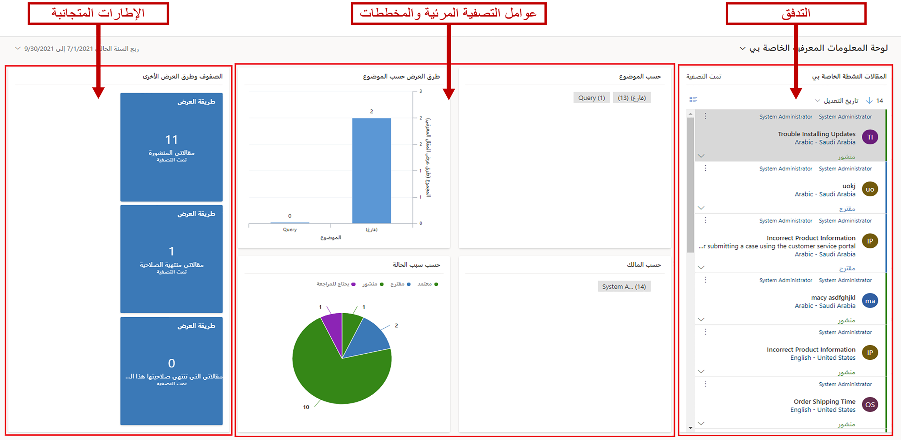
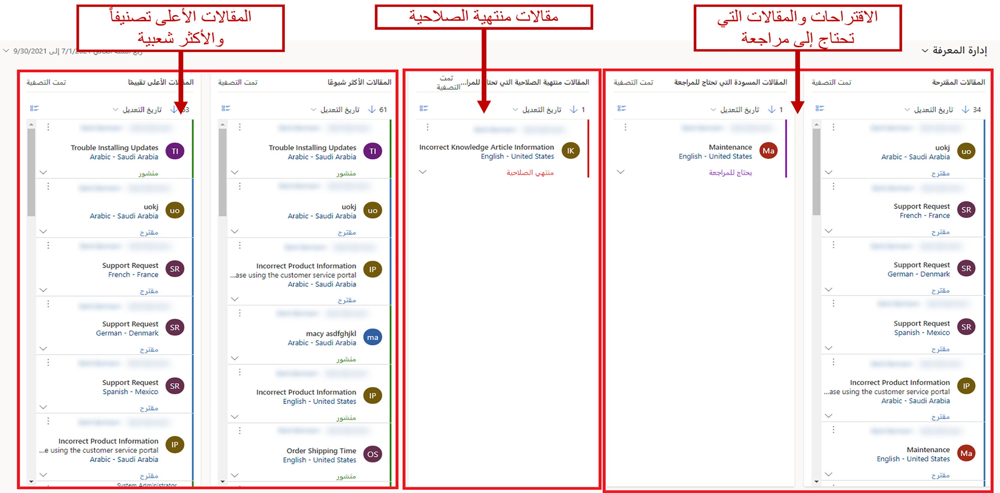
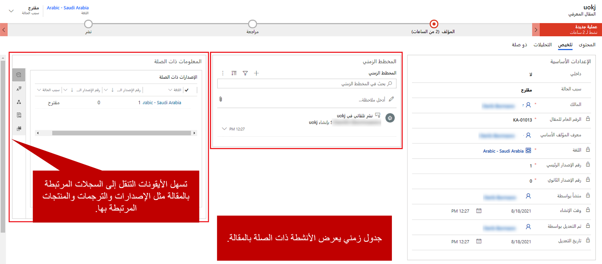
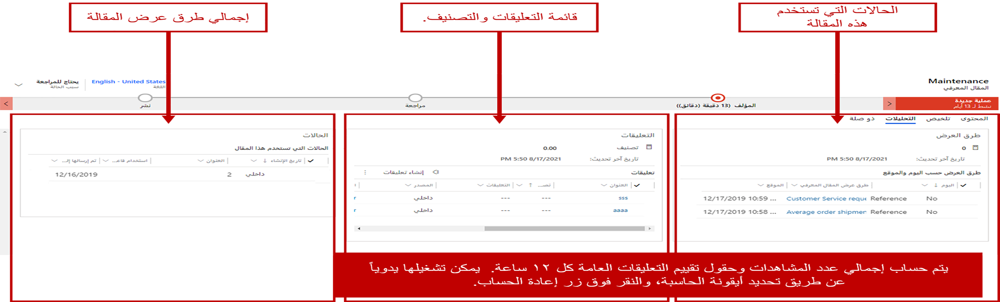

بعد نشر المقالات المعرفية واستخدامها من قبل العملاء والمندوبين، قد يجد مديرو المعرفة أنه من المفيد مراجعة تحليلات المقالات لاكتساب نظرة ثاقبة حول ما يحدث. يحتوي Microsoft Dynamics 365 على صفحتين من لوحات المعلومات التي يمكن لمديري المعرفة والمؤلفين استخدامهما لمراقبة حالة المقالات:

- صفحة **لوحة المعلومات المعرفية الخاصة بي**
- لوحة معلومات **مدير المعرفة**

## صفحة لوحة المعلومات المعرفية الخاصة بي

صُممت صفحة **لوحة المعلومات المعرفية الخاصة بي** للمؤلفين. فهي تمنح المؤلف لقطة مرئية لعدد المقالات التي يعمل عليها وحالتها. وتساعد المؤلفين في التعرّف بسرعة على المقالات التي تنتهي صلاحيتها خلال الشهر، والمقالات قيد المراجعة، وما إلى ذلك.

توفر صفحة **لوحة المعلومات المعرفية الخاصة بي** البيانات التالية:

- **دفق المقالات النشطة الخاصة بي:** يعرض هذا الدفق المقالات النشطة التي تم تعيينها للمؤلف.
- **المخططات وعوامل التصفية المرئية:** توفر المخططات عدد السجلات ذات الصلة في الدفق. على سبيل المثال، يمكنك مشاهدة المقالات حسب الحالة أو المالك أو الموضوع. تعمل المخططات أيضاً كعوامل تصفية مرئية. يمكن للمؤلفين التنقل لأسفل في مخطط لمشاهدة البيانات التي تهمهم أكثر.
- **قسم قوائم الانتظار وطرق العرض الأخرى**: تجمع الإطارات المتجانبة الموجودة في هذا القسم البيانات في عمليات الدفق وتساعد في مراقبة حجم المقالات. بشكل افتراضي، يتضمن هذا القسم الإطارات المتجانبة التالية: **مقالاتي المنشورة** و **مقالاتي منتهية الصلاحية** و **مقالاتي التي تنتهي صلاحيتها هذا الشهر**.

إذا كانت صفحة **لوحة المعلومات المعرفية الخاصة بي** لا توفر المعلومات المحددة التي تحتاجها، فيمكنك إنشاء لوحات معلومات تفاعلية إضافية أو بديلة لتلبية احتياجاتك.

لمزيد من المعلومات حول إعداد لوحات المعلومات التفاعلية، راجع [تكوين لوحات معلومات التجربة التفاعلية](https://docs.microsoft.com/previous-versions/dynamicscrm-2016/administering-dynamics-365/mt622067(v=crm.8)).

## لوحة معلومات مدير المعرفة

صُممت لوحة معلومات **مدير المعرفة** خصيصاً لمديري المعرفة. فهي تتيح لهم العثور بسرعة على المقالات الأكثر شيوعاً أو المقالات التي تحتاج إلى مراجعة أو المقالات ذات التصنيفات الأعلى. إذا كانت المقالات تتطلب أي إجراء، فيمكن لمديري المعرفة أيضاً أن يأخذوها مباشرة من لوحة المعلومات.

لمزيد من المعلومات حول مراقبة المقالات باستخدام لوحات المعلومات، راجع [مراقبة المقالات المعرفية باستخدام لوحات المعلومات](https://docs.microsoft.com/dynamics365/customer-engagement/customer-service/customer-service-hub-user-guide-knowledge-article#monitor-knowledge-articles-with-dashboards).

## تعقب معلومات المقالة

لكل مقالة، تتيح لك علامتا تبويب تعقب معلومات المقالة الأساسية والمعلومات التحليلية:

- الملخص
- التحليلات

## علامة تبويب الملخص

يحتوي جزء **الإعدادات الأساسية** من علامة التبويب **ملخص** على الكثير من المعلومات ذات الصلة بالمقالة. الكثير من هذه المعلومات ليست بيانات يمكنك تعديلها. بدلاً من ذلك، يتم تحديثها بواسطة النظام عند إجراء تغييرات على المقالة. تتضمن هذه المعلومات لغة المقالة والرقم العام وأرقام الإصدارات.

يوفر جزء **المخطط الزمني** معلومات المخطط الزمني للمقالة. يعرض المخطط الزمني جميع الأنشطة ذات الصلة المرتبطة بالمقالة. كما يتيح لك إضافة أنشطة إلى السجل. يمكنك أيضاً استخدام المخطط الزمني لعرض الملاحظات التي قدمها المراجعون حول المقالة، أو لمشاهدة المهام المحددة التي قد تكون مطلوبة قبل نشر المقالة.

وأخيراً، يوفر جزء **المعلومات ذات الصلة** إمكانية الوصول إلى السجلات ذات الصلة بالمقالة أو المرتبطة بها. يمكنك فتح السجلات الآتية باستخدام الأزرار الموجودة على طول الحافة اليمنى من هذا الجزء:

- **إصدارات ذات صلة:** هذا السجل يعرض محفوظات إصدار كاملة من المقالة. يمكنك عرض الإصدارات السابقة من المقالة، بل ويمكنك الرجوع إلى إصدار سابق إذا اضطررت إلى ذلك.
- **ترجمات ذات صلة:** هذا السجل يعرض قائمة بالترجمات المختلفة المتوفرة للمقالة.
- **فئات ذات صلة:** هذا السجل يعرض الفئات المرتبطة بالمقالة. تستخدم الفئات لموقع المقالة والتحليلات. وهي تساعد على توفير تنظيم أفضل للمقالات عند استخدام المقالات في قاعدة معرفية لأحد المداخل.
- **مقالات ذات صلة:** هذا السجل يعرض أي مقالات مشابهة للمقالة أو تم ربطها بها.
- **منتجات ذات صلة:** هذا السجل يعرض المنتجات المرتبطة بالمقالة.

## علامة تبويب التحليلات

إمكانية تعقب المحتوى يساعدك على تقييم قيمة هذا المحتوى لمؤسستك وعملائك. من خلال معرفة وفهم توقيت ومكان وعدد مرات عرض المقالة، يمكنك تحديد مقدار اعتماد العملاء وأعضاء الفريق على المعلومات الواردة في المقالة. هذه البيانات مفيدة للغاية عند إنشاء خطط تنظيم المحتوى المستقبلية. ويمكن أن تساعدك في تقرير المحتوى الذي ستقوم بتقديمه في المستقبل، فضلاً عن طريقة التقديم ومكان النشر والأسلوب أو البنية التي تستخدمها لكتابته.

عدد مرات عرض المقالة وغيرها من الإحصائيات متاحة في علامة التبويب **تحليلات**. تتضمن علامة التبويب هذه الأجزاء التالية:

- **طرق العرض:** يعرض هذا الجزء العدد الإجمالي لمرات عرض المقالة الحالية. يمثل هذا الرقم إجمالي عدد مرات العرض المجمعة لجميع إصدارات هذه المقالة والترجمات الخاصة بها. يتم تحديث الرقم تلقائياً كل 12 ساعة، ولكن يمكنك أيضاً حسابه يدوياً.

   تعرض الشبكة الفرعية **مرات العرض حسب اليوم والموقع** عدد مرات عرض المقالة الفردية في أيام معينة.

- **التعليقات:** يسجل هذا الجزء جميع التعليقات والتقييمات الخاصة بالمقالات، ويقوم بتحديث المقالات وفقاً لذلك.

   تعرض الشبكة الفرعية **التعليقات** جميع التعليقات التي تم تلقيها للمقالة الحالية.

   يُظهر حقل **التقييم** متوسط تقييم المقالة استناداً إلى حجم التعليقات وعدد التقييمات المتلقاة. يتم تحديث التقييم تلقائياً كل 12 ساعة، ولكن يمكنك أيضاً حسابه يدوياً.

- **الحالات:** يسرد هذا الجزء الحالات التي استخدمت المقالة الحالية. يمكنك فتح كل حالة من هذه الحالات لعرض تفاصيلها. بهذه الطريقة، يمكنك الحصول على رؤى هامة حول الأسئلة التي يطرحها العملاء والأساليب التي قاموا بها قبل طلب المساعدة. يمكن أن تساعدك هذه البيانات في عرض مقالاتك بشكل أفضل وتقديم معلومات أكثر فائدة لعملائك وأعضاء الفريق.

لمزيد من المعلومات حول تعقب تفاصيل المقالة، راجع [تعقب التفاصيل الأساسية للمقالة](https://docs.microsoft.com/dynamics365/customer-engagement/customer-service/customer-service-hub-user-guide-knowledge-article#track-basic-details-of-an-article).
