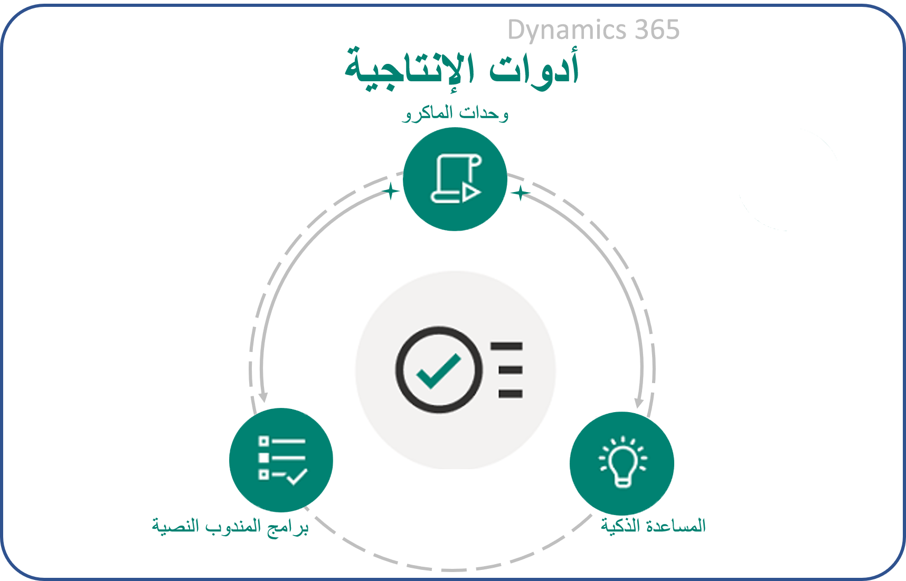
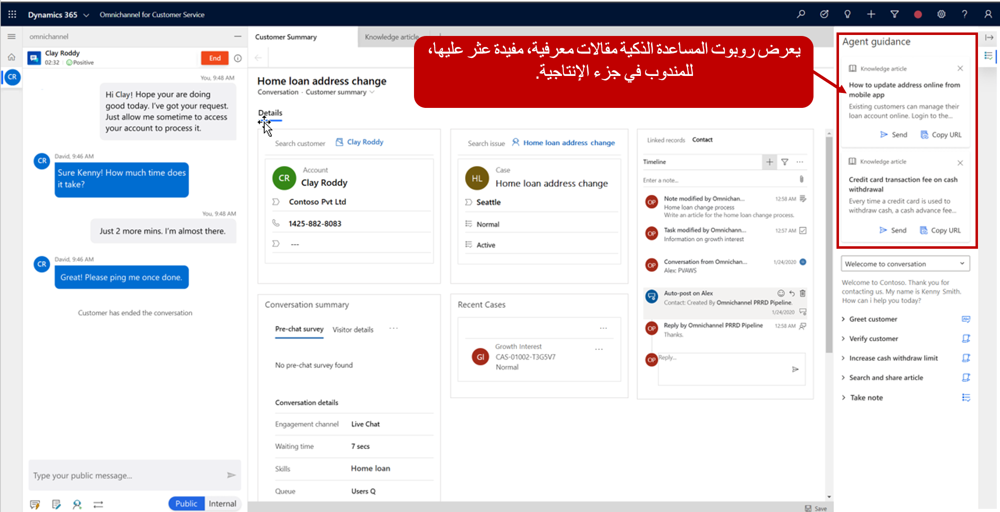

تنتقل مؤسسات خدمة العملاء من الاستجابة التفاعلية لطلبات العملاء إلى إنشاء حلول تلقائية وذكية وتنبؤية لمساعدة العملاء بشكل أسرع. تستخدم المؤسسات الذكاء الاصطناعي لتزويد المندوبين بتفاصيل سياقية لما يحدث في الوقت الحالي. تساعد هذه القدرة على الارتكاز على أساس الذكاء المندوبين على زيادة مقاييس الأداء الأساسية وتقديم تجربة أفضل للعملاء لزيادة رضا العملاء. عندما يصبح المندوبون أكثر كفاءة وإنتاجية، يتم تحسين تكلفة المؤسسة لتشغيل مركز الدعم، ويمكن للشركات كسب ولاء العملاء من خلال تقديم خدمة عملاء أفضل.

توفر القناة متعددة الاتجاهات لـ Customer Service في Microsoft Dynamics ‏365 للمندوبين القدرة على توصيل المعلومات الذكية لمساعدتهم في العثور على موارد مشابهة مقترحة لمساعدة العملاء. تشتمل المساعدة الذكية على موصل في القناة متعددة الاتجاهات ونموذج التعليمات البرمجية للمساعدة في إنشاء روبوت المساعدة الذكية. يتم عرض الروبوت للمندوبين في جزء الإنتاجية في واجهة المستخدم باستخدام بطاقات الموائمة. يعمل روبوت المساعدة الذكية كمساعد ذكي يقدم توصيات في الوقت الفعلي لحالات مماثلة أو مقالات معرفية أو كيانات أخرى يمكن برمجة الروبوت للبحث عنها لمساعدة الوكلاء على التعامل بفعالية مع المشكلات أثناء التفاعل مع العملاء. 

باستخدام المساعدة الذكية، يمكنك إنشاء روبوتات مخصصة وإدخالها في بيئات لتفسير المحادثات في الوقت الفعلي وتقديم التوصيات ذات الصلة إلى المندوبين في سياق المحادثة الحالية. يمكن للمؤسسات استخدام هذه المعلومات لتوصيل التوصيات الخاصة بها. على سبيل المثال، عندما يعمل المندوب مع أحد العملاء، يمكن أن تقترح المساعدة الذكية المقالات المعرفية ذات الصلة أو تحديد الحالات المماثلة التي يمكن أن تساعد في إيجاد حل. بالإضافة إلى ذلك، توفر المساعدة الذكية توصيات ذات مردود عملي للمساعدة في تنفيذ الإجراءات التلقائية، مثل إرسال مقالة معرفية إلى العميل.

يمكن تمكين المساعدة الذكية لقنوات المحادثة مثل المحادثة والرسائل القصيرة وFacebook والمزيد لتوفير تجربة متسقة للمندوبين.

### المتطلبات الأساسية للنشر

لاستخدام المساعدة الذكية، يجب نشر حل أدوات إنتاجية Dynamics 365 في بيئتك. يمكنك تنزيله مجاناً من [Microsoft AppSource](https://appsource.microsoft.com/product/dynamics-365/mscrm.d365_productivity_tools?tab=Overview).

> [!div class="mx-imgBorder"]
> 

بالإضافة إلى المساعدة الذكية، التي تمت تغطيتها بمزيد من التفاصيل في هذه الوحدة، تتضمن حزمة أدوات إنتاجية Dynamics 365 ما يلي:

- **وحدات الماكرو** - يقوم وكلاء المساعدة بأداء مهام متكررة أو رتيبة مثل فتح نماذج التطبيقات المستندة إلى نموذج، أو ملء الحقول بالتفاصيل مسبقاً، أو إرسال رسائل البريد الإلكتروني، أو تدوين الملاحظات.

- **نسخ المندوبين المكتوبة** - توفر إرشادات للمندوبين حول مشكلات أو سيناريوهات محددة. تساعد البرامج النصية المؤسسات على أن تكون موحدة ودقيقة وفعالة بالإضافة إلى كونها أسرع وأكثر كفاءةً من حيث التعامل مع العملاء.

يجب عليك إنشاء روبوت المساعدة الذكية الخاص بك ثم توصيله بالقناة متعددة الاتجاهات لـ Customer Service. يمكنك البدء بالوثائق ونماذج التعليمات البرمجية لروبوت المساعدة الذكية التي يتم توفيرها ثم توسيعها لتشمل أي كيانات أخرى تريد أن يقترح الروبوت المحتوى منها. بعد أن يتم دمج روبوت المساعدة الذكية، سيقوم بتفسير سياق المحادثة في الوقت الفعلي وتقديم اقتراحات للمندوبين.

### خطوات عالية المستوى لنشر روبوت المساعدة الذكية

فيما يلي الخطوات الخمس لتمكين المساعدة الذكية وتقديم اقتراحات ذكية للمستخدمين في القناة متعددة الاتجاهات لـ Customer Service:

1. **إنشاء بطاقات موائمة ستعرض المحتوى.** تعمل هذه البطاقات كنظام تسليم محتوى روبوت المساعدة الذكية للمندوبين عندما يقوم المسؤولون بتشغيل جزء الإنتاجية.

1. **إنشاء روبوت المساعدة الذكية.** يحدد التنفيذ التلقائي البيانات ذات الصلة وتقدمها لمساعدة الوكلاء في المحادثات المباشرة مع العملاء.

1. **إنشاء مستخدم روبوت.** يعمل مستخدم الروبوت هذا كمساعدة ذكية للمندوب ويستخدم روبوت المساعدة الذكية الذي تم إنشاؤه. على سبيل المثال، للبحث عن المقالات المعرفية، يجب عليك إنشاء مستخدم روبوت يشير إلى روبوت المساعدة الذكية وتم تعيين الأذونات اللازمة للوصول إلى المقالات المعرفية.

1. **إضافة روبوت المساعدة الذكية إلى دفق العمل.** تأكد من تضمين مستخدم الروبوت في دفق العمل حتى يتمكن أي مندوبين يمثلون جزءاً من دفق العمل هذا من رؤية الاقتراحات التي قدمها الروبوت. على سبيل المثال، دفق عمل المحادثة المباشرة الذي يتم استخدامه مع المحادثة سيحتوي على روبوت المساعدة الذكية للمقالة المعرفية الذي تمت إضافته إلى دفق العمل هذا للمساعدة في تحديد المقالات المعرفية المحتملة وعرضها على المندوبين الذين يقومون بالدردشات.

1. **تمكين جزء الإنتاجية.** يعرض جزء إنتاجية بطاقات موائمة المساعدة الذكية التي تتضمن المحتوى المقترح للمندوبين في القناة متعددة الاتجاهات لـ Customer Service. على سبيل المثال، بعد العثور على مقالة محتملة واقتراحها بواسطة الروبوت، يتم تقديم تفاصيل المقالة إلى المندوب في جزء الإنتاجية.

    > [!div class="mx-imgBorder"]
    > 

الآن بعد أن درست ما المساعدة الذكية وكيف تعمل على مستوى عالٍ، يمكنك استكشاف العملية والتكنولوجيا التي تُستخدم لنشر روبوت المساعدة الذكية.
