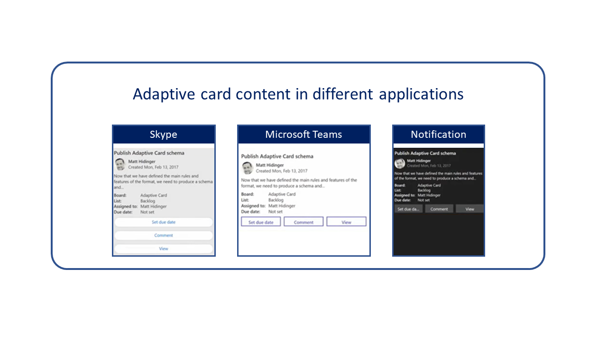
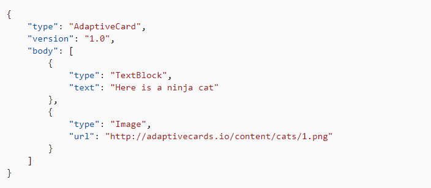

قبل استكشاف إنشاء الروبوت، يجب أن تتمتع بفهم أعمق للتكنولوجيا المستخدمة لعرض المحتوى للمندوبين في جزء الإنتاجية. يمكنك تقديم معلومات إلى المندوبين، مثل المقالات المعرفية المقترحة، في جزء الإنتاجية باستخدام بطاقات Microsoft Adaptive Cards.

إن Microsoft Adaptive Cards عبارة عن حل محمول مفتوح المصدر يساعدك على توصيل المحتوى إلى التطبيقات. تستخدم بطاقات الموائمة تنسيقاً واحداً لتقديم محتوى يقلل من عدد المخططات التي يحتاج المطورون إلى تعلمها. يساعد هذا المنهج على خفض تكلفة تطوير المحتوى ويساعد المحتوى على العمل عبر مجموعة أوسع من التطبيقات. ميزة أخرى لبطاقات الموائمة هي أن المحتوى سيتم عرضه في الأصل داخل تطبيق مضيف مثل جزء الإنتاجية في القناة متعددة الاتجاهات لـ Customer Service. يتم تصميم المحتوى تلقائياً بحيث يتطابق مع إرشادات UX للتطبيق المضيف والعلامة التجارية بحيث يكون له مظهر وسلوك التطبيق المضيف. ونتيجة لذلك، سيكون لدى المستخدمين تجربة متسقة، بغض النظر عن كيفية وصولهم إلى المحتوى.

على سبيل المثال، تقوم مؤسسة بإنشاء بطاقة موائمة باستخدام Microsoft Bot Framework، والتي سيتم استخدامها لتقديم مقالات معرفية للمستخدمين. عندما يستهلك المستخدم هذه المعلومات أثناء استخدام Skype، ستظهر وتتصرف بطريقة مشابهة لبطاقة Skype النموذجية. إذا كان شخص ما في تطبيق مثل Microsoft Teams يستهلك هذه الحمولة نفسها، فسيظهر ويتصرف مثل Microsoft Teams. بغض النظر عن مكان استهلاك المعلومات، ستقوم نفس الحمولة بتنشيط التطبيقات الداخلية التي تدعم بطاقات الموائمة وستظل تشعر بأنها أصلية تماماً في التطبيق.

> [!div class="mx-imgBorder"]
> 

هذا المفهوم مهم عندما تعمل مع مساعدة ذكية داخل القناة متعددة الاتجاهات لـ Customer Service. تبحث روبوتات المساعدة الذكية عن أحمال البيانات وتستخدمها من أنظمة أو مكونات مختلفة مثل الحالات من Dynamics أو التقويمات أو Office أو من أنظمة إدارة أصلية أو أخرى. بغض النظر عن مصدر البيانات، يتم تقديمها للمستخدم في القناة متعددة الاتجاهات لـ Customer Service باستخدام نفس واجهة المستخدم مثل مكونات القناة متعددة الاتجاهات الأخرى.

## مبادئ التصميم الأساسية لبطاقات الموائمة

تعد بطاقات الموائمة جزءاً مهماً من أي تنفيذ للقناة متعددة الاتجاهات لـ Customer Service، حيث سيتم استخدام المساعدة الذكية. عند التفكير في استخدام بطاقات الموائمة، ضع في اعتبارك بعض [المبادئ التوجيهية](/adaptive-cards/resources/principles/?azure-portal=true) التي كانت مفيدة في المساعدة في إبقاء عملية التصميم على المسار الصحيح:

- **التركيز على استخدام القيم الدلالية.** باستخدام القيم والمفاهيم الدلالية بدلاً من تخطيطات البكسل المثالية مثل الألوان وأحجام الأصناف والصور، يكون التطبيق المضيف قادراً على اتخاذ قرارات أفضل حول المظهر الفعلي وسلوك المحتوى المرتبط بالتطبيق الذي يتم عرضه فيه.

- **يمتلك مؤلفو البطاقات المحتوى؛ يمتلك التطبيق المضيف المظهر والسلوك.** عند إنشاء بطاقات، يمتلك المؤلفون البيانات التي يجب تقديمها في البطاقة. قد تتكون هذه البيانات من معلومات من مقالة معرفية يجب تضمينها أو إجراءات مثل القدرة على إرسال المقالة بالبريد الإلكتروني. بعد تسليم هذا المحتوى، يسيطر تطبيق الاستضافة على ويتحكم في مظهر وسلوك البطاقة لتقديمها بدقة أكبر في سياق التطبيق الخاص به.

- **حافظ على البطاقة بسيطة ولكن معبرة.** يجب أن تكون بطاقات الموائمة غرضاً معبراً وعاماً. الهدف ليس إنشاء إطار عمل لواجهة المستخدم بل إنشاء طبقة وسيطة تشبه Markdown، حيث يتم إنشاء وصف بسيط ومتسق لمحتوى المستند. يمكن لبطاقات الموائمة إنشاء وسيلة بسيطة ومعبرة لوصف محتوى البطاقة.

- **عند الشك في شيء ما، استبعده.** من الأسهل إضافة شيء لاحقاً بدلاً من تحمل الخطأ. عندما تحدد ما يجب تضمينه في البطاقة، إذا لم تكن متأكداً مما إذا كان يجب تضمين المعلومات أو لا، فقد يكون من الأفضل تركها. وإن إضافة خاصية لاحقاً أفضل من الاستمرار في استخدام خاصية قديمة تتمنى ألا تكون قد اضطررت إلى دعمها.

عادةً ما يكون الأشخاص الذين ينشرون المساعدة الذكية في بيئة القناة متعددة الاتجاهات الخاصة بـ Dynamics 365 لـ Customer Service هم نفس الأشخاص الذين سيكتبون محتوى بطاقة الموائمة. عادةً ما يتم إنشاء محتوى بطاقة الموائمة من قِبل المطورين. على الأرجح، قد لا يكون المطورون على دراية بمنتجات Dynamics 365. بعد الانتهاء من إنشاء محتوى البطاقة، سيقوم المطور بتسليم بطاقة الموائمة إلى مسؤول Dynamics 365 لنشرها في بيئة القناة متعددة الاتجاهات لـ Customer Service باستخدام المساعدة الذكية. لهذا السبب، لن توفر هذه الوحدة شرحاً متعمقاً لعملية كتابة المحتوى وعرضه. بدلاً من ذلك، ستركز على تقديم نظرة عامة عالية المستوى للمفاهيم الأساسية.

## كتابة البطاقات

الهيكل الأساسي للبطاقة كما يلي:

- **AdaptiveCard** - الكائن الجذر الذي يصف بطاقة الموائمة، بما في ذلك الأصناف مثل العناصر التي تتكون منها البطاقة، والإجراءات التي تتضمنها، وكيفية نطقها إذا تمت قراءتها مرة أخرى، وإصدار المخطط المطلوب لعرضها.

  - **النص الأساسي** - يتكون النص الأساسي من لبنات بناء تُعرف بالعناصر. قد تتضمن العناصر الصور المراد عرضها والنص المراد تضمينه وملفات الوسائط ومعلمات الإدخال والمزيد. يمكن أن تتألف العناصر في ترتيبات لانهائية تقريباً لإنشاء أنواع كثيرة من البطاقات.

  - **الإجراءات** - يمكن أن تحتوي العديد من البطاقات على مجموعة من الإجراءات التي قد يتخذها المستخدم. توضح هذه الخاصية تلك الإجراءات التي يتم عرضها عادةً في شريط إجراءات أسفل البطاقة.

يظهر المثال التالي بطاقة بسيطة تتضمن سطراً واحداً من النص متبوعاً بصورة.

> [!div class="mx-imgBorder"]
> 

## التعامل مع العناصر

العناصر هي المكونات الأساسية التي تشكل النص الأساسي للبطاقة. سيتم تحديد عناصر متعددة للمساعدة في تحديد التخطيط الكلي للبطاقة. يحتوي كل عنصر على خاصية نوع تحدد نوع الكائن. يحتوي كل نوع على خصائص مختلفة تحدد تفاصيل إضافية حول العنصر. لاحظ أن البطاقة السابقة تحتوي على عنصرين: TextBlock وImage.

الأنواع الثلاثة الأساسية للعناصر المستخدمة في البطاقات هي:

- **عناصر الموائمة** - أهم العناصر الأساسية التي يتم استخدامها في البطاقات. تتضمن هذه العناصر **TextBlock** و **Image**، اللذين يتم استخدامهما لإضافة والتحكم في مظهر النص والصور في البطاقات.

  [**مزيد من المعلومات حول عناصر الموائمة**](/adaptive-cards/authoring-cards/getting-started?azure-portal=true#adaptive-elements/)

- **عناصر الحاوية** - ساعد في ترتيب مجموعة من العناصر الفرعية لتسهيل الاستهلاك و/أو التسليم. تُستخدم الحاويات عادةً لمجموعات من الأصناف مثل الأعمدة أو الصور.

  [**مزيد من المعلومات حول عناصر الحاوية**](/adaptive-cards/authoring-cards/getting-started#container-elements/?azure-portal=true)

- **عناصر الإدخال** - تتيح لك طلب معلومات واجهة المستخدم الأصلية، مثل النص والتواريخ والأوقات والأرقام وما إلى ذلك، لإنشاء نماذج بسيطة.
  
  [**مزيد من المعلومات حول عناصر الإدخال**](/adaptive-cards/authoring-cards/getting-started?azure-portal=true#input-elements/)*

## التعامل مع الإجراءات

ستستفيد العديد من البطاقات من إضافة الإجراءات التي يمكن أن تساعد في توفير إمكانية استخدام أفضل للشخص الذي يستخدم البطاقة. على سبيل المثال، يمكنك استخدام إجراء لفتح عنوان URL خارجي أو لفتح بطاقة فرعية توفر معلومات إضافية.

[**مزيد من المعلومات حول الإجراءات**](/adaptive-cards/authoring-cards/getting-started#actions/?azure-portal=true)

[تحتوي Microsoft Docs](/?azure-portal=true) على مكتبة واسعة من المعلومات المتعلقة بكتابة محتوى بطاقة الموائمة.

لاستكشاف هذا المحتوى بمزيد من التفصيل، حدد الارتباطات التالية:

- [**بطاقات التأليف للشروع في العمل**](/adaptive-cards/authoring-cards/getting-started/?azure-portal=true)

- [**مستكشف مخطط البطاقة**](https://adaptivecards.io/explorer/?azure-portal=true)

- [**عينات البطاقات**](https://adaptivecards.io/samples/?azure-portal=true)

- [**استخدام الكلام في البطاقات**](/adaptive-cards/authoring-cards/speech/?azure-portal=true)

## عرض البطاقات داخل تطبيقك

بعد إنشاء بطاقة، يمكن عرضها داخل التطبيقات. تم توفير مجموعات أدوات SDK لجميع الأنظمة الأساسية الشائعة وتوفر [مواصفات تفصيلية](/adaptive-cards/rendering-cards/implement-a-renderer/?azure-portal=true) لإنشاء عارض بطاقات الموائمة الخاص بك. يحدد الجدول التالي مجموعات أدوات SDK لبطاقات الموائمة المختلفة المتوفرة.

|     النظام الأساسي       |     تثبيت                   |
|--------------------|-------------------------------|
|     JavaScript     |     npm   v1.2.6              |
|     NET WPF.       |     NuGet v1.2.4              |
|     NET   HTML.    |     NuGet   v1.2.4            |
|     Windows UWP    |     NuGet v1.2.9              |
|     Android        |     maven-central   v1.2.9    |
|     iOS            |     pod v1.2.9                |

بعد نشر مجموعة أدوات SDK الصحيحة، تحتاج إلى:

- إنشاء مثيل للعارض (AdaptiveCardRenderer). يكتسب هذا الإجراء حمولة البطاقة ويربط أحداث الإجراءات.

- اعرض بطاقة. بعد حصولك على حمولة بطاقة، اتصل بالعارض وقم بتمرير البطاقة. ستتلقى كائن واجهة مستخدم أصلياً يتكون من محتويات البطاقات. الآن، يمكنك وضع واجهة المستخدم هذه في مكان ما في تطبيقك.

[تحتوي Microsoft Docs](/?azure-portal=true) على مكتبة واسعة من المعلومات المتعلقة بعرض محتوى بطاقة الموائمة والتعامل مع مجموعات أدوات SDK.

لاستكشاف هذا المحتوى بمزيد من التفصيل، حدد الارتباطات التالية:

- [**بطاقات العرض للشروع في العمل**](/adaptive-cards/rendering-cards/getting-started/?azure-portal=true)

- [**التعامل مع تكوين المضيف**](/adaptive-cards/rendering-cards/host-config/?azure-portal=true)

- [**إمكانية التوسعة**](/adaptive-cards/rendering-cards/extensibility/?azure-portal=true)

- [**حالات العارض**](/adaptive-cards/rendering-cards/getting-started#adaptive-cards-sdks/?azure-portal=true)

- [**القوالب**](/adaptive-cards/templating/?azure-portal=true)
