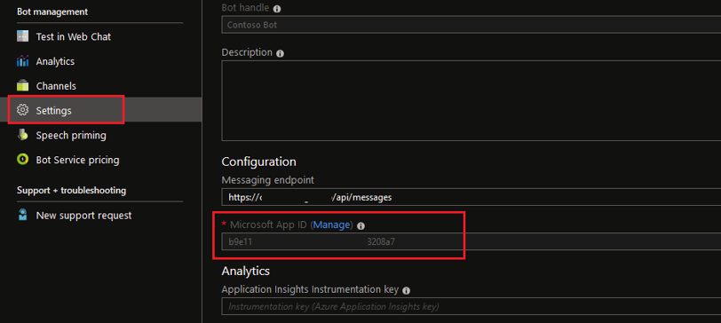
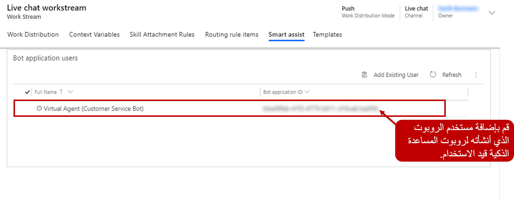

بعد قيامك بإنشاء روبوت باستخدام Microsoft Bot Framework والتسجيل في Azure Bot Service، يمكن استخدام الروبوت الخاص بك في قناة متعددة الاتجاهات لخدمة العملاء باعتباره روبوتاً مساعداً ذكياً. لاستخدام روبوت المساعدة الذكي، أنشئ مستخدم الروبوت في القناة متعددة الاتجاهات لـ Customer Service الذي تم تعريفه وتعيينه كمستخدم تطبيق. بعد ذلك، تأكد من أن مستخدم الروبوت هذا لديه القناة متعددة الاتجاهات اللازمة لدور أمان خدمة العملاء المرتبط به.

تتكون عملية تحديد مستخدم الروبوت في القناة متعددة الاتجاهات لـ Customer Service من خطوتين:

1. احصل على مُعرّف تطبيق Microsoft الخاص بالروبوت.

1. قم بإنشاء مستخدم تطبيق وإضافة معلومات خاصة بالروبوت إلى مستخدم التطبيق.

## احصل على مُعرّف تطبيق Microsoft الخاص بالروبوت

تتمثل مهمتك الأولى في الحصول على مُعرّف تطبيق Microsoft الخاص بالروبوت الذي ستستخدمه في القناة متعددة الاتجاهات لـ Customer Service. للحصول على مُعرّف تطبيق Microsoft، قم بتسجيل الدخول [Azure portal](https://portal.azure.com/?azure-portal=truee). انتقل إلى Bot Services، وحدد موقع تسجيل روبوت المساعدة الذكية، ثم حدد **الإعدادات**، حيث ستنسخ القيمة في حقل **مُعرّف تطبيق Microsoft** . يمثل هذا المُعرّف مُعرّف تطبيق الروبوت وهو ما ستستخدمه لإنشاء مستخدم الروبوت.

> [!div class="mx-imgBorder"]
> 

## إنشاء مستخدم تطبيق الروبوت

عندما يكون لديك مُعرّف تطبيق Microsoft، يمكنك إنشاء مستخدم روبوت في القناة متعددة الاتجاهات لـ Customer Service. اعتباراً من وقت نشر هذه الوحدة، لا يمكن تحديد مستخدمي الروبوت إلا في عميل الويب. يمكنك الوصول إلى عميل الويب عن طريق فتح الإعدادات المتقدمة المتاحة من الزر **الإعدادات** والذي يشبه الترس الموجود في الزاوية العلوية اليمنى من تطبيق إدارة القناة متعددة الاتجاهات.

بعد فتح الإعدادات المتقدمة، انتقل إلى **الإعدادات > الأمان > المستخدمون** ثم قم بتغيير القائمة المنسدلة **عرض** إلى **مستخدمو التطبيق**. حدد سجل مستخدم جديداً مرتبطاً بتسجيل تطبيق الروبوت الذي عملت معه سابقاً.

أثناء تحديد مستخدم الروبوت، قدم التفاصيل الموضحة في الجدول التالي.

|     حقل                 |     الوصف                                                                                                                                                                                                    |
|---------------------------|--------------------------------------------------------------------------------------------------------------------------------------------------------------------------------------------------------------------|
|     اسم المستخدم             |     اسم سجل الروبوت؛ هذه المعلومات هي فقط لأغراض التعريف في التطبيق ولا يتم عرضها عنصر واجهة المستخدم.                                                                           |
|     مُعرّف التطبيق        |     مُعرّف التطبيق لأي تطبيق صالح (غير منتهي الصلاحية) تم إنشاؤه في Azure Active Directory (Azure AD) لنفس المستأجر. لا يتم استخدامه بواسطة الروبوت في القناة متعددة الاتجاهات لـ Customer Service.    |
|     الاسم الكامل             |     يمثل اسم مستخدم الروبوت الذي سيتم عرضه عنصر واجهة المستخدم.                                                                                                                               |
|     نوع المندوب            |     يحدد هذا الحقل نوع سجل المستخدم. يجب تعيين هذا الحقل على **مستخدم تطبيق الروبوت**.                                                                                                                       |
|     مُعّرف تطبيق الروبوت    |     يجب تعيين هذا الحقل على مُعرّف تطبيق الروبوت من Azure AD الذي نسخته في الخطوة السابقة.                                                                                                          |

مثل أي مستخدم آخر، يحتاج مستخدم الروبوت إلى تعيين دور أمان له يضمن الوصول إلى المعلومات الضرورية. على سبيل المثال، سيحتاج مستخدم الروبوت الذي سيبحث في المقالات المعرفية إلى الحصول على الأذونات اللازمة للمقالات. بالإضافة إلى ذلك، بعد إنشاء المستخدم وحفظه مبدئياً، قم بتعيينه إلى القناة متعددة الاتجاهات لدور أمان مندوب خدمة العملاء عن طريق تحديد **إدارة الأدوار** في شريط الأوامر.

## إضافة روبوت المساعدة الذكية إلى دفق العمل

بعد إنشاء مستخدم الروبوت، قم بإضافته إلى دفقات العمل المناسبة للتأكد من أن المندوبين الذين يستخدمون دفق العمل هذا يمكنهم رؤية الاقتراحات. لتمكين هذه الميزة على مستوى دفق العمل، انتقل إلى **إدارة توزيع العمل**، وحدد **دفقات العمل**، ثم افتح دفق العمل الذي تريده إضافة الروبوت إلى. حدد دفق العمل الذي تريد إضافة روبوت المساعدة الذكي له. في صفحة **دفق العمل** حدد علامة التبويب **مساعداً ذكياً** حدد **إضافة مستخدماً موجوداً** للاطلاع على قائمة روبوتات المساعدة الذكية المتاحة، حدد روبوتاً من القائمة، ثم حدد **إضافة**. يمكنك إضافة روبوتات متعددة إلى دفق العمل بناءً على متطلبات عملك. حدد **حفظ** عند إضافة جميع الروبوتات الضرورية.

> [!div class="mx-imgBorder"]
> 
