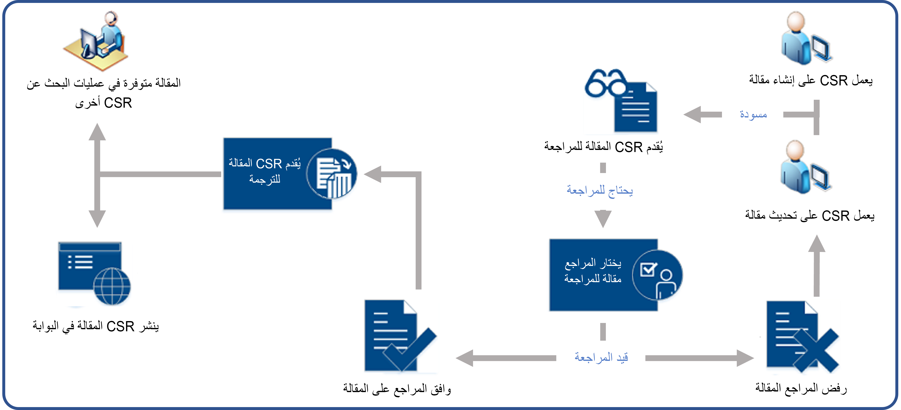

إدارة المعرفة هي عملية إنشاء المعرفة والمعلومات الخاصة بالمؤسسة وإدارتها واستخدامها وتبادلها. والهدف من أي حل لإدارة المعرفة هو الاستفادة على أفضل وجه ممكن من المعلومات التي تملكها المؤسسة وتسهيل استخدام هذه المعلومات قدر الإمكان.

تتيح وحدة **مدير المعرفة** في Microsoft Dynamics 365 للمؤسسات إمكانية توفير المعلومات لموظفيها وعملائها عن طريق إنشاء وإدارة المقالات المعرفية التي يحتمل أن يبحث عنها الأشخاص.

يمكن أن تتناول المقالات المعرفية أي عدد من المشكلات التي يواجهها العملاء والموظفون أثناء استخدامهم لمنتجات المؤسسة أو خدماتها. ويمكن أن تتضمن أنواع المقالات المعرفية حلولاً للقضايا الشائعة ووثائق المنتجات أو الميزات وإجابات عن الأسئلة المتداولة (الأسئلة الشائعة) وموجزات المنتجات. باستخدام محرر النص المنسق الذي تم توفيره، يمكن للمؤسسات إنشاء مقالات معرفية وتنسيق المحتوى وتضمين مقاطع فيديو أو صور والمزيد.

يتيح لك حل إدارة المعرفة ما يأتي:

- **إنشاء المقالات المعرفية وتصميمها:** إنشاء محتوى غني وجيد التنسيق لرسائل البريد الإلكتروني والمقالات المعرفية باستخدام محرر النص المنسق.
- **إدارة دورة حياة المقال:** استخدم تدفقات عمليات أعمال جاهزة لإدارة دورات حياة المقال أو إنشاء عمليات جديدة.
- **إدارة محفوظات إصدار المقال:** إدارة تحديثات إلى مقالات دون تعطيل المقالات المباشرة أو المنشورة.
- **ترجمة المقالات:** توفير ترجمات لمقال بلغات متعددة.
- **نشر المقالات:** نشر المقالات بمجرد الموافقة عليها، أو جدولتها للنشر لاحقاً. يمكنك أيضاً تعيين تواريخ انتهاء الصلاحية في المقالات.
- **تعقب ثوابت المقالات وتحليلها** تعقب عدد مرات استخدام المقال وعرضه وإرساله إلى العملاء.

## المقالات المعرفية Dynamics 365

يتم إنشاء المقالات المعرفية في مركز Dynamics 365 Customer Service. يمنحك حل إدارة المعرفة المرونة لتنفيذ حل إدارة المعرفة المصمم خصيصاً لاحتياجات مؤسستك. رغم أنه قابل للتكوين بشكلٍ كبير، إلا أنه يتم إصداره من خلال عملية إدارة المعرفة الافتراضية المحددة مسبقاً لمساعدتك على الشروع في العمل.

تعرض الصورة الآتية مثالاً للعملية الافتراضية لإنشاء مقالات معرفية واستخدامها في مركز خدمة العملاء.

> [!VIDEO https://www.microsoft.com/videoplayer/embed/RE2ITLi]

بعد ذلك، سندرس عملية تصميم حل إدارة المعرفة في Dynamics 365. ستتعرف على المزيد حول دورة حياة إدارة المعرفة وإنشاء المقالات والتعامل مع محرر المقالات والتحكم في الإصدار وخيارات النشر.

لمزيد من المعلومات حول حل إدارة المعرفة Dynamics 365، راجع [عملية إدارة المعرفة](/dynamics365/customer-engagement/customer-service/customer-service-hub-user-guide-knowledge-article#knowledge-management-process).
