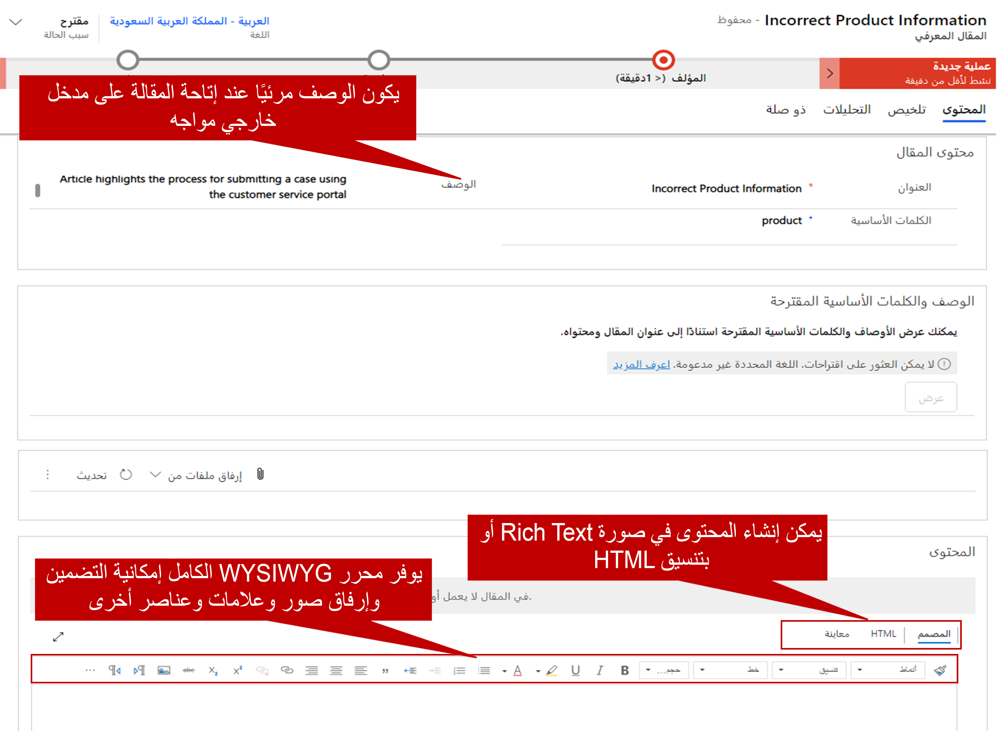
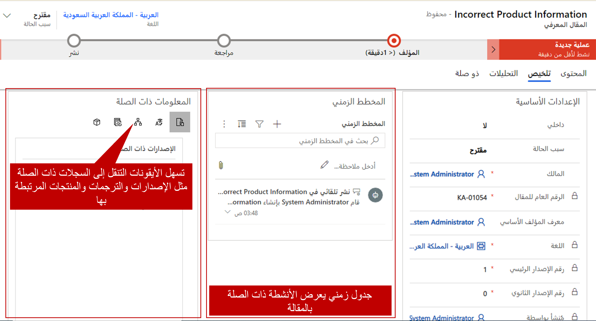

إن إيجاد حل فعال لإدارة المعرفة هو أكثر من مجرد مستودع للمشكلات والحلول. وينبغي أن يكون من السهل التنقل وتوفير حلول واضحة وموجزة والحصول على المعلومات الحالية والمهمة ويمكن الوصول إليها بسهولة عبر الأنظمة الأساسية.

عندما تستعد لإنشاء مستودع للمعرفة وتحديد مقالات معرفية محددة في Microsoft Dynamics 365، من المهم أن تفهم الرؤية الشاملة للمستودع. فيما يأتي بعض الأسئلة التي يجب أخذها في الحسبان:

- ما الغرض من استخدام المقال؟
- مَن سيستخدم المقال؟
- ما الذي يجب تضمينه في المقالة ليكون أكثر فائدة للأشخاص الذين يستخدمونه؟
- هل ترتبط المقالة بمنتج معين؟
- هل يجب أن يكون المقالة متوفرة بلغات متعددة؟ إذا كان يجب ذلك، فبأي اللغات؟
- هل المقالة حساسة للوقت؟

هذه القائمة تمثل عددَا قليلاً من الأشياء التي تحتاج إلى التفكير فيها. وسيكون لكل مؤسسة متطلبات محددة تجب تلبيتها.

يوفر Dynamics 365 العديد من الخيارات التي ستساعدك على إنشاء مقالات وإدارتها وفقاً لمتطلبات المؤسسة. يتميز بمحرر النص المنسق الذي يُسهّل إدراج عناصر مثل الصور ومقاطع الفيديو في المقالات، للمساعدة على شرح الأمور بشكلٍ أفضل وجعل المقالات أكثر جاذبية. إضافة إلى ذلك، يمكنك كتابة المقالات وتحريرها والبحث عنها ونشرها وترجمتها لتكون أكثر فعالية وملاءمة لجمهورك.

تحتوي المقالة المعرفية على 3 علامات تبويب تستخدم لإدارة المحتوى وعرض التحليلات.  

وإليك علامات التبويب هذه:

- المحتوى: يتضمن العنوان والكلمات الرئيسية والوصف ومصمم المحتوى.
- ملخص: يتضمن المخطط الزمني والمعلومات الأخرى ذات الصلة.
- التحليلات: تتضمن معلومات تحليلية عن المقالات.

**إنشاء المقال:**

يتم إنشاء المقالات المعرفية في مركز Customer Service.  يمكن إنشاؤها بواسطة أي شخص لديه إذن محدد لإجراء ذلك. إضافة إلى القدرة على تحديد مَن يمكنه إنشاء المقالات، يمكن أيضاً تعيين الأشخاص في المؤسسة كموافقين على المقالات.   

عند إنشاء مقالة للمرة الأولى، يجب أن تحدد الآتي:

### علامة تبويب المحتوى

عند إنشاء مقالة معرفية للمرة الأولى، يجب إدخال المعلومات الآتية في قسم **محتوى المقالة** في علامة التبويب **المحتوى**:

- **العنوان:** ينقل العنوان موضوع المقالة والغرض منها بطريقة موجزة.
- **الكلمات الرئيسية:** تستخدم الكلمات الرئيسية للبحث في قاعدة المعارف عن المقالات. افصل الكلمات الرئيسية المختلفة بفواصل.
- **الوصف:** وصف يقدم نظرة عامة قصيرة عن المقالة. يَظهر هذا النص في نتائج البحث ويستخدم لتحسين محرك البحث.

عند تصميم المقالة المعرفية، يجب التأكد من أن المحتوى ليس مناسباً للأشخاص الذين سيستخدمونه فقط، بل يسهل استخدامه أيضاً، بحيث يمكن للمستخدم استيعاب جميع المحتويات المعروضة بالكامل. على سبيل المثال، يمكنك إضافة رابط إلى فيديو يوضح الإجراء أو العملية التي تم تقديمها أو روابط إلى محتوى آخر ذي صلة أو HTML مضمن لتوفير محتوى أكثر ديناميكية. يدعم مصمم محتوى Dynamics 365 ميزات التصميم المتقدمة هذه والمزيد.

محرر المحتوى في قسم **المحتوى**. وتتكون من ثلاث علامات تبويب:

- **المصمم:** يعمل على كتابة محتوى المقالة وتحريره. علامة التبويب هذه تتضمن قدرات محسنة وغنية لتحرير النص.
- **HTML:** يعرض معاينة HTML من محتوى المقالة. يمكنك كذلك كتابة المقالة وتحريرها في علامة التبويب هذه.
- **معاينة:** تمكنك من رؤية مظهر المحتوى على الأجهزة مثل أجهزة كمبيوتر سطح المكتب أو الأجهزة اللوحية أو الأجهزة المحمولة.

للحصول على مزيد من المعلومات حول القدرات المختلفة لمحرر المحتوى، راجع [إنشاء المقالات المعرفية وإدارتها.](https://docs.microsoft.com/dynamics365/customer-engagement/customer-service/customer-service-hub-user-guide-knowledge-article)

### علامة تبويب "الملخص"

علامة تبويب **الملخص** تتضمن معلومات أخرى مرتبطة بالمقالة المعرفية. يتم تحديث كثير من هذه المعلومات بواسطة النظام عند إجراء تغييرات على المقالة. ولكن يمكنك تحرير بعضها. فيما يأتي الحقلان الرئيسيان اللذين قد تحتاج إلى تحديثهما:

- **داخلي:** يمكنك وضع علامة على المقالة للاستخدام الداخلي فقط. في هذه الحالة، لن يتمكن أشخاص من خارج مؤسستك من الوصول إلى المقالة (على سبيل المثال، من مدخل). يمكن أن يكون هذا الإعداد مفيداً للمقالات التي تركز بدرجة أكبر على العمليات الداخلية غير المرتبطة بالمستخدمين الخارجيين.
- **سبب الحالة:** يمكنك تحديد حالة المقالة للإشارة إلى ما إذا كانت مقترحة أو قيد المراجعة أو في انتظار المراجعة.

لا تظهر بعض المعلومات في علامة تبويب **الملخص** حتى يُحفظ سجل المقالة للمرة الأولى. على سبيل المثال، **المعلومات ذات الصلة** و **المخطط الزمني** هما جزءان مهمان يكونان متاحين عند حفظ السجل للمرة الأولى.

- **المخطط الزمني:** يعرض هذا الجزء كافة الأنشطة المرتبطة المقترنة بالمقالة المعرفية. يمكنك أيضاً إضافة الأنشطة مباشرة إلى السجل.
- **معلومات ذات صلة:** هذا الجزء يتيح الوصول إلى السجلات المرتبطة أو المقترنة بالمقالة المعرفية. يمكنك فتح السجلات الآتية باستخدام الأزرار الموجودة على طول الحافة اليمنى من هذا الجزء:

    - **إصدارات ذات صلة:** هذا السجل يعرض محفوظات إصدار كاملة من المقالة. يمكنك عرض الإصدارات السابقة من المقالة، بل ويمكنك الرجوع إلى إصدار سابق إذا اضطررت إلى ذلك.
    - **ترجمات ذات صلة:** هذا السجل يعرض قائمة بالترجمات المختلفة المتوفرة للمقالة.
    - **فئات ذات صلة:** هذا السجل يعرض الفئات المرتبطة بالمقالة. تستخدم الفئات لموقع المقالة والتحليلات. وهي تساعد على توفير تنظيم أفضل للمقالات عند استخدام المقالات في قاعدة معرفية لأحد المداخل.
    - **مقالات ذات صلة:** هذا السجل يعرض أي مقالات مشابهة للمقالة أو تم ربطها بها.
    - **منتجات ذات صلة:** هذا السجل يعرض المنتجات المرتبطة بالمقالة.

للحصول على مزيد من المعلومات حول إنشاء مقالات معرفية، راجع [إنشاء مقالة معرفية](https://docs.microsoft.com/dynamics365/customer-engagement/customer-service/customer-service-hub-user-guide-knowledge-article#create-a-knowledge-article).

سيتم تناول مهمات أخرى، مثل إنشاء ترجمات للمقالات ومعالجة الإصدارات وإعداد خيارات النشر، في وحدات لاحقة.
