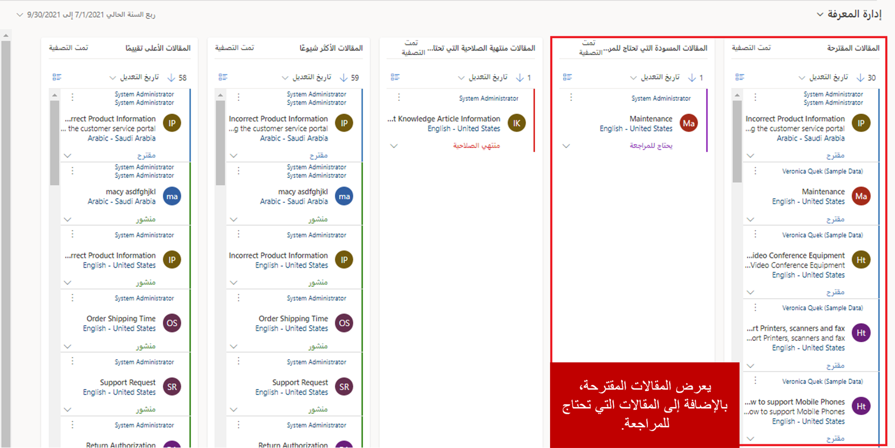

كما ذكرنا في وحدة النظرة العامة، فإن إدارة المعرفة الفعالة ودورة حياة الموافقة على المقالات لا تضمن فقط دقة محتوى المعرفة، ولكن توفر أيضاً المحتوى الأحدث والأكثر صلة للمستخدمين. بشكل جديد، تشبه دورة حياة إدارة المعرفة الصورة التالية.

- **مسودة:** تبدأ العملية بتعيين شخص ما مثل ممثل خدمة العملاء لإنشاء وتقديم إصدار مسودة في مقال.
    - تم وضع علامة على المقال لمراجعته من قبل أحد المعتمدين.
- **تمت الموافقة/الرفض:** يقوم المراجع بتقييم المحتوى في المقال ويمكنه إما الموافقة على المقال أو رفضه.
    -  إذا تم **رفض** المقال:
        - يتم إرساله مرة أخرى إلى مؤلف المقال الأصلي لإجراء تعديلات أو تحديثات. 
        - تتكرر العملية حتى تتم الموافقة على المقال في النهاية.  
    -  إذا تمت **الموافقة** على المقال:
        - يتم تعيين المقال إلى حالة **موافقة** ويكون جاهزاً للنشر

- **مجدول:** تتم جدولة نشر المقال. يتم توفير معلومات التاريخ مثل تاريخ النشر وانتهاء الصلاحية.    
    - يتم تعيين المقال إلى حالة **مجدول** حتى يتم الوصول إلى تاريخ النشر. 

- **منشور:** عندما يتم الوصول إلى تاريخ نشر المقال، تنتقل إلى حالة **منشور**. المقالات المنشورة متوفرة:
    - في سجلات الحالة التي يتم العمل عليها من قبل المندوبين 
    - المداخل المخصصة للعملاء

- **‏‏منتهي الصلاحية:** يتم نقل المقال الذي يصل إلى تاريخ انتهاء صلاحيتها إلى حالة ‏‏**منتهي الصلاحية**.  

قد يخضع المقال المعرفي للعديد من المراجعات والموافقات والتقييمات في دورة الحياة. في كثير من الحالات، بعد انتهاء صلاحية المقال المعرفي، فإنها تعود خلال عملية الموافقات الأخرى لإعادة نشره. 

## مسودة

بعد إنشاء محتوى المقال، يجب مراجعته للتأكد من دقته. يمكن مراجعة المقالات المعرفية بطريقتين:

- **وضع علامة للمراجعة:** تبدأ المقالات التي تم وضع علامة عليها للمراجعة في الظهور على لوحة معلومات **إدارة المعرفة**. 

- **تم تعيينه مباشرة:** يمكن تعيين المقالات مباشرة لأشخاص معينين أو إلى صف ما.

يجب أن يكون لدى المستخدمين الذين يحتاجون إلى الموافقة على المقالات المعرفية أذونات **الموافقة** لنوع سجل المقال المعرفي. يُضاف هذا الإذن بشكل افتراضي إلى أذونات دور مدير المعرفة أو مدير خدمة العملاء أو ممثل خدمة العملاء أو مسؤول النظام أو الأذونات المكافئة.  ويمكن أيضاً تحديد هذا الإذن لأي دور أمان من خلال تخصيص دور الأمان المحدد هذا.  

لمزيد من المعلومات حول أدوار الأمان، اطّلع على [أدوار الأمان والامتيازات.](/dynamics365/customer-engagement/admin/security-roles-privileges)

عندما يتم وضع علامة على مقال لمراجعته، فإنه يظهر ضمن عرض **مقال مسودة بحاجة إلى المراجعة**. بعد ذلك، يمكن لمدير المعرفة تعيين المقال إلى أعضاء فريق محددين أو قائمة انتظار معينة للمراجعة.

> [!div class="mx-imgBorder"]
> 

لمزيد من المعلومات حول وضع علامات على المقالات للمراجعة، راجع [وضع علامة على مقال معرفي للمراجعة](/dynamics365/customer-engagement/customer-service/customer-service-hub-user-guide-knowledge-article#mark-a-knowledge-article-for-review).

## مراجعة مقال معرفي، ورفضه أو الموافقة عليه

يجب مراجعة المقالات المعرفية للتأكد من دقتها قبل نشرها أو إتاحتها لأشخاص آخرين. عندما تتطلب مقال المراجعة، يمكن للمراجع تنفيذ الإجراءات التالية:

- تحديد مقال تم تعيينه للمراجعة.
- اقتراح تعليقات المراجعة.
- الموافقة على محتوى المقال.

هناك طرق متعددة لإضافة تعليقات واقتراحات إلى مقال. أولاً، يمكن إضافة الملاحظات مباشرةً إلى مقال في جزء **المخطط الزمني** في علامة التبويب **الملخص**. وبعد إضافة ملاحظة، تظهر في المخطط الزمني.

> [!div class="mx-imgBorder"]
> 

بالإضافة إلى ذلك، يمكن إضافة تعليقات المقال إلى المقالات المسودة أو المقالات التي تمت الموافقة عليها أو حتى المقالات المنشورة المستخدمة حالياً. تتيح التعليقات للأشخاص القيام بأشياء مثل إضافة تعليقات تقترح تعديلات معينة أو تقديم تقييم عام لمقال.

يمكن إضافة تعليقات المقال وعرضها في جزء **التعليقات** في علامة التبويب **التحليلات**. وعند التقاط التعليقات، يمكن تحديد التقييمات. يعرض حقل **التقييم** تصنيف المقال الحالي. تتم إعادة حساب قيمة هذا الحقل وفقاً لجدول محدد مسبقاً، ولكن يمكنك تشغيل عملية إعادة الحساب يدوياً في أي وقت عن طريق تحديد رمز الآلة الحاسبة في الحقل **التقييم**.

> [!div class="mx-imgBorder"]
> 

إحدى الطرق الجيدة للتأكد من أن المقالات حديثة ودقيقة هي تحديثها، استناداً إلى تعليقات المقال والملاحظات التي يتلقاها. بعد تحديث مقال، يمكنك تعيينه مرة أخرى إلى المراجع للموافقة عليه أو نشره. حدد **تعيين** في شريط الأوامر، ثم حدد المستخدم أو الفريق الذي تريد تعيين المقال إليه.

بمجرد أن يعتقد الموافق على المقال أن المقال جاهزاً للنشر، يمكن للموافق أن يوافق على المقال من خلال تحديد الزر **موافقة** في شريط الأوامر.  المقال جاهز الآن ليتم نشره.  

لمزيد من المعلومات حول مراجعة المقالات والموافقة عليها، راجع [مراجعة مقال معرفي ورفضه أو الموافقة عليه](/dynamics365/customer-engagement/customer-service/customer-service-hub-user-guide-knowledge-article#review-and-reject-or-approve-a-knowledge-article).

لمزيد من المعلومات حول تحديث المقالات المعرفية لالتقاط التعليقات، راجع [تحديث المقالات المعرفية لالتقاط التعليقات](/dynamics365/customer-engagement/customer-service/customer-service-hub-user-guide-knowledge-article#update-knowledge-articles-to-capture-feedback).

لمزيد من المعلومات حول تحديث المقالات المنشورة، راجع [تحديث المقالات المعرفية المنشورة](/dynamics365/customer-service/customer-service-hub-user-guide-knowledge-article?tabs=customerserviceadmincenter).
