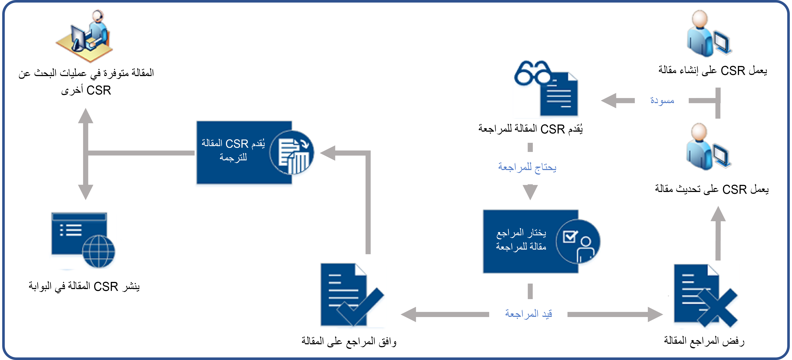
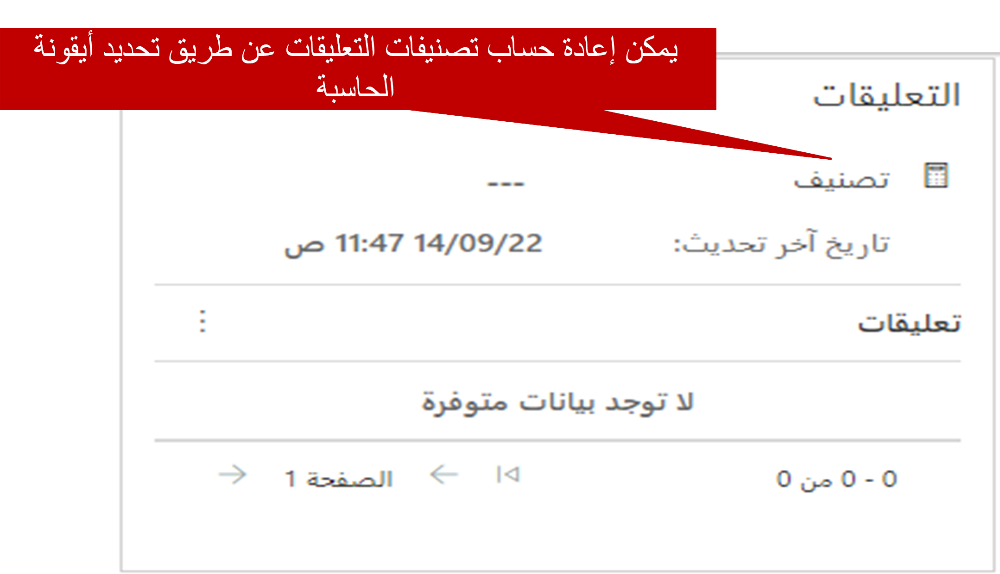

كما ذكرنا في وحدة النظرة العامة، فإن إدارة المعرفة الفعالة ودورة حياة الموافقة على المقالات لا تضمن فقط دقة محتوى المعرفة، ولكن توفر أيضاً المحتوى الأحدث والأكثر صلة للمستخدمين. بشكل جديد، تشبه دورة حياة إدارة المعرفة الصورة التالية.

- **مسودة:** تبدأ العملية بتعيين شخص ما مثل ممثل خدمة العملاء لإنشاء وتقديم إصدار مسودة في مقال.
    - تم وضع علامة على المقال لمراجعته من قبل أحد المعتمدين.
- **تمت الموافقة/الرفض:** يقوم المراجع بتقييم المحتوى في المقال ويمكنه إما الموافقة على المقال أو رفضه.
- إذا تم رفض المقال:
    - يتم إرساله مرة أخرى إلى مؤلف المقال الأصلي لإجراء تعديلات أو تحديثات. 
    - تتكرر العملية حتى تتم الموافقة النهائية على المقال.  
- إذا تمت الموافقة على المقال:
    - يتم تعيينه على حالة "موافقة" ويكون جاهزاً للنشر

- **مجدول:** تتم جدولة نشر المقال. يتم توفير معلومات التاريخ مثل تاريخ النشر وانتهاء الصلاحية.    
    - يتم تعيين المقال في حالة "مجدول" حتى يتم الوصول إلى تاريخ النشر. 

- **منشور:** بمجرد أن يتم الوصول إلى تاريخ نشر المقالات، تنتقل إلى حالة "منشور". المقالات المنشورة متوفرة:
    - في سجلات الحالة التي يتم العمل عليها من قبل المندوبين 
    - المداخل المخصصة للعملاء

- **‏‏منتهي الصلاحية:** يتم نقل المقال الذي يصل إلى تاريخ انتهاء صلاحيته إلى حالة ‏‏"منتهي الصلاحية".  (غير معروض) 

قد تخضع المقالة المعرفية للعديد من المراجعات والموافقات والتقييمات في دورة الحياة. في كثير من الحالات، بعد انتهاء صلاحية المقالة المعرفية، فإنها تعود خلال عملية الموافقات الإضافية لإعادة نشرها. 

**أدوار الأمان المستخدمة في عملية دورة الحياة**

سيحتاج المستخدمون الذين يقومون بإنشاء مقالات معرفية إلى الحصول على الأذونات اللازمة لإجراء ذلك.  يتم تحديد الأذونات في كيان المقالة المعرفية ويمكن الوصول إليها في علامة تبويب الخدمة لأي دور أمان.  

بعد إنشاء محتوى المقال، يجب مراجعته للتأكد من دقته. يمكن مراجعة المقالات المعرفية بطريقتين:

- **وضع علامة للمراجعة:** تبدأ المقالات التي تم وضع علامة عليها للمراجعة في الظهور على لوحة معلومات **إدارة المعرفة**. ومن هناك، يمكن تعيينها لأشخاص معينين أو إلى صف ما.
- **تم تعيينه مباشرة:** يمكن تعيين المقالات مباشرة لأشخاص معينين أو إلى صف ما.

بعد وضع علامة على مقال للمراجعة وبدء ظهوره على لوحة معلومات **إدارة المعرفة**، يمكن لإدارة المعرفة تعيينه لأعضاء فريق معينين أو صف ما للمراجعة.

لمزيد من المعلومات حول وضع علامات على المقالات للمراجعة، راجع [وضع علامة على مقالة معرفية للمراجعة](/dynamics365/customer-engagement/customer-service/customer-service-hub-user-guide-knowledge-article#mark-a-knowledge-article-for-review).

## مراجعة مقالة معرفية، ورفضها أو الموافقة عليها

يجب مراجعة المقالات المعرفية للتأكد من دقتها قبل نشرها أو إتاحتها لأشخاص آخرين. عندما يتطلب مقال المراجعة، يمكن للمراجع تنفيذ الإجراءات التالية:

- تحديد مقال تم تعيينه له للمراجعة.
- اقتراح تعليقات المراجعة.
- الموافقة على محتوى المقال.

هناك طرق متعددة لإضافة تعليقات واقتراحات إلى مقال. أولاً، يمكن إضافة الملاحظات مباشرةً إلى مقال في جزء **المخطط الزمني** في علامة التبويب **الملخص**. وبعد إضافة ملاحظة، تظهر في المخطط الزمني.

بالإضافة إلى ذلك، يمكن إضافة تعليقات المقال إلى المقالات المسودة أو المقالات التي تمت الموافقة عليها أو حتى المقالات المنشورة المستخدمة حالياً. تتيح التعليقات للأشخاص القيام بأشياء مثل إضافة تعليقات تقترح تعديلات معينة أو تقديم تقييم عام لمقال.

يمكن إضافة تعليقات المقال وعرضها في جزء **التعليقات** في علامة التبويب **التحليلات**. وعند التقاط التعليقات، يمكن تحديد التقييمات. يعرض حقل **التقييم** تصنيف المقال الحالي. تتم إعادة حساب قيمة هذا الحقل وفقاً لجدول محدد مسبقاً، ولكن يمكنك تشغيل عملية إعادة الحساب يدوياً في أي وقت عن طريق تحديد رمز الآلة الحاسبة بجوار اسم الحقل.

إحدى الطرق الجيدة للتأكد من أن المقالات حديثة ودقيقة هي تحديثها، استناداً إلى تعليقات المقال والملاحظات التي يتلقاها. بعد تحديث مقال، يمكنك تعيينه مرة أخرى إلى المراجع للموافقة عليه أو نشره. حدد **تعيين** في شريط الأوامر، ثم حدد المستخدم أو الفريق الذي تريد تعيين المقال إليه.

لمزيد من المعلومات حول مراجعة المقالات والموافقة عليها، راجع [مراجعة مقالة معرفية ورفضها أو الموافقة عليها](/dynamics365/customer-engagement/customer-service/customer-service-hub-user-guide-knowledge-article#review-and-reject-or-approve-a-knowledge-article).

لمزيد من المعلومات حول تحديث المقالات المعرفية لالتقاط التعليقات، راجع [تحديث المقالات المعرفية لالتقاط التعليقات](/dynamics365/customer-engagement/customer-service/customer-service-hub-user-guide-knowledge-article#update-knowledge-articles-to-capture-feedback).
