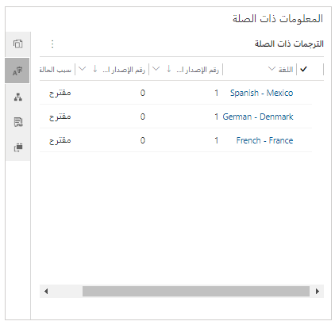
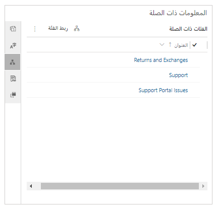

بما أنك تعمل على إنشاء مستودع المعرفة، قد تجد أن المقالات قيد التطوير، أو حتى المقالات التي نُشرت بالفعل، تتطلب تحديثات لتعكس ميزات جديدة أو طريقة جديدة لتشغيل إجراء. ونظراً لإجراء هذه التحديثات، تُخزّن الإصدارات السابقة من المقالة.

يساعد إصدار مقالة Microsoft Dynamics 365المؤسسات على إدارة التحديثات في مقالات المعرفة دون تعطيل المقالات المباشرة أو المنشورة. بتخزين إصدارات مقالة معرفة، يُمكنك تحديث المقالات بأحدث المعلومات ولكن يُمكنك أيضاً تتبع التغييرات طوال دورة حياة المنتجات والخدمات.

يُمكن إنشاء نوعين من الإصدارات للمقالات المعرفية:

- **الإصدار الرئيسي:** يُمثل نوع الإصدار هذا تغييرا كبيرا في الميزات أو الوظائف.

    مثال، ميزة جديدة أُضيفت إلى تطبيق برنامج تُحدث تغييراً وظيفياً كاملاً في التطبيق.

- **الإصدار الثانوي:** يُمثل نوع الإصدار هذا تغييراً ثانوياً لا يؤثر بالضرورة في الوظائف.

    مثال، تغيير شاشة في واجهة مستخدم التطبيق، ولكن النتيجة الإجمالية للشاشة لا تتأثر.

يُمكنك إضافة إصدارات رئيسية وثانية باستخدام شريط الأوامر في صفحة تعريف العنوان والكلمات الأساسية والمعلومات التفصيلية لهذه المقالة. عند إنشاء إصدار لأول مرة، يكون له نفس المحتوى والمعلومات والأذونات مثل الإصدار الحالي. يُمكنك بعد ذلك تحديث المعلومات ومراجعتها في الإصدار الجديد. تحتوي المقالة على حقول **رقم الإصدار الرئيسي** و **رقم الإصدار الثانوي** التي يتم تحديثها تلقائياً لتعكس رقم الإصدار الجديد.

> [!IMPORTANT]
> يعمل النظام على تعبئة حقول مثل **رقم الإصدار الرئيسي**، و **رقم الإصدار الثانوي**، و **اللغة**، و **الرقم العام للمقالة** تلقائياً. لا يُمكنك تغيير القيم في هذه الحقول.

لمعرفة المزيد عن إنشاء إصدارات المقالات، راجع [إنشاء إصدارات المقالات وإدارتها](https://docs.microsoft.com/dynamics365/customer-engagement/customer-service/customer-service-hub-user-guide-knowledge-article#create-and-manage-article-versions).

## ترجمة المقالات إلى لغات متعددة

إضافة إلى سهولة الوصول إلى المقالات التي تنشئها، يجب أن يجد جميع العملاء سهولة في استخدام هذه المقالات، بغض النظر عن البلد أو المنطقة التي يعيشون فيها. يتيح لك Dynamics 365 إنشاء مقالات مترجمة، حيثُ يمكنك توفير نفس محتوى المساعدة الذاتية بلغات متعددة، ولكن دون الحاجة إلى إدارة نسخ متعددة من المقالة ذاتها. مثال، قد تحتوي مقالة معرفية تشرح كيفية استبدال خرطوشة طابعة على إصدارات إسبانية وفرنسية وهندية. ويُمكن بعد ذلك إرسال هذه الإصدارات المترجمة عبر البريد الإلكتروني إلى العملاء الذين يتحدثون هذه اللغات.

عند ترجمة مقالة إلى لغة أخرى، يُنشئ Dynamics 365 إصدار رئيسي جديد بتلك اللغة.

مثال، لإنشاء إصدار فرنسي من المقالة المعرفية، حدد زر **ترجمة من** في شريط الأوامر، ثم حدد **الفرنسية** في قائمة اللغات المتوفرة.

> [!IMPORTANT]
> عند إنشاء إصدار من مقالة بلغة مختلفة، لا تُترجم المقالة فعليا إلى تلك اللغة. يجب توفير النص المترجم والمُنسَق للمقالة. ويُمكن لمترجمي اللغات التابعين لجهات خارجية المساعدة، ويُمكن لأدوات مثل Power Automate توفير بعض الأتمتة للعملية.

لمزيد من المعلومات عن ترجمات المقالات، راجع [ترجمة مقالة معرفية بعدة لغات](https://docs.microsoft.com/dynamics365/customer-engagement/customer-service/customer-service-hub-user-guide-knowledge-article#translate-a-knowledge-article-in-multiple-languages).

## فئات المقالة

عن طريق ربط مقالة بفئة أو أكثر، يُمكنك تسهيل البحث عن المقالة واستخدامها في مناطق مختلفة من التطبيق. يُمكن للمستخدمين الاستفادة من فئات المقالات عند البحث عن مقالة مباشرة من حالة ما. كما يُمكن استخدام فئات المقالات لتنظيم المقالات عندما يصل إليها المستخدمون من خلال بوابة العميل.

لإنشاء فئات المقالات، انتقل إلى **الإعدادات** \> **إدارة خدمة**، ثم بعد ذلك في قسم **إدارة الأساس المعرفي** حدد **الفئات**. كما يُمكنك تحديد التسلسلات الهرمية للفئات، مثل الأجهزة \> الطابعات \> الأسطوانات والبكرات. وبهذه الطريقة، يُمكنك إنشاء تسلسل هرمي لمقالة لفئات معينة.

لإضافة فئة إلى مقالة، حدد **إقران فئة** في شريط الأوامر. يُمكن إقران مقالة واحدة بفئات متعددة.

## إدارة إصدارات المقالات وترجماتها وفئاتها

تتكون إدارة المقالة من نشر وأرشفة إصدارات مختلفة من كل مقالة لتوفير أدق المعلومات للعملاء والموظفين الداخليين. رُغم أن مقالة واحدة قد تحتوي على إصدارات متعددة لتعكس أشياء مثل الترجمات أو التعديلات الرئيسية أو الثانوية، إلا أنه مسموح فقط بنشر إصدار واحد من المقالة في كل مرة. ومن المهم تتبع التغييرات التي تُجرى على كل إصدار، ونشر الإصدارات فقط في الوقت المناسب.

يُمكنك إدارة إصدارات المقالات في جزء **المعلومات المرتبطة** في علامة التبويب **ملخص** المقالة المعرفية.

على يمين جزء **المعلومات المرتبطة**، سترى عدة أزرار تتيح لك العمل مع السجلات ذات الصلة. السجلات التالية ذات الصلة متعلقة بالإصدارات والترجمات والفئات:

- **إصدارات مرتبطة:** يسرد هذا السجل جميع الإصدارات الرئيسية والثانوية للمقالة الحالية. من هنا، يُمكن أن ترى التالي:

    - تحرير إصدار أو تحديثه.
    - إنشاء إصدار جديد رئيسي أو ثانوي.
    - حذف إصدار.

    > [!IMPORTANT]
    > إذا حذفت إصدار مقالة، فإن الإجراء دائم ولا يُمكن الرجوع عنه.

- **الترجمات المرتبطة:** يعرض هذا السجل قائمة بالترجمات المختلفة المتوفرة للمقالة. من هنا، يُمكن أن ترى التالي:

    - تحرير ترجمة أو تحديثها.
    - إنشاء ترجمة جديدة رئيسية أو ثانوية.
    - حذف ترجمة أو إصدار ترجمة.

- **الفئات المرتبطة:** يذكر هذا السجل جميع الفئات المرتبطة بالمقالة الحالية. من هنا، يُمكن أن ترى التالي:

    - إضافة فئات المقالة.
    - تحرير فئات المقالة الموجودة.
    - إزالة فئة مقالة.

والآن بعد أن تعلمت كيفية إدارة إصدارات المقالات والترجمات والفئات وصيانتها بفعالية، أصبحت مستعداً للانتقال إلى معلومات عن نشر المقالات. سوف تتعرف على كيفية مشاركة إصدارات المقالات والترجمات والفئات في عملية النشر.

> [!VIDEO https://www.microsoft.com/videoplayer/embed/RE2IOG9]
