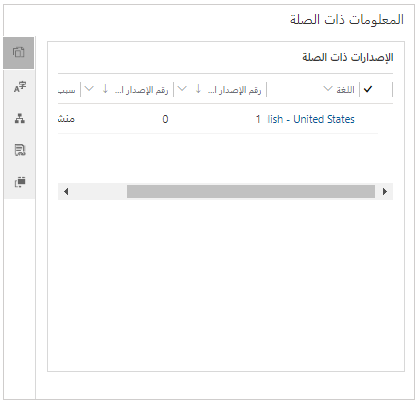

بما أنك تعمل على إنشاء مستودع المعرفة، قد تجد أن المقالات قيد التطوير، أو حتى المقالات التي نُشرت بالفعل، تتطلب تحديثات لتعكس ميزات جديدة أو طريقة جديدة لتشغيل إجراء. ونظراً لإجراء هذه التحديثات، تُخزّن الإصدارات السابقة من المقال.

يساعد إصدار مقال Microsoft Dynamics 365المؤسسات على إدارة التحديثات في مقالات المعرفة دون تعطيل المقالات المباشرة أو المنشورة. بتخزين إصدارات مقال معرفة، يُمكنك تحديث المقالات بأحدث المعلومات ولكن يُمكنك أيضاً تتبع التغييرات طوال دورة حياة المنتجات والخدمات.

يُمكن إنشاء نوعين من الإصدارات للمقالات المعرفية:

- **الإصدار الرئيسي:** يُمثل نوع الإصدار هذا تغييرا كبيرا في الميزات أو الوظائف.

    مثال، ميزة جديدة أُضيفت إلى تطبيق برنامج تُحدث تغييراً وظيفياً كاملاً في التطبيق.

- **الإصدار الثانوي:** يُمثل نوع الإصدار هذا تغييراً ثانوياً لا يؤثر بالضرورة في الوظائف.

    مثال، تغيير شاشة في واجهة مستخدم التطبيق، ولكن النتيجة الإجمالية للشاشة لا تتأثر.

يُمكنك إضافة إصدارات رئيسية وثانية باستخدام شريط الأوامر في صفحة تعريف العنوان والكلمات الأساسية والمعلومات التفصيلية لهذا المقال. عند إنشاء إصدار لأول مرة، يكون له نفس المحتوى والمعلومات والأذونات مثل الإصدار الحالي. يُمكنك بعد ذلك تحديث المعلومات ومراجعتها في الإصدار الجديد. يحتوي المقال على حقول **رقم الإصدار الرئيسي** و **رقم الإصدار الثانوي** التي يتم تحديثها تلقائياً لتعكس رقم الإصدار الجديد.

> [!div class="mx-imgBorder"]
> 

> [!IMPORTANT]
> يعمل النظام على تعبئة حقول مثل **رقم الإصدار الرئيسي**، و **رقم الإصدار الثانوي**، و **اللغة**، و **الرقم العام للمقال** تلقائياً. لا يُمكنك تغيير القيم في هذه الحقول.

لمعرفة المزيد عن إنشاء إصدارات المقالات، راجع [إنشاء إصدارات المقالات وإدارتها](/dynamics365/customer-engagement/customer-service/customer-service-hub-user-guide-knowledge-article#create-and-manage-article-versions).

## ترجمة المقالات إلى لغات متعددة

إضافة إلى سهولة الوصول إلى المقالات التي تنشئها، يجب أن يجد جميع العملاء سهولة في استخدام هذه المقالات، بغض النظر عن البلد أو المنطقة التي يعيشون فيها. يتيح لك Dynamics 365 إنشاء مقالات مترجمة، حيثُ يمكنك توفير نفس محتوى المساعدة الذاتية بلغات متعددة، ولكن دون الحاجة إلى إدارة نسخ متعددة من المقال ذاته. مثال، قد تحتوي مقال معرفية تشرح كيفية استبدال خرطوشة طابعة على إصدارات إسبانية وفرنسية وهندية. ويُمكن بعد ذلك إرسال هذه الإصدارات المترجمة عبر البريد الإلكتروني إلى العملاء الذين يتحدثون هذه اللغات.

عند ترجمة مقال إلى لغة أخرى، يُنشئ Dynamics 365 إصدار رئيسي جديد بتلك اللغة.

مثال، لإنشاء إصدار فرنسي من المقال المعرفي، حدد زر **ترجمة من** في شريط الأوامر، ثم حدد **الفرنسية** في قائمة اللغات المتوفرة.

> [!IMPORTANT]
> عند إنشاء إصدار من مقال بلغة مختلفة، لا يُترجم المقال فعلياً إلى تلك اللغة. يجب توفير النص المترجم والمُنسَق للمقال. ويُمكن لمترجمي اللغات التابعين لجهات خارجية المساعدة، ويُمكن لأدوات مثل Power Automate توفير بعض الأتمتة للعملية.

> [!div class="mx-imgBorder"]
> 

لمزيد من المعلومات عن ترجمات المقالات، راجع [ترجمة مقال معرفية بعدة لغات](/dynamics365/customer-engagement/customer-service/customer-service-hub-user-guide-knowledge-article#translate-a-knowledge-article-in-multiple-languages).

## فئات المقال

عن طريق ربط مقال بفئة أو أكثر، يُمكنك تسهيل البحث عن المقال واستخدامه في مناطق مختلفة من التطبيق. يُمكن للمستخدمين الاستفادة من فئات المقالات عند البحث عن مقال مباشرة من حالة ما. كما يُمكن استخدام فئات المقالات لتنظيم المقالات عندما يصل إليها المستخدمون من خلال مدخل العميل.

لإنشاء فئات المقالات، انتقل إلى **تطبيق مركز مسؤولي Customer Service**، ثم في القسم **المعرفة**، حدد **الفئات**. كما يُمكنك تحديد التسلسلات الهرمية للفئات، مثل الأجهزة \> الطابعات \> الأسطوانات والبكرات. وبهذه الطريقة، يُمكنك إنشاء تسلسل هرمي لمقال لفئات معينة.

لإضافة فئة إلى مقال، حدد **إقران فئة** في شريط الأوامر. يُمكن إقران مقال واحدة بفئات متعددة.

> [!div class="mx-imgBorder"]
> 

## إدارة إصدارات المقالات وترجماتها وفئاتها

تتكون إدارة المقال من نشر وأرشفة إصدارات مختلفة من كل مقال لتوفير أدق المعلومات للعملاء والموظفين الداخليين. رُغم أن مقال واحدة قد تحتوي على إصدارات متعددة لتعكس أشياء مثل الترجمات أو التعديلات الرئيسية أو الثانوية، إلا أنه مسموح فقط بنشر إصدار واحد من المقال في كل مرة. ومن المهم تتبع التغييرات التي تُجرى على كل إصدار، ونشر الإصدارات فقط في الوقت المناسب.

يُمكنك إدارة إصدارات المقالات في جزء **المعلومات المرتبطة** في علامة التبويب **ملخص** المقال المعرفي.

على يمين جزء **المعلومات المرتبطة**، سترى عدة أزرار تتيح لك العمل مع السجلات ذات الصلة. السجلات التالية ذات الصلة متعلقة بالإصدارات والترجمات والفئات:

- **إصدارات مرتبطة:** يسرد هذا السجل جميع الإصدارات الرئيسية والثانوية للمقال الحالية. من هنا، يُمكن أن ترى التالي:

    - تحرير إصدار أو تحديثه.
    - إنشاء إصدار جديد رئيسي أو ثانوي.
    - حذف إصدار.

    > [!IMPORTANT]
    > إذا حذفت إصدار مقال، فإن الإجراء دائم ولا يُمكن الرجوع عنه.

- **الترجمات المرتبطة:** يعرض هذا السجل قائمة بالترجمات المختلفة المتوفرة للمقال. من هنا، يُمكن أن ترى التالي:

    - تحرير ترجمة أو تحديثها.
    - إنشاء ترجمة جديدة رئيسية أو ثانوية.
    - حذف ترجمة أو إصدار ترجمة.

- **الفئات المرتبطة:** يذكر هذا السجل جميع الفئات المرتبطة بالمقال الحالي. من هنا، يُمكن أن ترى التالي:

    - إضافة فئات المقال.
    - تحرير فئات المقال الموجودة.
    - إزالة فئة مقال.

والآن بعد أن تعلمت كيفية إدارة إصدارات المقالات والترجمات والفئات وصيانتها بفعالية، أصبحت مستعداً للانتقال إلى معلومات عن نشر المقالات. سوف تتعرف على كيفية مشاركة إصدارات المقالات والترجمات والفئات في عملية النشر.

> [!VIDEO https://www.microsoft.com/videoplayer/embed/RE2IOG9]
