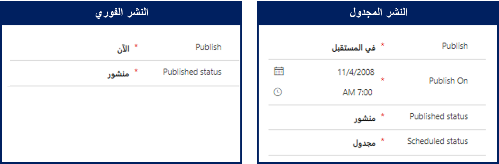
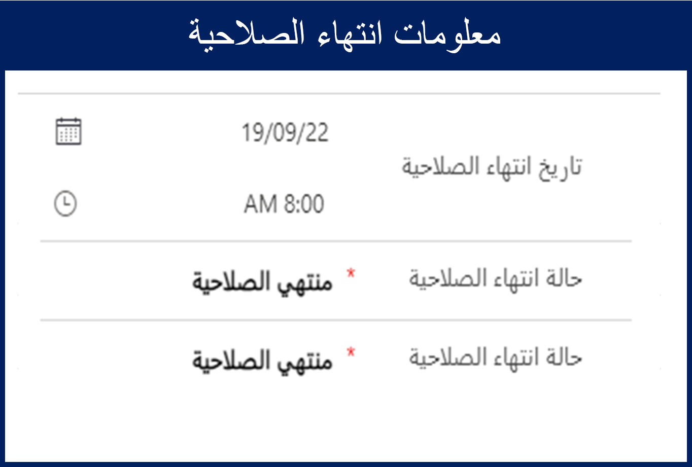
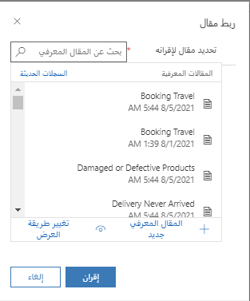

بعد مراجعة مقالة معرفية والموافقة عليها، تصبح جاهزة للنشر. بعد نشر مقالة، يمكن للمستخدمين الداخليين والخارجيين استخدامها عند حل الحالات، أو يمكنهم الوصول إليها من أحد المداخل.

يوفر Microsoft Dynamics 365 خيارين لنشر المقالات:

- **على الفور:** يمكنك نشر المقالة على الفور. يمكنك استخدام هذا الخيار، على سبيل المثال، إذا كان محتوى المقالة مرتبطاً بمشكلات تسجيل الدخول التي يُبلّغ عنها العديد من العملاء في الوقت الحالي.
- **النشر المجدول:** يمكنك تأجيل النشر حتى وقت محدد. يمكنك استخدام هذا الخيار، على سبيل المثال، إذا كانت سياسة إرجاع البضائع لدى المؤسسة ستتغير في الأول من الشهر. يمكن كتابة مقالة مسبقاً ونشرها عند تطبيق الإجراءات الجديدة.

قبل نشر المقالة، نوصيك بإلقاء نظرة أخيرة عليه. ضع في اعتبارك ما إذا كان هناك أي شيء آخر قد يساعد المستخدمين والعملاء في العثور عليه بسهولة أو استخدامه بشكل أكثر فاعلية. على سبيل المثال، إليك بعض الأسئلة التي قد تفكر فيها:

- هل المقالة مرتبطة بطريقة ما بمقالات أخرى؟
- هل يجب ربط المقالة بمنتجات أو خدمات أخرى؟
- هل يجب أن يكون كل من المستخدمين الداخليين والخارجيين قادرين على قراءة المقالة؟

استناداً إلى إجاباتك عن هذه الأسئلة، يمكنك استخدام الأزرار التالية في شريط الأوامر الخاص بالمقالة:

- **‏‫المقال ذو الصلة‬:** قُم بإقران المقالة الحالية بواحد أو أكثر من المقالات المماثلة المخزنة في Dynamics 365. يمكن عرض المقالات ذات الصلة من سجل **المقالات ذات الصلة** في جزء **المعلومات ذات الصلة** في علامة التبويب **الملخص**.
- **المنتج ذو الصلة:** قُم بإقران المقالة الحالية بمنتج واحد أو أكثر من منتجات Dynamics 365 المماثلة المخزّنة في كتالوج المنتجات. يمكن عرض المنتجات ذات الصلة من سجل **المنتجات ذات الصلة** في جزء **المعلومات ذات الصلة** في علامة التبويب **الملخص**.
- **وضع علامة "داخلي":** ضع علامة على المقالة على أنها مخصصة للاستخدام الداخلي فقط. لن يتمكن العملاء الخارجيون من استخدام المقالة من أحد المداخل. 
    - لنشر مقالة معرفية، حدد **نشر** من شريط الأوامر. في مربع الحوار الذي يظهر، يمكنك:

- **تحديد وقت نشر المقالة:** في حقل **نشر**، حدد ما إذا كنت تريد نشر المقالة على الفور أو في المستقبل. 
    - إذا حددت نشر المقالة "في المستقبل"، فحدد تاريخ النشر ووقته في حقل **نشر في**.

   

- **تعريف حالة المقالة المنشورة:** في حقل **الحالة المنشورة**، حدد الحالة التي يجب تعيين المقالة عليها بعد نشرها.
    - بشكل افتراضي، يتم اختيار "منشور".

- **تحديد ما إذا كانت المقالة تنتهي صلاحيتها أم لا**: في حقل **تاريخ انتهاء الصلاحية**، حدد التاريخ والوقت اللذين يجب أن تنتهي فيهما صلاحية المقالة المنشورة.

    - لم تعد المقالات منتهية الصلاحية متوفرة في عمليات البحث.
    - إذا قمت بتعيين مقالة بحيث تنتهي صلاحيتها، في حقل **الحالة المنشورة**، حدد الحالة التي يجب تعيين المقالة عليها بعد انتهاء صلاحيتها.

   

- **تحديد ما إذا كان ينبغي نشر ترجمات المقالة:** لنشر جميع ترجمات المقالة المعتمدة مع المقالة، في الحقل **نشر الترجمات المعتمدة ذات الصلة بالمقالة**، حدد نعم.
    - يجب الموافقة على ترجمة كل مقالة قبل نشرها. لن يتم نشر ترجمات المقالة التي لم تتم الموافقة عليها.

بعد نشر المقالة، ستظل منشورة حتى الوصول إلى تاريخ انتهاء الصلاحية (إذا تم تحديد تاريخ انتهاء صلاحية)، أو حتى يتم إلغاء نشر المقالة يدوياً.

> [!VIDEO https://www.microsoft.com/videoplayer/embed/RE2IOG4]

لمزيد من المعلومات حول جدولة مقالة ونشرها، راجع [جدولة مقالة أو نشرها](/dynamics365/customer-engagement/customer-service/customer-service-hub-user-guide-knowledge-article#schedule-or-publish-an-article).

**تحديث المقالات المعرفية المنشورة** عندما تكون مقالة معرفية في الحالة "منشورة" أو "مجدولة"، فيمكن تحديثها مباشرةً بواسطة المستخدمين الذين لديهم امتياز النشر المرتبط بسجل المستخدم الخاص بهم.  إذا كانت المقالة التي يتم تحديثها تحتوي على معلومات تُكمل مقالة معرفية موجودة، فيمكن إقران المقالة الموجودة بالمقالة المعرفية الحالية.

 

لمزيد من المعلومات حول تحديث المقالات المنشورة، راجع [تحديث المقالات المعرفية المنشورة](/dynamics365/customer-engagement/customer-service/customer-service-hub-user-guide-knowledge-article#update-published-knowledge-articles).

