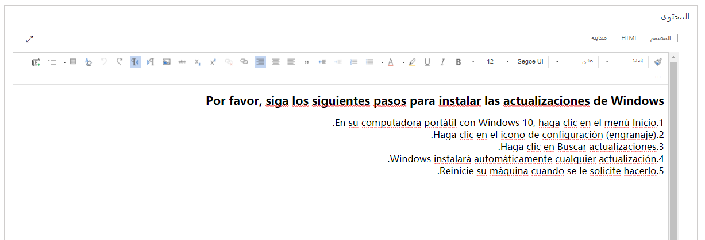

يعمل هذا التمرين بشكل أفضل عندما يكون لديك بيانات نموذجية لاستخدامها. يمكّنك Dynamics 365 من إضافة بيانات نموذجية حسب الحاجة. إذا لم يتم تثبيت البيانات النموذجية في البيئة التي تعمل فيها، فاتبع هذه الخطوات لتثبيت بعضها.

1. إذا لزم الأمر، من شريط التنقل بالتطبيق الرئيسي، حدد سهم القائمة المنسدلة بجوار **Dynamics 365**، ثم حدد **Dynamics 365** - مخصص.
2. من شريط التنقل، حدد سهم القائمة المنسدلة بجوار **الإعدادات**، ثم حدد **إدارة البيانات**.
3. حدد **البيانات النموذجية**.
4. حدد **تثبيت البيانات النموذجية**.
5. ثم أغلق صفحة **البيانات النموذجية**.

## الأهداف التعليمية

في نهاية هذا التمرين، ستتمكن من أداء المهام التالية:

- إنشاء مقالات معرفية.
- إنشاء ترجمات المقالات.
- نشر المقالات.

الوقت المقدر لإنهاء هذا التمرين العملي: 15 إلى 20 دقيقة

## السيناريو

أنت خبير قاعدة المعارف في شركتك. لقد طُلب منك إنشاء مقالة قاعدة معارف جديدة ترشد المستخدمين إلى طريقة تثبيت التحديثات على أجهزة الكمبيوتر المحمولة التي تعمل بنظام Microsoft Windows.

## ‏‫الخطوات عالية المستوى

1. إنشاء مقالات معرفية جديدة.
2. تقديم المقالة للمراجعة.
3. الموافقة على المقالة.
4. إنشاء ترجمة للمقالة.
5. نشر المقالة.

## الخطوات التفصيلية

### إنشاء مقالة معرفية جديدة وترجمة للمقالة

1. إذا لزم الأمر، من شريط التنقل بالتطبيق الرئيسي، حدد سهم القائمة المنسدلة بجوار **Dynamics 365**، ثم حدد **Dynamics 365** - مخصص.
2. في مخطط الموقع، ضمن **الخدمة**، حدد **المقالات المعرفية**.
3. من شريط الأوامر، حدد **جديد**.
4. في قسم **محتوى المقالة**، أدخل المعلومات التالية:

    - **العنوان**: تثبيت تحديثات Windows
    - **الكلمات الأساسية**: Windows، تحديثات، كمبيوتر محمول، كمبيوتر شخصي
    - **الوصف**: إرشادات حول كيفية تثبيت تحديثات Windows على الكمبيوتر المحمول.

5. حدد النص التالي وانسخه:

    **يُرجى اتباع الخطوات التالية لتثبيت تحديثات Windows**
    - على الكمبيوتر المحمول الذي يعمل بنظام Windows 10، انقر فوق قائمة "ابدأ".
    - انقر فوق أيقونة الإعدادات (رمز الترس).
    - انقر فوق التحقق من وجود تحديثات.
    - سيقوم Windows تلقائياً بتثبيت أي تحديثات.
    - أعد تشغيل جهازك عندما يُطلب منك ذلك.

6. في قسم **المحتوى**، حدد زر **لصق كنص عادي**.
7. الصق النص الذي نسخته في مربع النص، ثم حدد **موافق**.

   

8. قُم بتنسيق النص بحيث يبدو مثل الصورة التالية.

   

9. حدد **حفظ**.
10. في تدفق **العملية الجديدة** في الجزء العلوي من النافذة، حدد مرحلة **المؤلف**.
11. في حقل **موضوع المقالة**، حدد **استعلام** \> **معلومات**.
12. قُم بتعيين حقل **وضع علامة للمراجعة** على مكتمل.
13. حدد **المرحلة التالية**.
14. في مرحلة **المراجعة**، حدد **موافقة**.
15. حدد **موافقة** لإنهاء الموافقة.
16. أغلق مربع الحوار.
17. من شريط الأوامر، حدد **ترجمة**.
18. حدد **الإسبانية-الولايات المتحدة** كلغة.
19. حدد **إنشاء**.
20. إذا طُلب منك فتح ترجمة المقالة، فحدد **نعم**.
21. حدد النص التالي وانسخه:

    **Por favor, siga los siguientes pasos para instalar las actualizaciones de Windows**

    -En su computadora portátil con Windows 10, haga clic en el menú Inicio.
    - Haga clic en el icono de configuración (engranaje).
    - Haga clic en Buscar actualizaciones.
    - Windows instalará automáticamente cualquier actualización.
    - Reinicie su máquina cuando se le solicite hacerlo.

22. في قسم **المحتوى**، حدد زر **لصق كنص عادي**.
23. الصق النص الذي نسخته في مربع النص، ثم حدد **موافق**.
24. قُم بتنسيق النص بحيث يبدو مثل الصورة التالية.

   

25. حدد **حفظ**.
26. من شريط الأوامر، حدد **موافقة**.
27. في مربع الحوار **تأكيد الموافقة على المقالة**، حدد **موافق**.

### نشر المقالة

1. في مخطط الموقع، ضمن **الخدمة**، حدد **المقالات المعرفية**.
2. ابحث عن النسخة الإنجليزية من مقالة "تثبيت تحديثات Windows" وافتحها.
3. من شريط الأوامر، حدد **نشر**.
4. حدد إعدادات النشر كما هو موضح هنا:

    - **نشر:** الآن
    - **الحالة المنشورة:** منشور
    - **تاريخ انتهاء الصلاحية:** شهر واحد من التاريخ الحالي
    - **حالة انتهاء الصلاحية:** منتهي الصلاحية
    - **حالة انتهاء الصلاحية:** منتهي الصلاحية
    - **نشر الترجمات ذات الصلة التي تمت الموافقة عليها مع المقالة:** نعم

5. حدد **نشر**.

### اختبار المقالة

1. في مركز خدمة العملاء، في مخطط الموقع، حدد رمز مفتاح الربط للانتقال إلى **الحالات**.
2. من شريط الأوامر، حدد **حالة جديدة**.
3. أدخل المعلومات التالية الخاصة بالحالة الجديدة:
    - **عنوان الحالة:** مشكلة في تثبيت التحديثات
    - **الموضوع:** معلومات
    - **العميل:** Adventure Works
    - **الأصل**: الهاتف
4. حدد **حفظ**.
5. في الجزء **مرتبط**، حدد زر **Knowledge Base Search**.

لاحظ أن مقالة "تثبيت تحديثات Windows" تم إدراجها.

