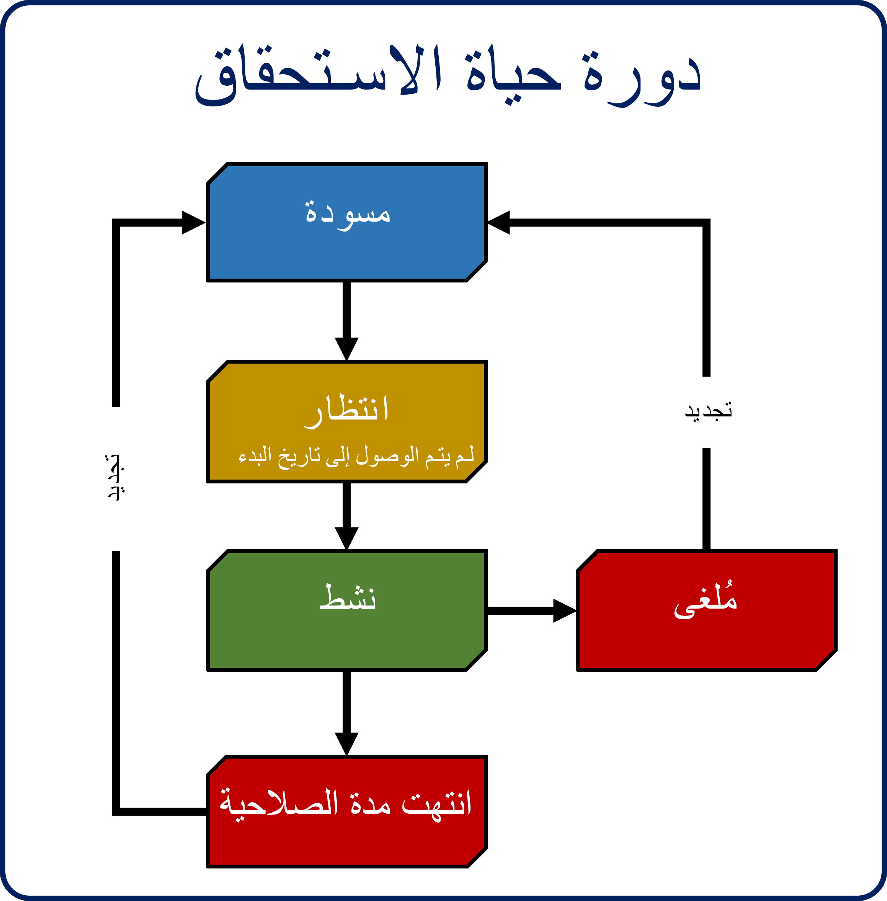

تقوم المؤسسات القائمة على الخدمات في العادة بتوفير عقود خدمات تؤهل عملائها للحصول على مبلغ مخصص من الدعم على مدى فترة محددة. قد يكون مقدار الدعم عدداً محدداً من الحالات أو فترة زمنية محددة.

يمكن أن يساعد Microsoft Dynamics 365المؤسسات على إدارة هذه الحصص وتعقبها وإنفاذها من خلال توفير آليتين لإدارة مستوى الخدمة الذي يحق للعميل الاستفادة منه:

- **SLAs:** تعمل ‎SLAs على تعقب ما يجب أن يحدث عند فتح حالة وتحديده، مثل وقت الاستجابة الأولي من جانب مهندس دعم أو الوقت الذي يستغرقه لحل الحالة.
- **الاستحقاقات:** الاستحقاقات هي اتفاقيات تحدد مستوى ونوع الدعم الذي يحق للعميل الاستفادة منه.

> [!NOTE]
> اتفاقيات SLA ليست محور التركيز الأساسي لهذه الوحدة. ولن تتم مناقشتها إلا فيما يتعلق بالاستحقاقات. لمعرفة المزيد عن اتفاقيات SLA، راجع وحدة "اتفاقيات مستوى الخدمة (SLA) لـ Microsoft Dynamics 365" في Microsoft Learn.

تحدد الاستحقاقات تفاصيل الدعم المحددة التي تم التعهد بها للعميل. تتضمن هذه التفاصيل تواريخ التغطية (الفترة) وعدد الحالات أو طول المُدة المخصصة.

على سبيل المثال، في أثناء الفترة التي يكون فيها الاستحقاق نشطاً، يحق للعميل إجراء 35 مكالمة هاتفية مع فريق مكتب المساعدة. ويحق لعميل آخر الاستفادة من إجمالي 100 ساعة من الدعم الفني عبر قنوات اتصال متعددة.

يمكن أن تساعد استحقاقات Dynamics 365 على دعم كلا المثالين السابقين. يمكن استخدامها لإدارة وتنفيذ السيناريوهات المختلفة، بما في ذلك:

- إدارة عقود الضمان.
- العقود المتعلقة بالخدمة.
- عقود الدعم المستند إلى الحوادث.
- عقود الدعم المستندة إلى الوقت.

يستند نظام إدارة استحقاقات Dynamics 365 إلى هذه العناصر:

- **الاستحقاقات:** الاستحقاق هو اتفاق فعلي يحدد تفاصيل الدعم المحددة التي يتم تقديمها إلى العميل. الاستحقاق النموذجي يحدد فترة التغطية المحددة وأنواع/فترات إضفاء الطابع الشخصي والقنوات المدعومة والمنتجات التي تتم تغطيتها.
- **قنوات الاستحقاق:** يمكنك تحديد قناة واحدة أو أكثر من تلك التي تحدد التغطية التي يتم توفيرها لمنتج أو صنف معين.
- **قوالب الاستحقاق:** يمكنك استخدام قوالب الاستحقاق لإنشاء خيارات الاستحقاق وتحديدها بسرعة، استناداً إلى أنواع مختلفة من الاستحقاقات التي يتم تقديمها إلى العملاء.

## دورة حياة الاستحقاق

يتبع كل سجل استحقاقات دورة حياة محددة. تعرض الصورة الآتية دورة حياة الاستحقاق.

- **مسودة:** عند إنشاء استحقاق للمرة الأولى، يكون في حالة **مسودة**. عندما يكون الاستحقاق عبارة عن مسودة، يمكنك تحرير جميع تفاصيل السجل، بما في ذلك عدد الحالات والقنوات والمنتجات وتواريخ التغطية. لا يمكنك إرفاق الحالات باستحقاق موجود في حالة **مسودة**.
- **انتظار:** تم تنشيط الاستحقاقات الموجودة في حالة **انتظار** وقيد انتظار الوصول إلى تاريخ بدء الاستحقاق. نظراً إلى أن الاستحقاق تم تنشيطه، لا يمكنك تحرير أي تفاصيل في السجل. نظراً إلى عدم الوصول إلى تاريخ البدء، لا يمكنك إرفاق الحالات بالاستحقاق.
- **نشط:** يعد الاستحقاق نشطاً عند تنشيطه ويتم تحديد التاريخ الحالي ضمن تواريخ التغطية المحددة. وعندما يكون الاستحقاق نشطاً، يمكن إرفاق حالات جديدة به، ولكن لا يمكن تحرير تفاصيل سجل الاستحقاق. لتحرير التفاصيل، يجب أولاً إلغاء تنشيط الاستحقاق.
- **‏‫منتهي الصلاحية** تنتهي صلاحية الاستحقاق بعد الوصول إلى تاريخ الانتهاء. بعد انتهاء صلاحية الاستحقاق، لا يمكنك إرفاق أي حالة به.
- **تم الإلغاء:** يمكن إلغاء استحقاق في أي وقت حال كونه نشطاً.
- ‏‏‎**تجديدات‬:** يمكن تجديد الاستحقاقات ولكن عندما تكون منتهية الصلاحية أو ملغاة فقط.

على مدار هذه الدورة التدريبية، سوف تدرس جوانب أخرى من الاستحقاقات بمزيد من التفصيل. على سبيل المثال، ستتعرف على كيفية إنشاء الاستحقاقات وتحديد الفترات والقنوات واستخدام الاستحقاقات مع الحالات. ستتعرف كذلك على تلميحات ونصائح بشأن استخدام الاستحقاقات.
