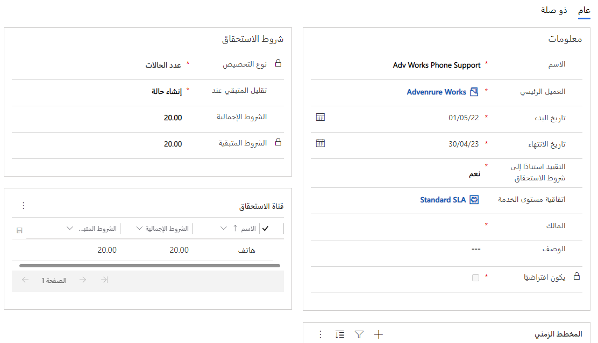

قبل أن تنشئ المؤسسة استحقاقات لعملائها، يجب أن تفهم متى يمكن تطبيق استحقاق محدد. إضافة إلى ذلك، تحتاج إلى مراعاة الظروف المحددة التي تقرر المطلوب من الاستحقاق. وهذه المعلومات يمكن أن تساعد المؤسسة على تحديد شكل عرض الاستحقاق القياسي الذي تقدمه والحالات التي يحتمل أن يكون الاستحقاق القياسي غير مناسب لها. رغم اختلاف كل مؤسسة عن الأخرى واختلاف احتياجات الاستحقاق، سيوجد على الأرجح مسائل قياسية يمكن أن تساعد على توجيهك إلى الاتجاه الصحيح.

فيما يأتي بعض الأسئلة التي قد تجول في خاطرك:

- هل ينبغي أن تستند الاستحقاقات إلى الوقت أو عدد الحالات؟
    - ماذا يحدث إذا تجاوز العملاء الوقت المخصص أو عدد الحالات؟
    - متى يجب خصم الأصناف من الحصة المتاحة؟ (مثلاً، هل يجب خصم الأصناف عند إنشاء الحالات أو عند حلها؟)
- هل نحتاج إلى استحقاقات مرتبطة بمنتجات محددة، مثل عقود الضمان؟
    - هل توجد مجموعة قياسية من المنتجات التي ستستخدم عقود الضمان؟
    - هل توجد قنوات محددة ينبغي استخدامها؟
- ما القنوات التي يمكن فتح الحالات منها؟
    - هل نحن بحاجة إلى الحد من القنوات المتوفرة؟
    - هل القنوات محدودة بالنسبة إلى أعمال الضمان؟
- ماذا يحدث إذا كان لدى العميل أكثر من استحقاق واحد؟
    - كيف سيحدد المندوب الاستحقاق الذي سيتم إرفاق الحالة إليه؟
    - هل يجب أن يكون أحد الاستحقاقات هو الاستحقاق الافتراضي للعميل؟
    - هل سنحد من الأشخاص الذين يمكنهم فتح حالات مقابل استحقاقات محددة؟
- هل تنطبق أي SLAs؟

يمكن أن تساعد هذه الأسئلة على تحديد الاستحقاقات المطلوبة من وجهة نظر العميل الفردي، وما المواقف التي يمكن أن تخدمها قوالب الاستحقاقات على نحو أفضل.

## إنشاء الاستحقاقات

لإنشاء SLAs، انتقل إلى **الإعدادات**\>**إدارة الخدمة**، ثم في قسم **شروط الخدمة**، حدد **استحقاقات**.

عند إنشاء استحقاق، يجب تقديم المعلومات الآتية:

- **الاسم**: أدخل اسم سجل الاستحقاق. سيظهر هذا الاسم في حقول البحث عند البحث عن استحقاق.
- **العميل الأساسي:** يحدد العميل المرتبط بالاستحقاق.
- **تاريخ البدء:** يمكن إرفاق حالات التاريخ إلى الاستحقاق بعد ضبطه على "نشط".
- **تاريخ الانتهاء:** التاريخ الذي ستنتهي بحلوله صلاحية الاستحقاق.
- **تقييد استناداً إلى مُدد الاستحقاق:** يحدد ما إذا كان يمكن تجاوز مُدد الاستحقاق. إذا قمت بتعيين هذا الخيار إلى *نعم*، يتم فرض مُدد الاستحقاق.
- **نوع التخصيص:** يحدد نوع الاستحقاق. يتوفر خياران: *عدد الحالات* و *عدد الساعات*.
- **المُدد الإجمالية:** يحدد إجمالي عدد الحالات أو الساعات المخصصة، استناداً إلى نوع التخصيص. لاحظ أنه رغم أن هذا الحقل غير مطلوب، إلا أنه من الأفضل إدخال قيمة فيه.
- **‏‫تقليل المتبقية عند:** يحدد متى يجب خصم الحالة من المُدد المتبقية. يتوفر خياران: *حل الحالة* و *عمليات إنشاء حالات*.

### الحقلان "نوع التخصيص" و"تقليل المتبقية عند"

يوثر حقلي **نوع التخصيص** و **تقليل المتبقية عند** عندما يتم خصم الحالات من استحقاق. من المهم أن نفهم كيف أن الحقل **تقليل المتبقية عند** يخصم أصنافاً من المُدد المتبقية في استحقاق، لأن هذا يمكن أن يكون له تأثير كبير في عدد الحالات المتبقية المتاحة حالياً.

عند تعيين حقل **نوع التخصيص** لاستحقاق إلى "عدد الحالات"، يمكنك تعيين حقل **تقليل المتبقية عند** إما إلى "إنشاء حالة" أو "حل الحالة". إذا قمت بتحديد "إنشاء حالة"، فإن أي حالة جديدة يتم إنشاؤها ستقلل المُدد المتبقية بمقدار 1. إذا قمت بتحديد حل الحالة، فلن يتم تقليل المُدد المتبقية حتى يتم حل الحالة.

على سبيل المثال، إذا كان استحقاق العميل يتضمن خمس حالات متوفرة، قد لا يكون تعيين حقل **تقليل المتبقية عند** إلى "حل الحالة" هو الخيار الأفضل، لأن العميل قد يكون لديه ثمانِ حالات نشطة قيد العمل حالياً. ومع حل هذه الحالات وخصمها من المُدد المتبقية، قد تجد أنه لم يتبق أي منها عند محاولة حل الحالات 6 و7 و8. يحدث هذا السيناريو عند تفعيل خيار **تقييد استناداً إلى مُدد الاستحقاق**. إذا قمت بتعيين هذا الخيار إلى "نعم"، فلا يمكنك حل الحالات 6 و7 و8، لأنها ستؤدي إلى تجاوز مُدد الاستحقاق. يمكن أن يكون ذلك مشكلة كبيرة، لأنه من المحتمل أن المندوبين قد عملوا لساعات على حل هذه الأصناف، والآن لا يمكن إقفالها.

إذا قمت بتعيين حقل **تقليل المتبقي في** إلى "إنشاء حالة" وتعيين خيار **تقييد استناداً إلى مُدد الاستحقاق** إلى "نعم"، فسيتم تقليل المُدد المتبقية كما يتم إنشاء الحالات. ثم لن تتمكن من إضافة الحالات 6 و7 و8 على الإطلاق. لذلك، لن يضيع المندوبون أي وقت في هذه الحالات.

عند تعيين حقل **نوع التخصيص** الخاص باستحقاق إلى "عدد الحالات"، يمكنك تعيين حقل **تقليل المتبقية عند** إلى *حل الحالة* فقط.

على سبيل المثال، إذا كان استحقاق العميل متاحاً لمدة 10 ساعات، فإن "حل الحالة" هو الخيار الأفضل، لأن إجمالي الوقت الذي يتم استخدامه في الحالة يتم احتسابه استناداً إلى جميع "الأنشطة المُقفلة" المرتبطة بالحالة. ويخصم الوقت الإجمالي لهذه الأنشطة، ثم يخصم من المُدد المتبقية.

> [!NOTE]
> عند إقفال حالة، يتم تضمين الأنشطة التي تم تمييزها على أنها "منتهية" فقط. لا يتم تضمين الأنشطة المفتوحة. لذلك، من المهم أن يقوم المندوبون بإقفال جميع الأنشطة ذات الصلة.

فيما يأتي بعض النقاط الأخرى التي تجب مراعاتها بشأن كيفية تأثير خيارات "إنشاء حالة" و"حل الحالة" في المُدد المتبقية:

- **إنشاء حالة:**
    - إذا قمت بإنشاء حالة جديدة مرتبطة باستحقاق، فسيتم تقليل المُدد المتبقية.
    - وإذا قمت بربط حالة موجودة باستحقاق، فسيتم تقليل المُدد المتبقية.
    - إذا قمت بإلغاء حالة مرتبطة باستحقاق، فستتم زيادة المُدد المتبقية.
    - إذا تم تحديث حالة بحيث تكون مرتبطة باستحقاق مختلف، فسوف تتم زيادة المُدد المتبقية على الاستحقاق الأول.

- **حل الحالة:**
    - إذا قمت بحل حالة جديدة مرتبطة باستحقاق، فسيتم تقليل المُدد المتبقية.
    - وإذا قمت بإعادة تنشيط حالة مرتبطة باستحقاق، فستتم زيادة المُدد المتبقية.

- **تغيير من "حل الحالة" إلى "إنشاء حالة":** عند إنشاء استحقاق جديد للمرة الأولى، يتم تعيين حقل **تقليل المتبقية عند** إلى "حل الحالة". يقوم الأشخاص أحياناً بتنشيط استحقاق ولكنهم يدركون لاحقاً أنه كان يجب تعيين حقل **تقليل المتبقية عند** إلى "إنشاء حالة". إذا قمت بإعادة تنشيط استحقاق وتغيير القيمة إلى "إنشاء حالة"، فلن تؤدي الحالات المفتوحة المرفقة حالياً إلى تقليل المُدد المتبقية. بدلاً من ذلك، تجب إزالة الاستحقاق من الحالة ثم إضافته مرة أخرى.

> [!VIDEO https://www.microsoft.com/videoplayer/embed/RE2IJmq]

للاطلاع على المزيد حول إنشاء الاستحقاقات، راجع [إنشاء استحقاق](https://docs.microsoft.com/dynamics365/customer-engagement/customer-service/create-entitlement-define-support-terms-customer#create-an-entitlement).
