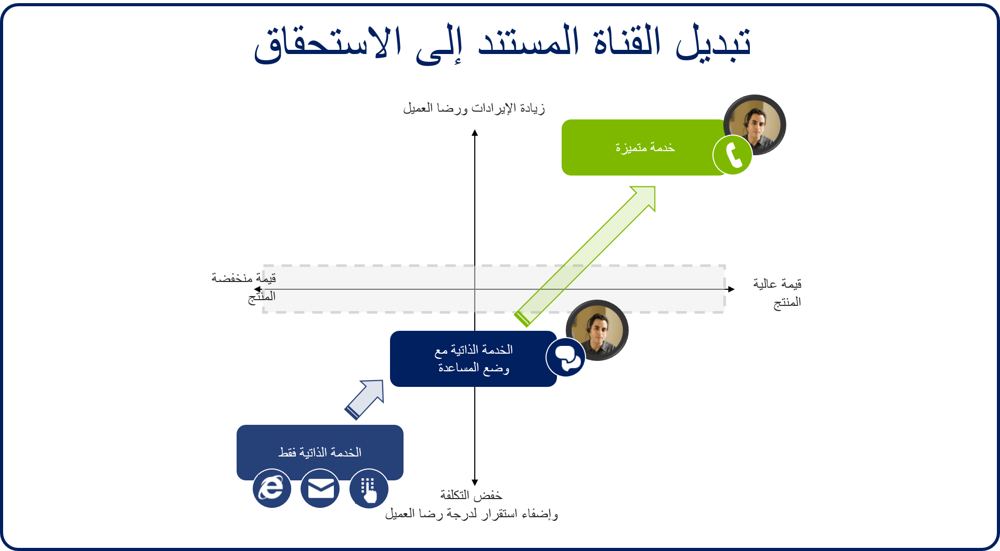
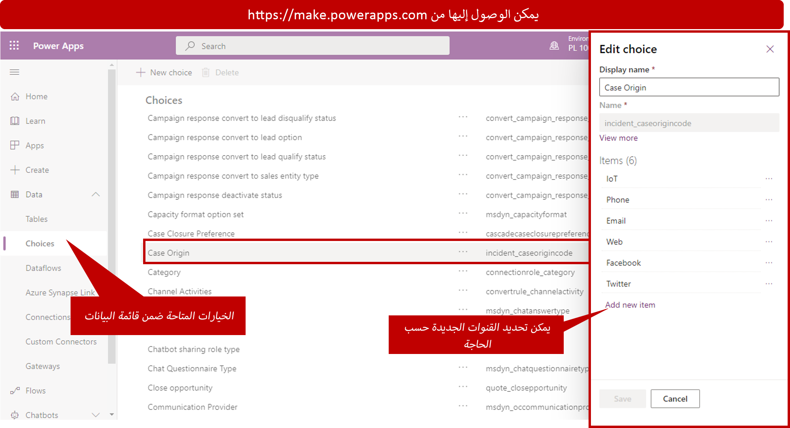
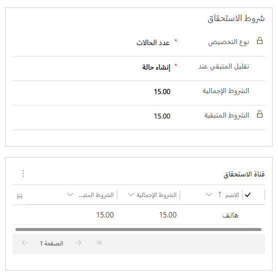
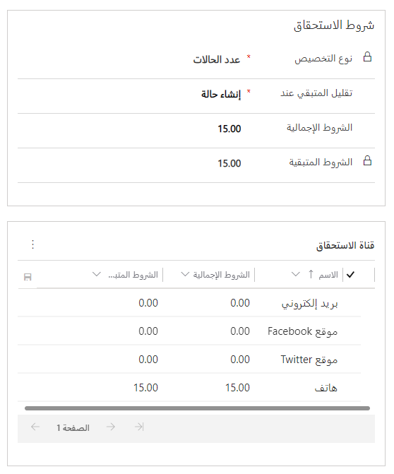

في هذه الأيام، تقدم مؤسسات الدعم لعملائها مزيداً من الطرق لبدء الاتصال وطلب الدعم. عندما تستفيد المؤسسات من قنوات متعددة لدعم إستراتيجيات المبيعات أو التسويق أو الخدمة الخاصة بها، يشار إلى الحلول التي تقدمها على أنها حلول متعددة القنوات أو قنوات متعددة الاتجاهات. على الرغم من أن أنواع الحلول هذه غالباً ما يتم ذكرها معاً، إلا أنها حلول مختلفة.

- **قنوات متعددة:** يقدم الحل متعدد القنوات تجربتين أو أكثر من تجارب القنوات للعملاء. لا تتم مشاركة البيانات بالضرورة عبر القنوات، والتجربة ليست متسقة.
    - على سبيل المثال، يبدأ العميل في طلب الدعم عبر الدردشة ولكن يتم نقله بعد ذلك إلى مندوب. يجب على العميل بعد ذلك تقديم جميع معلوماته مرة أخرى.

- **القناة متعددة الاتجاهات:** يوفر حل القناة متعددة الاتجاهات تجربتين أو أكثر من تجارب القنوات للعملاء، وتكون تجربة العميل متسقة عبر القنوات. يتم استخدام سياق الحالة والعميل لتبسيط التجربة عبر التطبيقات.
    - على سبيل المثال، يبدأ العميل في مدخل الخدمة الذاتية على الإنترنت ولكن بعد ذلك يبدأ محادثة دردشة. تتوفر كافة الصفحات التي قام العميل بفتحها للمندوب.

من خلال توفير حلول متعددة القنوات أو حلول القنوات متعددة الاتجاهات لعميلك، فإنك تساعد على ضمان أن كل عميل يمكنه التفاعل مع مؤسستك باستخدام الخيار الأفضل له. عند توفير حلول متعددة القنوات أو حلول القنوات متعددة الاتجاهات، يجب عليك أيضاً مراعاة التأثير في المؤسسة. على الرغم من أهمية التأكد من أن العملاء يتمتعون بتجربة متسقة عند العمل مع القنوات المختلفة، إلا أنه من المهم أيضاً تذكر أن كل قناة مختلفة بالفعل.

على سبيل المثال، يمكن للمندوب الذي تلقى مكالمة هاتفية من عميل أن يعمل فقط في هذه الحالة في تلك اللحظة. ولكن يمكن للمندوبين الذين يقومون بدعم العملاء الذين يستخدمون قنوات الدردشة التعامل مع حالات متعددة في نفس الوقت. ولذلك، تساعد هذه القنوات على تحسين الكفاءة وخفض التكاليف.

من خلال تصميم حلول القنوات متعددة الاتجاهات، يمكنك التحكم في القنوات التي يستخدمها العملاء وتوجيه أنواع محددة من الطلبات إلى قنوات مختلفة. عندما يتفاعل العملاء مع قناة معينة، يتم تقديم خيارات تصعيد لهم تبدأ في نقلهم عبر قنوات مختلفة.

في هذا المثال، يبدأ العميل بخيار الخدمة الذاتية مثل مدخل على الإنترنت. ثم يتم تصعيده إلى دردشة مع مندوب أو ربوت. وأخيراً، يتم توجيه العميل إلى المندوب المباشر على الهاتف.

## العمل مع قنوات الاستحقاق

Microsoft Dynamics 365 يتيح لك تحديد القنوات التي يمكن للعميل استخدامها لتقديم الحالات مقابل استحقاق. لماذا يعد هذا مهماً؟ على الرغم من أن المزيد من العملاء يتبنون قنوات دعم مختلفة، مثل الدردشة والبريد الإلكتروني ووسائل التواصل الاجتماعي، إلا أن العديد من العملاء لا يزالون يرغبون في الحصول على الدعم من خلال الكثير من القنوات الشخصية، مثل مكالمة هاتفية. ولكن العملاء الذين يفضلون المكالمات الهاتفية من المرجح أن يشغلوا المزيد من وقت المندوب. لذلك، فإن المندوبين الذين يقدمون الدعم عبر الهاتف يقومون بخدمة عدد أقل من العملاء.

يمكنك تحديد القنوات المتوفرة لاستحقاقات محددة. لذلك، يمكنك تقييد عدد الحالات التي يمكن للعميل فتحها عبر الهاتف. يمكنك أيضاً إنشاء عقود دعم للهاتف فقط ذات تكاليف أعلى مرتبطة بها.

عند إنشاء الاستحقاقات، يمكنك تحديد قنوات معينة متوفرة لفتح الحالات مقابل هذا الاستحقاق. يمكنك أيضاً تحديد الحد الأقصى لعدد الحالات التي يمكن فتحها عبر قناة محددة. خارج النطاق، القنوات المتاحة للاستحقاقات هي القنوات نفسها المدرجة في الحقل **الأصل** عند إنشاء حالة جديدة: الهاتف والبريد الإلكتروني والويب وFacebook وTwitter.

يمكنك إضافة مزيد من القنوات عن طريق الانتقال إلى **إعدادات** \> **تخصيصات** \> **تخصيص النظام** \> **مجموعة الخيارات** وإضافتها إلى مجموعة الخيارات العمومية **أصل الحالة**. بعد إضافة قنوات جديدة إلى مجموعة الخيارات، يمكن استخدامها كقنوات استحقاق.

عند إضافة قناة الاستحقاق، فإنك تقوم فقط بتقييد عدد الحالات التي يمكن فتحها من خلال تلك القناة. أنت لا تقيد استخدام قنوات إضافية أو تمنع استخدامها.

إليك مثال على ذلك.

في الصورة السابقة:

- في القسم **شروط الاستحقاق**، يبلغ العدد الإجمالي للحالات التي يمكن فتحها مقابل الاستحقاق 15. في القسم **قناة الاستحقاق**، يعد 15 أيضاً الحد الأقصى لإجمالي عدد شروط قناة الهاتف. لذلك، لا يمكن فتح أكثر من 15 حالة من خلال قناة الهاتف.
- ولكن لاحظ أنه نظراً لأننا لا نحدد أي قنوات أخرى، فإننا لا نقوم بتقييد عدد الحالات التي يمكن فتحها من خلال قنوات أخرى.
- من الممكن فتح، على سبيل المثال، 10 حالات عبر البريد الإلكتروني، واثنتين عبر الويب، وثلاث حالات عبر Facebook، وعدم فتح حالة واحدة عبر قناة الهاتف، شريطة ألا نتجاوز إجمالي شروط الاستحقاق.

إذا أردنا تقييد الاستحقاق بحيث يمكن استخدام المكالمات الهاتفية فقط لإجمالي 15 حالة، فيمكننا إعدادها كما هو موضح هنا.

نظراً لأننا حددنا أن إجمالي الشروط لجميع القنوات الأخرى هو 0 (صفر)، فإن العقد يكون عقد دعم فقط عبر الهاتف. لذلك، يمكن فتح جميع الحالات الـ 15 المتوفرة بموجب هذا العقد من خلال قناة الهاتف.

الاستحقاقات التي تحتوي على هذه الأنواع من المتطلبات ليست شائعة جداً، وهي طريقة رائعة للاستفادة من قوالب الاستحقاقات، والتي سنناقشها في وحدة نمطية أخرى.

> [!VIDEO https://www.microsoft.com//videoplayer/embed/RE2IM17]
