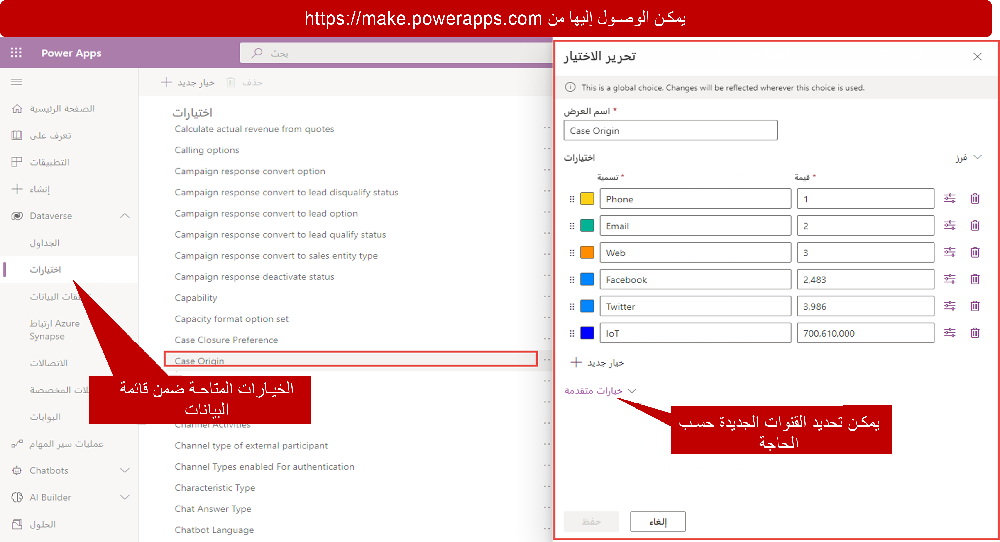

في هذه الأيام، تقدم مؤسسات الدعم لعملائها مزيداً من الطرق لبدء الاتصال وطلب الدعم. Microsoft Dynamics 365 يتيح لك تحديد القنوات التي يمكن للعميل استخدامها لتقديم الحالات مقابل استحقاق. لماذا تعد الميزة مهمة؟ على الرغم من أن المزيد من العملاء يتبنون قنوات دعم مختلفة، مثل الدردشة والبريد الإلكتروني ووسائل التواصل الاجتماعي، إلا أن العديد من العملاء لا يزالون يرغبون في الحصول على الدعم من خلال الكثير من القنوات الشخصية، مثل مكالمة هاتفية. ولكن العملاء الذين يفضلون المكالمات الهاتفية من المرجح أن يشغلوا المزيد من وقت المندوب. لذلك، فإن المندوبين الذين يقدمون الدعم عبر الهاتف يقومون بخدمة عدد أقل من العملاء.

يمكنك تحديد القنوات المتوفرة لاستحقاقات محددة. لذلك، يمكنك تقييد عدد الحالات التي يمكن للعميل فتحها عبر الهاتف. يمكنك أيضاً إنشاء عقود دعم للهاتف فقط ذات تكاليف أعلى مرتبطة بها.

عند إنشاء الاستحقاقات، يمكنك تحديد قنوات معينة متوفرة لفتح الحالات مقابل هذا الاستحقاق. يمكنك أيضاً تحديد الحد الأقصى لعدد الحالات التي يمكن فتحها عبر قناة محددة. خارج النطاق، القنوات المتاحة للاستحقاقات هي القنوات نفسها المدرجة في الحقل **الأصل** عند إنشاء حالة جديدة: الهاتف والبريد الإلكتروني والويب وFacebook وTwitter.

يتم تخزين القنوات في عمود اختيار يسمى **أصل الحالة**. يمكن إضافة المزيد من القنوات إلى هذا الحقل حسب الحاجة. يمكنك الوصول إلى الحقل من [Power Apps](https://make.powerapps.com/). يتوفر حقل **أصل الحالة** عن طريق الانتقال إلى **Dataverse الخيارات > أصل الحالة**. 

> [!div class="mx-imgBorder"]
> 

بعد إضافة القنوات الجديدة إلى عمود الاختيار، يمكن استخدامها كقنوات استحقاق. عند إضافة قناة الاستحقاق، فإنك تقوم فقط بتقييد عدد الحالات التي يمكن فتحها من خلال تلك القناة. أنت لا تقيد استخدام قنوات إضافية أو تمنع استخدامها.

وفيما يلي مثال على ذلك.

> [!div class="mx-imgBorder"]
> 

في الصورة السابقة:

-   في القسم **شروط الاستحقاق**، يبلغ العدد الإجمالي للحالات التي يمكن فتحها مقابل الاستحقاق 15. في القسم **قناة الاستحقاق**، يعد 15 أيضاً الحد الأقصى لإجمالي عدد شروط قناة الهاتف. لذلك، لا يمكن فتح أكثر من 15 حالة من خلال قناة الهاتف.

-  نظراً لأنك لا تحدد أي قنوات أخرى، فإنك لا تحدد عدد الحالات التي يمكن فتحها من خلال القنوات الأخرى.

-   من الممكن فتح، على سبيل المثال، 10 حالات باستخدام البريد الإلكتروني، وحالتين باستخدام الويب، وثلاث حالات باستخدام Facebook، وعدم فتح حالة واحدة عبر قناة الهاتف، بشرط ألا تتجاوز إجمالي شروط الاستحقاق.

إذا أردت تقييد الاستحقاق بحيث يمكن استخدام المكالمات الهاتفية فقط لإجمالي 15 حالة، فيمكنك إعدادها كما هو موضح هنا.

> [!div class="mx-imgBorder"]
> 

نظراً لأنك حددت أن إجمالي الشروط لجميع القنوات الأخرى هو 0 (صفر)، فإن العقد يكون عقد دعم فقط عبر الهاتف. لذلك، يمكن فتح جميع الحالات الـ 15 المتوفرة بموجب هذا العقد من خلال قناة الهاتف.

الاستحقاقات التي لها هذه الأنواع من المتطلبات غير شائعة جداً. إنها تعد طريقة رائعة للاستفادة من قوالب الاستحقاق، التي ستناقشها في وحدة أخرى.

> [!VIDEO https://www.microsoft.com/videoplayer/embed/RE2IM17]
