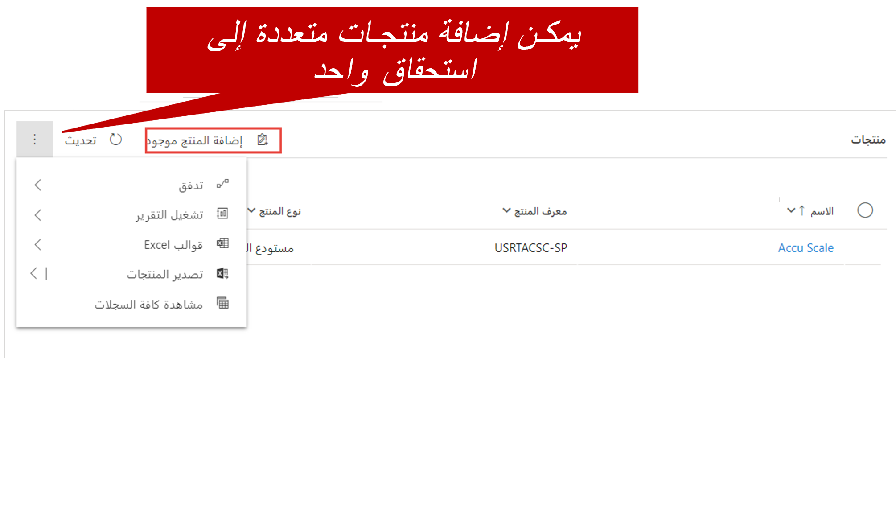
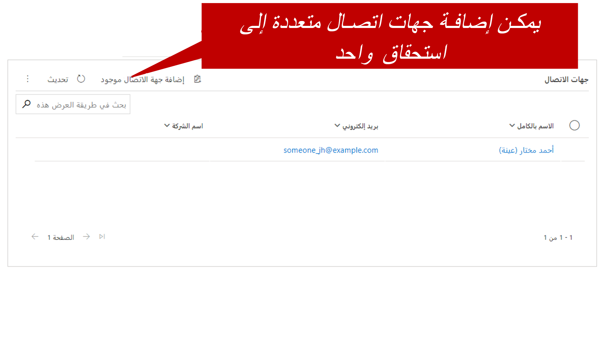

والآن بعد أن نظرت إلى بعض أساسيات الاستحقاقات، مثل الإنشاء الأولي وتعريف الشرط، دعنا ننظر في بعض الاعتبارات الأخرى التي غالباً ما تظهر عند عمل المؤسسات مع الاستحقاقات.

## الاستحقاقات الخاصة بالمنتج

نظراً لأنه يمكن إضافة المنتجات إلى الاستحقاق، فإنه غالباً ما يتم استخدام الاستحقاقات لأشياء مثل عقود الضمان. لنفترض أن العميل يقوم بشراء جهاز تلفزيون، ووفقاً لعقد الضمان، يحصل على عدد غير محدود من مكالمات الدعم لمدة عام واحد. في هذه الحالة، يمكنك فقط إضافة التلفزيون إلى قسم **المنتجات** من الاستحقاق وتحديد الشروط الإجمالية كشيء مثل 9,999 (لا يمكنك تحديد شروط غير محدودة في الواقع). عندما يتضمن الاستحقاق بعض المنتجات، إذا تم تحديد منتج في حالة جديدة، يكون الاستحقاق متاحاً للاختيار في تلك الحالة.

> [!div class="mx-imgBorder"]
> 

## تقييد جهات الاتصال

يرغب العملاء أيضاً في بعض الأحيان في تحديد الموظفين الذين يمكنهم استدعاء حالات وفتحها ضد عقد الدعم. قد يقوم العميل بشراء عقد دعم لسبب محدد، مثل الأنظمة أو الأحداث الهامة، وقد يفضل عدم استخدام العقد في مشكلات أصغر، مثل مشكلات كلمة المرور أو تسجيل الدخول. لذلك، يمكن إضافة جهة اتصال واحدة أو أكثر إلى الاستحقاق. عندما يتضمن الاستحقاق جهات الاتصال، إذا تم تحديد جهة اتصال في حالة جديدة، يكون الاستحقاق متاحاً للاختيار في تلك الحالة.

> [!div class="mx-imgBorder"]
> 

بعد إضافة منتج أو جهة اتصال إلى إحدى الحالات، تتوفر فقط الاستحقاقات الصالحة لهذا المنتج أو جهة الاتصال للاختيار.

إذا لم تتم إضافة أي منتج أو جهة اتصال إلى الحالة:

- جميع الاستحقاقات الصالحة للعميل متاحة للاختيار.
- يحدث خطأ إذا تم تحديد منتج أو جهة اتصال غير صالحة لاحقاً.

على الرغم من أن القدرة على تحديد منتجات وجهات اتصال معينة للاستحقاقات توفر قدراً كبيراً من المرونة، إلا أن هناك بعض الأشياء التي يجب مراعاتها. والأهم من ذلك، على الرغم من أنه يمكن إضافة منتجات وجهات اتصال متعددة إلى استحقاق واحد، إلا أنه لا يمكنك قصر منتجات محددة على أشخاص معينين.

على سبيل المثال، يتم تحديد المنتجات وجهات الاتصال التالية لاستحقاق ما:

- المنتجات:

    - طابعة ثلاثية الأبعاد
    - شاشة بدقة 4K

- جهات الاتصال:

    - مارسي هندرسون
    - جاكسون سميث

في هذا الاستحقاق، لا يمكنك تقييد مارسي بالمكالمات المتعلقة بالطابعة ثلاثية الأبعاد وجاكسون بإجراء مكالمات حول شاشة بدقة 4K. نظراً لأنه تم تحديد جهات الاتصال والمنتجات، يمكن لجهات الاتصال فتح الحالات لكلا المنتجين باستخدام الاستحقاق.

لتقييد كل جهة اتصال بمنتج معين، يجب عليك إنشاء سجلي استحقاق منفصلين: الأول لمارسي والطابعة ثلاثية الأبعاد، والآخر لجاكسون وشاشة بدقة 4K.

## اعتبارات أخرى للاستحقاقات

### التقييد استناداً إلى شروط الاستحقاق

من خلال تعيين خيار **التقييد استناداً إلى شروط الاستحقاق** إلى "نعم"، يمكنك منع فتح الحالات إذا كانت ستتسبب في تجاوز إجمالي الشروط المتبقية للاستحقاق. وبشكل افتراضي، يتم تعيين هذا الخيار على "لا". لذلك، من الممكن تجاوز عدد الحالات أو الساعات المتوفرة للاستحقاق.

### SLAs

إذا تم تحديد اتفاقية مستوى الخدمة (SLA) لاستحقاق، فإن أي حالات جديدة يتم فتحها مقابل الاستحقاق ستستخدم اتفاقية مستوى الخدمة (SLA) هذه. إذا كانت حالة جديدة مقترنة باستحقاق لا يحتوي على اتفاقية مستوى الخدمة (SLA)، فسيتم استخدام SLA الافتراضية للمؤسسة. إذا لم يكن هناك اتفاقية مستوى الخدمة (SLA) الافتراضية، فلن يتم استخدام SLA. يشرح الجدول التالي السيناريوهات بمزيد من التفصيل.

<table>
<thead>
<tr>
<th>السيناريو</th>
<th>‏‫‏‏اتفاقية مستوى الخدمة (SLA) القابلة للتطبيق</th>
</tr>
</thead>
<tbody>
<tr>
<td>يتم إنشاء حالة، ولكن لا يوجد استحقاق مقترن بها.</td>
<td>
<ul>
<li>إذا كان لدى المؤسسة اتفاقية SLA افتراضية، فسيتم تطبيقها على الحالة.</li>
<li>إذا كان لدى المؤسسة اتفاقية SLA افتراضية، فلن يتم تطبيق SLA على الحالة.</li>
</ul>
</td>
</tr>
<tr>
<td>يتم إنشاء حالة، ولكن يوجد استحقاق مقترن لها.</td>
<td>
<ul>
<li>إذا كان الاستحقاق يحتوي على اتفاقية SLA مقترنة نشطة، فسيتم تطبيق اتفاقية SLA المقترنة على الحالة.</li>
<li>إذا كان الاستحقاق لا يحتوي على اتفاقية SLA مقترنة نشطة، ولكن لدى المؤسسة اتفاقية SLA افتراضية، فسيتم تطبيق اتفاقية SLA على الحالة.</li>
<li>إذا لم يكن الاستحقاق يحتوي على اتفاقية SLA مقترنة نشطة، والمؤسسة ليس بها اتفاقية SLA افتراضية، فلن يتم تطبيق اتفاقية SLA على الحالة.</li>
</ul>
</td>
</tr>
</tbody>
</table>

### العملاء الذين لديهم استحقاقات متعددة

إذا اقترنت سجلات استحقاق متعددة بعميل، فقد يكون من الصعب أحياناً تحديد الاستحقاق الذي يجب استخدامه عند فتح حالة جديدة. في هذه الحالة، قد يكون من المفيد استخدام أشياء مثل المنتجات وجهات الاتصال وشروط القناة. ستتم بعد ذلك تصفية قائمة الاستحقاقات المتاحة، بناءً على الخيارات التي تم تحديدها.

وثمة نهج آخر هو تحديد استحقاق افتراضي للعميل. عندما يتم تحديد استحقاق افتراضي لعميل، فسيتم استخدامه إذا لم يتم تحديد استحقاق في حالة جديدة. يمكنك تحديد استحقاق باعتباره الاستحقاق الافتراضي بعد تنشيطه.

> [!IMPORTANT]
> إذا قمت بإلغاء تنشيط الاستحقاق الافتراضي لإجراء تغييرات، فلن يكون الاستحقاق الافتراضي تلقائياً عند إعادة تنشيطه. يجب إعادة تحديده على أنه الاستحقاق الافتراضي بعد إعادة تنشيطه.

## روابط إضافية

- [تنشيط الاستحقاق أو إلغاء تنشيطه](/dynamics365/customer-engagement/customer-service/create-entitlement-define-support-terms-customer#activate-or-deactivate-an-entitlement)
- [تعيين الاستحقاق كاستحقاق افتراضي](/dynamics365/customer-engagement/customer-service/create-entitlement-define-support-terms-customer#set-an-entitlement-as-default-entitlement)
- [ربط الاستحقاقات بالحالات](/dynamics365/customer-engagement/customer-service/create-entitlement-define-support-terms-customer#associate-entitlements-to-cases)
- [إلغاء الاستحقاق](/dynamics365/customer-engagement/customer-service/create-entitlement-define-support-terms-customer#cancel-an-entitlement)
- [تجديد الاستحقاق](/dynamics365/customer-engagement/customer-service/create-entitlement-define-support-terms-customer#renew-an-entitlement)

> [!VIDEO https://www.microsoft.com/videoplayer/embed/RE2IOG6]
