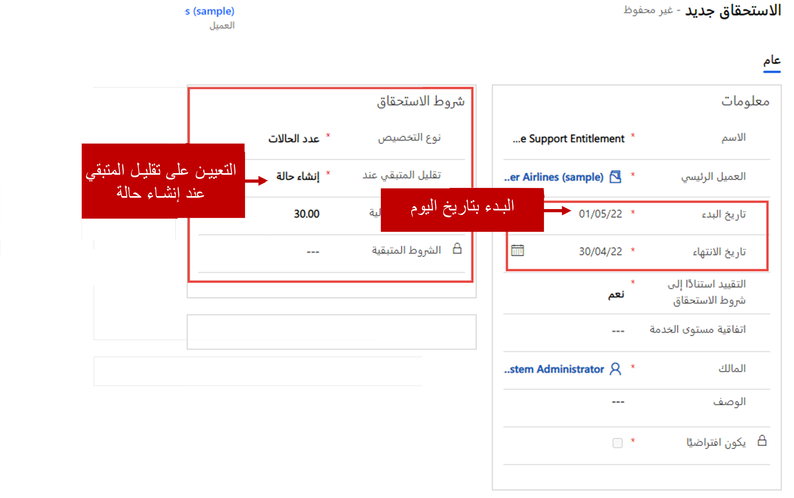
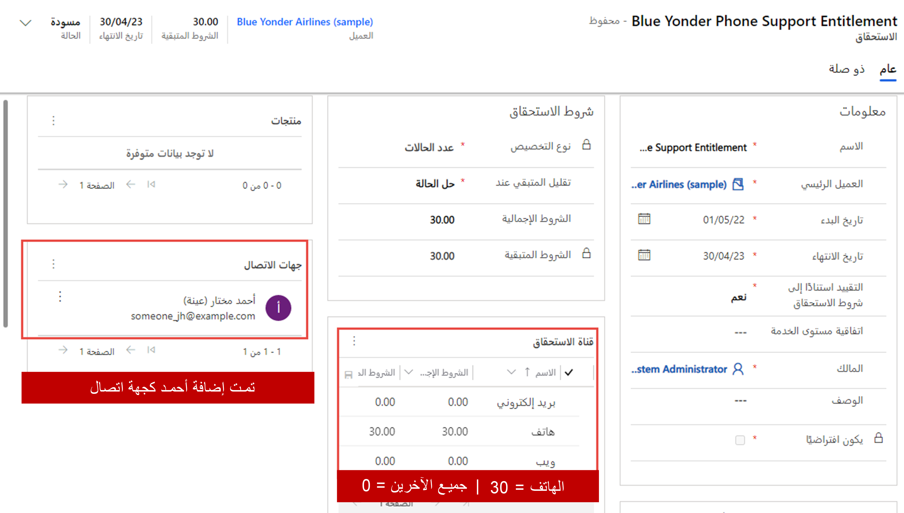
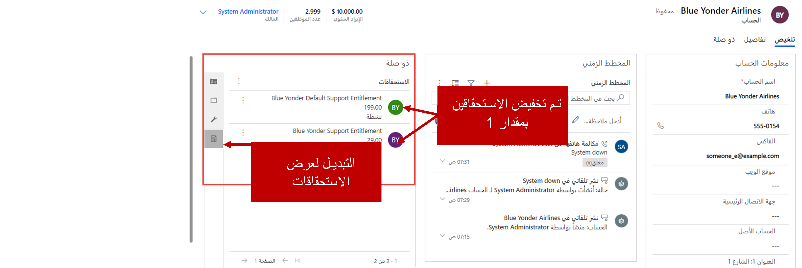

قبل أن تبدأ، لتحقيق أقصى تأثير لهذا التمرين والتمارين الأخرى المضمنة في مسار التعلم هذا، يوصى بأن يكون لديك بعض البيانات النموذجية للعمل بها. إذا كان المثيل الذي تعمل معه لا يحتوي على أي بيانات نموذجية، يمكنك استخدام الخطوات التالية لإضافة بيانات عينة المخزون إلى نظامك.

1.  في نافذة مستعرض جديدة، افتح مركز مسؤولي Power Platform. (https://admin.powerplatform.microsoft.com).

2.  باستخدام التنقل علي اليمين، حدد البيئة التي تريد تثبيت عينة البيانات عليها.  

3.  في "شريط الأوامر" في الجزء العلوي، حدد الزر **إعدادات**.

4.  حدد موقع عنوان **إدارة البيانات** وقم بتوسيعه.

5.  انقر فوق **عينات البيانات**.

6.  إذا لم تكن عينات البيانات مثبّتة، تحتاج إلى النقر فوق الزر **‏‫تثبيت عينات البيانات‬**. (قد يستغرق ظهور البيانات دقائق قليلة، ولكن يمكنك مواصلة استخدام التطبيق أثناء تثبيته).

7.  انقر فوق **إغلاق**.

## الأهداف التعليمية

في نهاية هذه التمارين، ستتمكن من أداء المهام التالية:
- إنشاء سجلات الاستحقاق في Dynamics 365.
- تحديد قنوات الاستحقاق.
- تقييد منتجات الاستحقاق وجهات الاتصال.
- تحديد الاستحقاقات الافتراضية.
    
أنت مدير خدمة عملاء في مركز دعم يُسمى Contoso. اتصلت بك Olivia Wilson، إحدى جهات الاتصال في Blue Yonder Airlines، بشأن خطة دعم الشركة. تنفذ شركة Blue Yonder نظام تذاكر جديد وتتوقع العديد من المشكلات. لذلك، تريد الشركة فتح دعم عبر الهاتف–فقط خطة لا يمكن أن تستخدمها إلا Olivia. يجب أن تستمر هذه الخطة لمدة عام واحد ويجب أن تسمح لـ Olivia بفتح 30 حالة عبر الهاتف.

تُدرك Blue Yonder أنه قد تنشأ مشكلات أخرى. ولكنها تريد فتح جميع الحالات التي لم تفتحها Olivia عبر الويب أو البريد الإلكتروني أو Facebook أو Twitter، وليس عبر الهاتف. لذلك، تريد الشركة خطة دعم أخرى سيستخدمها الجميع إلى جانب Olivia. يجب أن تقتصر خطة الدعم هذه على قنوات الويب والبريد الإلكتروني وFacebook وTwitter. ترى الشركة أن 200 حالة ستكون كافية لهذه الخطة.

### ‏‫الخطوات عالية المستوى

1. أنشئ استحقاق للدعم عبر الهاتف فقط له الخصائص التالية:
    - يقتصر على قناة الهاتف.
    - يقتصر على Olivia Wilson.

2. أنشئ استحقاقاً افتراضياً لـ Blue Yonder له الخصائص التالية:
-   إنشاء سجلات الاستحقاق في Dynamics 365
-   تحديد قنوات الاستحقاق
-   تقييد منتجات الاستحقاق وجهات الاتصال
-   تحديد الاستحقاقات الافتراضية
    -   لا يمكن فتح الحالات عبر الهاتف.
    -   تم تعيينه على أنه الاستحقاق الافتراضي للشركة.

3. تنشيط كلا الاستحقاقين.

### الخطوات التفصيلية

أنت مدير خدمة عملاء في مركز دعم يُسمى Contoso. اتصلت بك Olivia Wilson، إحدى جهات الاتصال في Blue Yonder Airlines، بشأن خطة الدعم الخاصة بها. حيثُ تقوم بتنفيذ نظام تذاكر جديد وتتوقع أن تنشأ العديد من المشاكل. وترغب في فتح خطة دعم عبر الهاتف فقط والتي ستستمر لمدة عام واحد وتتيح فقط لـ Olivia إمكانية فتح 30 حالة عبر الهاتف.

#### إنشاء استحقاق للدعم عبر الهاتف فقط

1. استخدام منطقة التنقل إلى اليمين، قم بالتبديل إلى منطقة **إدارة الخدمة**.

1. حدد **الاستحقاقات**.

1. من شريط الأوامر، حدد **جديد**.

1. أدخل المعلومات التالية الخاصة بالاستحقاق الجديد:

   - **الاسم**: استحقاق دعم عبر الهاتف لـ Blue Yonder
   - **العميل الأساسي**: Blue Yonder Airlines (عينة)
   - **تاريخ البدء**: التاريخ الحالي
   - **تاريخ الانتهاء**: سنة واحدة من التاريخ الحالي
   - **تقييد على أساس شروط الاستحقاق**: نعم
   - **نوع التخصيص**: عدد الحالات
   - **تقليل المتبقي عند**: إنشاء حالة
   - **إجمالي الشروط**: 30

1. حدد **حفظ** لحفظ الاستحقاق وتركه مفتوحاً.

#### إضافة شروط القناة

1. في الشبكة الفرعية **لقناة الاستحقاق**، حدد **علامة الجمع (+)**.
2. في حقل **الاسم**، حدد **الهاتف**، واضبط حقل **إجمالي الشروط** على **15**.
3. كرر الخطوتين 1 و2 لإضافة شروط القناة الإضافية التالية:
-  الاسم = **Twitter** و **إجمالي الشروط** = **0**
-  الاسم = **البريد الإلكتروني** و **إجمالي الشروط** = **0**
-  الاسم = **Facebook** و **إجمالي الشروط** = **0**
-  الاسم = **الويب** و **إجمالي الشروط** = **0**
    -  إنشاء استحقاق للدعم عبر الهاتف فقط
    -  قناة الهاتف فقط
    -  **Olivia Wilson** فقط
-   إنشاء استحقاق افتراضي لـ Blue Yonder
    -  غير مسموح بالهاتف
    -  يجب أن يكون افتراضياً.

#### قصر الاستحقاق على Olivia Wilson

1. في الشبكة الفرعية **جهات الاتصال**، حدد **علامة الجمع (+)**.
2. أضف **Olivia Wilson** كجهة اتصال.

سيكون استحقاقك المكتمل مشابهاً للصورة التالية.

من **شريط التنقل** للتطبيق الرئيسي، انقر فوق محدد القائمة المنسدلة للوحدة النمطية ثم انقر فوق **Dynamics 365 - Customer Service**.

#### تنشيط الاستحقاق

1. من شريط الأوامر، حدد **تنشيط** لتنشيط سجل الاستحقاق.
2. من صفحة **تأكيد تنشيط الاستحقاق**، حدد **تنشيط**.
3. قُم بإغلاق الاستحقاق.

#### إنشاء الاستحقاق الافتراضي لـ Blue Yonder

1. في شبكة **الاستحقاق**، من شريط الأوامر، حدد **جديد**.
2. أدخل المعلومات التالية الخاصة بالاستحقاق الجديد:
   -  **الاسم**: استحقاق الدعم الافتراضي لـ Blue Yonder
   -  **العميل الأساسي**: Blue Yonder Airlines (عينة)
   -  **تاريخ البدء**: التاريخ الحالي
   -  **تاريخ الانتهاء**: سنة واحدة من التاريخ الحالي
   -  **تقييد على أساس شروط الاستحقاق**: نعم
   -  **نوع التخصيص**: عدد الحالات
   -  **تقليل المتبقي عند**: إنشاء حالة
   -  **إجمالي الشروط**: 200

3. حدد **حفظ** لحفظ الاستحقاق وتركه مفتوحاً.

#### إضافة شروط القناة

1. في الشبكة الفرعية لقناة **الاستحقاق**، حدد **علامة الجمع (+)**.
2. في حقل **الاسم**، حدد **الهاتف**، واضبط حقل **إجمالي الشروط** على **0**. 

سيكون استحقاقك المكتمل مشابهاً للصورة التالية.

#### تنشيط الاستحقاق الافتراضي

- **الاسم**: استحقاق دعم عبر الهاتف لـ Blue Yonder
- **العميل الأساسي**: Blue Yonder Airlines (عينة)
- **تاريخ البدء**: تاريخ اليوم
- **تاريخ الانتهاء**: سنة واحدة من اليوم
- **تقييد على أساس شروط الاستحقاق**: نعم
- **نوع التخصيص**: عدد الحالات
- **تقليل المتبقي عند**: إنشاء حالة
- **إجمالي الشروط**: 30

1. من شريط الأوامر، حدد **تنشيط** لتنشيط سجل الاستحقاق.
2. من صفحة **تأكيد تنشيط الاستحقاق**، حدد **تنشيط**.
3. للتأكد من استخدام الاستحقاق بشكل افتراضي، حدد **تعيين** **كافتراضي**.

## تمرين: تطبيق الاستحقاقات على الحالات

لقد اتصلت بك Olivia Wilson بخصوص مشكلة ما، لكن نظام Blue Yonder معطّل. يجب عليك إنشاء حالة جديدة وربط استحقاق الشركة بالحالة.

### ‏‫الخطوات عالية المستوى

1. قُم بإنشاء حالة جديدة.
2. اربط الاستحقاق.
3. أضف مكالمة هاتفية.
4. قُم بحل الحالة لتقليل الشروط المتبقية للاستحقاق.

### الخطوات التفصيلية

1. قُم بتشغيل **مركز خدمة العملاء** في **Dynamics 365**.
2. في مخطط الموقع، حدد رمز **مفتاح الربط** لفتح صفحة **الحالات**.
3. من شريط الأوامر، حدد **حالة جديدة**.
4. أدخل المعلومات التالية الخاصة بالحالة الجديدة:
   - **عنوان الحالة**: توقف النظام
   - **العميل**: Blue Yonder Airlines (عينة)
   - **الأصل**: الهاتف
   - **الاستحقاق**: استحقاق الدعم عبر الهاتف لـ Blue Yonder
5. في العملية **من الهاتف إلى الحالة**، حدد مرحلة **تحديد**.
6. قُم بتعيين حقل **بحث عن جهة اتصال** إلى **Olivia Wilson (عينة)**.
7. حدد **حفظ** لحفظ الحالة.

## أضف نشاط مكالمة هاتفية إلى الحالة
    
- **البريد الإلكتروني** مع إجمالي **الشروط** إلى **0**
- **Facebook** مع إجمالي **الشروط** إلى **0**
- **الويب** مع إجمالي **الشروط** إلى **0**
1. في قسم **المخطط الزمني**، حدد **إضافة معلومات وأنشطة**.
2. من القائمة التي تظهر، حدد **مكالمة هاتفية**.
3. أدخل المعلومات التالية الخاصة بنشاط المكالمة الهاتفية:
   - **الموضوع**: الاتصال بالعميل بخصوص الحل
   - **اتصال من**: سجل المستخدم الخاص بك
   - **اتصال إلى**: Olivia Wilson
   - **الاتجاه**: صادر
   - **المدة**: 15 دقيقة
   - **الوصف**: تم الاتصال بالعميل وتم حل المشكلة عن طريق إعادة تشغيل الخادم.
4. حدد **حفظ**.
5. في قسم **المخطط الزمني**، لنشاط المكالمة الهاتفية الذي أنشأته للتو، حدد **زر علامة الحذف (...)** بجوار **حذف**.
6. من القائمة التي تظهر، حدد **إغلاق النشاط**.
7. في صفحة **إغلاق المكالمة الهاتفية**، أدخل المعلومات التالية:
   -  **الحالة**: مكتمل
   -  **الحالة**: تم التنفيذ
8. حدد **إغلاق**.

### حل الحالة

1. من شريط الأوامر، حدد **حل الحالة**.
2. في حقل **الحل**، أدخل **خادم تمت إعادة تمهيده**، وقُم بضبط حقل **وقت قابل للفوترة** على **30 دقيقة**.
3. حدد **حل**.
4. من شريط الأوامر، انقر فوق زر **تنشيط** لتنشيط سجل **الاستحقاق**.

## إنشاء حالة جديدة من مستخدم آخر

1. من شريط الأوامر، حدد **حالة جديدة**.
2. أدخل المعلومات التالية الخاصة بالحالة الجديدة:
   -  **عنوان الحالة**: مشكلة في كلمة المرور
   -  **العميل**: Blue Yonder Airlines (عينة)
   -  **الأصل**: البريد الإلكتروني

3. حدد **حفظ** لحفظ الحالة. لاحظ أنه تمت إضافة استحقاق الدعم الافتراضي لـ Blue Yonder تلقائياً إلى الحالة.

### حل الحالة

1. من شريط الأوامر، حدد **حل الحالة**.
2. في حقل **الحل**، أدخل **خادم تمت إعادة تمهيده**، وقُم بضبط حقل **وقت قابل للفوترة** على **30 دقيقة**.
3. حدد **حل**.

### عرض الشروط المتبقية للاستحقاق

1. في مخطط الموقع، حدد **حسابات**.
2. حدد **Blue Yonder Airlines**.
3. في القسم **مرتبط**، حدد أيقونة **الاستحقاق**. لاحظ أنه تم تقليل كل من سجل الاستحقاق للدعم عبر الهاتف فقط وسجل الاستحقاق الافتراضي بمقدار 1.

