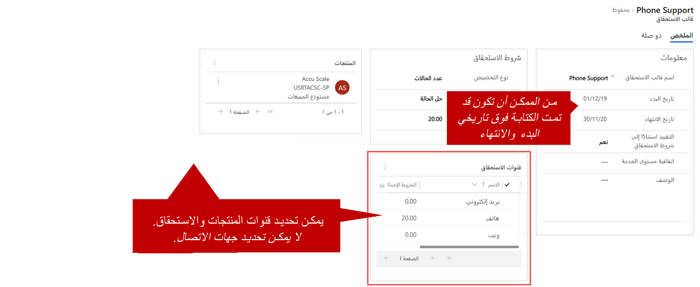

نظراً لأن الاستحقاقات يمكن أن تغطي مجموعة متنوعة من السيناريوهات، فقد تجد أنه من الأسهل إنشاء قوالب الاستحقاق وتحديدها. تساعدك القوالب في إنشاء سجلات استحقاق جديدة بملء بعض البيانات الأكثر شيوعاً مسبقاً.

هناك العديد من السيناريوهات التي يمكن أن تكون قوالب الاستحقاقات مفيدة فيها. إليك بعض الأمثلة:

- تريد إنشاء قالب خدمة قياسي يعمل بمثابة خط أساسي، ويمكن استخدامه لإنشاء استحقاقات للعملاء.
- تريد استخدام الأتمتة. يقدم قالب استحقاق خيارات أكثر من استحقاق محدد.

تقوم قوالب الاستحقاق فقط بملء بعض البيانات مسبقاً عند إنشاء سجلات الاستحقاق لأول مرة. ولا تحافظ على مزامنة البيانات. لذلك، إذا قمت بتغيير قالب، فلن يؤثر التغيير على أي استحقاقات موجودة كانت تستند إلى هذا القالب. أيضاً، لا يتم تنشيط قوالب الاستحقاق أو تعطيلها. بعد إنشاء القالب، يكون متاحاً للمستخدمين لتحديده.

## تحديد قوالب الاستحقاق

لإنشاء قوالب الاستحقاق، انتقل إلى **إعدادات** \> **إدارة الخدمة**، ثم في قسم **القوالب**، حدد **قوالب الاستحقاق**. المعلومات الوحيدة المطلوبة للقالب هي الاسم. يمكنك ملء بقية المعلومات كما تريد.

ومن بين الميزات الأخرى لاستخدام القوالب أنه يمكنك تحديد شروط القناة والمنتجات مسبقاً. ولكن بالنسبة إلى معظم السجلات في Microsoft Dynamics 365، لا يمكنك إضافة شروط القناة أو المنتجات حتى تقوم بحفظ القالب أولاً.

نظراً لأن قوالب الاستحقاق ليست خاصة بالعميل، فلا يمكنك تحديد عميل لقالب. سيتم تحديد العميل فقط عند إنشاء استحقاق من القالب. بالإضافة إلى ذلك، نظراً لأن القوالب ليست خاصة بالعميل، فلا يمكنك تحديد جهات اتصال على قالب. يجب تحديد جهات الاتصال في الاستحقاق الفعلي الذي تم إنشاؤه للعميل.

بعد حفظ القالب، يمكنك استخدامه لإنشاء استحقاقات جديدة. حدد **جديد** من شريط الأوامر، ثم حدد **من القالب**، ثم حدد قالباً من القائمة المتوفرة. ستتم تعبئة جميع المعلومات اللازمة مسبقاً في سجل الاستحقاق الجديد، بناءً على القالب الذي حددته.

> [!VIDEO https://www.microsoft.com/videoplayer/embed/RE2ITLh]
