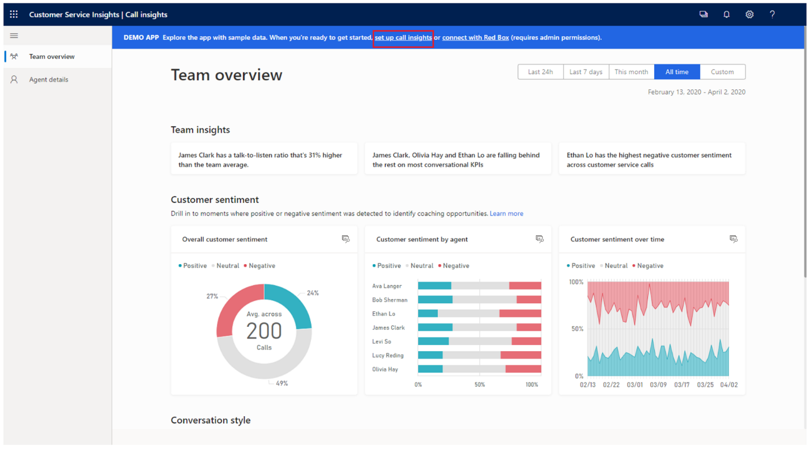

من الناحية التاريخية، كانت إدارة وتتبع الفرق بين المندوبين أثناء تلقيهم للمكالمات أمراً صعباً. بعض المندوبين أكثر فعالية بشكل طبيعي مع العملاء من غيرهم. يمكن أن تؤثر العوامل المختلفة على فعالية المندوب، مثل معدل الكلام ومقدار الوقت الذي يقضيه المندوب في الاستماع مقابل التحدث. في السابق، كانت الطريقة الوحيدة التي يمكن للمؤسسات من خلالها تقييم هذه البيانات هي مطالبة أفراد ضمان الجودة بإجراء مراقبة فورية، حيث يستمعون إلى المكالمات العشوائية التي يتلقاها المندوبون. تكمن مشكلة المراقبة الموضعية في أنك لا تحصل على الصورة كاملة حقاً.

تسجل معظم مراكز الاتصال مكالمات المندوب. باستخدام الذكاء الاصطناعي، يمكن للمؤسسات أن تبدأ في تحليل جميع التسجيلات لجميع المندوبين، والتي يمكن أن توفر تمثيلاً أكثر دقة للموقف بأكمله. الآن، يمكنك تقييم المندوبين الفرديين ومقارنتهم أيضاً بمندوبين آخرين. على سبيل المثال، من خلال تحليل معدلات الكلام، يمكنك تحديد المندوبين الذين يتحدثون بسرعة كبيرة ثم صياغة استراتيجيات تدريب للمساعدة في حل المشكلة. يمكن أن يساعدك هذا النهج أيضاً في تحديد الشعور العام للعميل تجاه المندوبين لتحديد شعور العملاء تجاه تجربتهم مع كل مندوب.

يوفر Microsoft Dynamics 365 Customer Service Insights ميزة معلومات المكالمات، التي تستخدم التحليلات وعلوم البيانات لجمع البيانات من تسجيلات مكالمات كل مندوب. يقوم بتحليل البيانات لتوفير المعلومات والرؤى لمساعدتك في إدارة فرق دعم العملاء وتدريب المندوبين بشكل استباقي. تعرض معلومات المكالمات مؤشرات الأداء الأساسية ذات الصلة (KPIs) ومؤشرات الأداء الأساسية لبيانات المكالمات الذكية حسب الفريق والمندوب والمكالمة. تم تصميم معلومات المكالمات لمساعدة المشرفين والمندوبين في وظائفهم اليومية، وتوفير الأدوات التي يحتاجون إليها لتتبع أداء المكالمات مع العملاء المتوقعين والعملاء.

مع معلومات المكالمات، يمكن للمشرف:

-   عرض مكالمات الوكلاء ومقارنتها والحصول على نظرة ثاقبة حول أفضل الممارسات من خلال معرفة المزيد حول سلوكيات المندوبين الأهم وما يجعلهم ناجحين.

-   عرض أداء الفريق من خلال المعلومات وتوجه العملاء وأسلوب المحادثة.

-   عرض وفهم أسلوب محادثة كل مندوب على حدة، وتوجه العملاء، والمعلومات، وسجل المكالمات.

-   الاستماع إلى المكالمات، وقراءة النسخ المكتوبة، وتحديد عناصر الإجراءات الممكنة، وعرض المعلومات المهمة للأعمال.

مع معلومات المكالمات، يمكن للمسؤول:

-   تكوين وتتبع الكلمات الأساسية التي يريد المشرفون مراقبتها في مكالمات العملاء.

-   تكوين طول الفترة الزمنية للاحتفاظ ببيانات الفريق أو المندوب الفردي من المؤسسة.

-   إدارة البيئات وتكوين بيانات المكالمات.

-   تكوين مستويات التدرج الهرمي التي يمكن للمشرفين عرض بيانات الاتصال لها.

يجب على المسؤولين تكوين معلومات المكالمات قبل توفر المعلومات للمشرفين والمندوبين. يمكنك الوصول إلى معلومات المكالمات من تطبيق Dynamics 365 Customer Service Insights عن طريق تحديد **مساحات العمل الخاصة بي** وتحديدها من القائمة. إذا لم يتم تكوين معلومات المكالمات، سيرى المشرفون والمندوبون الذين يسجلون الدخول إلى التطبيق عينة من البيانات، مما يسمح لك باستكشاف ميزات التطبيق ووظائفه ويساعد على تقليل منحنى التعلم.

> [!div class="mx-imgBorder"]
> 
