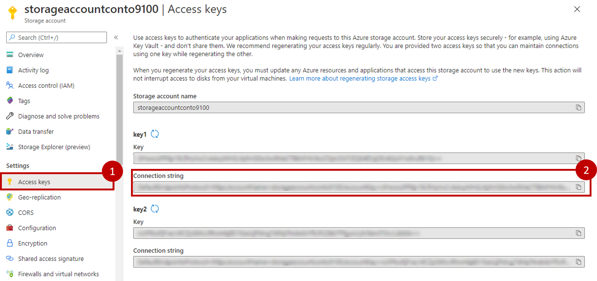
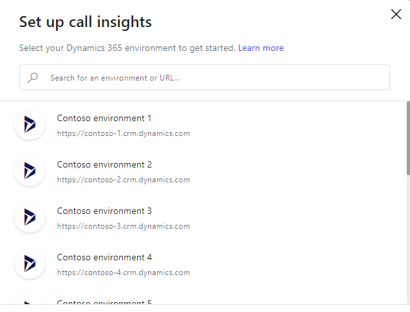
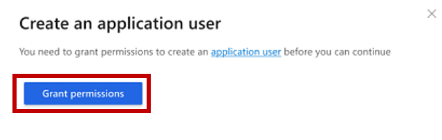
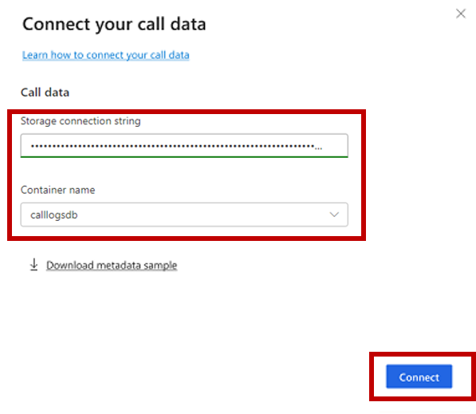
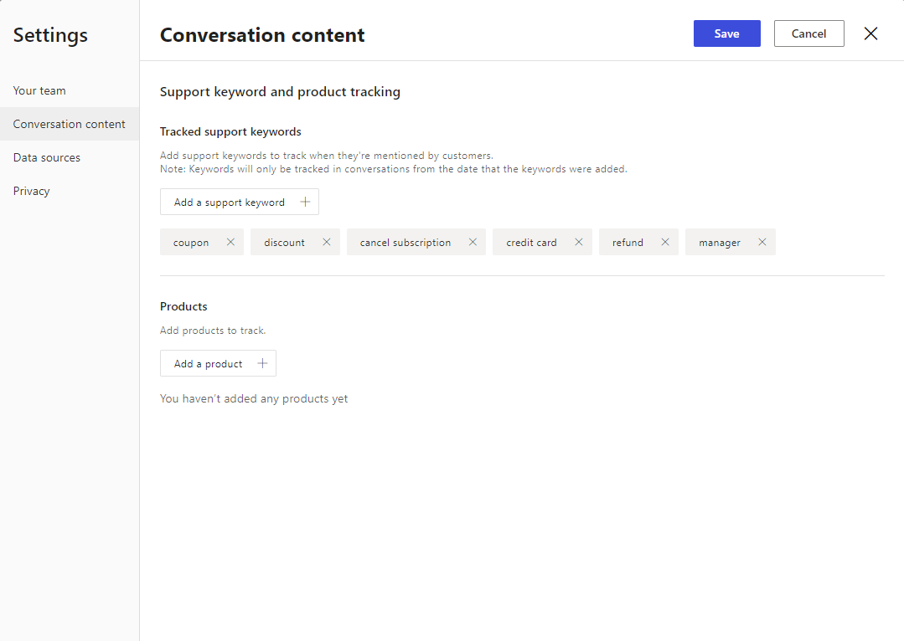
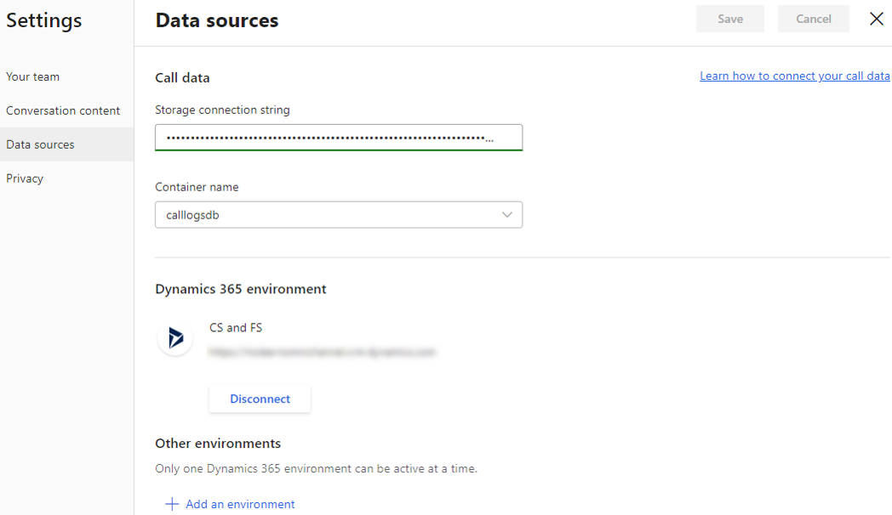

أثناء عملية تكوين معلومات المكالمات، سيتم إرشادك خلال عملية الاتصال ببيانات المكالمات، والاتصال ببيئة Dynamics 365، وتكوين الكلمات الأساسية والمنتجات. استناداً إلى دورك في المؤسسة، ستكون قدرات التكوين المختلفة متاحة. يمكن للمسؤولين إعداد ميزات معلومات المكالمات الكاملة، والتي تتضمن بيئة Dynamics 365 Customer Service، ومنح أذونات التطبيق، وتوصيل بيانات المكالمات، وتحديد واستخدام الكلمات الأساسية المتعقبة. يمكن لغير المسؤولين استخدام البيانات في التطبيق لأغراض التدريب، ولكن لا يسمح لهم بتكوين الميزات.

## تكوين معلومات المكالمات لتوصيل بيانات المكالمات

لتحليل سجل المكالمات الهاتفية، تحتاج معلومات المكالمات إلى الوصول إليها. هناك طريقة بسيطة لتوفير هذا الوصول وهي إنشاء مستودع تسجيل المكالمات (حاوية البيانات الثنائية الكبيرة) في حساب تخزين Microsoft Azure. بعد ذلك، يمكن تحميل المكالمات إلى المستودع لتقييم معلومات الاتصال.

لإضافة موارد إلى الاشتراك، قم بتسجيل الدخول إلى [مدخل Azure](https://portal.azure.com/?azure-portal=true) كمستخدم لديه الأذونات الضرورية. في جزء التنقل، حدد  **جميع الموارد**، وقم بإنشاء مورد جديد أو افتح حساب تخزين الكائن الثنائي كبير الحجم الموجود المطلوب الذي تريد العمل معه. في حساب التخزين، أضف حاوية جديدة حيث سيتم إرسال سجلات المكالمات إليها.

في حين أن إنشاء الحاويات ليس هو التركيز الأساسي لهذه الدورة التدريبية، يمكنك العثور على [معلومات إضافية عن إنشاء الحاويات](https://docs.microsoft.com/azure/storage/blobs/storage-quickstart-blobs-portal?azure-portal=true#create-a-container). 

عند إنشاء حاوية التخزين، حدد موقع سلسلة الاتصال بحاوية الكائنات الثنائية كبيرة الحجم عن طريق تحديد **مفاتيح الوصول**، وهي القيمة التي ستحتاج ليها لاحقاً عند توصيل بيانات مركز الاتصال. بعد إنشاء الحاوية، يمكنك البدء في تحميل تسجيلات المكالمات وتكوين معلومات المكالمات.

> [!div class="mx-imgBorder"]
> 

## تحميل تسجيلات المكالمات

يمكن تحميل تسجيلات المكالمات بتنسيقات صوتية، مثل MP3 وWAV. بالإضافة إلى تنسيق الصوت، يجب تحميل ملف بيانات التعريف المطابق بتنسيق JSON. ستحتاج إلى أن يكون لديك ما لا يقل عن 10 سجلات مكالمات في مستودع التسجيل لمعالجة وعرض البيانات في معلومات المكالمات.

 يجب أن تفي ملفات الصوت وJSON بالمتطلبات التالية قبل تحميلها:

-   يجب أن تكون أسماء الملفات الصوت وملفات JSON المطابقة هي نفسها. على سبيل المثال، إذا قمت بتسمية ملف الصوت  **call-recording-10-dec-2018.wav**، يجب تسمية ملف JSON المطابق باسم  **call-recording-10-dec-2018.json**.

-   لا يمكن أن يحتوي اسم الملف على أحرف محجوزة، مثل !*'();:@&=+$،/?%#[]".

-   يجب أن يكون طول اسم الملف أقل من 260 حرفاً.

-   يجب أن يكون تسجيل المكالمة نوع ستيريو للتسجيل فقط.

## إعداد معلومات المكالمات 

إذا اخترت عدم تكوين التطبيق عند بدء تشغيله في البداية، فيمكنك تهيئته بعد ظهور رسالة تطبيق DEMO التي يتم عرضها أعلى الشاشة. أثناء الإعداد، سيُطلب منك توفير بيئة Dynamics 365 التي تريد الاتصال بها، مما يساعد على استدعاء الرؤى لحساب وتوحيد الرؤى الضرورية المتعلقة بفريقك.

> [!div class="mx-imgBorder"]
> 

بعد أن قمت بالإشارة إلى بيئة Dynamics 365، قد يستغرق الأمر بضع دقائق لتوصيل البيانات بالتطبيق. استناداً إلى الأذونات المقترنة بحسابك، قد يطلب منك إنشاء مستخدم تطبيق. إذا طلب منك القيام بذلك، حدد **منح الأذونات** لإنشاء مستخدم التطبيق.

> [!div class="mx-imgBorder"]
> 

ستحتاج إلى الاتصال ببيانات مكالمتك الهاتفية حتى تتمكن معلومات المكالمات من الوصول إليها لأغراض التحليل والبدء في التواصل معها. على سبيل المثال، يمكن لمؤسستك إنشاء تخزين Azure Blob يمكن تحميل بيانات المكالمات الهاتفية إليه.

في الشاشة التالية، ستوفر سلسلة الاتصال لوحدة تخزين Azure Blob التي تريد العمل معها. بعد أن يتم توفير سلسلة الاتصال، ستكون الحاوية المقترنة بها متوفرة لتحديدها. سيؤدي تحديد **الاتصال** إلى توصيلك بالبيئة.

> [!div class="mx-imgBorder"]
> 

الخطوة الأخيرة في عملية التكوين هي توفير دعم الكلمات الرئيسية وقيم تعقب المنتج. بينما يتحدث المندوبون مع العملاء على المكالمات، فمن المرجح أن يتحدثوا عن منتجاتك وخدمتك وتفاصيل أخرى. من خلال إضافة هذه التفاصيل إلى تطبيق معلومات المكالمات، يمكنك البدء في تتبع المحادثات التي تتضمنها. على سبيل المثال، قد ترغب في تضمين كلمات تشغيل مثل الإلغاء أو استرداد الأموال أو الخصم. 

تدعم معلومات المكالمات نوعين من العناصر يمكن تعقبهما في المحادثات: 

-   الكلمات الأساسية

-   المنتجات

إن إضافة كلمات رئيسية ومنتجات ذات صلة بمؤسستك تضمن تعقبها في المكالمات. كلما تم ذكر كلمات رئيسية أو منتجات محددة أثناء مكالمة، ستجمع معلومات المكالمات البيانات وتعرضها بشكل مناسب على لوحة المعلومات. سيتم تعقب الكلمات الأساسية والمنتجات التي يتم تعريفها من قِبل المسؤولين وعرضها عبر المؤسسة. يمكن للمشرفين أيضاً تحديد الكلمات الأساسية والمنتجات المتعقبة. عندما يقوم المشرفون بتعريفها، تكون خاصة بفريق المشرف وسيتم عرضها عليهم فقط. لن يكون لدى مستخدمي معلومات المكالمات الأخرى هذه الكلمات الأساسية والمنتجات المتعقبة المقدمة لهم.

من داخل **الإعدادات**، يمكنك استخدام قسم **محتوى المحادثة**  لإضافة الكلمات الأساسية والمنتجات التي يتم تعقبها في المكالمات أو إزالتها. يمكن إضافة كلمات أساسية ومنتجات جديدة وتحرير العناصر الموجودة في أي وقت.

> [!div class="mx-imgBorder"]
> 

## تحديث بيانات التكوين

في أي وقت، يمكنك تحديث إعدادات الاتصال، بما في ذلك تحديث المعلومات ذات الصلة بمستودع المكالمات المتصل ومثيل Dynamics 365 Customer Service. يمكنك إنجاز هذه المهمة من قسم  **مصادر البيانات** ، حيث يمكنك تحديث حاوية تخزين Azure Blob المستخدمة وتغيير مثيل Dynamics 365 Customer Service المتصل.

> [!div class="mx-imgBorder"]
> 

في وقت نشر هذه الدورة التدريبية، يمكنك فقط الحصول على بيئة Dynamics 365 Customer Service نشطة واحدة متصلة بالتطبيق. إذا قمت بتنشيط بيئة أخرى، فسيتم إلغاء تنشيط البيئة الحالية المتصلة بها تلقائياً. بعد ذلك، سيتم عرض البيانات البيئة الجديدة على التطبيق. بعد الاتصال ببيئة جديدة، ستحتاج إلى إضافة كلمات أساسية ومنتجات متعقبة، كما يجب توفير أذونات للوصول إلى البيانات وإلى البيئة المضافة.
