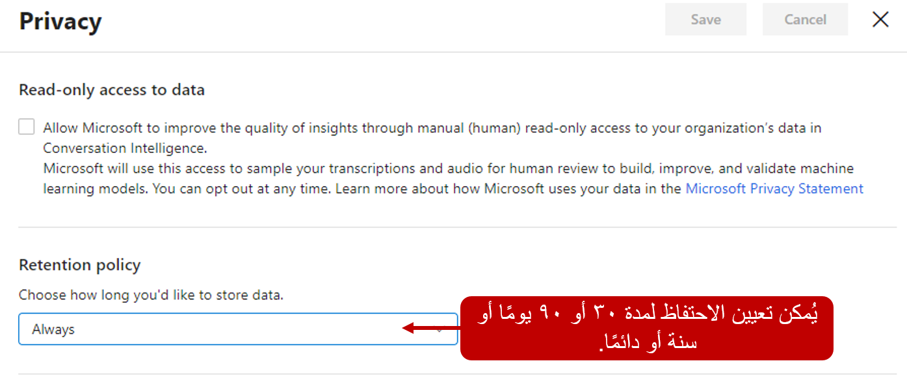
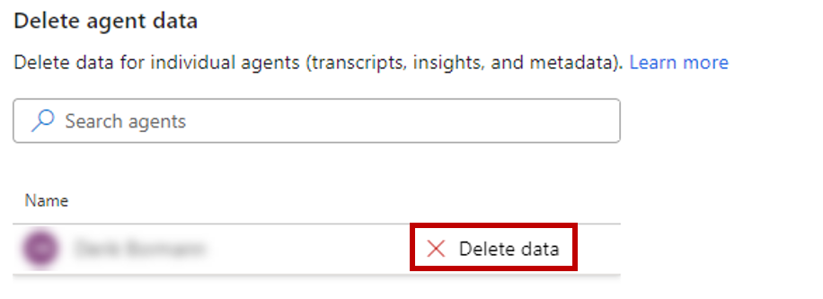

عندما تقوم مؤسستك بتكوين معلومات المكالمات، تتم معالجة تسجيلات مكالمات المندوبين وتحليلها لتوفير المعلومات الضرورية مثل الشعور العام للعملاء واتجاهات التوجه والكلمات الأساسية المحددة التي استخدمها العملاء أثناء المكالمات.

توفر معلومات المكالمات الخيارات التالية لتكوين فترة الاحتفاظ:

-   [سياسة الاحتفاظ](/dynamics365/ai/customer-service-insights/ci-admin-data-retention-deletion#retention-policy/?azure-portal=true)

-   [حذف بيانات المندوب](/dynamics365/ai/customer-service-insights/ci-admin-data-retention-deletion?azure-portal=true#delete-agent-data/)

## سياسة الاحتفاظ

تتيح لك سياسة الاحتفاظ تحديد المدة التي يجب خلالها الاحتفاظ ببيانات تسجيل المكالمات التي تم تحليلها في معلومات المكالمات من خلال تحديد حد زمني. عند تحديد حد زمني للاحتفاظ، تحتفظ الميزة ببيانات تسجيل المكالمات للمهلة الزمنية المحددة. تقوم معلومات المكالمات بحذف البيانات عند الوصول إلى الحد الزمني. على سبيل المثال، إذا قمت بتعيين حد وقت الاحتفاظ إلى **30 يوماً**، في أي وقت معين، ستحتفظ معلومات المكالمات ببيانات المكالمة من وقت تحليلها إلى 30 يوماً. بعد ذلك، في اليوم الـ 31، سيقوم التطبيق بحذف بيانات المكالمة التي تم تحليلها.

يتم تكوين سياسة الاحتفاظ في صفحة **الإعدادات** في التطبيق. في قسم **الخصوصية**، يمكنك تكوين إعدادات مختلفة متعلقة بالاحتفاظ بالبيانات. يتيح لك قسم **سياسة الاحتفاظ** تحديد عدد الأيام للاحتفاظ بالبيانات التي تم تحليلها، من **30 يوماً** أو **90 يوماً** أو **سنة واحدة** أو **دائماً**.

> [!div class="mx-imgBorder"]
> 

## حذف بيانات المندوب

يمكن حذف بيانات المندوب في سيناريوهات لم تعد هناك حاجة إليها، مثل عندما لا يعود المندوب يقدم تقارير إليك، أو تم تحويله إلى فريق آخر، أو ترك مؤسستك، وما إلى ذلك. عند حذف بيانات المندوب، يتضمن الحذف كافة إحصاءات المندوب ومحفوظات المكالمات. يمكن حذف البيانات من قائمة **الخصوصية**. في قسم **حذف بيانات المندوب**، حدد المندوب الذي تريد حذف البيانات منه، ثم حدد **حذف البيانات**.

> [!div class="mx-imgBorder"]
> 
