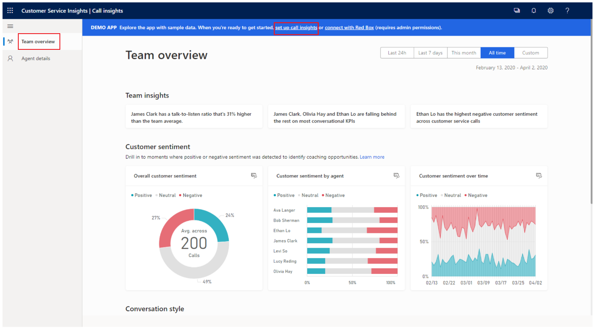
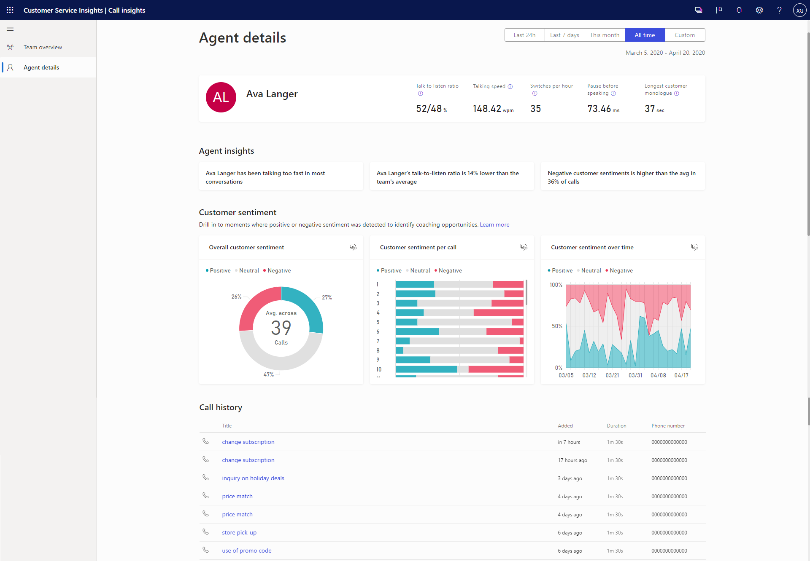
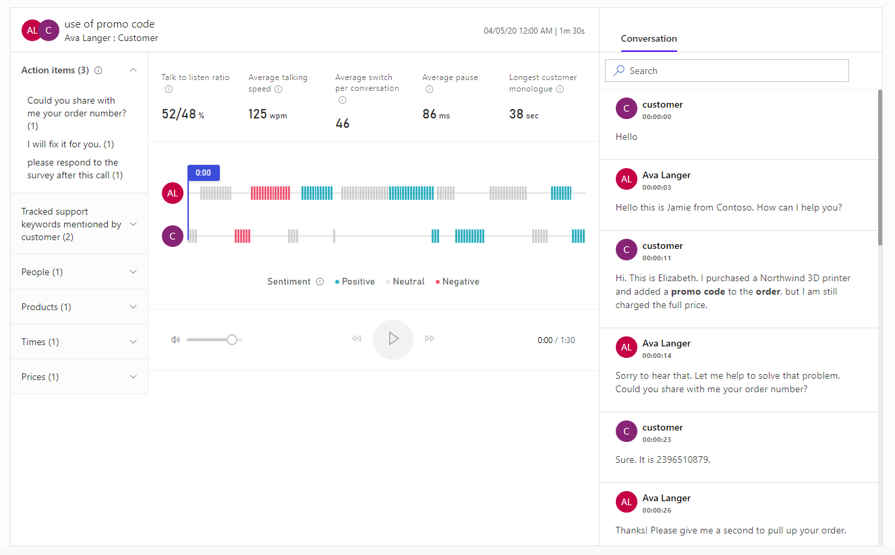

تعد مكالمات خدمة العملاء من أهم جوانب الأعمال. وتساعدك هذه المكالمات في تغيير شكل أعمالك من خلال تحسين رضا العملاء. وبإمكان الصفحة **نظرة عامة على الفريق** في معلومات المكالمات أن تساعد المشرفين في تحليل السلوك العام لفريقهم أثناء مكالمات العملاء. يساعد هذا التحليل أيضاً في تحديد سيناريوهات تدريب الفريق للمساعدة في زيادة رضا العملاء والحصول على مكاسب النشاط للأعمال.

تساعد مؤشرات الأداء الأساسية (KPI) والمعلومات التالية المشرفين على:

-   تقييم توجهات العملاء بشكل عام واتجاهات التوجه.

-   تقييم إسهامات الفريق تجاه توجهات العملاء.

-   اكتساب معلومات حول ما يحدث مع الفريق.

-   تحليل نمط المحادثة المتّبع لدى الفريق.

لعرض الصفحة **نظرة عامة على الفريق**، قم بتسجيل الدخول إلى معلومات المكالمات، ثم حدد **نظرة عامة على الفريق**.

> [!div class="mx-imgBorder"]
> 

|     مؤشرات الأداء الأساسية (KPI)/المعلومات          |     الوصف                                                                                                                                                                                                                                                                                                                                                                                                                                                                                                                                                                                                                                                                                                                                                                                                                                                                  |
|---------------------------|----------------------------------------------------------------------------------------------------------------------------------------------------------------------------------------------------------------------------------------------------------------------------------------------------------------------------------------------------------------------------------------------------------------------------------------------------------------------------------------------------------------------------------------------------------------------------------------------------------------------------------------------------------------------------------------------------------------------------------------------------------------------------------------------------------------------------------------------------------------------------------|
|     عامل تصفية التاريخ           |     يُوفر فترة زمنية يمكنك خلالها عرض بيانات مكالمات فريقك والمعلومات المتعلقة به.                                                                                                                                                                                                                                                                                                                                                                                                                                                                                                                                                                                                                                                                                                                                                                                                |
|     معلومات الفريق         |     تعرض مستجدات فريقك وأحدث الاتجاهات. وهي تشمل المندوبين الذين يسجلون نقاطاً عالية في رضا العملاء وأولئك الذين قد يحتاجون إلى التدريب استنادًا إلى توجهات العملاء التي يقدمونها، والكلمات الأساسية المتداولة.                                                                                                                                                                                                                                                                                                                                                                                                                                                                                                                                                                                                                |
|     توجه العميل    |     **توجه العميل العام:** يُحدد توجه العميل بالنسبة المئوية إن كان إيجابياً أو سلبياً أو محايداً. **توجه العميل على مدار الوقت:** يعرض كيف يتم توزيع التوجهات الثلاثة للعملاء (الإيجابية والسلبية والمحايدة) عبر الإطار الزمني المحدد. **توجه العميل حسب المندوب:** يُحدد مدى مساهمة كل مندوب من المندوبين الخاصين بك في إنشاء توجه العميل بشكل عام ويُظهر المندوبين الذين لديهم أعلى المساهمات أو أدناها.                                                                                                                                                                                                                                                                                                                                                                                |
|     نمط المحادثة    |     **نسبة التحدث إلى الاستماع:** تُحدد متوسط نسبة الاستماع والتحدث للمندوبين في المحادثات مع العملاء. **سرعة التحدث:** تعرض متوسط عدد الكلمات التي ينطقها المندوبون في الدقيقة. **تبادل الحديث في الساعة:** يعرض متوسط تبادل الحديث بين المندوب والعميل في محادثة؛ أي عدد المرات التي تبدلت فيها المحادثة من شخص إلى آخر. ويدل هذا القياس على مدى المشاركة أثناء المحادثات. **التوقف المؤقت قبل التحدث:** يعرض عدد المِلّي ثانية الذي توقف فيها المندوب مؤقتاً قبل الرد على استعلامات العملاء؛ ويشير هذا العامل إلى مدى تحلي المندوب بالصبر. **أطول حوار فردي للعميل:** يعرض أطول فترة حديث بالثواني دون انقطاع من جانب العميل؛ ويشير هذا العامل إلى أن المندوبين يطرحون أسئلة جيدة ويُظهرون تفهماً لاحتياجات العملاء.    |

## تحليل أداء المندوب

أحد الأسباب العديدة التي تجعل المؤسسات تستخدم Customer Service Insights هو تحليل أداء المندوب. يمكن للمشرفين الاطلاع على معلومات وتحليلات خاصة بأداء كل مندوب أثناء المكالمات مع العملاء. ستختلف المعلومات التي سيتم عرضها في صفحة **تفاصيل المندوب** باختلاف دورك كمشرف أو مندوب.

بصفتك مشرفاً، يمكنك استخدام صفحة **تفاصيل المندوب** لتحليل السلوك العام لمندوب فردي أثناء مكالمات العميل. وبفضل هذا التحليل، يمكنك تحديد سيناريوهات التدريب لزيادة إنتاجية الأعمال ورضا العملاء.

باستخدام صفحة **تفاصيل المندوب** يمكنك القيام بما يلي:

-   تحديد الكلمات الأساسية التي يستخدمها العملاء أثناء المكالمات.

-   تحديد المندوبين المحتملين الذين قد يحتاجون إلى التدريب.

-   تحديد أفضل ممارسات أفضل المندوبين لديك.

-   مراجعة كل مندوب عن كثب من خلال عرض البيانات وتحليلها، مثل مؤشرات الأداء الأساسية (KPI) للمحادثات والمعلومات وتوجهات العملاء.

-   تحليل النُسخ المكتوبة من المكالمات وتحديد النواحي التي يحتاج فيها المندوبون إلى التدريب أو النواحي التي يتفوق فيها أفضل المندوبين.

-   التعليق على النسخة المكتوبة من المكالمات ومشاركتها مع المندوبين.

-   فحص مكالمات مندوب معين لمتابعة العناصر الإجرائية والإشارات، مثل الكلمات الأساسية، وتحديد أنشطة التدريب المحتملة.

الصورة التالية هي مثال على كيفية عرض صفحة المندوب للمشرفين.

> [!div class="mx-imgBorder"]
> 

يتم عرض مؤشرات الأداء الأساسية (KPI) والمعلومات التالية للمشرفين الذين يعرضون صفحة المندوب.

  |     مؤشرات الأداء الأساسية (KPI)/المعلومات         |     الوصف                                                                                                                                                                                                                                                                                                                                                                                                                                                                                                                                                                                                                                                                                            |
|--------------------------|------------------------------------------------------------------------------------------------------------------------------------------------------------------------------------------------------------------------------------------------------------------------------------------------------------------------------------------------------------------------------------------------------------------------------------------------------------------------------------------------------------------------------------------------------------------------------------------------------------------------------------------------------------------------------------------------------------|
|     عامل تصفية التاريخ        |     حدد المخطط الزمني الذي تريد عرض بياناته.                                                                                                                                                                                                                                                                                                                                                                                                                                                                                                                                                                                                                                               |
|     المعلومات الأساسية    |     حدد مندوباً من القائمة المنسدلة لعرض معلوماته، مثل المعلومات والإحصاءات وسجل المكالمات. وباستخدام هذه المعلومات، يمكنك تقييم سلوك المندوب وتحديد النواحي التي يحتاج فيها المندوب إلى التدريب. يمكنك التعليق مباشرة على النُسخ المكتوبة من المكالمات لتوفير مدخلات التدريب أو جمع المعلومات حسب الحاجة. يمكنك أيضاً إرسال بريد إلكتروني إليهم أو إجراء محادثة مباشرةً عن طريق تحديد رمز البريد الإلكتروني لإرسال بريد إلكتروني أو عن طريق تحديد رمز المحادثة لإجراء محادثة مع المندوب. تُظهر هذه المعلومات أيضاً نمط المحادثة لدى المندوب مع مؤشرات الأداء الأساسية (KPI)، مثل متوسط سرعة التحدث، وتبادل الحديث لكل محادثة، ومتوسط التوقف المؤقت، و‏‫أطول حوار فردي للعميل.    |
|     المعلومات             |     تعرض ما يحدث مع المندوب وأحدث الاتجاهات الخاصة بكل مندوب، مثل توجه العملاء ونسبة التحدث إلى الاستماع.                                                                                                                                                                                                                                                                                                                                                                                                                                                                                                                                                       |
|     الإحصائيات           |     **متوسط مستوى توجه العميل:** يعرض توجهات العملاء (سواء كانت إيجابية، أو سلبية أو محايدة) لكل مكالمة تعامل معها المندوب. **متوسط نسبة التحدث إلى الاستماع:** يعرض متوسط نسبة التحدث إلى الاستماع للمندوب أثناء المكالمات مع العميل. **التوجه على مدار الوقت:** يُظهر التوجهات الثلاثة للعملاء (الإيجابية والسلبية والمحايدة) عبر الإطار الزمني المحدد للمندوب.                                                                                                                                                                                                                                                                                   |
|     سجل المكالمات       |     يعرض قائمة مكالمات المندوب. افتح مكالمة محددة للاستماع إليها، واطلع على النسخة المكتوبة، واعرض إشارات الاتصال (على سبيل المثال، الكلمات الأساسية المُشار إليها أثناء المكالمة). لمزيد من المعلومات، راجع [عرض ملخص المكالمات وفهمه](https://docs.microsoft.com/dynamics365/ai/customer-service-insights/ci-view-understand-call-summary/?azure-portal=true).                                                                                                                                                                                                                                                                                                                                                                                                                                                          |

بصفتك مندوباً، يمكنك استخدام صفحة **تفاصيل المندوب** لتحليل سلوكك العام أثناء مكالمات العملاء. وباستخدام هذا التحليل، يمكنك تحديد أفضل الممارسات، بالإضافة إلى النواحي التي تحتاج إلى تحسينها.

باستخدام صفحة **تفاصيل المندوب** يمكنك القيام بما يلي:

-   تحديد الكلمات الأساسية الرئيسية التي يستخدمها العملاء أثناء المكالمات.

-   تحديد أسماء المنتجات التي يشير إليها العملاء أثناء المكالمات.

-   تحليل النُسخ المكتوبة من المكالمات وتحديد النواحي التي تحتاج فيها إلى التدريب.

-   عرض تعليقات مشرفك على النُسخ المكتوبة من المكالمات.

-   استكشاف مكالمات محددة لمتابعة العناصر الإجرائية وعرض الإشارات (على سبيل المثال الكلمات الأساسية)، وقراءة النسخة المكتوبة، والمزيد.

الصورة التالية هي مثال على كيفية عرض صفحة المندوب للمندوبين.

> [!div class="mx-imgBorder"]
> 

يتم عرض مؤشرات الأداء الأساسية (KPI) والمعلومات التفصيلية التالية للمندوبين الذين يعرضون بياناتهم الخاصة.

|     مؤشرات الأداء الأساسية (KPI)/المعلومات         |     الوصف                                                                                                                                                                                                                                                                                                                                                                                  |
|--------------------------|--------------------------------------------------------------------------------------------------------------------------------------------------------------------------------------------------------------------------------------------------------------------------------------------------------------------------------------------------------------------------------------------------|
|     عامل تصفية التاريخ        |     حدد المخطط الزمني الذي تريد عرض بياناته.                                                                                                                                                                                                                                                                                                                                     |
|     المعلومات الأساسية    |     تعرض نمط المحادثة مع مؤشرات الأداء الأساسية (KPI)، مثل متوسط سرعة التحدث، وتبادل الحديث لكل محادثة، ومتوسط التوقف المؤقت، و‏‫أطول حوار فردي للعميل.                                                                                                                                                                                                                                    |
|     المعلومات             |     تعرض أحدث الاتجاهات الخاصة بك، مثل توجهات العملاء ونسبة التحدث إلى الاستماع.                                                                                                                                                                                                                                                                                        |
|     الإحصائيات           |     **متوسط مستوى توجه العميل:** يعرض توجهات العملاء (سواء كانت إيجابية، أو سلبية أو محايدة) لكل مكالمة تعاملت معها.    **متوسط نسبة التحدث إلى الاستماع:** يعرض متوسط نسبة التحدث إلى الاستماع أثناء المكالمات مع العميل. **التوجه على مدار الوقت:** يُظهر التوجهات الثلاثة للعملاء (الإيجابية والسلبية والمحايدة) عبر الإطار الزمني المحدد.    |
|     سجل المكالمات       |     يعرض قائمة مكالماتك. افتح مكالمة محددة للاستماع إليها، واطلع على النسخة المكتوبة، واعرض إشارات الاتصال (على سبيل المثال، الكلمات الأساسية التي تمت الإشارة إليها أثناء المكالمة). لمزيد من المعلومات، راجع [عرض ملخص المكالمات وفهمه](https://docs.microsoft.com/dynamics365/ai/customer-service-insights/ci-view-understand-call-summary/?azure-portal=true).                                                                                                                                                       |

## عرض ملخص المكالمة وفهمه

يحتاج المندوبون ومشرفيهم إلى طريقة بسيطة لمراجعة المحادثات التي أجراها المندوب والعثور بسرعة على نقاط الحوار والكلمات الأساسية والمعلومات ذات الصلة. تُوفر صفحة ملخص المكالمة عرضاً عالي المستوى لكيفية سير المكالمة وتتضمن إشارات (مثل العناصر الإجرائية المحددة والكلمات الأساسية ذات الصلة التي تمت الإشارة إليها) والمخطط الزمني للمكالمة ونسخة مكتوبة والمزيد.

تساعد المعلومات الموجودة في صفحة ملخص المكالمات على:

-   زيادة معرفة المندوبين بسرعة بالمحادثات الماضية مع العملاء وتسليط الضوء على الموضوعات والالتزامات المهمة.

-   حصول المشرفين على عرض عالي المستوى لكيفية إدارة فريقهم لعلاقاته مع العملاء.

الصورة التالية هي مثال على صفحة ملخص المكالمات.

> [!div class="mx-imgBorder"]
> 

تتضمن مؤشرات الأداء الأساسية (KPI) والمعلومات الموجودة في صفحة ملخص المكالمة ما يلي:

-   **تفاصيل المكالمة** - تعرض أسماء المشاركين وموضوع المكالمة ووقت حدوث المكالمة الهاتفية.

-   **جزء الإشارات** - يعرض نقاط الحوار ذات الصلة التي تمت الإشارة إليها أثناء المكالمة:

    -   **العناصر الإجرائية** - تعرض قائمة بالعناصر القابلة للتنفيذ التي تمت الإشارة إليها أثناء المكالمة؛ على سبيل المثال، "سأرسل إليك بريداً إلكترونياً" أو "سأتابع مع ميشيل غداً". عند تحديد عنصر إجرائي، يمكنك معرفه المكان الذي تمت الاشارة إليه في المخطط الزمني.

    -   **الكلمات الأساسية المتعقبة للدعم التي أشار إليها العملاء‬** - تعرض الكلمات الأساسية التي تمت الاشارة إليها أثناء المكالمة. عند تحديد كلمة أساسية، يمكنك معرفة مكان ذِكر هذه الكلمة في المخطط الزمني.

    -   **الأشخاص** - يعرض أسماء الأشخاص الذين تمت الإشارة إليهم أثناء المكالمة؛ على سبيل المثال، "سارة تتصل من Contoso". عند تحديد اسم، يمكنك معرفه المكان الذي تمت الاشارة إليها في المخطط الزمني.

    -   **المنتجات** - تعرض أسماء المنتجات التي تمت الاشارة إليها أثناء المكالمة؛ على سبيل المثال، "أعرف فقط كيفية استخدام تلفزيون Fabrikam LED". عند تحديد منتج، يمكنك معرفه المكان الذي تمت الإشارة إليه في المخطط الزمني.

    -   **الأوقات** - تعرض الأوقات التي تمت الإشارة إليها أثناء المكالمة؛ على سبيل المثال، "لنتحدث الأسبوع القادم". عند تحديد وقت، يمكنك معرفه المكان الذي تمت الاشارة إليه في المخطط الزمني.

    -   **الأسعار** - تعرض الأسعار التي تمت الاشارة إليها أثناء المكالمة؛ على سبيل المثال، "ستبلغ تكلفة المنتج 50 دولاراً". عند تحديد سعر، يمكنك معرفه المكان الذي تمت الاشارة إليه في المخطط الزمني.

-   **معلومات المحادثة الأساسية** - تعرض مقاييس مثل متوسط سرعة التحدث، وعدد مرات تبادل الحديث لكل محادثة، ومتوسط التوقف المؤقت، و‏‫أطول حوار فردي للعميل.

-   **المخطط الزمني لتشغيل المكالمة** - يعرض المخطط الزمني لتشغيل المكالمة مع التوجهات المميزة (على سبيل المثال الإيجابية والمحايدة والسلبية). يمكنك الانتقال إلى لحظة معينة من المكالمة عن طريق تحديد وقت محدد على المخطط الزمني. سيتم تلقائياً تمرير النسخة المكتوبة من المكالمة (الموجودة على اليسار) إلى تلك اللحظة في المكالمة. يمكنك أيضاً إيقاف المكالمة مؤقتاً وترجيعها وإعادة توجيهها وضبط مستوى الصوت حسب الحاجة.

-   **النسخة المكتوبة من المكالمة** - تُقدم سجلاً مكتوباً للمكالمة. بصفتك مشرفاً، يمكنك مراجعة النسخة المكتوبة والتعليق عليها (على سبيل المثال، لتقديم اقتراح إلى المندوب حول كيفية التعامل مع مثل هذا الموقف في المستقبل).

بصفتك مندوباً، يمكنك مراجعة النسخة المكتوبة والتعليقات التي تم نشرها بواسطة المشرف أو المدرب على المخطط الزمني. ويمكنك تقديم ردود على التعليقات، حسب الاقتضاء.

