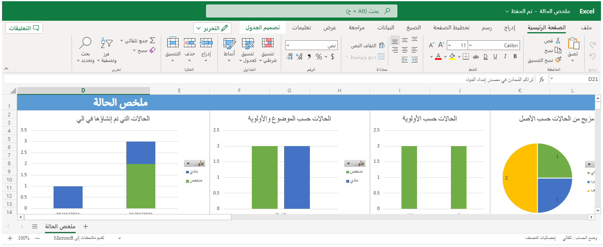
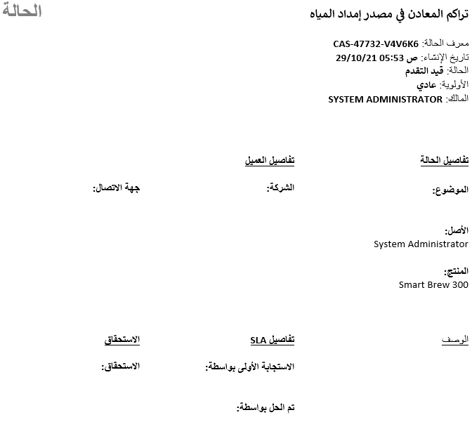

يحتوي Microsoft Dynamics 365 على خيارات تحليلية متعددة لمساعدة المؤسسات على اتخاذ قرارات الأعمال التي تستند إلى أحجام الحالة السابقة واتجاهاتها. على سبيل المثال، يمكن للمؤسسات تحديد طرق عرض مخصصة تعرض أنواعاً معينة من البيانات، أو استخدام المخططات للتعمق في مزيد من التفاصيل حول السجلات المختلفة المتعلقة بالخدمة، أو حتى تحليل البيانات باستخدام أدوات مثل Microsoft Excel وMicrosoft Power BI.

بشكل مبتكر، توفر Microsoft Dynamics 365 Customer Service العديد من الأدوات التي تساعد المؤسسات على تحليل بياناتها المهمة.

- **طرق العرض** - توفير الطرق الأبسط لتحليل البيانات الأساسية.
وهي تتضمن خيارات متعددة لتصفية البيانات وفرزها.
يحتوي كل نوع سجل على عدة طرق عرض محددة مسبقاً. يمكن للمستخدمين إضافة المزيد من وجهات النظر على أساس الاحتياجات الفردية.

- **المخططات** - توفر المخططات تمثيلاً مرئياً فورياً للمعلومات، استناداً إلى طرق العرض المرتبطة بأنواع سجلات معينة، مثل العملاء المتوقعين والفرص. إن Dynamics 365 يتضمن العديد من المخططات التفاعلية.

- **لوحات المعلومات** - تساعد المستخدمين في دمج البيانات من أنواع سجلات متعددة في منطقة تفاعلية واحدة. قد تتضمن لوحات المعلومات مخططات وطرق عرض وبيانات من صفحات HTML مخصصة ومواقع ويب خارجية وموارد أخرى. إن Dynamics 365 يتضمن لوحات معلومات متعددة مختلفة.

- **ميزة البحث المتقدم** - تتيح للمستخدمين تشغيل إجراء عمليات بحث معقدة وشاملة لجميع أنواع المعلومات. مثالاً على ذلك، يمكن للمستخدمين البحث عن معلومات خلال الأنواع المختلفة من السجلات وعرض البيانات المجمعة. يمكن للمستخدمين بعد ذلك حفظ عمليات البحث والنتائج كمشاهدات شخصية لاستخدامها لاحقاً.

- **التقارير** - توفر طريقة منظمة لإظهار معلومات معينة. يتضمن Dynamics 365 العديد من تقارير الخدمة المكونة مسبقاً والتي يمكن للشركات استخدامها لتتبع الجوانب المهمة في إدارة الحالة.
يمكن للمستخدمين إنشاء تقارير مخصصة باستخدام معالج تقارير Dynamics 365.

- **Microsoft Excel** - يمكن للمستخدمين تصدير البيانات من Dynamics 365 إلى Excel للاستفادة من أدوات التحليل التي يوفرها Excel، مثل إمكانات التخطيط الأكثر تفصيلاً وPivotTables. بالإضافة إلى ذلك، يمكن للمستخدمين تصدير بيانات Dynamics 365 إلى Excel كورقة عمل ثابتة أو ورقة عمل ديناميكية أو PivotTable ديناميكي أو في Microsoft Excel Online.

- **قوالب Microsoft Excel** - تسمح للمستخدمين بتقديم البيانات من طريقة عرض السجلات باستخدام ميزات التخطيط في Excel.
يتم تضمين نموذجين في Dynamics 365 Customer Service: حالة اتفاقية مستوى الخدمة (Case SLA) وملخص الحالة، والتي تظهر في لقطة الشاشة التالية. يمكنك إنشاء قوالب Excel لاحتياجات إعداد التقارير الخاصة بك.

  > [!div class="mx-imgBorder"]
  > 

- **قوالب Microsoft Word** - السماح للمستخدمين بإنشاء إخراج منسق لسجل واحد. قالب يلخص سجل الحالة مضمن في Dynamics 365 Customer Service ويظهر في لقطة الشاشة التالية. لإنشاء مستندات عالية التنسيق، يمكنك إنشاء قوالب Word الخاصة بك.

  > [!div class="mx-imgBorder"]
  > 

- **الوظيفة الإضافية لـ Customer Service Insights** - يوفر تحليلات ورؤى قوية للذكاء الاصطناعي حول الحالات والموضوعات والمندوبين والمقالات المعرفية.

تستخدم العديد من المؤسسات Power BI للقيام بإعداد التحليلات والتقارير الخاصة بالمعلومات المهنية الأكثر تعقيداً. يمكن لـ Power BI سحب البيانات من مصادر بيانات متعددة لدعم الاحتياجات التحليلية المتقدمة. قد يكون Dynamics 365 Customer Service أحد مصادر البيانات هذه. باستخدام Power BI Desktop لكتابة التقارير، وباستخدام Power BI لمشاركة لوحات المعلومات والبيانات من Dynamics 365 Customer Service، يكون لدى المستخدمين في مؤسستك طريقة جديدة فعالة للعمل مع بيانات Dynamics 365.
