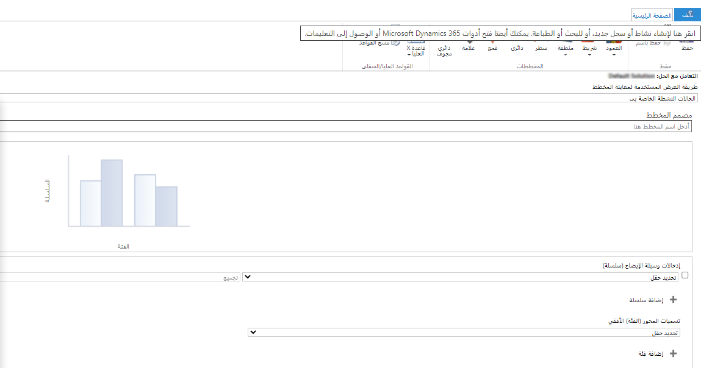
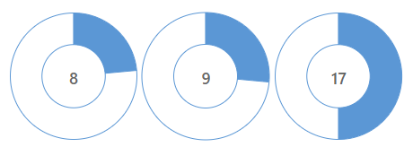

تقوم أدوات مثل التقارير الجاهزة وMicrosoft Excel بعمل رائع في تجميع البيانات وتوفير منظور لها. ومع ذلك، لا يحتاج معظم المستخدمين إلى هذا المستوى من تحليل البيانات؛ بل يحتاجون إلى طريقة للتنقل بسرعة وعرض البيانات عالية المستوى المهمة لهم. فمثلاً، قد يرغب المندوبون في رؤية الحالة المفتوحة الأخيرة الخاصة بهم، أو أنشطة اليوم الحالي، أو ملاحظات العملاء الخاصة بهم.
توفر المخططات رؤى مرئية لأهم البيانات والمعلومات الخاصة بالمؤسسة أو المستخدم.

بخلاف كونها سهلة الاستخدام، تعرض المخططات البيانات في الوقت الفعلي. عند فتح الحالات وإغلاقها، يتم تحديث المهام وما إلى ذلك، ستعكس المخططات التغييرات على الفور. بالإضافة إلى ذلك، تحتوي المخططات فقط على السجلات التي يمتلك المستخدم الإذن لعرضها.

المخططات هي تمثيلات رسومية للبيانات من طريقة العرض المحددة حالياً للجدول. عندما يتم تغيير إحدى طرق العرض، يتغير بالتالي المخطط.
يوفر Dynamics 365 عدة أنواع مختلفة من المخططات.
يمكنك استخدام المخططات الجاهزة أو إنشاء مخططاتك الخاصة.
بعد إنشاء المخطط، يمكنك استخدامه في طرق العرض أو إضافته إلى "لوحات المعلومات".

## مخططات الحالة

يتضمن جدول "الحالة" العديد من المخططات المحددة مسبقاً التي يمكنك استخدامها لاستهلاك البيانات الإجمالية بسرعة، بما في ذلك:

- **الحالات النشطة بحسب المندوب** - مخطط عمودي يوضح عدد الحالات المفتوحة لكل مندوب.

- **اتجاه إنشاء الحالة** - مخطط عمودي يعرض عدد الحالات التي يتم إنشاؤها يومياً.

- **مجهود عميل الحالة** - مخطط عمودي مكدس يعرض عدد الحالات التي تم إنشاؤها كل شهر وعدد القنوات المستخدمة في الحالات.

- **مزيج الحالة** - مجموعة من المخططات التي تعرض عدد الحالات بحسب المجموعات المختلفة: وحدة العمل، والأصل، والأولوية، ونوع الحالة.

- **اتجاه دقة الحالة** - مخطط عمودي يعرض عدد الحالات التي يتم حلها يومياً.

- **اتجاه الحالة بحسب الموضوعات** - مخطط خطي يعرض اتجاه الحالات التي تم إنشاؤها بمرور الوقت.

- **الحالات بحسب الحساب** - مخطط علامات يوضح عدد الحالات لكل حساب.

- **الحالات بحسب المنشأ (في اليوم)** - مخطط عمودي مكدس يعرض عدد الحالات لكل يوم، مجمعة بحسب الأصل.

- **الحالات بحسب الأولوية** - مخطط دائري مجوّف يعرض عدد الحالات مجمعة بحسب الأولوية. يمكنك استخدام هذا المخطط على لوحات المعلومات التفاعلية.

- **الحالات بحسب المالك** - مخطط عمودي مكدس يعرض عدد الحالات لكل مندوب، مجمعة بحسب الأولوية.

- **الحالات بحسب المنتج** - مخطط العلامات الذي يعرض عدد الحالات المرتبطة بكل منتج.

- **الحالات بحسب الحالة** - مخطط عمودي يعرض عدد الحالات، مجمعة بحسب الحالة.

- **لوحة القيادة للخدمة** - مخطط شريطي يوضح عدد الحالات بحسب المندوب.

## بناء المخططات

يمكنك إنشاء مخططات مخصصة ثم إتاحة تلك المخططات للمستخدمين في طرق العرض ولوحات المعلومات.

> [!div class="mx-imgBorder"]
> 

### أنواع المخططات

تتوفر عدة أنواع من المخططات لتتمكن من إنشائها:

- **العمود** (عمود وعمود مكدس أو بنسبة 100% عمود مكدس)

  > [!div class="mx-imgBorder"]
  > 

- **الشريط** (الشريط أو الشريط المكدس أو بنسبة 100% شريط مكدس)

  > [!div class="mx-imgBorder"]
  > 

- **المساحة** (المساحة أو المنطقة المكدسة أو المساحة المكدسة بنسبة 100%)

  > [!div class="mx-imgBorder"]
  > 

- **Line**

  > [!div class="mx-imgBorder"]
  > 

- **Pie**

  > [!div class="mx-imgBorder"]
  > 

- **أنبوب**

  > [!div class="mx-imgBorder"]
  > 

- **العلامات**

  > [!div class="mx-imgBorder"]
  > 

- **Doughnut**

  > [!div class="mx-imgBorder"]
  > 

### قواعد المخطط

يمكنك إنشاء قواعد لإظهار الصفوف القليلة العلوية أو السفلية فقط في المخطط. حدد هذه الميزة من كلتا القائمتين وأيضاً أثناء إنشاء المخطط.

## عرض المخططات

سيتم طي المخططات افتراضياً عندما تقوم بعرض المخطط بجوار طريقة العرض الخاصة بك. ومع ذلك، يمكنك تحديد **إظهار المخططات**، مما يؤدي إلى ظهور المخطط على الجانب الأيسر من طريقة العرض.

> [!div class="mx-imgBorder"]
> 

## التنقل لأسفل

يعني التنقل لأسفل الدخول إلى المخطط لعرض بيانات محددة فقط. سيتم طرح بعض الأسئلة عليك بخصوص المنطقة التي تريد البحث فيها، إذا كنت تتعمق في المخطط. حدد المخطط وستكون قادراً على تحديد تحديدات البيانات الخاصة بك للتعمق في البيانات بشكل أكبر.

> [!div class="mx-imgBorder"] 
> 

## مخططات النظام

يمكنك إنشاء مخططات النظام في مدخل صانع [Microsoft Power Apps.](https://make.powerapps.com?azure-portal=true) مخططات النظام مرئية لجميع المستخدمين داخل المؤسسة. إذا قمت بتخصيص أحد الحلول، فسيكون الخيار **المخططات** متاحاً تحت كل جدول. 

> [!div class="mx-imgBorder"]
> 

تأكد من تحديد الحقول التي تريد عرضها على "عناوين المحور الأفقي" (الفئة) و"إدخالات وسيلة الإيضاح" (السلسلة).
يعرض محور "إدخالات وسيلة الإيضاح" (سلسلة) البيانات التي تمثل قيمة رقمية فقط. يمكنك الاختيار بين **المتوسط** أو **عد الكل** أو **عد غير الفارغ‎** أو **الأقصى** أو **الأدنى** أو **المجموع**. إذا اخترت حقلاً غير رقمي لمحور السلسلة، فيمكنك فقط اختيار **عد الكل** أو **عد غير الفارغ**. 

تعرض "تسميات المحور الأفقي" (الفئة) القيم الرقمية أو غير الرقمية. يمكن أن يتم إدراج ما يصل إلى فئتين لديك.

يمكنك تصدير المخططات واستيرادها إلى حلول أخرى. بالإضافة إلى ذلك، يمكنك تخصيص المخططات عن طريق تصدير المخطط إلى ملف XML وإجراء التعديل المناسب المطلوب في XML.

## المخططات الشخصية

يمكنك الوصول إلى المخططات الشخصية في مركز "خدمة العملاء" وإنشائها من عرض الجدول. ترتبط المخططات الشخصية بالمستخدم الذي قام بإنشائها، ولكن يمكن مشاركتها مع مستخدمين وفِرق أخرى.

> [!NOTE]
> لا يتوفر المخططين Tag وDoughnut في المخططات الشخصية.

يمكن للمستخدم تصدير تعريف مخطط شخصي ومشاركته مع مسؤول يمكنه بعد ذلك استيراده وتكوينه كمخطط نظام ثم إتاحته لجميع المستخدمين.
