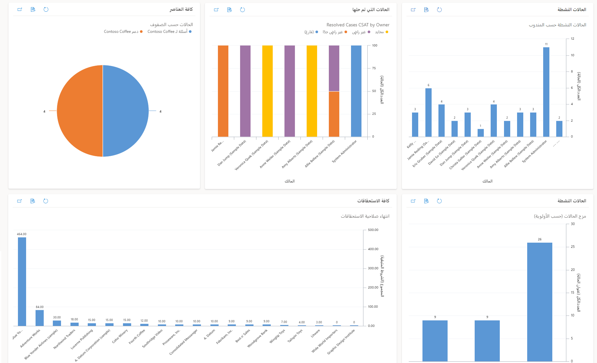
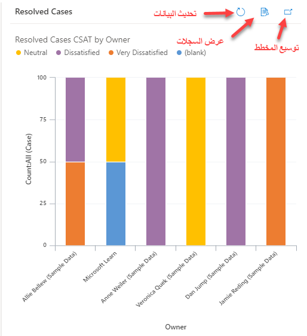
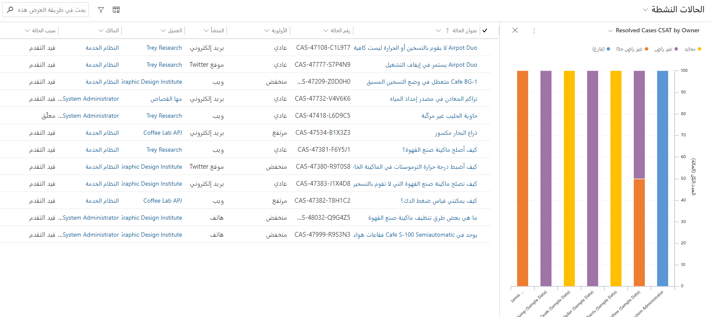
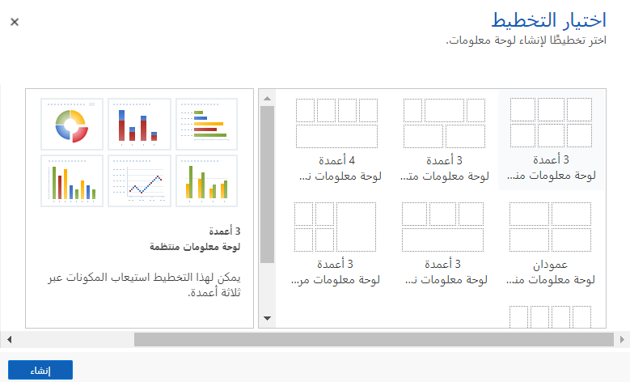
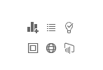
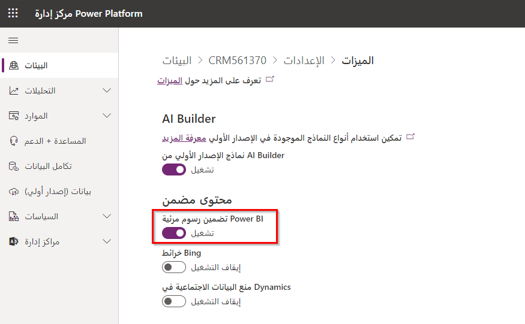
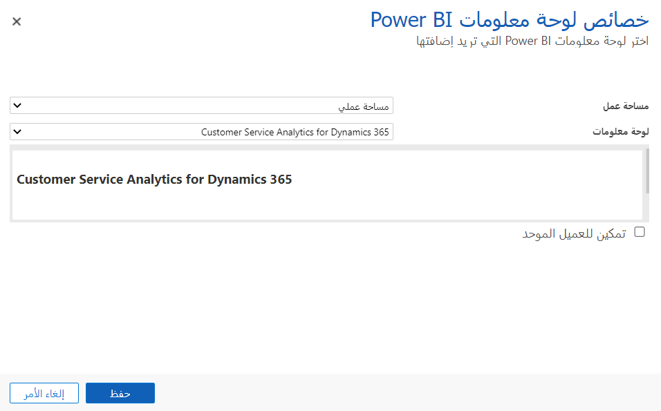
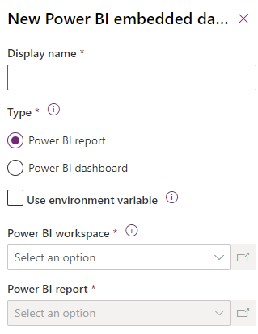
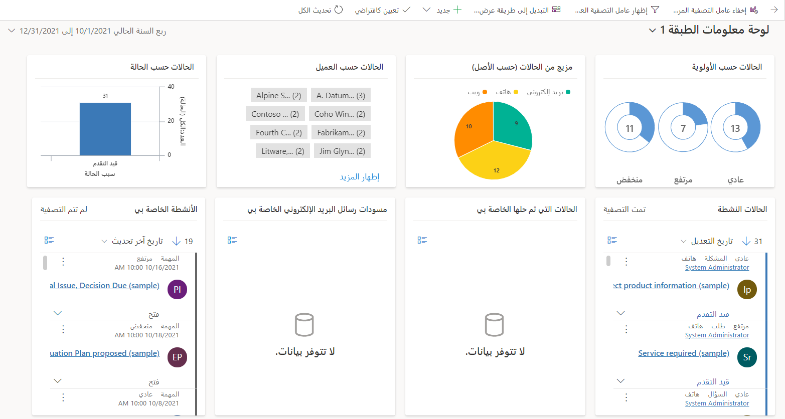
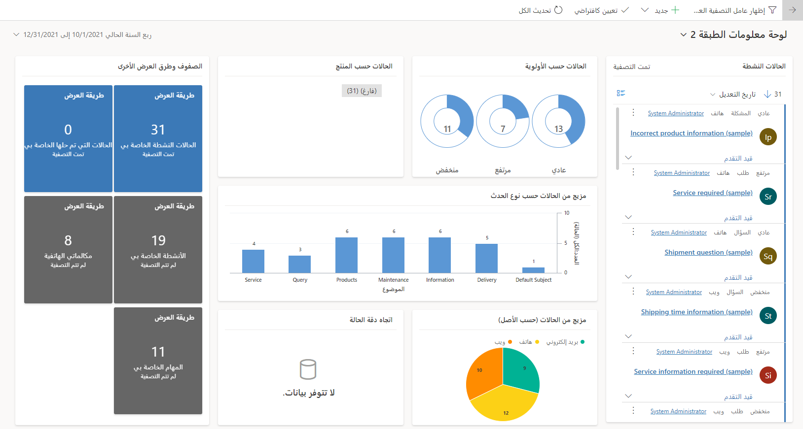

عند اتخاذ قرارات العمل، يتمكن المستخدمون بفضل لوحات المعلومات من عرض أهم المعلومات التي يحتاجون إليها. يمكن أن تتكون لوحات المعلومات من مخططات وقوائم وموارد أخرى، مثل صفحات الويب الخارجية. تضم Dynamics 365 Customer Service العديد من لوحات المعلومات المكوّنة مسبقاً والتي تساعد في توضيح المعلومات الأكثر أهمية. يمكنك تغيير لوحات المعلومات مسبقة التكوين، كما يمكنك إنشاء لوحات معلومات مخصصة.

ولوحة المعلومات هي مجموعة من طرق العرض والمخططات وإطارات Iframes وموارد الويب والتقارير الرسومية الأخرى التي توفر نظرة عامة ذات مستوى عالٍ على البيانات في شاشة واحدة. فمثلاُ، يمكنك إظهار درجات الرضا عن الحالة جنباً إلى جنب مع عمليات انتهاء صلاحية الاستحقاق وخليط الحالات بحسب الأولوية.
تُظهر لقطة الشاشة التالية مثالاً على إحدى لوحات المعلومات.

> [!div class="mx-imgBorder"] 
> 

تُسمى العناصر التي يتم تقديمها على لوحة المعلومات بـ "المكونات"، ويمكن أن تشتمل كل لوحة معلومات على ستة مكوّنات بحد أقصى. تتيح لك هذه الميزة تحليل بيانات خدمة العملاء المختلفة في نفس الوقت. تعد لوحة المعلومات، بشكل أساسي، لقطة من البيانات بتنسيقات مختلفة من جداول مختلفة في صفحة واحدة.

> [!NOTE]
> ستقدم صفحة لوحة المعلومات أحدث البيانات كلما قام المستخدم بتحميلها، ورغم ذلك لا يتم تحديثها تلقائياً.

## لوحات معلومات الحالة

تضم Dynamics 365 Customer Service العديد من لوحات المعلومات الجاهزة التي تسمح للمستخدمين بقياس إنتاجيتهم ومقارنة مدى توافقهم مع مستخدمين آخرين داخل مؤسستهم. تسمى لوحات المعلومات الجاهزة هذه "لوحات معلومات النظام" وبإمكان جميع مستخدمي المؤسسة عرضها نظراً لتوافرها لديهم. في Dynamics 365 Customer Service، تضم لوحات المعلومات الجاهزة ما يلي:

- لوحة معلومات Connected Customer Service

- لوحة معلومات مدير Customer Service

- لوحة معلومات أداء Customer Service

- لوحة المعلومات الاجتماعية لممثل خدمة العملاء

- مدير المعرفة

- لوحة المعلومات المعرفية لديّ

- لوحة المعلومات من المستوى 1

- لوحة المعلومات من المستوى 2

تُظهر كلّ لوحة معلومات رسوماً مرئية أو طرق عرض مختلفة، على السجلات الواردة من أحد الجداول. يمكنك توسيع المكونات أو التنقل لأسفل في السجلات المستخدمة لإنشاء المخططات بتحديد الزر المناسب.

> [!div class="mx-imgBorder"]
> 

إذا حددت الأيقونة **عرض السجلات**، فستفتح إحدى النوافذ التي تُظهر المخطط وقائمة بالسجلات التي تم استخدامها لإنشاء المخطط.

> [!div class="mx-imgBorder"]
> 

## لوحات المعلومات المخصصة

يمكنك تخصيص لوحات المعلومات هذه وإنشاء المزيد منها عند الضرورة، وذلك إذا كانت لوحات المعلومات الجاهزة لا تفي باحتياجاتك.
يُطلق على لوحات المعلومات التي يقوم المستخدمون الفرديون بإنشائها اسم "لوحات المعلومات الشخصية". تكون لوحات المعلومات الشخصية ظاهرة فقط للمستخدمين الذين أنشأوها بشكل افتراضي، لكن يمكنهم مشاركتها مع مستخدمين آخرين إذا لزم الأمر. حدد زر **‏‫لوحة معلومات Dynamics 365‬** في شريط الأوامر، وذلك لإنشاء لوحة معلومات شخصية. يمكنك إضافة لوحات معلومات النظام من داخل **الحلول** في مدخل صانع [Power Apps](https://make.powerapps.com?azure-portal=true).

هناك ثلاثة أنواع من لوحات المعلومات التي يمكنك إنشاؤها وهي:

- **لوحة معلومات Dynamics 365** - وتحتوي على مكوّنات مثل القوائم والمخططات.

- لوحة معلومات **Power BI** - تضمين تقرير Power BI أو لوحة المعلومات.

- **لوحة المعلومات التفاعلية** - وهي لوحات معلومات Dynamics 365 التي تتيح لك التفاعل مع سجلات Dynamics 365 وتصفيتها والعمل عليها.

## لوحات معلومات Dynamics 365

> [!NOTE]
> تختلف خطوات إضافة لوحة معلومات اختلافاً طفيفاً عن لوحات المعلومات الشخصية ولوحة معلومات النظام.

في مركز "خدمة العملاء"، انتقل إلى **الخدمة > لوحات المعلومات** وحدد **+ جديد** ثم حدد **لوحة معلومات Dynamics 365**. الخطوة التالية هي تحديد أحد تخطيطات لوحة المعلومات.

> [!div class="mx-imgBorder"]
> 

في أحد الحلول المتوفرة في مدخل صانع Power Apps، حدد **+ جديد** وحدد **لوحة المعلومات** ثم حدد التخطيط.

في مصمم لوحة المعلومات، يمكنك إضافة مكونات استناداً إلى احتياجاتك المحددة. يتضمن كل عنصر نائب للمكون الأزرار التي تتوافق مع مختلف أنواع المكونات التي يمكنك إعدادها. يمكنك تغيير حجم المكوّنات أو نقلها أو حذفها كما يلزم، عند إضافتها إلى لوحة المعلومات.

تشمل أنواع المكونات التي يمكنك إضافتها إلى لوحة المعلومات ما يلي:

- **المخطط** - يُظهر هذا المكوّن مخطط Dynamics 365. تأكد من تحديد الخصائص التالية عند إضافة أحد المخططات إلى لوحة معلومات:

  - الجدول المطلوب استخدامه

  - طريقة العرض التي تعرّف البيانات الظاهرة في المخطط

  - المخطط المحدد المطلوب إظهاره

- **القائمة** - يُظهر هذا المكوّن طريقة عرض محددة لـ Dynamics 365. تأكد من تحديد الخصائص التالية عند إضافة إحدى القوائم إلى لوحة معلومات:

  - الجدول المطلوب استخدامه

  - طريقة العرض المحددة المطلوب إظهارها

- **المساعد** - يُظهر هذا المكوّن "المساعد".

- **Iframe** - يُظهر هذا المكوّن معلومات لصفحة ويب.

- **مورد الويب** - يُظهر هذا المكوّن معلومات لمورد ويب.

- إطار **Power BI** - يتيح لك هذا المكوّن إضافة إطار متجانب من لوحة معلومات Power BI إلى لوحة المعلومات التي تقوم بإنشائها.

في كل مكوّن، يمكنك تحديد أيقونة نوع المكوّن، كما هو موضح في لقطة الشاشة التالية.

> [!div class="mx-imgBorder"]
> 

> [!IMPORTANT]
> تأكد من تمكين **دمج الرسوم المرئية لـ Power BI** في إعدادات النظام بحيث يمكنك إضافة إطارات Power BI. افتراضياً، يتم تعيين هذا الخيار إلى **إيقاف تشغيل**. بالإضافة إلى ذلك، لا يمكنك إضافة إطار Power BI المتجانب إلى لوحة معلومات نظام Dynamics 365.

يمكنك حفظ لوحة المعلومات وإغلاقها بعد ظهورها بالشكل الذي تريده.
ستتوفر لوحة المعلومات التي قمت بإنشائها في قائمة لوحات المعلومات وذلك في المرة التالية التي تحدد فيها الخيار **لوحات المعلومات** في مخطط الموقع.
تَظهر لوحات المعلومات الشخصية دائماً في أعلى القائمة ضمن **لوحات المعلومات الخاصة بي**.

## لوحات معلومات Power BI

تُستخدم لوحات معلومات Power BI لعرض البيانات المهمة والإبلاغ عنها ويمكن استخدامها بعدد من الطرق المختلفة. يمكنك أيضاً تضمينها في تطبيقات مثل Customer Service.

> [!IMPORTANT]
>  تأكد من تمكين **تضمين الرسوم المرئية لـ Power BI** في إعدادات النظام بحيث يمكنك إضافة لوحات معلومات Power BI. افتراضياً، يتم تعيين هذا الخيار إلى **إيقاف تشغيل**.

### تمكين تقارير Power BI

لتضمين لوحات معلومات Power BI والإطارات المتجانبة في التطبيقات المستندة إلى النموذج، ستحتاج إلى تمكين تقارير Power BI في Dynamics 365.

في مركز مسؤولي [Microsoft Power Platform](https://admin.powerplatform.microsoft.com/?azure-portal=true)، حدد **الإعدادات** لبيئة Dynamics 365 الخاصة بك.

انتقل إلى **المنتج** > **الميزات**، وقم بتشغيل **تضمين الرسوم المرئية لـ Power BI**، ثم حدد **حفظ**.

> [!div class="mx-imgBorder"]
> 

### قم بتضمين لوحة معلومات Power BI شخصية في Dynamics 365 Customer Service

يمكنك تضمين لوحة معلومات Power BI في تطبيقات "خدمة العملاء". في مركز "خدمة العملاء"، انتقل إلى **الخدمة > لوحات المعلومات** وحدد **+ جديد** ثم حدد **لوحة معلومات Power BI**.

في النافذة المنبثقة، حدد **مساحة العمل** و **لوحة المعلومات** التي تريد استخدامها ثم حدد **حفظ**.

> [!div class="mx-imgBorder"]
> 

### تضمين إحدى لوحات معلومات النظام لـ Power BI في Dynamics 365 Customer Service

لإضافة لوحة معلومات النظام لـ Power BI في أحد الحلول في مدخل صانع Power Apps، حدد **+ جديد > لوحة المعلومات > Power BI Embedded**.

> [!div class="mx-imgBorder"]
> 

عند إضافة لوحة معلومات Power BI مضمّنة إلى أحد الحلول، يمكنك إضافة تقرير Power BI أو لوحة معلومات Power BI.

في النافذة المنبثقة، حدد **مساحة العمل** و **النوع** و **التقرير** أو **لوحة المعلومات** التي تريد استخدامها ثم حدد **حفظ**.

## لوحات المعلومات التفاعلية

تختلف لوحات المعلومات التفاعلية عن لوحات المعلومات الأخرى من حيث إنها ستقدم تمثيلاً مرئياً للبيانات المرتبطة بجدول واحد.
هناك نوعان من التجارب التفاعلية وهما:

- **متعددة الدفق** - يعرض البيانات للعديد من الدفق للبيانات. يمكن أن تكون عمليات الدفق لنفس الجدول أو لجداول مختلفة.

- **دفق واحد** - يعرض البيانات لدفق واحد من البيانات من جدول واحد.

تحتوي لوحات المعلومات متعددة الدفق وأحادية الدفق على مخططات تفاعلية توفر عدداً من الصفوف ذات الصلة، مثل الحالات بحسب الأولوية أو بحسب الحالة.
تعمل تلك المخططات أيضاً كعوامل تصفية مرئية. تعتمد عوامل التصفية المرئية (المخططات التفاعلية) على جداول متعددة. يحدد الجدول الموجود في دفق البيانات جدول عامل التصفية المرئي، في لوحات المعلومات أحادية الدفق.

يمكن للمستخدمين تطبيق المزيد من عوامل التصفية باستخدام عامل التصفية العمومي وعامل تصفية الإطار الزمني.
يعمل عامل التصفية العمومي على مستوى العمود في جميع المخططات وأيضاً على عمليات الدفق والإطارات المتجانبة التي تستند إلى جدول عوامل التصفية (يمكنك تحديد جدول عوامل التصفية عند إعداد عوامل التصفية المرئية).

### لوحة المعلومات متعددة الدفق

تعرض لوحة المعلومات متعددة الدفق بياناتك في الوقت الفعلي من خلال تدفقات بيانات فردية أو متعددة. يمكن أن تكون البيانات الموجودة في الدفق من جدول واحد فقط، ولكن يمكن أن توجد العديد من عمليات الدفق، بحيث يستخدم كل دفق جدولاً مختلفاً.

يمكنك عرض صف من عوامل التصفية المرئية في الأعلى مع عمليات دفق البيانات تحتها، في لوحة المعلومات متعددة الدفق.

> [!div class="mx-imgBorder"]
> 

### لوحة المعلومات أحادية الدفق

تعرض لوحات المعلومات أحادية الدفق البيانات من دفق واحد من طريقة عرض جدول واحد. يمكنك إضافة العديد من المكوّنات إلى لوحة معلومات أحادية الدفق واحد أكثر من لوحة معلومات متعددة الدفق.

تحتوي لوحة المعلومات أحادية الدفق على دفق البيانات على اليسار وعوامل التصفية المرئية والإطارات المتجانبة على اليمين.

> [!div class="mx-imgBorder"]
> 

### إنشاء لوحات معلومات تفاعلية

لا يمكنك إنشاء لوحات معلومات تفاعلية شخصية؛ يجب إنشاؤها في أحد الحلول وفي مستكشف الحلول "الكلاسيكي".

عندما تقوم بإنشاء لوحة معلومات تفاعلية، حدد دفقاً واحداً أو دفقاً متعدداً ثم حدد الجداول وطرق العرض لاستخدامها في عمليات الدفق.
