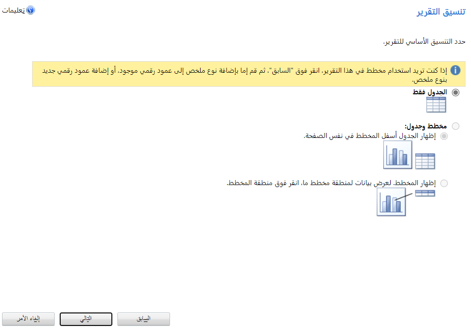

تتوفر لديك العديد من الخيارات فيما يتعلق بالتقارير في Dynamics 365 Customer Service.
تشمل Dynamics 365 Customer Service عدة تقارير للنظام التي يمكنك استخدامها للحصول على رؤى حول كيفية أداء نشاطك التجاري. يمكنك استخدام هذه التقارير كما هي، أو تخصيصها لتلبية احتياجاتك. بالإضافة إلى ذلك، يمكنك استخدام معالج التقارير لإنشاء تقارير مخصصة جديدة.

## تقارير النظام

يتم توفير العديد من التقارير لـ Dynamics 365 Customer Service.
توضح الأقسام التالية ثلاثة تقارير رئيسيه: **الحالات المهملة**، و **الأنشطة**، و **حجم نشاط الخدمة**.

### تقرير الحالات المهملة

باستخدام تقرير **الحالات المهملة**، يمكنك تحسين تحليلات فريق الخدمة الخاص بك وإغلاق الحالات الخاصة بك.
بالإضافة إلى ذلك، يمكنك التعرّف بسرعة على الحالات التي لم يتم تحديثها مؤخراً والعمل عليها.
كما يوضح التقرير أيضاً اسم مندوب الخدمة الذي تم تعيينه للحالة. يمكنك استخدام هذه المعلومات لمتابعة الفريق الخاص بك والبدء في حل هذه الحالات.

### تقرير الأنشطة

استخدم **تقرير الأنشطة** لتوفير خدمة أفضل لعملائك. كما يمكنك الحصول علي عرض سريع لكافة الأنشطة المقترنة بحالات الدعم، مثل المكالمات الهاتفية، والمهام، ورسائل البريد الكتروني، والمواعيد، وحل الحالة. استخدم المعلومات الموجودة في هذا التقرير لمراجعة تفاصيل كل نشاط وتحديد الأنماط لإجراء تحسينات على كيفية التواصل مع عملائك.

### تقرير حجم نشاط الخدمة

استخدم تقرير **حجم نشاط الخدمة** لمراجعة الأنماط في حجم نشاط الخدمة. يعرض التقرير مدة أو عدد أنشطة الخدمة التي تم تجميعها حسب الخدمات، والموارد، والفترات الزمنية، والمعايير الإضافية.

> [!div class="mx-imgBorder"]
> 

> [!NOTE]
> هذه التقارير عملية ورائعة. يمكنك تغيير عوامل التصفية وتغيير كيفية تجميع البيانات. يمكنك أيضاً التنقل لأسفل داخل السجلات والتنقل مباشرةً إلى السجل في مركز خدمة العملاء.
يمكنك أيضاً طباعة وتنزيل تلك التقارير كملفات PDF أو Microsoft Word أو Excel.

## معالج التقارير

إذا كنت ترغب في إنشاء التقارير الخاصة بك في Dynamics 365 Customer Service، يمكنك القيام بذلك من خلال طريقة عرض **التقارير**.

> [!IMPORTANT]
> إذا لم تكن التقارير متوفرة في تنقل التطبيق، ستحتاج إلى إضافة جدول التقارير إلى مخطط موقع التطبيق.

> [!div class="mx-imgBorder"]
> 

حدد **+ جديد** لإنشاء تقرير جديد.

> [!div class="mx-imgBorder"]
> 

حدد **معالج التقارير** لبدء إنشاء التقرير الخاص بك.

> [!div class="mx-imgBorder"]
> 

يمكنك اختيار البدء بتقرير حالي أو إنشاء تقرير جديد حسب الحاجة. عندما تتخذ قرارك، حدد **التالي**.

> [!div class="mx-imgBorder"]
> 

حدد **خصائص التقرير** بإعطائها اسماً ووصفاً، وحدد الجدول الذي تريد الإبلاغ عنه، ثم حدد **التالي**.

> [!div class="mx-imgBorder"]
> 

قم بإعداد عامل التصفية لتحديد السجلات المطلوب تضمينها في التقرير الخاص بك ثم حدد **التالي**.

> [!div class="mx-imgBorder"]
> 

قم بإعداد التخطيط عن طريق تحديد الأعمدة من الجدول كمجموعة أو تفاصيل، ثم حدد **التالي**.

> [!div class="mx-imgBorder"]
> 

حدد تنسيق التقرير لتضمين مخطط أو استبعاده، ثم حدد **التالي**.

> [!div class="mx-imgBorder"]
> 

حدد **+ جديد** لإنشاء التقرير.

> [!div class="mx-imgBorder"]
> 

لقد قمت بإنشاء التقرير الخاص بك بنجاح. حدد **إنهاء**.

> [!div class="mx-imgBorder"]
> 

حدد **تشغيل التقرير** لتشغيل التقرير.

> [!div class="mx-imgBorder"]
> 
