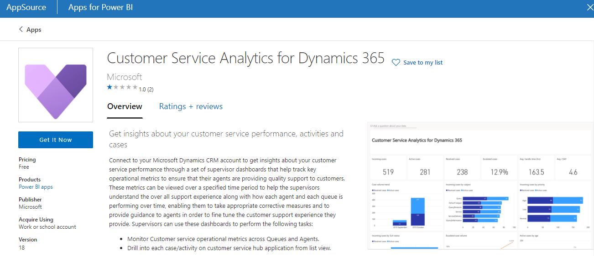
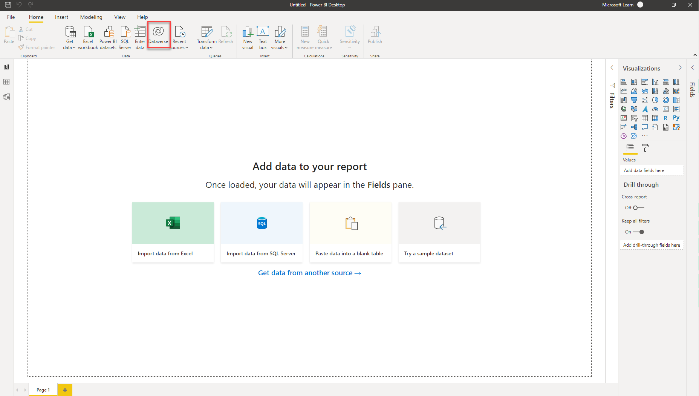
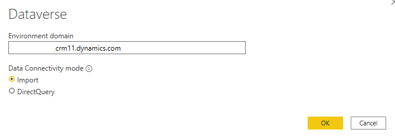
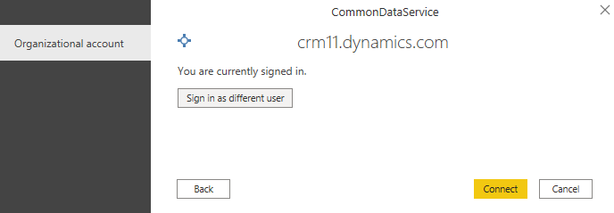
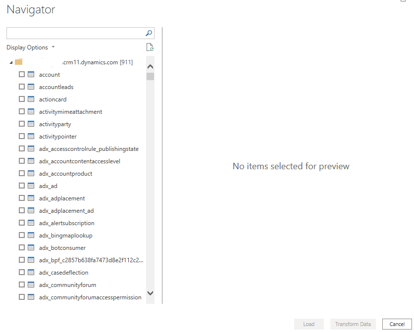
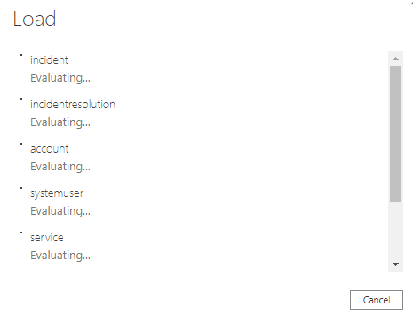
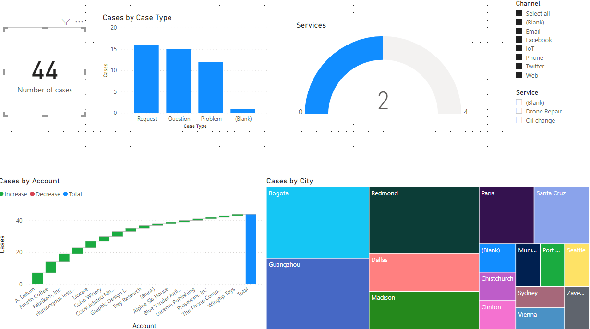

كما ذكر سابقاً، يمكنك تضمين تقارير Power BI ولوحات المعلومات والإطارات المتجانبة في Dynamics 365 Customer Service. وتقوم هذه الوحدة باستكشاف كيف يمكن لـ Power BI استهلاك البيانات من Dynamics 365 لإنشاء تقارير ولوحات معلومات Power BI.

> [!NOTE]
> لا توضح هذه الوحدة النمطية كيفية إنشاء تقارير Power BI بالتفصيل؛ ويكون التركيز على كيفية اتصال Power BI ببيانات Dynamics 365 Customer Service.

## نظرة عامة على Power BI

Microsoft Power BI عبارة عن مجموعة من أدوات تحليل الأعمال التي تقدم رؤى من خلال مؤسستك. يساعد Power BI على الاتصال بمئات من مصادر البيانات، ويبسط عملية إعداد البيانات، ويقود التحليل الفوري.
باستخدام الأدوات التي توفرها Power BI، يمكنك إنتاج تقارير مقنعة ثم نشرها حتى تتمكن مؤسستك من استهلاكها على الويب وعبر الأجهزة المحمولة.

يمكن للجميع إنشاء لوحات معلومات مخصصة تمنحهم عرضاً فريداً بزاوية 360 درجة لأعمالهم، والتي تتسع عبر المؤسسة، والتي تشتمل على الحوكمة وميزات الأمان. تتوفر هذه الميزات والأدوات من خلال موقع ويب Power BI. يوفر موقع الويب هذا موقعاً يمكنك فيه إنشاء لوحات معلومات مخصصة. بالإضافة إلى ذلك، يشتمل موقع الويب على لوحات معلومات Power BI المكونة مسبقاً التي تم إنشاؤها خصيصاً لـ Microsoft Dynamics 365 Customer Service.

Power BI هي أداة مفيدة لمساعدتك في تحليل بيانات Microsoft Dynamics 365. نظراً لأنه تطبيق تحليلات كامل للمؤسسات، فإن له نظاماً بيئياً خاصاً به. تتصل التطبيقات المتوفرة لـ Power BI بمئات من مصادر البيانات المختلفة، بما في ذلك Dynamics 365. لذلك، من السهل عليك الاتصال والحصول على بيانات مفيدة على الفور.

يمكنك توصيل Dynamics 365 الخاص بك باستخدام تطبيق Power BI تم تكوينه مسبقاً أو عن طريق إنشاء تقارير Power BI الخاصة بك.

## تطبيق Power BI

يحتوي تطبيق Customer Service Analytics for Dynamics 365 من Power BI على العديد من التقارير ولوحات المعلومات للحالات وقوائم الانتظار والمندوبين. يمكنك استخدام هذا التطبيق لتحليل بيانات خدمة العملاء.

> [!div class="mx-imgBorder"]
> 

تم شرح هذا التطبيق بمزيد من التفصيل في وحدة الشروع في العمل مع Customer Service Insights.

## قم بتوصيل Power BI بـ Dynamics 365 Customer Service

Power BI Desktop هو تطبيق Microsoft Windows الذي يمكنك من الاتصال بالبيانات وإنشاء التقارير قبل النشر إلى خدمة Power BI على powerbi.com.

> [!div class="mx-imgBorder"]
> 

حدد رمز **Dataverse** الموجود في شريط الأدوات لتلقي المطالبة بمجال المؤسسة الخاص ببيئة Dynamics 365 Customer Service.

> [!div class="mx-imgBorder"]
> 

> [!NOTE]
> يمكنك تحديد خيار **الاستيراد**، حيث يتم نسخ البيانات في Power BI ثم تحديثها على أساس مجدول. وبدلاً من ذلك، يمكنك تحديد الخيار **DirectQuery** حيث يتم الاستعلام عن البيانات في الوقت الحقيقي من Dataverse عند وصول أحد المستخدمين إلى تقرير Power BI.

انسخ عنوان URL الخاص ببيئتك ثم حدد **موافق**. إذا طُلب منك ذلك، سجّل الدخول باستخدام بيانات اعتماد Dynamics 365 الخاصة بك.

> [!div class="mx-imgBorder"]
> 

حدد **اتصال**.

> [!div class="mx-imgBorder"]
> 

حدد الجداول في Dataverse التي تريد استخدامها في التقارير الخاصة بك.
تتطلب هذه العملية فهم نموذج البيانات الخاص بتطبيق Dynamics 365 Customer Service. يمكنك تحديد **التحميل** لاستيراد جميع الجداول والأعمدة والبيانات. بدلاً من ذلك، حدد **تحويل البيانات** لبدء **Power Query**، حيث يمكنك تنظيف بياناتك وتحويلها.

> [!div class="mx-imgBorder"]
> 

بعد تحميل البيانات، يمكنك استخدام وظيفة Power BI لإنشاء الرسوم المرئية، كما هو موضح في لقطة الشاشة التالية.

> [!div class="mx-imgBorder"]
> 

## الاعتبارات

نظراً لأن Power BI يتصل بـ Dynamics 365، فهناك بعض القيود التي يجب مراعاتها عندما تقرر استخدام Power BI:

- لا يعمل Power BI في سياق السجلات أو المستخدمين. على عكس المخططات ولوحات المعلومات، لا يتم تشغيل Power BI في سياق سجل أو مستخدم.
ومع ذلك، باستخدام موصل Dataverse، يتم تنفيذ سياق الأمان الخاص بالمستخدم من خلال Power BI بحيث يتمكن المستخدمون فقط من رؤية البيانات التي يحق لهم الحصول عليها.

- تظهر تحديثات البيانات في كل ساعة أو يومياً إذا كنت تستخدم خيار **الاستيراد**. لا يُظهر Power BI عرض الوقت الفعلي لبيانات Dynamics 365. يتم تحديث البيانات على فترات زمنية محددة تعتمد على فئة التسعير الخاصة بك.

- ويتم فصل تطبيق Dynamics 365 وخدمة Power BI. Power BI هو تطبيق منفصل يتصل ببيانات Dynamics 365. قد يتطلب الأمر تراخيصاً أخرى بالإضافة إلى تراخيص Dynamics 365 الخاص بك.
