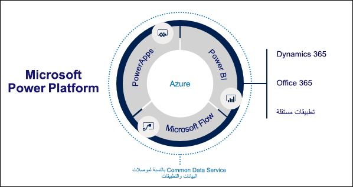
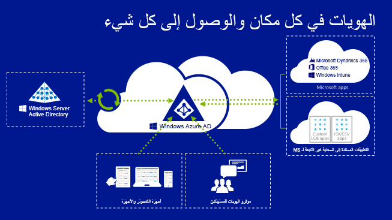

Microsoft Power Platform هو نظام أساسي لتطوير التطبيقات عالي الإنتاجية من Microsoft. يتم استخدام النظام الأساسي من جانب Microsoft لبناء تطبيقات الطرف الأول الخاصة بها Dynamics 365 for Sales وService وField Service وMarketing وTalent. وهذا يعني أن هذه التطبيقات مبنية أصلاً في النظام الأساسي. يستطيع عملاء المؤسسات أيضاً بناء تطبيقات خطوط الأعمال المخصصة الخاصة بهم باستخدام التكنولوجيا نفسها. يمكن كذلك للمستخدمين الفرديين والفرق الفردية داخل مؤسستك إنشاء تطبيقات إنتاجية شخصية أو جماعية دون كود أو بكود منخفض.

إن Microsoft Power Platform يتضمن Power Apps وPower BI وPower Automate، مما يؤدي للاستفادة من البنية الأساسية المشتركة لتطبيق Microsoft Dataverse للتطبيقات وموصلات البيانات. تم إنشاء هذه القدرات على الخدمات السحابية من Microsoft Azure وتستفيد منها. كما يمكن أن تتضمن التطبيقات المبنية على النظام الأساسي Power Apps خدمات السحابة Azure للتوسع من الإنتاجية الفردية إلى المجموعة المهمة من تطبيقات الأعمال للمؤسسة.

### أمن النظام الأساسي

بياناتك محمية بشكلٍ آمن لأن النظام الأساسي لتطبيق الأعمال مبني على [Microsoft Azure](https://www.microsoft.com/trustcenter/Security/AzureSecurity). وهذا يعني أنها ستستفيد من تقنيات الأمان القوية لنظام Azure الأساسي. كما أن تشفير البيانات، في أثناء السكون والانتقال، يحافظ على السرية. إضافة إلى ذلك، تستخدم خدمات النظام الأساسي لتطبيق الأعمال مجموعات أمامية وخلفية منفصلة ودور البوابة وبنية تخزين البيانات الآمنة. ويساعد ذلك على حماية معلوماتك ويسمح بتوحيد بيانات مؤسستك سواء في السحابة أو داخلياً.

### المصادقة

يمكنك الآن التأكد من أن وصول المستخدم إلى بياناتك آمناً وتحت السيطرة. يستخدم النظام الأساسي لتطبيق الأعمال [Azure Active Directory (AzureAD)](https://www.microsoft.com/cloud-platform/azure-active-directory) آليات إدارة الهوية والوصول للمساعدة على ضمان أن المستخدمين المخولين فقط من يمكنهم الوصول إلى البيئة والبيانات والتقارير.

يستخدم النظام الأساسي لتطبيق الأعمال Azure AD كمستودع هوية للمصادقة والتخويل. عندما يقوم المستخدمون بتسجيل الدخول إلى خدمات النظام الأساسي لتطبيق الأعمال عبر موقع ويب (HTTPS) آمن، يتم تشفير جميع الاتصالات بين متصفح الويب الخاص بالمستخدم وخدمة النظام الأساسي لتطبيق الأعمال.

يقوم [‬‏‫مدير حركة بيانات Azure](https://azure.microsoft.com/services/traffic-manager/) بتلقي الطلب و---إستناداً إلى موقع المستخدم---يحدد موقع أقرب توزيع خدمة، ثم يستجيب باستخدام عنوان IP الخاص بمجموعة واجهة الويب الأمامية (WFE).

لمعرفة المزيد حول كيفية تنفيذ مدير حركة بيانات Azure لتوجيه حركة البيانات، تتوفر وثائق [Microsoft Azure في أساليب توجيه حركة البيانات بواسطة مدير حركة البيانات](https://docs.microsoft.com/azure/traffic-manager/traffic-manager-routing-methods#performance-traffic-routing-method).

للتعرف على شبكة تسليم محتوى Azure (CDN) التي يتم تنزيل الملفات الضرورية منها، مقاطع فيديو لشبكة تسليم محتوى وثائق [Microsoft Azure](https://azure.microsoft.com/documentation/services/cdn/).

### التشفير

يمكن أن يساعد التشفير على حماية البيانات سواء في حالة السكون أو الانتقال. يتم تشفير البيانات المطلوبة والمحالة أثناء النقل باستخدام HTTPS.

يتم تشفير البيانات المنقولة من خلال بوابة البيانات الداخلية. يتم إرسال البيانات التي يقوم المستخدمون عادة بتحميلها إلى مخزن البيانات الثنائية كبيرة الحجم لـ Azure، ويتم تخزين كافة بيانات التعريف والعناصر للنظام نفسه في قاعدة بيانات Azure SQL ومخزن جداول Azure.

### تفادي فقدان البيانات

يمكن للمسؤولين تكوين سياسات تفادي فقدان البيانات للتحكم في تدفق البيانات بين الخدمات المختلفة في تدفقاتها وتطبيقاتها.
ويمكن لهذه السياسات منع إرسال البيانات إلى أنظمة غير متوافقة حتى إذا كان المستخدم النهائي يتمتع بحق الوصول لإرسال هذه المعلومات يدوياً.

> [!Note]
> تنطبق سياسات تفادي فقدان البيانات على أي تطبيقات مخصصة وتدفقات مضمنة من خلال Power Apps. ولا تنطبق على تطبيقات Dynamics 365 Customer Engagement الجاهزة. للحصول على مزيد من المعلومات، راجع [سياسات تفادي فقدان البيانات](https://docs.microsoft.com/power-automate/prevent-data-loss).

### الخصوصية

في Microsoft، نتعامل بحزمٍ مع المعايير الصارمة فيما يتعلق بخصوصية بيانات العملاء وحمايتها. ونتخذ إجراءات قوية لحماية بياناتك من الأشخاص غير المخولين أو الوصول غير المناسب. لا تحظر سياسات Microsoft استخراج بياناتك للتسويق أو الإعلان فحسب، بل نقيد أيضاً وصول موظفي Microsoft والمقاولين من الباطن، ونحدد متطلبات الاستجابة لطلبات الحكومة لبيانات العملاء بعناية. ومع ذلك، تكون بيانات العملاء الخاصة بك متاحة لك في أي وقت ولأي سبب من الأسباب.

تلتزم Microsoft بالقوانين الدولية لحماية البيانات فيما يتعلق بعمليات نقل بيانات العملاء عبر الحدود. كما نقدم شبكة موسعة من مراكز البيانات العمومية لمساعدة العملاء على الوفاء بالقيود الجغرافية على تخزين البيانات.

### Microsoft Dynamics 365والقانون العام لحماية البيانات (GDPR)

يتعلق القانون العامة لحماية البيانات (GDPR) بشكلٍ أساسي بحماية حقوق الخصوصية للأفراد وتمكينها. يمكنك قراءة المزيد حول التزام Microsoft بالأمان في مركز توثيق Microsoft.
Microsoft Dynamics 365 يلتزم بمساعدة عملائنا على استيفاء متطلبات القانون العام لحماية البيانات (GDPR). في هذا الموضوع، ستجد العديد من المعلومات والموارد التي تساعدك على فهم كيفية دعم Microsoft Dynamics للقانون العام لحماية البيانات (GDPR) وكيف نقدم المعلومات والأدوات التي يحتاج إليها عملائنا لتحديد التزاماتهم بالقانون العام لحماية البيانات (GDPR) ودعمها.
فيما يأتي أنواع المعلومات التي يتوفر لدينا معلومات إضافية بشأنها:

- المستندات التقنية
- طلبات أصحاب البيانات
- مدير التوافق
- البث الشبكي
- منشورات المدونة
- الكتب الإلكترونية

[اعرف المزيد عن القانون العام لحماية البيانات (GDPR) على Microsoft Dynamics 365 وGDPR](https://docs.microsoft.com/powerapps/administrator/create-dlp-policy)
