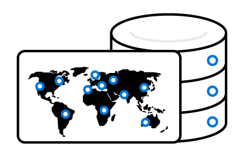
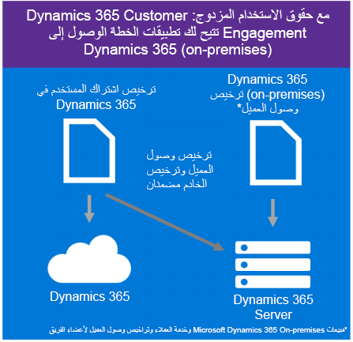

سيتم توزيع تطبيقات Dynamics 365 Customer Engagement الخاصة بك بشكل أكثر سلاسة مع بعض التخطيط الأولي.

### تحديد نهج توزيع المستأجر والمثيل

سيتم توزيع معظم المؤسسات التي تنفذ تطبيقات Microsoft Dynamics 365 Customer Engagement عبر الإنترنت بالكامل في السحابة. كل مستأجر Microsoft Dynamics 365 سيتضمن مثيل إنتاج واحد ومثيلاً غير إنتاجي واحد. استناداً إلى عملية إدارة دورة حياة التطبيق (ALM)، قد تحتاج إلى سعة اشتراك إضافية (مثل مثيلات إضافية أو تخزين)، ويمكنك تضمين هذه التراخيص الإضافية الاختيارية مع اشتراكك. تنطبق الوظائف الإضافية للاشتراك عبر المستأجر؛ ولا ترتبط بمستخدم معين.

من المهم أن يتم قضاء بعض الوقت لتحليل المتطلبات التقنية للمؤسسة التي تقوم بتوزبع Microsoft Dynamics 365 لتصميم حل يستوفي هذه المتطلبات. يمكن توزيع حلول Microsoft Dynamics 365 Online على نهج المستأجر الفردي الأساسي أو المثيل المزدوج أو يمكن نشرها على نهج متعدد المثيلات وحتى متعدد المستأجرين، وفقاً لاحتياجات المؤسسة. سنستكشف هذه المفاهيم بمزيد من التفصيل في **تخطيط التوزيع**.

Microsoft Dynamics 365 CE Online هو حل "خدمة تأجير برامج (SaaS)" مع مرونة كبيرة من حيث نماذج التوزيع. كل ترخيص اشتراك مستخدم (USL) يخص Microsoft Dynamics 365 CE Online يُتيح حقوق الاستخدام المزدوج التي تسمح للعملاء بخيار توزيع برنامج الخادم إما في سحابة Microsoft أو في سحابة خاصة محلية أو مستضافة من قِبل شريك. في بعض الحالات، قد يرغب العملاء في توزيع كلا النوعين من المثيلات في آنٍ واحد. قد يتم ذلك للمساعدة على ترحيل توزيع Dynamics 365 on-premises إلى Dynamics 365، تشغيل عمليات توزيع Dev/Test الخاصة في Microsoft Azure.

### حدد المتوفر مع اشتراك Dynamics 365

ستعمل قدرات الاشتراك الافتراضية لخطة تطبيقات Dynamics 365 Customer Engagement على الاستفادة من نفس المستأجر وستتراكم البنية الأساسية عبر المستأجر الواحد.

للحصول على أحدث تفاصيل الترخيص، راجع: أسعار [Microsoft Dynamics 365](https://dynamics.microsoft.com/pricing/)

#### الخدمات والبرامج الإضافية

تقدم Microsoft خدمات وبرامج إضافية تعمل إلى جانب Dynamics 365. ويتم تضمين هذه الخدمات مع المستخدم الكامل كما هو موضح أدناه. ليست هناك حاجة إلى ترخيص هذه الخدمات والبرامج الإضافية.

**Microsoft Power Platform** - تم إنشاء تطبيقات Dynamics 365 في Microsoft Power Platform، نظام أساسي عالي الإنتاجية يتضمن قدرة العملاء على دمج المنتجات:

- Power Apps تعمل على توسيع التطبيقات وتخصيصها:
- Power Automate: أتمتة عمليات الأعمال وسير العمل.
- Power BI يوفر ذكاء الأعمال

حدد تطبيقات Dynamics 365 التي يمكن تخصيصها باستخدام قدرات Power Apps وPower Automate. كما أن تطبيقات المؤسسة وخطط المؤسسة لـ Dynamics 365 تتضمن الخطة 2 من Power Apps، حيث تقدم تخصيصات أكثر تقدماً بالإضافة إلى القدرة على إنشاء تطبيقات مخصصة مستقلة وتشغيلها.

ترجى زيارة [Power Apps](https://powerapps.microsoft.com) و[التدفق](https://flow.microsoft.com) لمزيد من التفاصيل حول Power Apps والتدفق.

> [!NOTE]
> - يتم ترخيص قدرات Power BI بشكل منفصل في هذا الوقت.
> - ويتم تحديد حقوق استخدام Power Apps والتدفق استناداً إلى تطبيق Dynamics 365 أو الخطة التي تم ترخيص المستخدم لها. يرجى الاطلاع على [نظرة عامة على الترخيص](https://docs.microsoft.com/power-platform/admin/pricing-billing-skus) للحصول على المزيد من المعلومات.

بالإضافة إلى هذه التطبيقات المعتمدة على Microsoft Power Platform، سيحق لك الوصول إلى تطبيقات أخرى مثل ‎Unified Service Desk (USD)‎ وصوت العميل وقدرات Dynamics 365 Mobile Offline وGamification. ويمكنك التعرف على كيفية تثبيت هذه التطبيقات في اشتراكات Administrating‏ Microsoft Power Platform.

ويعد فهم ما هو متاح من خلال اشتراكك في Microsoft Dynamics‏ 365 أمراً حاسماً لتصميم حل يلبي جميع المتطلبات التقنية التي تحتاج إليها مؤسستك.
