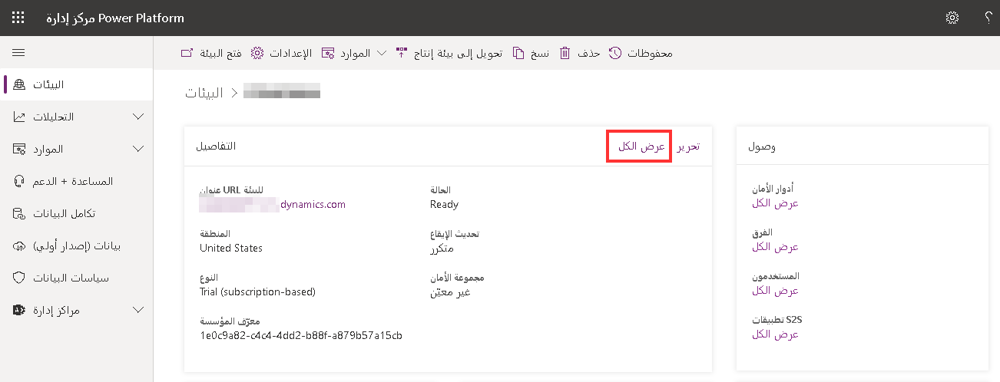
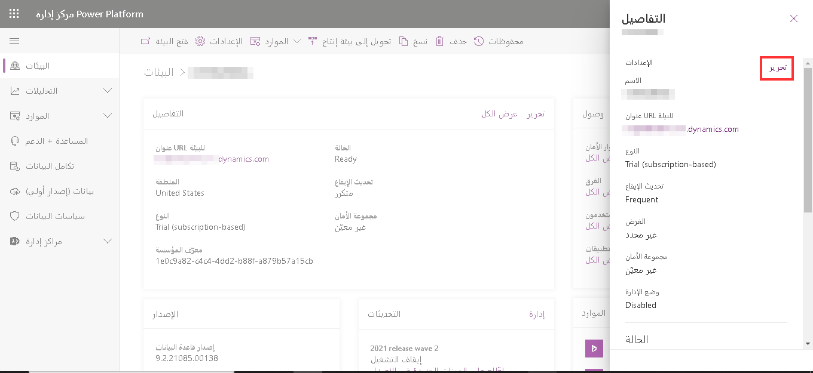

سيتم نشر تطبيقات مشاركة العميل في Dynamics 365 الموزعة على Dataverse بشكل أكثر سلاسة مع بعض التخطيط الأولي. قبل بدء عملية التوزيع الفعلية، خذ بعين الاعتبار ما يلي:

### اكتشاف البيئة

وصف تفصيلي لبيئة مؤسستك من حيث عدد المستخدمين أو المجموعات أو الفرق، وعدد وحدات الأعمال أو الأقسام ونوعها. حدد البيانات الحالية التي ترغب في جلبها إلى تطبيقات Dynamics 365 Customer Engagement، ومتطلبات تخزين البيانات الإجمالية. قم بتضمين تحليل متطلبات العمل الذي يصف توقعات مؤسستك أو متطلبات اتفاقية مستوى الخدمة (SLA). حدد سياساتك المتعلقة بالأمان والخصوصية.

أثناء وضع خطتك، تحتاج أيضاً إلى التفكير في إجابات لأسئلة مثل:

- هل يوجد تداخل كافٍ في العملاء والمنتجات عبر وحدات العمل لتتمكن من العمل في نفس بيانات تطبيقات Dynamics 365 Customer Engagement؟
- ما نوع سياسة الأمان التي تنتهجها المؤسسة بالفعل؟
- هل هناك أي متطلبات خاصة في هذا المجال؟
- هل هناك خطة لنمو الأعمال التجارية التي يمكن أن تؤثر في عدد المستخدمين؟

خطط لتعيين وقت كافٍ للقيام بهذا الاكتشاف؛ يمكن أن تؤثر المعلومات التي تنتج عن هذا التدريب في طريقة تنفيذك للخدمة.

### تسجيل الدخول الأحادي

عملية مصادقة تمكّن المستخدم من الوصول إلى أنظمة أو خدمات متعددة من خلال مجموعة واحدة من بيانات اعتماد تسجيل الدخول. على سبيل المثال، تنفيذ تسجيل الدخول الأحادي في بيئة شبكة اتصال المؤسسة يعني أنه بعد تسجيل دخول مستخدم إلى شبكة الاتصال، لا يجب على المستخدم إدخال بيانات الاعتماد مرة أخرى.

> [!Note]
> لمشتركي Microsoft 365، يجب أن تكون بيئة تطبيقات Dynamics 365 Customer Engagement في نفس المستأجر مثل اشتراك Microsoft 365 الخاص بك. يمكن مزامنة حساب المستخدم في "Active Directory" مع مستأجر واحد فقط.

### التكامل مع تطبيقات Microsoft 365

يمكنك تحسين تجربة شركتك عبر الإنترنت بشكل كبير من خلال دمج تطبيقات Microsoft 365 مع اشتراكك. يتطلب ذلك شراء اشتراك Microsoft 365 منفصلاً، وستحصل على أفضل تجربة تكامل إذا كان اشتراكك في Microsoft 365 والبيئة في نفس المستأجر.

للحصول على تكامل كامل لميزات Microsoft 365 مع تطبيقات مشاركة العميل في Dynamics 365 الموزعة على تطبيقات Dataverse وتطبيقات مشاركة العميل في Dynamics 365 المحلية، ستحتاج إلى\' Microsoft 365 Enterprise E3 أو إصدار أحدث. يتطلب إجراء اتصالات وعقد مؤتمرات Skype for Business [PSTN](https://support.office.com/article/What-is-PSTN-calling-3dc773b9-95e0-4448-b2f1-887c54022429) وجود Microsoft 365 Enterprise E5. خطط Microsoft 365 الأخرى غير مدعومة. لمزيد من المعلومات عن التراخيص والأسعار، راجع: [تسعير Dynamics 365](https://www.microsoft.com/dynamics365/pricing).

من المهم ملاحظة أن Power Apps وكذلك Power Automate مدمجان في العديد من تطبيقات Microsoft Business Applications مثل Microsoft Dynamics 365، وSharePoint Online، وMicrosoft Teams وغيرها. يتم تمكين هذه التكاملات وتكون جاهزة لاستخدامها من قبل المستخدمين. يمكن لمسؤول النظام إزالة أذونات بعض المستخدمين حتى لا يتمكنوا من الاستفادة من التكامل مع Power Apps أو Power Automate، ولكن لا يمكن حذف عمليات التكامل الافتراضية هذه بواسطة مسؤول النظام.

### الأدوار الإدارية

يتوفر عدد من الأدوار الإدارية لتعيينها للمستخدمين إذا قمت بإدارة اشتراكك في بيئة Microsoft Online Service. تحدد الأدوار الإدارية المسؤوليات الإدارية المتعلقة بأنشطة إدارة الاشتراك، مثل إدارة الفوترة وإدارة كلمة المرور وإدارة إدارة المستخدم.

خذ بعين الاعتبار الأدوار الإدارية المتوفرة واحتياجات البيئة الخاصة بك لتحديد الأدوار التي تريد استخدامها والمستخدمين الذين ستختارهم لكل دور. دور المسؤول العمومي هو الدور الأعلى مستوى، حيث تتوفر لديه كافة الأذونات لإدارة أي جزء من عملية الاشتراك. نوصي بتعيين هذا الدور لأكثر من شخص واحد بحيث يتوفر شخص ما دائماً لإدارة جميع جوانب الاشتراك.

> [!NOTE]
> تغطي الأدوار الإدارية جميع وظائف إدارة الاشتراك داخل الخدمة. هذه ليست هي نفس أدوار الأمان التي تقوم بتعيينها للمستخدمين، والتي تتطلب الوصول إلى الموارد في الخدمة.

للحصول على القائمة الكاملة للأدوار الإدارية المتوفرة، راجع [معلومات حول أدوار المسؤول](/office365/admin/add-users/about-admin-roles).

### استيراد البيانات

توفر تطبيقات مشاركة العميل في Dynamics 365 معالجاً للمساعدة في استيراد بيانات تطبيقات مشاركة العميل في Dynamics 365 من تطبيقات وخدمات أخرى. إذا قمت باستيراد البيانات من أنظمة أخرى، ففكر في الطريقة التي ستعالج بها البيانات لتقليل الأخطاء.

### مكامل البيانات
إن مكامل البيانات (للمسؤولين) هو خدمة تكامل من نقطة إلى نقطة تستخدم لتكامل البيانات في Microsoft Dataverse للتطبيقات. وهو يدعم تكامل البيانات من مصادر متعددة—على سبيل المثال، Dynamics 365 for Finance and Operations، Dynamics 365 for Sales، SQL (إصدار أولي)—في Dataverse للتطبيقات. كما يدعم تكامل البيانات في Dynamics 365 for Finance and Operations وكذلك Dynamics 365 for Sales. هذه الخدمة متوفرة بشكل عام منذ يوليو 2017.

بدأنا بتطبيقات الطرف الأول، على سبيل المثال، Dynamics 365 for Finance and Operations وكذلك Dynamics 365 for Sales. بمساعدة Power Query أو الموصلات المستندة إلى M، يمكننا الآن دعم مصادر إضافية مثل SQL (إصدار أولي) وسنوسع هذا إلى أكثر من 20 مصدراً في المستقبل القريب.

لمزيد من المعلومات حول كيفية استخدام تكامل البيانات لعمليات نشر Dynamics 365 الخاصة بك، راجع [دمج البيانات في Dataverse للتطبيقات](/powerapps/administrator/data-integrator).

### إضافة بيئة لاشتراكك

يمكنك إضافة بيئات الإنتاج وغير الإنتاج (Sandbox). تنشئ كل بيئة جديدة مؤسسة منفصلة يمكن استخدامها من قبل أقسام أو مواقع مختلفة أو لأغراض غير إنتاجية مثل التطوير. 

يجب أن تكون مسؤول Microsoft 365 Global للقيام بهذه المهام. ومع ذلك، يمكنك استخدام خدمة أقل امتيازاً. لمزيد من المعلومات، راجع [تعيين أدوار المسؤول](https://support.office.com/article/Assign-admin-roles-in-Office-365-eac4d046-1afd-4f1a-85fc-8219c79e1504).

### البيئات غير الإنتاجية/بيئة Sandbox

بيئة Sandbox هي أي بيئة غير إنتاجية لتطبيقات Dynamics 365 Customer Engagement. تعد بيئة Sandbox، المعزولة عن الإنتاج، المكان المناسب لتطوير واختبار تغييرات التطبيق بأمان مع مخاطر منخفضة. يمكن أن يكون لدى المستأجر ما يصل إلى 75 بيئة غير إنتاجية.

بعض المزايا الرئيسية التي تقدمها البيئة غير الإنتاجية/ Sandbox هي:

- تقييم الوظائف الجديدة قبل تقديمها إلى بيئة الإنتاج الخاصة بك: يمكن تحديث بيئة Sandbox قبل الإنتاج حتى تتمكن من اختبار جميع وظائفك قبل تطبيق التحديث على الإنتاج.
- التحكم في الوصول: يمكن وضع بيئة sandbox في الوضع الإداري للسماح فقط للمستخدمين الذين لديهم أدوار أمان مسؤولي النظام أو مخصص النظام بالوصول إلى البيئة.
- النسخ والاستعادة: يمكنك نسخ التخصيصات والبيانات من بيئة الإنتاج إلى بيئة Sandbox
- التدريب: بعد نسخة كاملة من الإنتاج إلى بيئة sandbox، تحصل على بيئة تدريب مذهلة. سيتمكن المستخدمون من تجربة الإمكانات الكاملة لحل الإنتاج الخاص بهم دون الخوف من إضافة أو حذف بيانات الاختبار أثناء التدريب مما قد يؤدي إلى تعطيل جودة البيانات المحفوظة في الإنتاج.
- اختبار تطبيقات جديدة: تعد بيئة آلية تحديد الوصول مكاناً رائعاً لتثبيت الحلول والتطبيقات لاختبارها والنظر فيها للإنتاج. بعد اختبار التطبيق، يمكن تدريب المستخدمين في Sandbox قبل يوم نشر التطبيق في مرحلة الإنتاج.

### بيئات الإنتاج

تهدف هذه البيئات إلى استخدامها للعمل الدائم في المؤسسة. يمكن إنشاؤها وامتلاكها بواسطة مسؤول أو أي شخص لديه ترخيص Power Apps بشرط أن تكون سعة قاعدة البيانات المتوفرة 1 جيجابايت. يتم أيضًا إنشاء هذه البيئات لكل قاعدة بيانات Dataverse موجودة عند ترقيتها إلى الإصدار 9.0 أو ما بعده. بيئات الإنتاج هي ما يجب أن تستخدمه في أي بيئات تعتمد عليها.

### تبديل البيئة

من المهم قضاء بعض الوقت في التخطيط والتصميم للتنفيذ الخاص بك، ولكن ستتاح لك دائماً الفرصة لتبديل نوع البيئة من الإنتاج إلى Sandbox، ومن Sandbox إلى الإنتاج إذا لزم الأمر.

على سبيل المثال، إذا قمت بأخذ نسخة احتياطية من بيئة إنتاج قبل تثبيت أحد الحلول ولاحظت أن هذا الحل يمنحك بعض المشكلات بعد التثبيت، أو ربما لا تتمكن حتى من إزالة الحل، يمكنك الاستعادة من النسخة الاحتياطية؛ ومع ذلك، لا يمكنك استعادة النسخ الاحتياطية في بيئة الإنتاج، يجب تحويل البيئة إلى Sandbox أولاً، ثم يمكنك متابعة الاستعادة من النسخة الاحتياطية، ثم التبديل إلى الإنتاج مرة أخرى. تم وضع هذا القيد من أجل تجنب الاستبدال العرضي لبيئة الإنتاج الخاصة بك.

### تفاصيل البيئة

يمكنك رؤية بعض تفاصيل بيئاتك عن طريق اختيار البيئة. حدد **عرض الكل** لمشاهدة المزيد من تفاصيل البيئة.

> [!div class="mx-imgBorder"] 
> 

حدد **تحرير** لمراجعة تفاصيل البيئة وتعديلها.

> [!div class="mx-imgBorder"] 
> 

