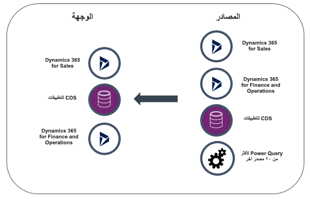
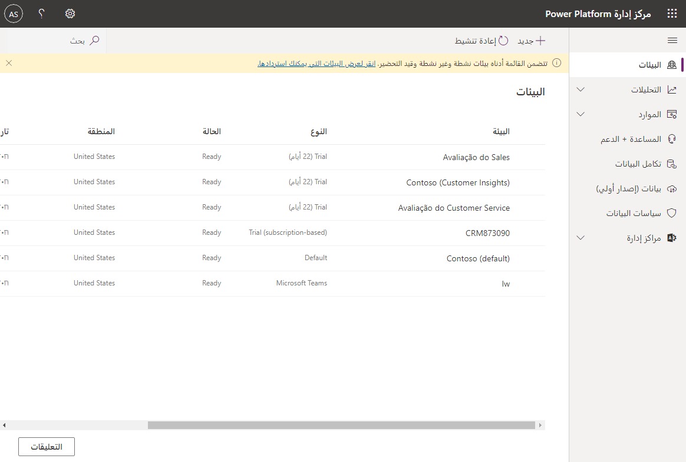

سيتم توزيع تطبيقات Dynamics 365 Customer Engagement الخاصة بك بشكل أكثر سلاسة مع بعض التخطيط الأولي. قبل بدء عملية التوزيع الفعلية، خذ بعين الاعتبار ما يلي:

### اكتشاف البيئة

وصف تفصيلي لبيئة مؤسستك من حيث عدد المستخدمين أو المجموعات أو الفرق، وعدد وحدات الأعمال أو الأقسام ونوعها. حدد البيانات الحالية التي ترغب في إدخالها إلى تطبيقات Dynamics 365 Customer Engagement ومتطلبات تخزين البيانات الإجمالية. قم بتضمين تحليل متطلبات العمل الذي يصف توقعات مؤسستك أو متطلبات اتفاقية مستوى الخدمة (SLA). حدد سياساتك المتعلقة بالأمان والخصوصية.

أثناء وضع خطتك، تحتاج أيضاً إلى التفكير في إجابات لأسئلة مثل:

- هل يوجد تداخل كافٍ في العملاء والمنتجات عبر وحدات الأعمال لتتمكن من العمل في نفس بيانات تطبيقات Dynamics 365 Customer Engagement؟
- ما نوع سياسة الأمان التي تنتهجها المؤسسة بالفعل؟
- هل هناك أي متطلبات خاصة في هذا المجال؟
- هل هناك خطة لنمو الأعمال التجارية التي يمكن أن تؤثر في عدد المستخدمين؟

خطط لتعيين وقت كافٍ للقيام بهذا الاكتشاف؛ يمكن أن تؤثر المعلومات التي تنتج عن هذا التدريب في طريقة تنفيذك للخدمة.

### تسجيل الدخول الأحادي

عملية مصادقة تمكّن المستخدم من الوصول إلى أنظمة أو خدمات متعددة من خلال مجموعة واحدة من بيانات اعتماد تسجيل الدخول. على سبيل المثال، تنفيذ تسجيل الدخول الأحادي في بيئة شبكة اتصال المؤسسة يعني أنه بعد تسجيل دخول مستخدم إلى شبكة الاتصال، لا يجب على المستخدم إدخال بيانات الاعتماد مرة أخرى.

> [!Note]
> بالنسبة للمشتركين في Microsoft 365، يجب أن يكون مثيل تطبيقات Dynamics 365 Customer Engagement في نفس المستأجر مثل اشتراك Microsoft 365. يمكن مزامنة حساب المستخدم في "Active Directory" مع مستأجر واحد فقط.

### التكامل مع تطبيقات Microsoft 365

يمكنك تحسين تجربة شركتك عبر الإنترنت بشكل كبير من خلال دمج تطبيقات Microsoft 365 مع اشتراكك. يتطلب ذلك شراء اشتراك Microsoft 365 بشكل منفصل، وستحصل على أفضل تجربة تكامل إذا كان اشتراك Microsoft 365 والمثيل في المستأجر نفسه.

للحصول على تكامل كامل لميزات Microsoft 365 مع تطبيقات Dynamics 365 Customer Engagement وتطبيقات Dynamics 365 Customer Engagement (محلي)،\'ستحتاج إلى Microsoft 365 Enterprise E3 أو إصدار أحدث. يتطلب إجراء اتصالات وعقد مؤتمرات Skype for Business [PSTN](https://support.office.com/article/What-is-PSTN-calling-3dc773b9-95e0-4448-b2f1-887c54022429) وجود Microsoft 365 Enterprise E5. خطط Microsoft 365 الأخرى غير مدعومة. لمزيد من المعلومات عن التراخيص والأسعار، راجع: [تسعير Dynamics 365](https://www.microsoft.com/dynamics365/pricing).

من المهم ملاحظة أن Power Apps وكذلك Power Automate مدمجان في العديد من تطبيقات Microsoft Business Applications مثل Microsoft Dynamics 365، وSharePoint Online، وMicrosoft Teams وغيرها. يتم تمكين هذه التكاملات وتكون جاهزة لاستخدامها من قبل المستخدمين. يمكن لمسؤول النظام إزالة أذونات بعض المستخدمين حتى لا يتمكنوا من الاستفادة من التكامل مع Power Apps أو Power Automate، ولكن لا يمكن حذف عمليات التكامل الافتراضية هذه بواسطة مسؤول النظام.

### الأدوار الإدارية

يتوفر عدد من الأدوار الإدارية لتعيينها للمستخدمين إذا قمت بإدارة اشتراكك في بيئة Microsoft Online Service. تحدد الأدوار الإدارية المسؤوليات الإدارية المتعلقة بأنشطة إدارة الاشتراك، مثل إدارة الفوترة وإدارة كلمة المرور وإدارة إدارة المستخدم.

خذ بعين الاعتبار الأدوار الإدارية المتوفرة واحتياجات البيئة الخاصة بك لتحديد الأدوار التي تريد استخدامها والمستخدمين الذين ستختارهم لكل دور. دور المسؤول العمومي هو الدور الأعلى مستوى، حيث تتوفر لديه كافة الأذونات لإدارة أي جزء من عملية الاشتراك. نوصي بتعيين هذا الدور لأكثر من شخص واحد بحيث يتوفر شخص ما دائماً لإدارة جميع جوانب الاشتراك.

> [!NOTE]
> تغطي الأدوار الإدارية جميع وظائف إدارة الاشتراك داخل الخدمة. هذه ليست هي نفس أدوار الأمان التي تقوم بتعيينها للمستخدمين، والتي تتطلب الوصول إلى الموارد في الخدمة.

للحصول على القائمة الكاملة للأدوار الإدارية المتوفرة، راجع [معلومات حول أدوار المسؤول](https://docs.microsoft.com/office365/admin/add-users/about-admin-roles).

### استيراد البيانات

توفر تطبيقات Dynamics 365 Customer Engagement معالجاً للمساعدة على استيراد بيانات تطبيقات Dynamics 365 Customer Engagement من تطبيقات وخدمات أخرى. إذا قمت باستيراد البيانات من أنظمة أخرى، ففكر في الطريقة التي ستعالج بها البيانات لتقليل الأخطاء.

### مكامل البيانات
إن مكامل البيانات (للمسؤولين) هو خدمة تكامل من نقطة إلى نقطة تستخدم لتكامل البيانات في Microsoft Dataverse للتطبيقات. وهو يدعم تكامل البيانات من مصادر متعددة—على سبيل المثال، Dynamics 365 for Finance and Operations، Dynamics 365 for Sales، SQL (إصدار أولي)—في Dataverse للتطبيقات. كما يدعم تكامل البيانات في Dynamics 365 for Finance and Operations وكذلك Dynamics 365 for Sales. هذه الخدمة متوفرة بشكل عام منذ يوليو 2017.

بدأنا بتطبيقات الطرف الأول، على سبيل المثال، Dynamics 365 for Finance and Operations وكذلك Dynamics 365 for Sales. بمساعدة Power Query أو الموصلات المستندة إلى M، يمكننا الآن دعم مصادر إضافية مثل SQL (إصدار أولي) وسنوسع هذا إلى أكثر من 20 مصدراً في المستقبل القريب.

لمزيد من المعلومات حول كيفية استخدام "مكامل البيانات" لعمليات توزيع Dynamics 365، راجع [تكامل البيانات في Dataverse للتطبيقات](https://docs.microsoft.com/powerapps/administrator/data-integrator).

### إضافة مثيل إلى اشتراكك

يمكنك إضافة مثيلات الإنتاج وغير الإنتاج (آلية تحديد الوصول) إلى اشتراك تطبيقات Dynamics 365 Customer Engagement. ينشئ كل مثيل جديد مؤسسة منفصلة يمكن استخدامها من قبل أقسام أو مواقع أو لأغراض غير إنتاجية مثل التطوير. لمزيد من المعلومات حول أنواع المثيلات المتوفرة لك، راجع [Dynamics 365 Customer Engagement تسعير التطبيقات وترخيصها](https://dynamics.microsoft.com/pricing/).

يجب أن تكون مسؤول Microsoft 365 العمومي للقيام بهذه المهام. ومع ذلك، يمكنك استخدام خدمة أقل امتيازاً. لمزيد من المعلومات، راجع [تعيين أدوار المسؤول](https://support.office.com/article/Assign-admin-roles-in-Office-365-eac4d046-1afd-4f1a-85fc-8219c79e1504).

### مثيلات غير إنتاجية/آلية تحديد الوصول

مثيل آلية تحديد الوصول هو أي مثيل غير إنتاجي لتطبيقات Dynamics 365 Customer Engagement. يعتبر مثيل آلية تحديد الوصول، المعزول عن الإنتاج، هو المكان المناسب لتطوير تغييرات التطبيق واختبارها بأمان مع مخاطر منخفضة. يمكن أن يكون لدى المستأجر ما يصل إلى 75 مثيلاً غير إنتاجي.

بعض المزايا الرئيسية التي يقدمها مثيل غير إنتاجي/آلية تحديد الوصول هي:

- تقييم الوظائف الجديدة قبل تقديمها إلى بيئة الإنتاج: يمكن تحديث مثيل آلية تحديد الوصول بحيث يمكنك اختبار كافة الوظائف قبل تطبيق التحديث على الإنتاج.
- التحكم بالوصول: يمكن وضع مثيل آلية تحديد الوصول في "الوضع الإداري" للسماح للمستخدمين الذين لديهم أدوار أمان "مسؤولي النظام" أو "مخصص النظام" فقط بالوصول إلى البيئة.
- النسخ والاستعادة: يمكنك نسخ التخصيصات والبيانات من مثيل إنتاج إلى مثيل آلية تحديد الوصول
- التدريب: بعد نسخة كاملة من الإنتاج إلى مثيل آلية تحديد الوصول، يمكنك الحصول على بيئة تدريب رائعة. سيتمكن المستخدمون من تجربة الإمكانات الكاملة لحل الإنتاج الخاص بهم دون الخوف من إضافة بيانات الاختبار أو حذفها أثناء التدريب مما قد يؤدي إلى تعطيل جودة البيانات التي يتم الحفاظ عليها في الإنتاج.
- اختبار تطبيقات جديدة: تعد بيئة آلية تحديد الوصول مكاناً رائعاً لتثبيت الحلول والتطبيقات لاختبارها والنظر فيها للإنتاج. بعد اختبار التطبيق، يمكن تدريب المستخدمين في آلية تحديد الوصول قبل يوم توزيع التطبيق في مرحلة الإنتاج.

### مثيلات الإنتاج

تهدف هذه المثيلات إلى استخدامها للعمل الدائم في مؤسسة ما. يمكن إنشاؤها من قبل مسؤول عمومي أو أي شخص لديه دور مسؤول خدمة Dynamics 365. يمكن أن يكون لدى المستأجر ما يصل إلى 50 مثيل إنتاج.

بيئات التشغيل هي ما يجب أن تستخدمه في أي بيئات تعتمد عليها.

### تبديل مثيل

من المهم قضاء بعض الوقت في التخطيط والتصميم لتطبيق Microsoft Dynamics 365 الخاص بك، ولكن سيكون لديك دائماً فرصة تبديل نوع المثيل من إنتاج إلى آلية تحديد الوصول، ومن آلية تحديد الوصول إلى الإنتاج إذا لزم الأمر.

على سبيل المثال، إذا أخذت نسخة احتياطية من مثيل إنتاج قبل تثبيت حل ولاحظت أن الحل يعطيك بعض المشكلات بعد التثبيت، أو ربما كنت غير قادر على إزالة الحل، يمكنك الاستعادة من نسختك الاحتياطية؛ ومع ذلك، لا يمكنك استعادة النسخ الاحتياطية إلى مثيل إنتاج، وسيتعين تبديل المثيل إلى آلية تحديد الوصول أولاً، ثم يمكنك متابعة الاستعادة من النسخ الاحتياطي، ومن ثم التبديل إلى الإنتاج مرة أخرى. تم وضع هذا القيد لتجنب عمليات الاستبدال العرضية لمثيل الإنتاج الخاص بك.

### مثيلات Dataverse

يتيح لك Dataverse تخزين البيانات المستخدمة في بيئات Power Apps [وإدارتها بأمان](https://docs.microsoft.com/powerapps/administrator/environments-overview).
اعتباراً من 21 مارس 2018، يتم عرض بيئات Power Apps المزودة بقاعدة بيانات Dataverse كمثيلات في مركز إدارة Dynamics 365. هناك يمكنك عرض وإجراء بعض الإدارة لمثيلات Dataverse الخاصة بك.

#### تحديد مثيلات Dataverse

1. في مركز إدارة Dynamics 365، حدد علامة التبويب **المثيلات**.
2. حدد مثيلاً وابحث عن **Microsoft Dataverse** في تفاصيل الوصف.

#### إدارة مثيلات Dataverse

حالياً، تتوفر مثيلات Dataverse كأنواع تجريبية وأنوع إنتاج. تعتمد إجراءات الإدارة المتوفرة على مركز الإدارة الذي تستخدمه.

يمكنك إدارة ما يلي باستخدام مثيل Dataverse في مركز إدارة Dynamics 365:

- فتح مثيل
- تعديل مثيل
- نسخ مثيل
- حذف مثيل
- تغيير الإخطارات

### الإدارة في مركز إدارة Dynamics 365

- إضافة أو إزالة مستخدم أو مجموعة من دور مسؤول البيئة أو منشئ البيئة. للحصول على مزيد من المعلومات، راجع [إدارة البيئة](https://docs.microsoft.com/powerapps/administrator/environments-administration)
- توفير قاعدة بيانات Dataverse للبيئة. لمزيد من المعلومات، راجع [إنشاء قاعدة بيانات Dataverse](https://docs.microsoft.com/powerapps/administrator/create-database)
- تعيين سياسات تفادي فقدان البيانات. لمزيد من المعلومات، راجع [تفادي فقدان البيانات (DLP) وإدارتها](https://docs.microsoft.com/powerapps/administrator/prevent-data-loss)
- تعيين سياسات أمان قاعدة البيانات (كمفتوحة أو مقيدة بأدوار قاعدة البيانات). ‏‫لمزيد من المعلومات، راجع [تكوين أمان قاعدة البيانات](https://docs.microsoft.com/powerapps/administrator/database-security)
- يمكن لأعضاء دور المسؤول العمومي للمستأجر Azure AD بما في ذلك (مسؤولي Microsoft 365 العموميين) أيضاً إدارة جميع البيئات التي تم إنشاؤها في المستأجر الخاص بهم وتعيين سياسات على مستوى المستأجر من مركز إدارة Power Apps.

### مركز مسؤولي Microsoft Power Platform
قبل أن ننتقل إلى أبعد من ذلك، من المهم الإشارة إلى أنه إذا كنت قد قمت بإدارة المستأجرين والمثيلات، فقد استخدمت مركز إدارة Dynamics 365.

من خلال دمج Dataverse للتطبيقات والأنظمة الأساسية لتطبيقات Dynamics 365 Customer Engagement، نطلق تجربة مركز إدارة جديدة تجمع إدارة إدارة Power Apps وFlow وDynamics 365 معاً في موقع واحد - [مركز مسؤولي Microsoft Power Platform](https://admin.dynamics.com/)

مركز الإدارة الجديد هذا حالياً في وضع إصدار أولي، ولكنه سيحل محل مركز إدارة Dynamics 365 كواجهة سنستخدمها لتنفيذ بيئات Dynamics 365. من المهم أن تقوم بمراجعة مركز مسؤولي Microsoft Power Platform الجديد والتعرف عليه أثناء الإصدار الأولي.

لمزيد من المعلومات حول مركز مسؤولي Microsoft Power Platform، يرجى الاطلاع على [مقدمة مركز مسؤولي Microsoft Power platform](https://blogs.msdn.microsoft.com/crm/2018/09/25/introducing-the-power-platform-admin-center/)
